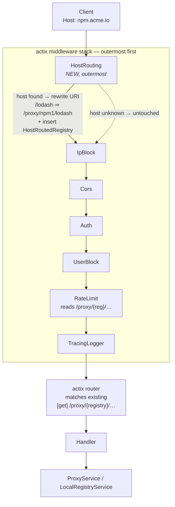
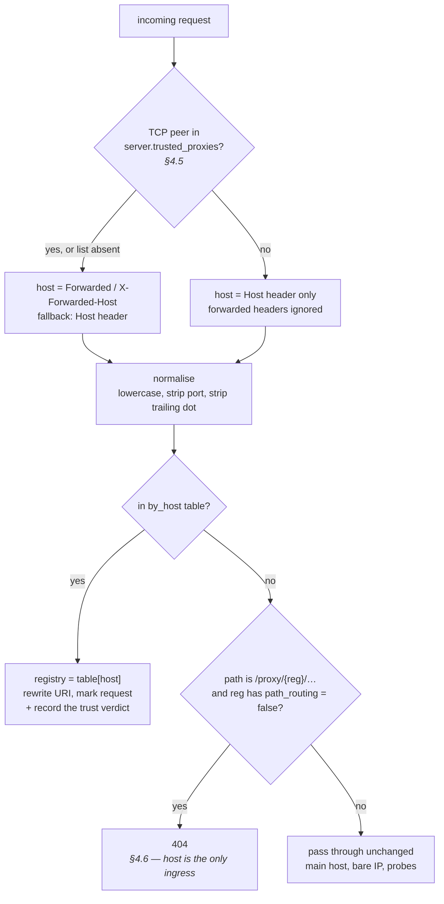
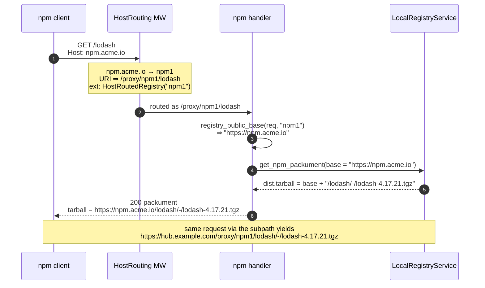
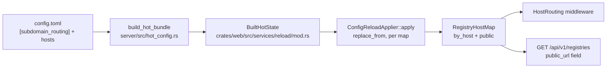

# RFC 0001 — Subdomain (host-based) registry routing

| Field       | Value                                                        |
| ----------- | ------------------------------------------------------------ |
| Status      | **Implemented** — all phases landed; see the implementation notes in §13 |
| Author      | Max Batleforc <maxleriche.60@gmail.com>                       |
| Co-author   | Claude Opus 5 (1M context) <noreply@anthropic.com>            |
| Created     | 2026-07-29                                                    |
| Supersedes  | —                                                             |
| Touches     | `crates/config`, `crates/web`, `crates/core`, `server`, `ui`, `helm`, docs |

---

## 1. Summary

Today a registry is reachable at exactly one place:

```text
https://hub.example.com/proxy/{registry}/…
```

This RFC proposes letting an administrator additionally bind a registry to one or more
**hostnames**, so that everything reachable under `/proxy/{registry}/…` is reachable identically at
the **root** of that host:

```text
https://npm1.hub.example.com/…      # wildcard, derived from the registry name
https://npm.acme.io/…               # explicit vanity host
```

The subpath keeps working, unchanged, for every registry. The host is an *additional ingress* by
default — a registry can opt out of path routing explicitly (§4.6), but nothing changes for one that
does not.

### Before / after

```ini
# .npmrc — today
registry=https://hub.example.com/proxy/npm1/
//hub.example.com/proxy/npm1/:_authToken=…

# .npmrc — with this RFC
registry=https://npm.acme.io/
//npm.acme.io/:_authToken=…
```

```toml
# .cargo/config.toml — today
[registries.internal]
index = "sparse+https://hub.example.com/proxy/cargo1/registry/"

# with this RFC
[registries.internal]
index = "sparse+https://cargo.acme.io/registry/"
```

---

## 2. Motivation

1. **Ecosystems that assume they own the origin root.** Cargo publishes to `/api/v1/crates/new`,
   GitLab exposes `/api/v4/…`, Forgejo `/api/packages/…`. These work behind our path prefix today
   only because we replicate the whole shape under `/proxy/{registry}`. Any tool that hardcodes an
   absolute path from the origin root breaks. A dedicated host removes the class of problem.
2. **Absolute URLs in metadata.** NuGet's service index, PyPI's simple index, Composer's
   `packages.json`, npm's `dist.tarball`, Terraform's `download_url` all embed absolute
   self-referencing URLs. They are already generated per-request; a host-based origin makes them
   short and stable, and is what most client tooling and corporate proxies expect.
3. **Operational ergonomics.** A vanity host is something you hand to a team, put in a
   `settings.xml`, and keep stable while the backend moves. It also lets an operator apply
   per-host WAF rules, rate limits or TLS policies at the ingress, without teaching the ingress
   about our path scheme.
4. **Future Proof** Nothing prevent futur registry to need to be at the root of a fqdn or some registry to have overlaping endpoint
5. **Cosmetics that matter.** `npm.acme.io` reads as an npm registry. `hub.example.com/proxy/npm1`
   reads as an implementation detail.

---

## 3. Goals / non-goals

**Goals**

- Bind a registry to a wildcard-derived host and/or explicit hosts, configured in TOML.
- Every route that works at `/proxy/{registry}/…` works at the host root, with **no per-route work**.
- Let a registry opt out of path routing entirely, so its host can be its only ingress (§4.6).
- Every self-referencing URL the server generates reflects the ingress the client actually used.
- Hot-reloadable, like every other registry-scoped map.
- Zero behaviour change when the feature is not configured.
- **Make proxy trust an explicit, configurable concept.** Routing now depends on a header a client
  can set, so *which* forwarded headers we believe, and *from whom*, stops being an implicit
  assumption and becomes a documented setting — one that covers the forwarded host and scheme, not
  just the client IP as today (§4.5).

**Non-goals**

- Replacing or deprecating the `/proxy/{name}` subpath globally. It stays the default and the only
  way to reach a registry with no host; §4.6 is a per-registry choice, not a migration path.
- Terminating TLS or managing certificates inside the server. DNS and certificates stay the
  operator's job (the ingress/reverse proxy).
- Authenticating the reverse proxy itself (mTLS, shared secret, signed headers). Proxy trust here is
  network-level — "this TCP peer is our ingress" — not cryptographic.
- Per-host authentication realms, per-host RBAC, or per-host rate-limit buckets. Authorisation is a
  property of the *registry*, not of how the request was routed.
- Routing a host to anything other than a single registry (no host → namespace, host → package).

---

## 4. User-facing design

### 4.1 Configuration

```toml
# Global: derive a host for every registry from its name.
[subdomain_routing]
enabled     = true
base_domain = "hub.example.com"   # npm1.hub.example.com -> registry "npm1"
scheme      = "https"             # used only to render public URLs in the API/UI

[[registries]]
name         = "npm1"
type         = "npm"
hosts        = ["npm.acme.io"]    # optional extra vanity hosts
path_routing = true               # default; false ⇒ reachable only by host (§4.6)
```

- `[subdomain_routing]` is optional. Absent or `enabled = false` ⇒ no wildcard hosts.
- `hosts` is optional and independent of `[subdomain_routing]`; a registry can have vanity hosts
  with no wildcard configured at all.
- `scheme` never affects routing. It only decides whether the API advertises `https://npm.acme.io`
  or `http://npm.acme.io`. Defaults to `https`.
- `path_routing` defaults to `true`, so existing configs are unaffected.

### 4.2 Resolution rules

- The incoming host is **normalised** before lookup: lowercased, port stripped, trailing dot
  stripped. `NPM.Acme.io:8443.` and `npm.acme.io` are the same host.
- Explicit `hosts` entries and wildcard-derived hosts live in one table. Explicit entries win on
  conflict *within a registry*; a conflict *between registries* is a config error (§4.3).
- A host that is not in the table is passed through untouched — that is the main host serving the
  admin API, the SPA, `/healthz`, `/metrics`, and the `/proxy/{name}` subpaths.

### 4.3 Validation (startup and reload, fail-fast)

`AppConfig::validate()` rejects:

| Condition                                                      | Rationale                                        |
| -------------------------------------------------------------- | ------------------------------------------------ |
| `enabled = true` with no `base_domain`                           | silently routes nothing                          |
| the same host claimed by two registries                          | ambiguous, last-write-wins would be invisible    |
| a `hosts` entry colliding with another registry's wildcard host  | same ambiguity, harder to spot                   |
| a `hosts` entry equal to `base_domain` itself                    | would shadow the main host and hide the admin API |
| a host containing `/`, a scheme prefix, or empty after trimming  | not a hostname                                   |
| `path_routing = false` on a registry with no reachable host      | the registry would be unreachable entirely (§4.6) |
| host-based routing configured with **neither** `[server].trusted_proxies` nor the deprecated `[ip_blocking].trusted_proxies` set | routing would depend on an ungoverned header (§4.5) |

This mirrors the existing duplicate-registry-name check in
`crates/config/src/schema/mod.rs::validate` (~line 139), and lives in the same per-registry loop.

Conditions that are **warnings**, not errors — logged and surfaced in the admin UI (§4.7):

| Condition | Behaviour |
| --- | --- |
| `[subdomain_routing]` enabled but a registry name is not a valid DNS label (`my_registry`, `Foo.Bar`) | no wildcard host for that registry; it stays reachable by path and by any explicit `hosts` |
| both `[server].trusted_proxies` and the deprecated `[ip_blocking].trusted_proxies` are set | `[server]` wins; the warning names the shadowed one |
| `[server].trusted_proxies` absent while *no* host routing is configured | legacy permissive header trust — recommended to set it explicitly |
| host routing configured and satisfied only by the deprecated `[ip_blocking].trusted_proxies` | accepted, and the list governs host/scheme/client-IP alike; the warning asks for the one-line move to `[server]` |

### 4.4 The host belongs to the registry — entirely

**On a registry host, every path is the registry's.** There is no passthrough allowlist.

```text
GET https://cargo1.hub.example.com/api/v1/crates/new
  -> /proxy/cargo1/api/v1/crates/new     ✅ cargo publish

GET https://cargo1.hub.example.com/api/v1/registries
  -> /proxy/cargo1/api/v1/registries     ❌ 404 — the admin API lives on the main host
```

This is not a preference, it is forced: cargo (`/api/v1/…`), GitLab (`/api/v4/…`) and Forgejo
(`/api/packages/…`) all legitimately serve paths under `/api`. Any reserved prefix would shadow a
real registry route. The same argument applies to `/healthz` and `/metrics` — a `generic` or `deb`
registry can legitimately mirror those paths — so probes and scrapes target the main host.

A corollary worth documenting for users: `https://npm1.hub.example.com/proxy/npm1/lodash` becomes
`/proxy/npm1/proxy/npm1/lodash` and 404s. Pick one ingress per client.

### 4.5 Proxy trust

The host we route on is a header. Behind a reverse proxy it is `Forwarded` / `X-Forwarded-Host`;
directly exposed it is `Host`. Which of those we believe is now a routing decision, so this RFC
promotes proxy trust from an implicit assumption to a first-class setting.

**Where we stand today** — the codebase is inconsistent:

| Signal | Current behaviour |
| --- | --- |
| `X-Forwarded-For` (client IP) | Trusted **only** when the TCP peer is listed in `[ip_blocking].trusted_proxies` — see `extract_client_ip` in `crates/web/src/middleware/ip_block.rs`. Correct, but scoped to one middleware. |
| `Forwarded` / `X-Forwarded-Host` (host) | Trusted **unconditionally** — `connection_info().host()`, used by all 8 base-URL helpers. |
| `X-Forwarded-Proto` (scheme) | Trusted **unconditionally** — same call. |

So the strict rule already exists for client IP, and the two signals this RFC leans on are the two
that have no rule at all.

**Proposal** — one server-level list, governing all three:

```toml
[server]
# CIDR ranges (or bare IPs) of the reverse proxies in front of BatleHub.
# `Forwarded` / `X-Forwarded-Host` / `X-Forwarded-Proto` / `X-Forwarded-For` are
# honoured only when the TCP peer falls inside one of these.
#   absent  -> legacy permissive behaviour; a hard error once any host routing is configured
#   []      -> forwarded headers ignored entirely; use `Host` and the connection
#   [nets]  -> honoured only from those peers
trusted_proxies = ["10.42.0.0/16", "192.168.1.10"]
```

**CIDR, not exact IPs.** A Kubernetes ingress sits behind a pod CIDR that changes every rollout, so
enumerating addresses is unmaintainable. Entries are parsed as `IpNet`; a bare address is accepted
and treated as a `/32` (or `/128`), which keeps every existing `[ip_blocking].trusted_proxies` value
valid. This needs one small dependency (`ipnet`, MIT/Apache-2.0) or ~30 lines of hand-rolled prefix
matching — either way it must pass `cargo deny check`, and the choice is a review-time detail, not a
design decision.

| `trusted_proxies` | Peer | Host used for routing + URLs | Scheme | Client IP |
| --- | --- | --- | --- | --- |
| absent (no host routing) | any | forwarded, else `Host` | forwarded, else connection | as today |
| `[]` | any | `Host` header only | connection | TCP peer |
| `["10.42.0.0/16"]` | in range | forwarded, else `Host` | forwarded, else connection | first `X-Forwarded-For` |
| `["10.42.0.0/16"]` | out of range | `Host` header only | connection | TCP peer |

Notes:

- **Absent ≠ empty.** The field is `Option<Vec<String>>` precisely so "not configured" and
  "configured to trust nobody" are distinguishable.
- **Absent is a hard error once host routing is configured** — i.e. when `[subdomain_routing]` is
  enabled or any registry declares `hosts`. Routing on a header the server has no stated policy
  about is not a state we let a deployment reach. For everyone else absent keeps today's behaviour,
  because tightening it by default would silently change the URLs existing deployments generate
  (they would start advertising the internal service host).
  Adopting the feature is therefore a one-line addition to `[server]`, which the error message
  spells out verbatim.
- `[ip_blocking].trusted_proxies` stays valid as a **deprecated alias**: when `[server]` has none, it
  is used, so no existing config breaks. When both are present, `[server]` wins and a warning names
  the shadowed one.
- **The alias satisfies the §4.3 requirement.** "Absent" in the rule above means *no list from
  either key*. A deployment that already declares `[ip_blocking].trusted_proxies` has stated a proxy
  policy; refusing to start it because the same list sits under the older key would break the
  backwards compatibility the alias exists for (§9). It resolves to the same effective list, so it
  governs host, scheme and client IP alike — and it warns, so the deprecation is still visible and
  the operator is nudged to move it. Only a deployment with *neither* key fails to start.
- The trust decision is computed **once**, in the host-routing middleware, and stored in the request
  extensions next to `HostRoutedRegistry`, so the outbound helper (§5.3) and the IP-based middlewares
  read the same verdict rather than each re-deriving it.

### 4.6 Per-registry path opt-out

```toml
[[registries]]
name         = "npm1"
hosts        = ["npm.acme.io"]
path_routing = false        # /proxy/npm1/… -> 404; the host is the only ingress
```

`path_routing = false` makes a registry reachable **only** through its host(s). The motivation is
isolation: once a team is handed `npm.acme.io`, an operator may not want the same content answering
on the shared main host, where it inherits that host's CORS policy, WAF rules and cache keys, and
where a URL leaked from one ingress silently keeps working on the other.

- Default is `true`. Existing configs are untouched.
- A registry with `path_routing = false` and no reachable host is a **config error** (§4.3) — it
  would be a registry nothing can talk to. "Reachable host" means at least one `hosts` entry, or a
  wildcard host derived from a name that is a valid DNS label.
- The subpath returns **404**, not 403: a disabled ingress should look absent, not forbidden.
- Consequence to handle in the implementation, not just document: the SPA links to packages by
  relative `/proxy/{registry}/…` paths (`front_office/packages.rs`). For a host-only registry those
  must be rendered as absolute public URLs, otherwise the admin UI links 404 (§6.6).

### 4.7 Configuration warnings

Several rules above degrade rather than fail — a non-DNS-label registry name, a shadowed deprecated
setting, host routing leaning on the deprecated alias — and a silent `tracing::warn!` at startup is
not good enough for something an operator
will only notice when a hostname mysteriously does not resolve to a registry.

There is no config-warning surface in the codebase today. This RFC adds a small one, because it is
the difference between "the warning exists" and "the warning is seen":

- `AppConfig::warnings(&self) -> Vec<ConfigWarning>`, a sibling of `validate()` (which keeps its
  `Result<()>` signature and its call sites). `ConfigWarning { code, message, path }`, where `code`
  is a stable slug (`subdomain.invalid-dns-label`) and `path` points at the offending config
  location (`registries[3].name`).
- Emitted as `tracing::warn!` at startup and on every reload, **and** stored so they can be read back.
- Exposed at `GET /api/v1/admin/config/warnings` (admin-only) and included in the responses of the
  existing `POST /api/v1/admin/config/validate` and `/from-content`, so an admin sees them
  *before* applying a pending reload rather than after.
- Rendered in the admin UI's configuration page as a dismissible list, with the `path` shown
  verbatim so it can be searched for in the TOML.

The mechanism is general: these three warnings are its first users, not its only intended ones.

---

## 5. Architecture

Two mechanisms, deliberately kept separate: **inbound** (how a request finds its registry) and
**outbound** (what URL we hand back to the client). Conflating them is what makes this kind of
feature sprawl.

### 5.1 Inbound — one rewrite middleware, zero route changes

There are ~249 route definitions in `crates/web/src/handlers/proxy/**` carrying
`/proxy/{registry}/…`. **None of them change.**

An outermost middleware resolves the request host to a registry name and rewrites the request URI to
the canonical path, exactly the way actix-web's own `NormalizePath` does it — replace
`req.head_mut().uri` with a `Uri` rebuilt from parts. Routing happens *after* middleware, so
everything downstream — route matching, the auth middleware, the rate limiter, tracing spans,
metrics labels — observes the canonical `/proxy/{registry}/…` path it already understands.

In particular `extract_registry_from_path`
(`crates/web/src/middleware/rate_limit/middleware.rs:20`) keeps working with no modification: by the
time the limiter runs, the path is canonical.



Registration order matters. In `server/src/server_factory.rs` the last `.wrap(...)` call is the
outermost layer, so `HostRoutingMiddlewareFactory` is added **last**, after the existing
`Condition::new(enabled, IpBlockMiddlewareFactory…)`.

Details that the implementation must get right:

- The **raw** `path_and_query().as_str()` is concatenated, never decoded. npm scoped packages arrive
  as `/@scope%2fpkg`; decoding would turn one path segment into two and change what is fetched.
- Root path `/` becomes `/proxy/{registry}/`, not `/proxy/{registry}`.
- If `Uri::from_parts` fails, return **400**, never a silent passthrough. A passthrough on a
  registry host would expose the admin API at a place the operator believes is registry-only.
- The host is read into an owned `String` before any `.await`, the pattern already documented on
  `composer::build_base_url` — but through the proxy-trust gate of §4.5, not a bare
  `connection_info().host()`.

### 5.2 Host resolution



The table is **materialised at config-load time**: for every registry we insert its wildcard host
(when `[subdomain_routing]` is enabled) and each of its explicit `hosts`. Request-time lookup is
therefore a single hash lookup with no suffix parsing and no "does this registry exist" check.

### 5.3 Outbound — one public-base helper

Self-referencing URLs are built today in three redundant ways:

- 8 near-identical `{scheme}://{host}` helpers — `composer::build_base_url`, `npm::base_url`,
  `terraform::shared::base_url_from_req`, plus inline `connection_info()` blocks in
  `nuget/service_index.rs`, `nuget/registration.rs`, `pypi/simple.rs`, `cargo/index.rs`,
  `jetbrains_marketplace/mod.rs`;
- ~25 `format!("{base}/proxy/{registry}/…")` sites in `crates/web`;
- 5 functions in `crates/core/src/services/local_registry/` that take a `base_url` and append
  `/proxy/{registry}` themselves.

All three collapse into **one** helper in `crates/web/src/handlers/proxy/common.rs`:

```rust
/// The public base URL of `registry` as seen by *this* client.
///
/// `https://npm.acme.io` on a host-routed request,
/// `https://hub.example.com/proxy/npm1` otherwise.
pub fn registry_public_base(req: &HttpRequest, registry: &str) -> String
```

Every call site then formats `{base}/…` with no literal `/proxy/` anywhere. The core functions keep
their `base_url` parameter but its **contract changes** from "server origin" to "registry public
base", and they drop the prefix from their format strings.

The scheme and host in that base come from `trusted_origin` (§6.3), so the eight ad-hoc
`connection_info()` calls disappearing here also removes eight places that trusted forwarded headers
unconditionally.



### 5.4 Hot reload

The host table is just another registry-scoped map. It reuses the private `LockedMap<V>`
(`crates/web/src/lib.rs`, ~line 40) and therefore inherits `replace_from` and the documented
request-scoped skew semantics of `RegistryMap` / `UpstreamMap` / `RegistryModeMap`.



---

## 6. Detailed design

### 6.1 `crates/config`

- New `crates/config/src/schema/routing.rs`:

  ```rust
  pub struct SubdomainRoutingConfig {
      pub enabled: bool,                 // #[serde(default)]
      pub base_domain: Option<String>,   // #[serde(default)]
      pub scheme: String,                // default "https"
  }
  ```

  re-exported from `schema/mod.rs` alongside the other `pub use` blocks.
- `AppConfig.subdomain_routing: Option<SubdomainRoutingConfig>` (`#[serde(default)]`), next to
  `proxy` / `vulnerability_scan`.
- `RegistryConfig.hosts: Vec<String>` (`#[serde(default)]`) and
  `RegistryConfig.path_routing: bool` (`#[serde(default = "default_true")]`, the helper already
  exported from `schema/registry.rs`).
- `ServerConfig.trusted_proxies: Option<Vec<String>>` in `schema/server.rs` (§4.5) — `Option` so
  absent and `[]` stay distinguishable, entries parsed as `IpNet` with bare addresses widened to
  `/32` / `/128`. `IpBlockingConfig.trusted_proxies` (`schema/network.rs`) is marked deprecated in
  its doc comment but keeps working as the fallback.
- Errors per §4.3 inside the existing per-registry loop in `AppConfig::validate()`; warnings per
  §4.7 in a new `AppConfig::warnings()`.

### 6.2 `crates/web/src/lib.rs` — `RegistryHostMap`

```rust
#[derive(Clone, Default)]
pub struct RegistryHostMap {
    by_host:      LockedMap<String>,  // "npm.acme.io" | "npm1.hub.example.com" -> "npm1"
    public:       LockedMap<String>,  // "npm1" -> "https://npm.acme.io"
    host_only:    LockedMap<bool>,    // "npm1" -> true when path_routing = false (§4.6)
}

impl RegistryHostMap {
    pub fn registry_for(&self, normalised_host: &str) -> Option<String>;
    pub fn public_url_for(&self, registry: &str) -> Option<String>;
    pub fn is_host_only(&self, registry: &str) -> bool;
    pub fn replace_from(&self, other: &Self);
}
```

`public` holds the *preferred* public URL per registry — the first explicit host when present,
otherwise the wildcard host — prefixed with the configured `scheme`. It is what the API and UI
advertise.

### 6.3 `crates/web/src/middleware/host_routing.rs` (new)

`HostRoutingMiddlewareFactory::new(RegistryHostMap, ProxyTrust)`, structured like
`middleware/rate_limit/middleware.rs` (`Transform` + `Service`, `forward_ready!`,
`LocalBoxFuture`). Behaviour per §5.1. Registered as the final `.wrap(...)` in
`server/src/server_factory.rs`.

Because it is outermost, this is also where the proxy-trust verdict of §4.5 is computed, once per
request, and inserted into the request extensions:

```rust
pub struct ProxyTrust { trusted: Option<Vec<IpNet>> }    // None = legacy permissive
pub struct PeerTrusted(pub bool);                        // request extension

/// Client-facing host + scheme, honouring forwarded headers only when `PeerTrusted(true)`.
pub fn trusted_origin(req: &HttpRequest) -> (String /*scheme*/, String /*host*/);
```

`extract_client_ip` in `middleware/ip_block.rs` already implements the same peer-membership test for
`X-Forwarded-For`; it is refactored to read `PeerTrusted` instead of re-deriving it, so all three
forwarded signals agree within a request. Its exact-`IpAddr` comparison becomes an `IpNet::contains`
(§4.5). The existing `ip_block.rs` tests keep their coverage.

The same middleware enforces the §4.6 opt-out, because it is the one place that knows whether a
request was host-routed: on a request that was **not** host-routed, if the path is
`/proxy/{reg}/…` and `map.is_host_only(reg)`, return **404** without calling the inner service.
Reusing `extract_registry_from_path` (`middleware/rate_limit/middleware.rs:20`) keeps the parsing in
one place — it moves to a shared module and both middlewares import it.

### 6.4 Outbound call sites

| Location                                                    | Change                                              |
| ----------------------------------------------------------- | --------------------------------------------------- |
| `handlers/proxy/common.rs`                                   | add `registry_public_base`                          |
| `composer/mod.rs`, `npm/mod.rs`, `terraform/shared.rs`       | delete the local base-URL helper, call the shared one |
| `nuget/{service_index,registration}.rs`, `pypi/simple.rs`, `cargo/index.rs`, `jetbrains_marketplace/mod.rs` | replace the inline `connection_info()` block |
| ~25 `format!("{base}/proxy/{registry}/…")` sites             | drop the `/proxy/{registry}` literal                |
| `core/…/local_registry/read.rs` (`get_npm_packument`, `get_npm_version`), `eco_pypi.rs`, `eco_composer.rs`, `eco_terraform.rs` | re-contract `base_url`, drop the embedded prefix, update doc comments |

**Deliberately untouched**, so reviewers do not go looking:

- `jetbrains_marketplace/files.rs` — the `/proxy/{registry}/files/…` strings there are route
  *definitions* (utoipa + `#[get]` macros), not generated URLs.
- `nuget/vuln.rs::vuln_base` — builds an **upstream** URL, not a self-URL.

### 6.5 Wiring

- `server/src/hot_config.rs::build_hot_bundle` — build the map, return it, add it to `BuiltHotState`
  (`crates/web/src/services/reload/mod.rs:91`).
- `ConfigReloadService` + `PendingReloadSnapshot` + `applier.rs` (~line 191) — one field, one
  `replace_from`, mirroring `registry_map`.
- `server/src/server_factory.rs` — `ServerParams.registry_host_map`, `app_data` registration (the
  registries endpoint reads it), and the outermost `.wrap(...)`; threaded through
  `server/src/main.rs` and `server/src/setup.rs`.

### 6.6 API and UI

- `crates/web/src/handlers/front_office/registries.rs` — `RegistryInfo` gains
  `public_url: Option<String>`, returned to anonymous and authenticated callers alike; the existing
  `accessible_registries_for(&identity)` filter is the only gate (§11).
- Regenerate the SDK: `task dump-spec` then `task ui:generate`. `ui/src/client/` is generated — never
  hand-edited.
- `ui/src/pages/SetupGuide.vue` — the snippet context gains `registryUrl`
  (`public_url ?? ${base}/proxy/${name}`) and a `urlFor(name)` resolver, needed because some
  snippets reference *other* registries by type.
- `ui/src/config/registryTypes.ts` — replace every `${ctx.base}/proxy/${ctx.registryName}` with
  `${ctx.registryUrl}`, and the GitHub/npm/cargo upstream-rewrite blocks with `ctx.urlFor(...)`.
- `ui/src/components/namespace/NamespaceUpload.vue` — same substitution in its publish snippets.
- `crates/web/src/handlers/front_office/packages.rs` — the relative `/proxy/{registry}/…` links it
  builds for the SPA must become absolute public URLs for host-only registries (§4.6), otherwise
  every package link in the admin UI 404s for those registries.
- Admin UI configuration page — render the config warnings of §4.7.

### 6.7 Helm

`helm/batlehub/values.yaml` currently exposes a single `ingress.host`. Add `ingress.extraHosts: []`
with a commented wildcard example (`"*.hub.example.com"`), and make
`templates/ingress.yaml` iterate over `host` + `extraHosts` for both the `rules` and the `tls.hosts`
list, with a note that the TLS secret needs the matching SAN.

The chart also gains a `trustedProxies` value wired into the rendered config, defaulting to the
cluster's pod CIDR placeholder with a comment — since §4.5 makes it mandatory the moment a user sets
`extraHosts`, shipping the two together avoids a chart upgrade that fails at server startup.

### 6.8 Config warnings

- `ConfigWarning` in `crates/config` + `AppConfig::warnings()` (§4.7).
- A `ConfigWarnings` store next to the other reload state, refreshed by `ConfigReloadService` on
  startup and on every apply.
- `GET /api/v1/admin/config/warnings` in `handlers/back_office/config.rs`, and a `warnings` field
  added to `ReloadResponse` so `/config/validate` and `/config/from-content` return them inline.
- SDK regeneration (`task dump-spec` + `task ui:generate`) covers the UI side.

---

## 7. Security considerations

- **Proxy trust (§4.5).** `connection_info().host()` honours `Forwarded` / `X-Forwarded-Host` before
  the `Host` header, today unconditionally. That is already true of every URL we generate; this RFC
  extends it to *routing*, which is why proxy trust is promoted to an explicit
  `[server].trusted_proxies` setting covering host, scheme and client IP alike. The reverse proxy
  must set these headers and strip client-supplied ones; with `trusted_proxies` configured, a
  request that does not come from the ingress cannot influence them at all.
- **Spoofing gains nothing.** Forging a host to reach registry *B* is exactly equivalent to
  requesting `/proxy/B/…`, which any client can already do. Authorisation is evaluated on the
  registry, by the same RBAC rules, after the rewrite. There is no route reachable by host that is
  not reachable by path.
- **Host exclusivity is the safety property.** Because a registry host rewrites *everything*, the
  admin API cannot be reached there. The 400-on-malformed-URI rule exists for the same reason: a
  passthrough would be a hole in that property.
- **`path_routing = false` is isolation, not authorisation** (§4.6). It closes an ingress; it does
  not grant or revoke access, and a user who can reach the registry by host can reach exactly what
  they could before. It returns 404 rather than 403 so the disabled ingress reveals nothing about
  whether the registry exists.
- **Path traversal.** The rewrite is a pure prefix concatenation on the raw, still-encoded path; it
  neither decodes nor normalises. Existing defences are unchanged and still apply after routing:
  `validate_package_name` at the handler edge, `validate_coordinate` in `ProxyService::handle` and
  `LocalRegistryService::get_artifact`, and `ensure_safe_key` at the storage backends.
- **No new authenticated surface.** The feature adds one admin-only endpoint (`/config/warnings`).
  `public_url` on `GET /api/v1/registries` is shown to anonymous callers too, but only for the
  registries that listing already returns them — `accessible_registries_for(&identity)` decides
  that, unchanged, so a host is never disclosed for a registry the caller cannot reach.

---

## 8. Alternatives considered

| Alternative | Why rejected |
| --- | --- |
| actix `guard::Host` scopes — register the route tree once per host | Requires registering ~249 routes for every host, and hosts must be known when the `App` is built. Kills hot reload, and the memory/startup cost grows with the number of registries. |
| Do it entirely in the reverse proxy — rewrite `/` to `/proxy/{name}/` at the ingress | Teaches every ingress about our path scheme, and does nothing for generated URLs: NuGet/PyPI/npm metadata would still advertise `/proxy/{name}/…` paths that do not exist on that host. Half the feature, in the wrong layer. |
| Reserve `/api`, `/healthz`, `/metrics` on registry hosts | Breaks cargo publish (`/api/v1/crates/new`), GitLab (`/api/v4`), Forgejo (`/api/packages`). A reserved prefix is a permanent trap for future registry types. |
| Thread an explicit `prefix` argument through every handler instead of a request extension | ~25 handlers and 5 core functions would gain a parameter that is derivable from the request. The extension keeps the change local to one helper. |
| Per-host RBAC / rate-limit buckets | Would make the same registry behave differently depending on the URL used to reach it — surprising, and a source of policy drift. Explicitly a non-goal. |
| Keep trusting `Forwarded` / `X-Forwarded-Host` unconditionally, as today | It is survivable while the header only decorates generated URLs; once it selects a *registry*, leaving it ungoverned means an operator cannot tell, from the config, what the server believes. The strict rule already exists for `X-Forwarded-For` — extending it is cheaper than explaining why two headers follow different rules. |
| A dedicated `X-BatleHub-Registry` header set by the ingress instead of routing on the host | Works, but moves the mapping into the ingress config, splits the source of truth, and still leaves generated URLs wrong. Also fails the "hand a team a hostname" goal. |

---

## 9. Rollout and compatibility

- **Off by default.** With no `[subdomain_routing]` and no `hosts`, the table is empty, the
  middleware is a no-op, and every generated URL is byte-identical to today.
- **No config migration**, no `CURRENT_CONFIG_VERSION` bump — the schema change is purely additive.
- **Operator prerequisites**, to be spelled out in the user docs: a DNS record (or wildcard) per
  host, a certificate covering it (wildcard cert for the `base_domain` case), a reverse proxy that
  forwards the original `Host`, and `[server].trusted_proxies` listing that proxy's IPs.
- **Proxy trust is backwards compatible for existing deployments**: an absent `trusted_proxies`
  behaves exactly as today, and `[ip_blocking].trusted_proxies` keeps working (as a CIDR list now,
  which every existing bare-IP value still satisfies) — including as the list that satisfies the
  §4.3 host-routing requirement, so a deployment that already sets it can adopt host routing without
  touching its proxy-trust config, and only gets a deprecation warning. Adopting host routing from a
  config that declares **neither** key requires adding the list — a deliberate one-line migration,
  enforced by a startup error whose message contains the exact TOML to paste (§4.5).
- **`path_routing = false` is opt-in per registry** and defaults to `true`; no existing route
  changes behaviour.
- **Rollback** is a config edit plus a hot reload; nothing is persisted.

---

## 10. Test plan

- **Config** (`crates/config/src/schema/tests.rs`): parse + validate — duplicate host,
  wildcard/explicit collision, `enabled` without `base_domain`, host normalisation (case, port,
  trailing dot), host equal to `base_domain`, `path_routing = false` with no reachable host,
  host routing configured with both `trusted_proxies` keys absent (error) and with only the
  deprecated `[ip_blocking]` one set (accepted, warns); and `warnings()` returning the expected
  codes for a non-DNS-label registry name and a shadowed `[ip_blocking].trusted_proxies`.
- **Map** (unit tests in `crates/web/src/lib.rs`): wildcard materialisation, explicit-host
  precedence, `public_url_for`, miss on an unknown host, `replace_from`.
- **Middleware** (unit tests in `host_routing.rs`): rewrite of `/`, nested paths, query string
  preservation, `%2f` in a scoped npm package left encoded, unknown host untouched, malformed URI
  → 400.
- **Integration** — new `crates/web/tests/host_routing.rs`, plus a `make_host_routed_app` factory in
  `crates/web/tests/common/mod.rs` (the existing `make_app*` helpers do not wrap this middleware):
  - host request ≡ subpath request, response body for body;
  - generated URLs rooted at the host, with no `/proxy/` segment, for npm `dist.tarball`, the NuGet
    service index and registration `@id`s, the PyPI simple index, Composer `metadata-url` and
    `dist`, the Terraform provider `download_url`, and the cargo index `dl` / `api`;
  - cargo publish to `/api/v1/crates/new` on a registry host succeeds, while `/api/v1/registries` on
    that host returns 404;
  - a wildcard host and a vanity host resolve to the same registry;
  - an unknown host still serves the admin API and the subpath proxy, with `/proxy/{name}` URLs;
  - RBAC denial is identical on both ingresses — no authorisation bypass via routing.
- **Proxy trust** (unit tests beside `trusted_origin`, plus integration cases): a spoofed
  `X-Forwarded-Host` from an untrusted peer neither routes nor appears in generated URLs; the same
  header from a peer *inside a configured CIDR* does both; a peer just outside the range does not;
  a bare IP entry still matches exactly; `trusted_proxies = []` ignores forwarded headers entirely;
  an absent list reproduces today's behaviour byte for byte; `[ip_blocking].trusted_proxies` alone
  still governs client-IP extraction; `X-Forwarded-Proto` decides `http` vs `https` in generated
  URLs only when the peer is trusted.
- **Path opt-out** (`crates/web/tests/host_routing.rs`): with `path_routing = false`,
  `/proxy/{reg}/…` returns 404 while the same request on the registry's host succeeds; a sibling
  registry with `path_routing = true` is unaffected; the 404 is indistinguishable from an unknown
  registry; `GET /api/v1/registries` still lists the registry with its `public_url`.
- **Config warnings**: `GET /api/v1/admin/config/warnings` requires admin and returns the expected
  codes; `/config/validate` carries them inline for a config that is valid but warns.
- **`public_url` exposure** (`crates/web/tests/…`): an anonymous caller of `GET /api/v1/registries`
  receives `public_url` for an anonymous-accessible registry, and does not see a restricted registry
  at all — the filter, not the field, is what protects it.
- **Rate limiting** (`crates/web/tests/rate_limit.rs`): one case proving the limiter still keys on
  the registry when the request arrived host-routed.

Existing suites must pass unchanged — that is the main regression signal for the outbound
refactor, since `local_*_registry.rs`, `terraform.rs` and `vuln_proxy_endpoints.rs` already assert
generated URLs on the subpath.

---

## 11. Decisions and open questions

### Resolved

| # | Question | Decision |
| --- | --- | --- |
| 2 | Per-registry opt-out from path routing — now or later? | **Now.** `path_routing = false` is part of this RFC, specified in §4.6. |
| 3 | Registry name that is not a valid DNS label, under a wildcard | **Warn and skip.** Warning goes to the log *and* the admin UI, which is why §4.7 exists. |
| 4 | Should the wildcard cover a bare `base_domain` request? | **No.** The bare domain stays the main host. |
| 5 | `trusted_proxies` absent while host routing is configured | **Hard error**, where "absent" means neither `[server].trusted_proxies` nor the deprecated `[ip_blocking].trusted_proxies` is set. The alias satisfies the requirement (and warns) so existing deployments are not broken by a key move; from a config with neither, it is a one-line migration and the error message contains the TOML to paste (§4.5). |
| 6 | Exact IPs or CIDR ranges? | **CIDR**, with bare addresses accepted as `/32` / `/128`. Easier to set up and to maintain across pod-IP churn (§4.5). |
| 1 | `public_url` visible to anonymous callers of `GET /api/v1/registries`? | **Yes**, with no extra gate. The endpoint already filters by `accessible_registries_for(&identity)`, so an anonymous caller only ever sees registries that already allow anonymous access — and for those, the host is exactly what they need to configure a client. Withholding it would leave the Setup Guide unusable for the anonymous case while hiding a hostname that is in public DNS anyway. |

### Still open

None. The RFC is ready for implementation review.

---

## 12. Implementation phases

Each phase is independently reviewable and leaves the tree green.

| Phase | Content |
| --- | --- |
| 0a | Proxy trust (§4.5): `[server].trusted_proxies` with CIDR parsing, `ProxyTrust` / `PeerTrusted` / `trusted_origin`, `ip_block.rs` refactored onto the shared verdict, deprecation of the `[ip_blocking]` alias. Independently useful and shippable on its own — it closes today's unconditional trust of `X-Forwarded-Host` even if the rest of this RFC never lands. |
| 0b | Config warnings (§4.7): `ConfigWarning`, `AppConfig::warnings()`, the admin endpoint and the UI list. Also standalone; every later phase reports through it. |
| 1 | `crates/config` schema + validation (`hosts`, `path_routing`, §4.3 errors); `RegistryHostMap` + unit tests. No behaviour change yet. |
| 2 | `host_routing` middleware — rewrite, the §4.6 opt-out guard, wiring through `hot_config` / `BuiltHotState` / applier / `server_factory`; middleware unit tests + `crates/web/tests/host_routing.rs` for the inbound half. |
| 3 | Outbound unification: `registry_public_base`, removal of the 8 local helpers, the ~25 format sites, the 5 core functions; extend `host_routing.rs` with the generated-URL assertions. |
| 4 | `RegistryInfo.public_url`, SDK regeneration, `registryTypes.ts` / `SetupGuide.vue` / `NamespaceUpload.vue`, absolute package links for host-only registries in `front_office/packages.rs`. |
| 5 | Helm `extraHosts`, user documentation (`website/guide/`, including a proxy-trust section for `[server].trusted_proxies`), `docs/configuration.md`, `config.example.toml`, `CHANGELOG.md`, `ROADMAP.md`. |

---

## 13. Implementation notes

All six phases landed. Three deliberate deviations from the design above, each
because the spec as written would have been wrong:

1. **`PeerTrusted(bool)` became a three-state `PeerTrust` enum**
   (`crates/web/src/middleware/proxy_trust.rs`). §4.5's own table needs "absent"
   and "trusted" to agree about the forwarded host and scheme while *disagreeing*
   about `X-Forwarded-For` — absent must keep ignoring it. A single boolean
   cannot express that, and collapsing it would have silently made the client IP
   spoofable for every deployment with no list. The variants are
   `LegacyPermissive` / `Trusted` / `Untrusted`.

2. **The trust verdict resolves lazily when the middleware did not run.**
   `peer_trust()` reads the request extension, falls back to the registered
   `ProxyTrust` app data, and only then to legacy-permissive. Without this, every
   test app that does not wrap `HostRoutingMiddlewareFactory` — which is most of
   them — would have silently changed behaviour.

3. **The URI rewrite updates `match_info` as well as `head.uri`.** §5.1 describes
   only the latter; actix routes on the former, so rewriting just the URI changes
   what handlers *see* while still routing on the original path. Both halves, in
   the order actix's own `NormalizePath` does them.

Two things the RFC left implicit that the implementation had to decide:

- **`registry_public_base` on a *foreign* registry host.** A request routed to
  registry A that generates a URL for registry B cannot use
  `{current host}/proxy/B`, because on A's host every path is A's. It falls back
  to B's advertised public URL. Same fallback for a `path_routing = false`
  registry addressed from anywhere else.
- **Host normalisation is shared with the config crate**
  (`batlehub_config::schema::normalise_host`), so a host that validates at
  startup is byte-for-byte the host that routes at request time.

Two adjacent fixes the change forced:

- `NamespaceUpload.vue`'s `cliSnippets` was a plain object evaluated once during
  setup, so its interpolated registry name never updated. It had to become a
  `computed` for the per-registry base URL to work, which fixes that too.
- The Setup Guide's `netrcHost` now derives from the *registry's* URL rather than
  the API origin — credentials are keyed by the host the client actually talks to.
  Identical to before for any registry without a host.
