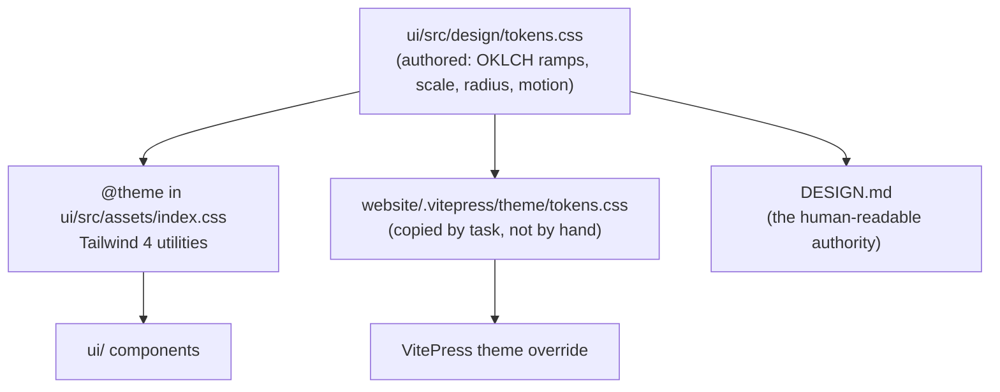
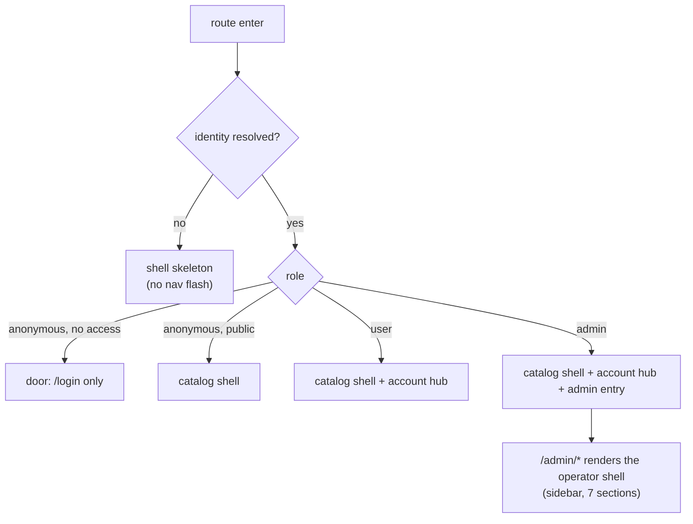
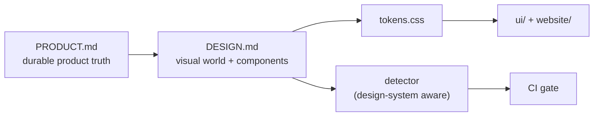

# RFC 0003 — Web console redesign

| Field       | Value                                                        |
| ----------- | ------------------------------------------------------------ |
| Status      | Draft                                                         |
| Author      | Max Batleforc <maxleriche.60@gmail.com>                       |
| Co-author   | Claude Opus 5 (1M context) <noreply@anthropic.com>            |
| Created     | 2026-08-11                                                    |
| Supersedes  | —                                                             |
| Touches     | `ui`, `website`, `PRODUCT.md`, `DESIGN.md`, CI, docs           |
| Proof       | `ui/design-proof/` — the catalog surface built in the chosen world (R8/R9) |

---

## 1. Summary

The web console in `ui/` grew one page at a time alongside twenty-one registry adapters. It now has
29 page components and 48 components across 55 route entries — 22 of which are redirects — with 17
pages behind `/admin`, plus a second package browser that does the same job as the first one better.
Nothing about it was designed; all of it was added.

This RFC proposes a **full redesign of the console** — information architecture, shell, component
layer, and visual expression — carried out with the [Impeccable](https://impeccable.style) design
skill as the working method rather than as a one-off aesthetic pass. Three things are settled going
in and are not up for rediscovery during the work: the name and wordmark **`BatleHub.`** stay, the
result must remain recognisably part of the **Monofolio** family that also dresses `website/`, and
the console must reach **WCAG 2.2 AA** and ship **French/English** localisation. Everything else
about the visual world — palette derivation, type scale, density, motion, the grid-and-glow
treatment — is explicitly reopened.

The redesign is *replacement*, not polish. The current expression is treated as evidence of intent
and as an anti-reference, not as a floor to build on.

### Before / after

```text
# today — one flat top nav, everything at equal weight
BatleHub.  Packages  Explore  Access Check  URL Mapper  Setup        [Admin]  Docs  ⬤  ☰
           └ /packages          → all packages, client-side filter, no pagination
           └ /explore           → the same packages, server-paginated, registry facet,
                                  upstream search — strictly better, second in the nav
           └ /packages/detail?registry=…&name=…       (query params)
           └ /explore/packages/:registry/:name        (path params)
           └ /access-check, /path-mapper              debug tools, primary nav weight

# with this RFC — the shell follows what the viewer can actually do
BatleHub.  Packages  Setup  ·  Admin      Docs  Locale  Theme  ⬤
           └ /packages                    one catalog: facets, server search, upstream
           └ /packages/:registry/:name    one detail page; admin controls inline for admins
           └ /me                          profile · tokens · namespace · CLI
           └ /tools                       access check · URL mapper (demoted, still linked
                                          from the errors that make you want them)
           └ /admin/…                     unchanged sections, one redirect table
```

---

## 2. Motivation

1. **Two package browsers compete for the same job, and the weaker one is the landing page.**
   `/` redirects to `/packages` (`ui/src/router/index.ts`), which renders `PackageList.vue`: a
   single `listPackages2()` call, client-side substring filter, no pagination. `/explore`
   (`PackageExplorer.vue`, 450 lines) does the same thing with a registry sidebar, server-side
   search, per-registry counts, sorting, pagination *and* upstream search. Every first-time visitor
   lands on the lesser surface. The two even disagree on URL shape — `/packages/detail?registry=…`
   versus `/explore/packages/:registry/:name` — so a package has two canonical addresses, only one
   of which survives a copy-paste.

2. **The admin shell has outgrown itself.** 17 pages under a seven-item sidebar, and the router
   carries 22 redirect entries — 12 of them legacy aliases (`/admin/users` →
   `/admin/security/users`, `/admin/bulk` → `/admin/packages/bulk`, …) hand-written one per moved
   page, the rest section indexes. `AdminPackages.vue` is 639 lines and `AdminConfigReload.vue`
   619 — both are pages that grew a second and third job without ever being re-cut.

3. **Debug tools hold primary-navigation weight.** "Access Check" and "URL Mapper" sit between
   "Explore" and "Setup" in the top nav. They are excellent tools for the ten minutes a year when a
   pull is mysteriously 403ing, and they are dead weight in the nav for the rest of the year. Worse,
   they are *not* linked from the place people actually meet the problem: a denied request.

4. **Nothing is designed for the first five minutes.** A freshly deployed instance has no packages,
   no cached artifacts, no audit entries and possibly no configured registries. Today that renders
   as a column of empty tables. There is no first-run path, no "you have no registries yet, here is
   how to add one", no activation moment. This matters precisely for the self-hoster and the
   platform owner — the two audiences who see the instance at its emptiest.

5. **Accessibility is unverified and probably failing.** Across 29 pages and 48 components there
   are **18 `aria-*` attributes in total**, eight files that mention `focus-visible`, no skip link,
   and **no `prefers-reduced-motion` handling anywhere in `ui/src`** — in a theme whose signature is
   glow and a scrolling grid. `--accent` is defined as the primary colour at 10–12 % alpha and used
   as a background behind `--accent-foreground` text; that pairing has never been contrast-checked
   in either mode. AA is a stated requirement (§4.7) that the current UI has no evidence of meeting.

6. **English is welded in.** `ui/index.html` hardcodes `<html lang="en">`, there is no `vue-i18n`
   dependency, and every user-visible string is a literal inside a `.vue` template. French/English
   is now a requirement; retrofitting it page-by-page *after* a redesign means touching all
   29 pages twice.

7. **The design language is duplicated by hand.** `ui/src/assets/index.css` and
   `website/.vitepress/theme/custom.css` each hold their own copy of the OKLCH crimson/copper
   values, radius, and glow definitions. They already read as two dialects rather than one system,
   and every future token change is two edits with no mechanism that notices when only one lands.

8. **The current expression carries known generated-UI tells.** Impeccable's deterministic detector,
   run against the tree at the time of writing, flags:

   | Surface | Rule | Where |
   | --- | --- | --- |
   | `ui/` | `codex-grid-background` | `ui/src/assets/index.css:134` — the two-axis hairline grid |
   | `ui/` | `border-accent-on-rounded` | `ui/src/components/admin/SectionTabs.vue:22` |
   | `website/` | `side-tab` | `custom.css:261`, `ConfigGenerator.vue:2595` — 3 px left border on cards |
   | `website/` | `codex-grid-background` | `custom.css:325` |

   Two findings in `ui/src` is a low count because the detector only sees source; the rules that
   need a rendered page (contrast, hierarchy, spacing rhythm, focus order) have never run against
   this UI at all.

9. **Registry knowledge is data; its presentation is not.** `ui/src/config/registryTypes.ts` is
   80 kB of per-type definitions and setup snippets, and `registryPathFields.ts` another 33 kB —
   all of it funnelled into one `SetupGuide.vue` page (310 lines) and one `PathMapper.vue` (147).
   Adding the 22nd registry type extends the data file, which is right; but the surface that data
   feeds was designed for about six registries and is now a wall.

---

## 3. Goals / non-goals

**Goals**

- One catalog surface and one canonical package URL, working identically for anonymous, user and
  admin viewers with the affordances each of them actually has.
- A shell that follows identity: an anonymous viewer on a public instance, an authenticated
  developer, and an admin see three coherent products, not one product with hidden items.
- A designed first run: a fresh instance explains itself and offers the next action, on every
  surface that can legitimately be empty.
- A stated, enforced accessibility contract — WCAG 2.2 AA, keyboard-complete, reduced-motion
  honoured — verified in CI rather than asserted in a document.
- French and English throughout, with a message catalogue that new work extends by default.
- One set of design tokens, authored once, consumed by both `ui/` and `website/`.
- A replacement visual world that stays in the Monofolio family and clears Impeccable's detector on
  both source and rendered pages.
- Design decisions recorded where later work will read them: `PRODUCT.md` (written, §11 R5) and
  `DESIGN.md` (the RFC's Phase 1 deliverable).

**Non-goals**

- **Changing the API.** `ui/src/client/` is generated from `ui/openapi.json`; if the redesign wants
  data the API does not expose, that is a separate RFC. Any such need is recorded in §11 rather
  than fixed opportunistically.
- **Changing the frontend stack.** Vue 3 + Vite + Tailwind 4 + `radix-vue` stays. No Nuxt, no SSR,
  no component-library swap (§8).
- **Redesigning the TUI** (`cli/`'s ratatui interface). Same product, different medium, different
  RFC.
- **A marketing site.** `website/` is a documentation surface (Read mode) and is in scope only for
  token alignment and the anti-pattern fixes listed in §6.7 — not for a hero-page rewrite.
- **Server-side UI configuration.** There is no `[ui]` block in `AppConfig` today and this RFC does
  not add one; locale and theme stay client-side (§4.6).
- **Rebranding.** The name, the wordmark and the Monofolio lineage are fixed inputs (§11 R2).
- **Onboarding that writes config.** First-run guidance *explains* and *links*; it does not gain a
  new privileged endpoint that mutates `config.toml`.

---

## 4. User-facing design

### 4.1 The shell follows the identity

Three viewer classes already exist in `useAuth` (`role`, `has_registry_access`, `auth_provider`,
`isAdmin`). Today the shell renders one nav and hides items inside it. Instead:

| Viewer | What the shell is | Primary nav |
| --- | --- | --- |
| Anonymous, no registry access | A door. Login only; everything else is unreachable anyway (the router already redirects). | — |
| Anonymous, public instance | A catalog and a quick-start. No account surfaces, no empty "My …" pages that will only 302. | Packages · Setup |
| Authenticated developer | The catalog plus their own things, grouped in one account hub. | Packages · Setup · *(avatar → Me)* |
| Admin | The above plus the operator product, entered deliberately rather than sitting in the same row. | Packages · Setup · **Admin** |

Rules:

- A nav item is rendered when the viewer can *use* it. Nothing is shown that leads to a redirect.
- `/tokens` requires an OIDC session (`requiresOidcAuth`); a static-token user never sees it rather
  than seeing it and bouncing to `/login`.
- The admin entry stays visually distinct (it is a different product), but it is one item, not a
  divider plus an item plus a duplicated mobile block.

### 4.2 Information architecture

```text
/                         → identity-aware home (§4.3), not a blind redirect to /packages
/login
/packages                 → the one catalog (PackageList + PackageExplorer merged)
/packages/:registry/:name → the one package page; admin controls inline when isAdmin
/setup                    → connect-a-tool flow (registry → tool → snippet)
/me                       → account hub, tabbed: profile · tokens · namespace · CLI
/tools                    → diagnostics: access check · URL mapper
/admin/…                  → unchanged section structure; redirects become one table
```

Consolidation, by count: **29 page components → ~22 routed pages.**

| Merged into | From | Why |
| --- | --- | --- |
| `/packages` | `PackageList.vue`, `PackageExplorer.vue` | Same job; explorer's data path wins (paginated, server-side search, upstream results). |
| `/packages/:registry/:name` | `PackageDetail.vue`, `ExplorePackageDetail.vue`, `AdminPackageDetail.vue` | One package, one address. Admin actions become a section of the page gated on `isAdmin`, not a parallel page with its own layout. |
| `/me` | `MyProfile.vue`, `TokensPage.vue`, `MyNamespace.vue`, `CliDownload.vue` | Four routes that are all "things that belong to me", each currently a top-level destination reachable only from a dropdown. |
| `/tools` | `AccessCheck.vue`, `PathMapper.vue` | Diagnostics, demoted from primary nav and *promoted* into the error states that motivate them (§4.4). |

The admin section keeps its seven groups — they map to real operator concerns and the sidebar is the
right pattern for 17 destinations. What changes is the mechanics: the 12 hand-written legacy
redirects collapse into one `LEGACY_REDIRECTS` table adjacent to `adminSections.ts`, so the section
list and its aliases stop drifting apart.

**Deep links keep working.** Every path that resolves today still resolves after the rework, via
redirect where it moved (§9).

### 4.3 Three entry experiences

The home route resolves to one of three states, chosen from identity plus one cheap instance probe
(registry count and package count, both already exposed):

1. **Fresh instance, admin viewer.** A first-run path: which registries are configured, what is
   missing, and the next concrete action (add a registry to `config.toml` → reload → publish or pull
   something). Links into `/setup` and the docs site; never claims to have done anything itself.
2. **Developer viewer.** Straight to work: search the catalog, the last things they touched, their
   namespace, and a one-click path to the snippet for the tool they use.
3. **Anonymous on a public instance.** What this instance mirrors, and how to point a tool at it.

This is the one place the console is allowed to be a *Persuade*-adjacent surface; everything else is
**Operate** in Impeccable's terms, and is judged by scanability and task completion rather than
expression.

### 4.4 Empty, loading, error and denied states are first-class

Every list surface gets four designed states, not one plus three accidents. The `AsyncState`
component already exists and is the right place for this contract.

| State | Requirement |
| --- | --- |
| Empty (nothing yet) | Say what would put something here, and link to it. Distinguish "no packages have ever been published to this registry" from "your filter matched nothing". |
| Empty (filtered) | Show the filter that produced it and offer to clear it. |
| Loading | Skeletons matching the final layout for anything above the fold; no full-page spinner that discards context on every refetch. |
| Error | The failing operation in the user's vocabulary, the status, and a retry. Never a bare `extractMessage()` string as the entire page. |
| Denied (403) | The one place the diagnostics earn their keep: a 403 links straight into `/tools` prefilled with the registry, package and identity that were refused. |

### 4.5 Destructive-action contract

Bulk yank, bulk delete, IP blocks, package deletion and config reload act on infrastructure other
people's builds depend on. `ConfirmDialog` exists; the contract it must enforce:

- Name the **scope and the count** before the verb — "Yank 47 versions of `internal/auth` across
  2 registries" — computed from the actual selection, never "Are you sure?".
- State **reversibility explicitly**: yank is reversible, delete is not, a config reload drops
  nothing in flight (`HotConfig` swaps atomically) but changes policy for the next request.
- Irreversible actions require typing the object name; reversible ones do not. Confirmation friction
  is proportional to consequence, not applied uniformly.
- After the fact, the result is reported with counts (succeeded / failed / skipped), not a toast
  that says "Done".

### 4.6 Internationalisation

- `vue-i18n` (Composition API mode) with catalogues at `ui/src/locales/en.json` and `fr.json`.
  Single catalogue per locale — **no per-component `<i18n>` blocks**, so extraction and review stay
  mechanical.
- Keys are namespaced by surface (`packages.empty.title`), never by English sentence.
- Locale resolution: explicit user choice in `localStorage` → `navigator.language` prefix match →
  `en`. `document.documentElement.lang` is set from the active locale (it is currently a hardcoded
  attribute in `ui/index.html`).
- **The locale is a stored preference, not a shell toggle.** It lives in user settings
  as a three-state control — **System / English / Français** — in the same panel and with
  the same grammar as the theme setting. Three states because "System" (follow
  `navigator.language`) is a real answer that a two-way switch cannot express, and because
  the stored preference and the resolved locale are different things: storing `en` when the
  user meant "follow my browser" silently swallows a later browser-language change. The
  preference persists per browser; the resolved locale is what renders.
- **Domain terms are not translated**: registry type names, `latest`, `yank`, HTTP verbs, config
  keys and CLI invocations stay verbatim in both locales. A French UI that says *"chaîne de
  caractères de version"* where the config says `version_pattern` is worse than English.
- Dates, counts and byte sizes go through `Intl` (`ui/src/lib/format.ts` centralises this today and
  keeps that role).
- **Untranslated by decision**: server-produced error text and audit reasons render as returned. The
  API has no locale negotiation and this RFC does not add one (§3, non-goals).

### 4.7 Accessibility contract

Target: **WCAG 2.2 AA**. Concretely, and checkable:

| Requirement | Detail |
| --- | --- |
| Contrast | ≥ 4.5:1 body, ≥ 3:1 large text and UI boundaries, **in both themes**, including every `--accent`-alpha-over-surface pairing that exists today. |
| Focus | A visible focus indicator on every interactive element, ≥ 3:1 against its background, never removed by a `focus:outline-none` without a replacement. |
| Keyboard | Every action reachable and operable by keyboard, including tables, dialogs, the registry facet, and the mobile nav. Focus is trapped in dialogs and restored on close. |
| Landmarks | One `<main>` (exists), plus `<nav>`/`<header>`/`<footer>` and a skip link (missing today). |
| Motion | Every animation and the grid/glow treatment respect `prefers-reduced-motion: reduce`. Currently unhandled anywhere in `ui/src`. |
| Names | Icon-only controls carry accessible names — the theme toggle, the mobile menu button, copy buttons, and row action buttons all lack them today. |
| Status | Async results announce via a live region rather than a purely visual state change. |

### 4.8 Configuration

No server configuration is added. Locale and theme are client-side and persisted per browser. The
existing build-time variables (`VITE_API_BASE_URL`, `VITE_DOCS_URL`, `VITE_CSP`) are unchanged.

---

## 5. Architecture

### 5.1 One token source, two consumers



The invariant: **there is exactly one file where a colour, radius, spacing step or duration is
decided.** `website/` receives it through a `task` step (`task ui:tokens`, mirroring the existing
`task dump-spec` pattern) whose output is committed, so a drift shows up as a diff in review rather
than as two themes that quietly disagree. A CI check re-runs the copy and fails if the tree is
dirty — the same shape as the existing spec/client sync gate.

### 5.2 Shell composition



The guard order in `router.beforeEach` is unchanged — OIDC callback, then error, then
`waitForIdentity`, then access and meta guards. What changes is that the shell subscribes to the
same resolved identity instead of each component re-deriving visibility from `isAdmin` inline.

### 5.3 Where the redesign decisions live



`PRODUCT.md` is written and is an input, not an output, of this RFC. `DESIGN.md` is the deliverable
of Phase 1 and is what makes the detector design-system-aware (it reads local `DESIGN.md` /
`.impeccable/design.json` unless `--no-design-system` is passed).

---

## 6. Detailed design

### 6.1 `ui/src/design/` — the token layer

- New `ui/src/design/tokens.css`: the OKLCH ramps (re-derived, not inherited), the spacing and type
  scale, radius, elevation, motion durations and easings. Both themes defined here.
- `ui/src/assets/index.css` keeps the Tailwind `@theme` mapping and the base layer, and stops being
  the place values are *decided*.
- The signature utilities (`.cyber-grid-bg`, `.cyber-text-glow`, `--cyber-glow`, `--steam-glow`)
  are re-examined rather than carried over: the grid is a flagged detector rule (§2.8) and the glow
  is unverified against contrast and reduced-motion. Whatever replaces them is a `DESIGN.md`
  decision, and whatever survives gains a `prefers-reduced-motion` path.

### 6.2 `ui/src/components/ui/` — primitives

The 18 primitives (button, badge, card, dialog, table, tabs, select, switch, pagination,
async-state, code-block, copy-button, page-header, alert, input, label, separator) stay as the
component vocabulary; each is re-cut against the new tokens and the §4.7 contract. Each already has
a colocated `*.test.ts`; those tests are the regression signal that a primitive kept its API while
its skin changed.

Additions the redesign needs and does not have: `Skeleton`, `EmptyState`, `Toast`/live-region
`Announcer`, `Breadcrumb`, `Facet` (the registry filter, currently inlined in `PackageExplorer`),
and `DestructiveConfirm` (a `ConfirmDialog` specialisation enforcing §4.5).

### 6.3 Shell and navigation

- `AppHeader.vue` loses the duplicated desktop/mobile link definitions (three separate
  `RouterLink` blocks repeat the same active-class logic today); `AppNav.vue` becomes the single
  renderer for both variants driven by one identity-derived link list.
- `AdminLayout.vue` keeps the sidebar + mobile tab-strip split; the strip gains scroll affordances
  and keyboard support.
- New `LEGACY_REDIRECTS` table beside `ui/src/config/adminSections.ts`, consumed by the router,
  replacing the inline redirect entries.

### 6.4 Pages

Rebuild in the order of §12. Notable per-page work beyond the merge table in §4.2:

- **`AdminPackages.vue` (639 lines)** and **`AdminConfigReload.vue` (619)** are split: list/filter
  state separates from row actions, and the config editor separates the editor, the validation
  report and the read-only ConfigMap path (which is a genuinely different screen, not a banner).
- **`SetupGuide.vue`** becomes the connect-a-tool flow: pick registry → pick tool → get snippet,
  reading the same `registryTypes.ts` data. The data file's shape does not change.
- **`AdminDashboard.vue` (160 lines)** is the operator's answer to "is it healthy and is it
  saving me anything" and is currently the thinnest page for the most important question.

### 6.5 Internationalisation mechanics

- Add `vue-i18n` and `@intlify/unplugin-vue-i18n`; catalogues under `ui/src/locales/`.
- Extraction pass per phase: a page is not "done" until its strings are keys.
- Lint gate: a rule (or a small script in `ui/` run by `task`) that fails on literal user-visible
  text in templates, so the catalogue cannot silently rot as pages are added.
- `ui/index.html`'s `lang` attribute becomes the boot default only; the app sets it on locale change.

### 6.6 CI gates

- `npx impeccable detect ui/src website/.vitepress` in the frontend workflow, non-advisory findings
  failing the build once the tree is clean.
- A rendered-page pass (the detector accepts URLs, and the a11y checks that matter need a real DOM)
  against a preview build, added in the phase that first has a stable shell.
- The existing `vitest`, `oxlint`, `vue-tsc -b` and coverage gates are unchanged and must stay green
  throughout; they are the guarantee that a visual rework did not change behaviour.

### 6.7 `website/`

In scope only for: consuming the shared tokens (§5.1), and clearing its two detector findings
(`side-tab` at `custom.css:261` and `ConfigGenerator.vue:2595`, `codex-grid-background` at
`custom.css:325`). Content, navigation and VitePress configuration are untouched.

**Deliberately untouched**, so reviewers do not go looking:

- `ui/src/client/` — generated from `ui/openapi.json`, git-ignored, never hand-edited.
- `ui/openapi.json` and every Rust crate — this RFC adds no API surface. If a redesigned page wants
  a field the API lacks, it is recorded in §11, not added here.
- `ui/src/config/registryTypes.ts` and `registryPathFields.ts` — the *data* is correct and stays;
  only what consumes it is redesigned.
- `cli/`'s ratatui TUI — different medium, different RFC.
- `crates/web/src/middleware/security_headers.rs` and the `buildCsp()` path — see §7.

---

## 7. Security considerations

- **No new authenticated surface.** The rework moves and merges routes that already exist behind
  the same guards. `requiresAuth`, `requiresOidcAuth` and `requiresAdmin` semantics are preserved
  route-for-route, and `crates/web`'s authorisation is unchanged — the console has never been the
  enforcement point, and consolidating `AdminPackageDetail` into `/packages/:registry/:name` does
  not make it one. The admin section of that page is a *rendering* decision; the endpoints it calls
  stay admin-only server-side.
- **Hiding is not authorisation, and the RFC does not pretend otherwise.** §4.1 hides nav items the
  viewer cannot use for clarity. An attacker who types the URL still hits the router guard and then
  the server's RBAC. Nothing that was reachable becomes unreachable, and nothing unreachable becomes
  reachable.
- **CSP stays strict; live mode widens it only in a dev build, only on request, and only to one
  localhost port.** `ui/index.html` carries a
  `<meta http-equiv="Content-Security-Policy" content="%VITE_CSP%">` built by `buildCsp()` in
  `ui/build/csp.ts`. Impeccable's `live` mode serves a helper script from
  `http://localhost:<port>/live.js`, which `script-src 'self'` refuses. Implemented (§11 R7):

  - `buildCsp(apiBaseUrl, livePort)` takes a **port number**, not an origin or a source list. The
    only policy that argument can express is one localhost origin on `script-src`/`connect-src` plus
    `blob:` on `img-src` — no environment value can turn it into an arbitrary source.
  - `resolveLivePort(mode, env)` decides whether it may be non-null, and requires **both** a
    non-production build **and** `VITE_IMPECCABLE_LIVE_PORT` naming a valid port. It returns `null`
    for a production build regardless of the variable, and refuses anything that is not a plain
    in-range integer rather than coercing it.
  - Absent the opt-in, `buildCsp` emits a policy byte-identical to the one it emitted before live
    mode existed — pinned by a test that compares the two outputs directly, alongside the existing
    `script-src 'self';` whole-directive assertion.

  The residual risk is a developer running `pnpm dev` with the variable set, which allows scripts
  from a port on their own machine in their own browser. Nothing in a produced artifact changes.
- **Destructive confirmations are a safety property, not a nicety.** §4.5's scope-and-count
  requirement exists because bulk endpoints accept a selection the UI computes; showing the wrong
  count is how someone yanks the wrong 47 versions.
- **Token display.** `/me` groups tokens with profile and namespace. Token values remain
  write-once-reveal-once as they are today; grouping them with less-sensitive content must not
  cause a token to render on a route the user did not deliberately open — the account hub's tabs are
  routed, not eager-rendered.
- **Translation is not a trust boundary, but it is an injection surface.** Catalogue values are
  interpolated as text; no `v-html` on translated strings, and no locale-dependent URL construction.

---

## 8. Alternatives considered

| Alternative | Why rejected |
| --- | --- |
| Keep Monofolio as-is, fix only the IA | It leaves items 5, 6 and 8 of §2 untouched — the a11y gap, the i18n retrofit, and the flagged tells all live in the token and component layer. It also means touching all 29 pages for IA now and again for i18n and contrast later. |
| Adopt an off-the-shelf Vue design system (PrimeVue, Naive UI, shadcn-vue as a dependency) | Trades 17 owned primitives with colocated tests for a theming layer, and forfeits the Monofolio lineage that §11 R2 makes binding. The primitives are not the expensive part; the IA and the states are. |
| Rewrite in Nuxt for SSR and built-in i18n | The console is behind auth and serves no SEO purpose; SSR would add a Node runtime next to a single Rust binary, which is the deployment story's whole point. |
| Incremental page-by-page redesign with both looks live | Two design systems coexisting across 29 pages for the duration, with no point at which the detector or a contrast audit can pass. Phased *delivery* (§12) gets the same reviewability without a permanently mixed surface. |
| Do i18n as a separate follow-up RFC | Cheaper to schedule, twice as expensive to execute: every rebuilt page would be edited again purely to extract strings. |
| Machine-translate the French catalogue | The domain vocabulary (yank, latest, registry modes, gate names) is exactly what a general translator gets wrong, and a wrong French label on a destructive action is a safety problem. §4.6 keeps domain terms verbatim; the rest is authored. |

---

## 9. Rollout and compatibility

- **Default behaviour.** There is no flag: the console is replaced. It is a client-side asset served
  by the same binary; there is no per-user opt-in to maintain and no dual-stack period.
- **URL compatibility.** Every path that resolves today resolves after the rework. Moved routes get
  redirects: `/explore` → `/packages`, `/explore/packages/:registry/:name` and
  `/packages/detail?registry=…&name=…` → `/packages/:registry/:name`, `/profile`, `/tokens`,
  `/my-namespace`, `/cli` → the matching `/me` tab, `/access-check` and `/path-mapper` → `/tools`.
  The existing `/admin/*` legacy redirects are preserved by the new table (§6.3). Bookmarks and
  links in `docs/` keep working; a redirect that would break a documented URL is a review blocker.
- **Config migration.** None. `CURRENT_CONFIG_VERSION` does not move; no `AppConfig` field is added
  or removed.
- **Operator prerequisites.** None. Same build, same static assets, same container image.
- **Persisted state.** `localStorage`/`sessionStorage` keys in use today (auth tokens, `oidc_state`,
  theme) keep their names and meanings; locale is a new key. A user with an old session is not
  logged out by the deploy.
- **Rollback.** Revert the frontend commits and rebuild — nothing is persisted server-side, no
  migration runs, no API contract moved. The only user-visible residue of a rollback is a stored
  locale preference that the old UI ignores.
- **Docs.** `docs/` screenshots and any UI walkthroughs are updated in the phase that changes the
  surface they show; `README.md`'s feature list is unaffected.

---

## 10. Test plan

- **Component unit** (`ui/src/components/**/*.test.ts`): the 18 primitives keep their public props
  and slots; tests are updated only where an API deliberately changes. New primitives
  (`EmptyState`, `Skeleton`, `Announcer`, `DestructiveConfirm`, `Facet`) ship with tests, including
  `DestructiveConfirm` refusing to confirm an irreversible action without a typed name.
- **Page unit** (`ui/src/pages/*.test.ts`): the merged catalog and package pages get the coverage
  `PackageList.test.ts` and `AdminUsers.test.ts` have today, extended to the four states of §4.4.
- **Router** (`ui/src/router/index.test.ts`): the existing guard suite must pass unchanged — it is
  the proof that consolidation did not weaken `requiresAuth`/`requiresOidcAuth`/`requiresAdmin`.
  New cases: every legacy path in §9 lands on its replacement, preserving query and hash.
- **i18n**: a test asserting `en` and `fr` catalogues have identical key sets, and that no key is
  missing at runtime for any rendered page.
- **Accessibility**: automated axe pass over the rendered routes in the phase that first has a
  stable shell; contrast checked per token pair in both themes as a unit test over the token file,
  not by eye.
- **Detector**: `npx impeccable detect ui/src website/.vitepress` clean of non-advisory findings,
  plus a rendered-URL pass at desktop and mobile viewports.
- **Existing suites that must pass unchanged**: the full `vitest` run (39 test files today),
  `vue-tsc -b`, `oxlint`, and the frontend coverage gate. The Rust workspace is untouched, so a
  green `cargo test --workspace` before and after is a null result by construction — if it is not,
  something is in scope that should not be.

---

## 11. Decisions and open questions

### Resolved

| # | Question | Decision |
| --- | --- | --- |
| R1 | How far does the rework go — IA only, token evolution, or full redesign? | **Full redesign, visual identity reopened.** The a11y, i18n and duplication problems all live below the page layer; an IA-only pass leaves them. |
| R2 | What is binding despite the identity being open? | **The name and wordmark `BatleHub.`, and the Monofolio lineage.** The console may replace this instance's expression of Monofolio but must stay recognisably in the family shared with `website/`. Voice is deliberately *not* frozen. |
| R3 | Who is this for? | **All three audiences at once** — the self-hoster, the platform owner, and the developer/CI consumer — because they share one instance. Corporate/air-gapped is an end goal, not a current user, and no copy may imply otherwise. |
| R4 | Accessibility and localisation? | **WCAG 2.2 AA and French/English.** Both are requirements of the rework, not follow-ups (§8). |
| R5 | Is Impeccable a reference or a tool in the repo? | **Bootstrapped.** Installed at `.claude/skills/impeccable/` (project scope) and `PRODUCT.md` written from a real interview. The skill and `.impeccable/` are gitignored — ~150 vendored files that turn over on every upstream release are not review surface — and installed on demand with `task impeccable:install`. `PRODUCT.md` and `DESIGN.md`, the durable decisions, are tracked. `task impeccable:detect` runs the deterministic scan; its findings are already cited as evidence in §2.8. |
| R7 | Does live mode get to relax the CSP? | **Yes, under a two-condition gate, and it is implemented.** `resolveLivePort` requires a non-production build *and* an explicit `VITE_IMPECCABLE_LIVE_PORT`; `buildCsp` takes a port number, so the widest policy it can express is one localhost origin. A produced build is unchanged, pinned by test. See §7. |
| R8 | What replaces the grid-and-glow signature? | **The world is an Emigre bitmap type specimen in its dark rendition** (chosen from the direction roll, seed key `51446004`, over the roll's own assignment). The decorative two-axis grid goes; the *edge* stays, which was the stated requirement. Its replacement divider language is the dashed hairline rule — same visual family, but every line separates two real things, so the `codex-grid-background` tell disappears without the surface going calm. The core device is **resolution as state**: an artifact BatleHub holds and has verified renders at full resolution, one it does not renders coarse. |
| R9 | Which palette? | **The incumbent Monofolio OKLCH tokens** (with the one chroma correction in R11). Measured against the specimen world's dark ground they beat the world's own board red: `--foreground` 16.88:1, `--copper` 8.06:1, `--primary` crimson **5.32:1** (AA body) against the board red's 4.06:1 (large-text only). The binding lineage and the world's "one synthetic accent" turn out to want the same colour from opposite directions. Two incumbent faults are corrected rather than inherited — see R10. |
| R10 | The two token faults the measurement exposed | **`--primary-foreground` on `--primary` is 3.58:1 and fails AA** — every filled crimson button in the current UI has this; the fill takes dark ink instead (4.91:1). **`--card` against `--background` is 1.01:1**, a surface that cannot be seen; the dashed rule carries that separation and `--ground-raised` lifts to `oklch(0.12 0.020 18)` so hover registers. Both land in Phase 2. |
| R11 | Colour tokens must be in-gamut for sRGB *as authored* | **`--accent` is re-specified at max in-gamut chroma — `oklch(0.65 0.235 25)` (`#ff343d`) — not caveated.** Monofolio ships `oklch(0.65 0.26 25)`, which is outside sRGB, so engines disagree on what they paint: naive clipping gives `#ff0e30` (5.32:1), CSS Color 4 chroma reduction gives ~`#ff343d` (**5.76:1**). Both clear AA today, so nothing is broken — but a token that leaves the gamut cannot carry a contrast *guarantee*, and `--accent` is load-bearing four ways (link text, fill under dark ink, blocked state, selected edge). The clamped value measures **better** than the one it replaces (5.76:1 and 5.69:1 vs 5.32:1 and 5.26:1) and keeps the lineage. **Rule for Phase 2:** every colour token is in-gamut for sRGB as authored, with the Monofolio source value kept as a provenance comment rather than as the computed value — a prose caveat gets broken by the next edit, a value that cannot leave the gamut cannot. Wide-gamut, if wanted, layers as an `@supports (color: color(display-p3 …))` enhancement over the in-gamut base, with AA measured against the base. |
| R11a | What the in-gamut gate caught once it was executable | **Four out-of-gamut tokens, not one.** Phase 2 turned R11 into a test (`ui/src/design/tokens.test.ts`), which immediately failed on values that had been reviewed, documented and shipped in the proof: dark `--accent` authored at chroma **0.236** against a limit of **0.235876** — over by 0.000124, invisible to the eye and fatal to the guarantee; and three light-rendition tokens — `--ground-sunk` and `--accent-ink` at 0.005 against a limit of 0.0048, and `--focus` at 0.16 against a limit of **0.1127**. All four are clamped; every measured ratio is unchanged to two decimals except `--focus` on paper, 4.46:1 → 4.48:1. The lesson is the rule's own justification: a colour rule that is not executed is a colour rule that is not enforced, and every one of these passed human review. |
| R12 | Does the console keep a light rendition? | **Yes, and it is the world's home ground rather than a concession.** The specimen board is ink on paper; the dark rendition is the adaptation the use scene earned. Light is built from Monofolio's light tokens under R11, which immediately catches a second out-of-gamut value: light `--primary` ships `oklch(0.52 0.24 25)` where the sRGB maximum at that L/H is **0.2108**. Measured on paper: ink 16.64:1 · ink-dim 7.24:1 · accent 5.63:1 · copper 5.74:1 · counter-ink on accent 5.97:1 · rule-strong 3.41:1 · focus 4.48:1. Copper darkens from L .58 to L .50 — at .58 it reads 4.2:1 on paper, under the body floor; the hue relationship survives, the lightness cannot. **The Undependable Fill Rule holds in both renditions** (raised vs paper is 1.11:1, as untrustworthy as 1.06:1 on near-black, because the ratio compresses at both ends), so the state grammar transfers unchanged. Theme is a stored preference — System / Light / Dark — resolved before first paint and re-resolved on OS change only while the preference is System. |
| R13 | Does the catalog split cached from upstream results? | **No — one list, with provenance stated per row.** The question a reader actually has is "does this instance already have it?", and two tables make that harder to answer, not easier: you would have to look in both to know. An upstream-only row carries an explicit `upstream` marker and is not navigable to a detail page, because there is nothing cached to show yet. This also matches the design system's own state grammar, where an artifact's standing is a property of the row rather than of which table it was filed under. |
| R6 | Where do the design decisions live afterwards? | **`PRODUCT.md` (done) and `DESIGN.md` (Phase 1).** The detector reads `DESIGN.md`, so recording the world is what makes the CI gate meaningful rather than generic. |

### Still open

1. **Whether `website/` consumes tokens by build step or by published package.** §5.1 assumes a
   committed copy produced by a `task` step, matching `task dump-spec`. A real npm package is
   cleaner and heavier. *Recommendation:* the `task` step; revisit only if a third surface appears.
2. **Whether `AdminDashboard` needs API data it does not have** (per-registry savings over time,
   cache hit-rate trend). If yes, that is a separate API RFC, not a quiet addition here.
3. **French copy authorship.** §4.6 rules out machine translation for domain terms. Who writes and
   reviews the French catalogue, and whether English remains the source of truth for key naming, is
   unsettled.

---

## 12. Implementation phases

Each phase leaves the tree green: `vue-tsc -b`, `vitest`, `oxlint` and the coverage gate all pass at
every boundary.

| Phase | Content | Useful on its own? |
| --- | --- | --- |
| 1 | **Decide the world.** ✅ Done. `/impeccable` new-work ran: direction chosen (R8), palette settled by measurement (R9, R10), and a proving surface for the catalog built at `ui/design-proof/` — standalone, outside `ui/src`, so no production code moved. `DESIGN.md` is documented from that built world. | Yes — records the design language even if nothing else lands. |
| 2 | **Token layer.** ✅ Done. `ui/src/design/tokens.css` (both renditions, one source), `color.ts` for the maths, `tokens.test.ts` enforcing in-gamut and every AA floor in both renditions, `task ui:tokens` + drift gate, and the alias bridge in `index.css` so the existing pages adopt the system unchanged. The gate caught four out-of-gamut tokens and, via the sidecar regeneration, out-of-gamut steps in 12 tonal ramps. | Yes. |
| 3 | **Primitives and states.** ✅ Done. Six primitives added with tests — `Announcer`, `Skeleton`, `EmptyState`, `Breadcrumb`, `Facet`, `DestructiveConfirm` (the §4.5 contract in code: required `count`/`scope`, stated reversibility, typed-name friction only where irreversible). §4.7 work landed: a global `prefers-reduced-motion` neutraliser in `index.css` (per-component `motion-safe:` cannot reach radix's `data-[state]` animations or `tw-animate-css`), a skip link and a focusable `<main>` landmark, accessible names and `aria-expanded`/`aria-controls` on the icon-only controls that lacked them, `CopyButton` named in icon size, and `Pagination` given a landmark and a live page indicator. The 18 existing primitives inherit the palette through the alias bridge and had their a11y gaps closed; **they are not yet redrawn in the specimen grammar** — that happens per surface in Phases 4–6, since a primitive's final form depends on the page that uses it. | Yes — every existing page inherited the a11y fixes. |
| 4 | **Shell and IA.** ✅ Done. `ui/src/config/navigation.ts` derives the bar from identity and holds `LEGACY_REDIRECTS` + `SECTION_INDEXES` as data; one router guard consumes them, preserving query and hash, replacing ~20 hand-written entries. `/` is now a real identity-aware surface (fresh-instance path for admins, straight-to-work otherwise) instead of a blind redirect to `/packages`. `/me` and `/tools` hubs share `HubLayout`, with routed tabs so each still deep-links and `/me/tokens` renders only on the route the user opened. Diagnostics left the primary bar. 34 new tests cover every §9 path, query preservation, and that the moved routes kept their guards. **Deferred to Phase 5:** the catalog redirects (`/explore` → `/packages`, both detail URLs → `/packages/:registry/:name`). Their target is the *merged* catalog, which Phase 5 builds; redirecting now would send people from the better explorer to the weaker list. | Yes — the navigation fix stands alone. |
| 5 | **Catalog and package pages.** ✅ Done. `PackageList` deleted and `PackageExplorer` → `PackageCatalog` at `/packages`, now using the `Facet`, `EmptyState` and `Skeleton` primitives. The three detail pages became one `PackageDetailPage` at `/packages/:registry/:name`, with administration as a *section* of it rather than a parallel page — admin data is fetched only when the viewer is an admin, since the endpoint is admin-only server-side. The deferred §9 redirects landed, including the query→path conversion, with `version`/`artifact` preserved as query because they select *within* a package. `/explore` left the primary bar, since it is now the same surface. | Yes — the single biggest usability win in §2. |
| 6 | **Admin surfaces.** ✅ Done for the three named items. `AdminDashboard` rebuilt around the operator's two real questions — a verdict sentence leads, numbers support it, and a degraded registry no longer looks identical to a healthy one. `AdminConfigReload`'s read-only path became its own screen (`ConfigReadOnlyView`) instead of a banner above a textarea that still looked editable with Validate and Apply beneath it. `AdminPackages`'s three `window.confirm()` calls became `DestructiveConfirm`, so a bulk purge now names its scope and count and demands a typed confirmation — the whole reason Phase 3 built it. No native `confirm()` remains in any admin page. **Not done:** the other 14 admin pages are not visually redrawn in the specimen grammar; they inherit the palette, the a11y fixes and the primitives, and their redraw is deferred rather than claimed. | Partially — best after 3 and 4. |
| 7 | **Setup and first run.** ✅ Done. The 403 → diagnostics path exists: a blocked version links into `/tools/access-check` with the coordinate prefilled, and `AccessCheck` reads it (ignoring array-valued params rather than rendering them). The fresh-instance path is designed on all three surfaces that can be empty — `/`, the admin dashboard, and the setup guide — each saying what would put something there and linking to it, with only admins told *how*, since only they can act. The setup guide gained a tool filter, because a strip built for six registry types is a wall at 21. Remaining hand-rolled empty states (`MyNamespace`, `NamespacePackagesTable`, the package page's version list) now use `EmptyState`. | Yes. |
| 8 | **i18n extraction and the French catalogue.** ✅ Done. `vue-i18n` wired with the same preference model as the theme (stored `system|en|fr`, resolved value renders, `<html lang>` set from it — it had been hardcoded `en`). **Every user-visible string is extracted: the audit reads 0, and `task ui:i18n:check` is pinned there**, so a new hardcoded string fails the build. Both catalogues are complete, with real plural forms replacing `"(s)"` ternaries and `<i18n-t>` wherever a sentence wraps a value — French does not put the placeholder where English does. The gate covers key parity, empty values, placeholder survival, verbatim domain terms and a French length budget; it rejected three over-long strings during authoring. The French is drafted at `docs/i18n-review-fr.md` for review — four judgement calls are decided and recorded, the rest await sign-off. | No — it is the closing gate on §4.6. |
| 9 | **Verification and CI.** 🔶 Gates built; the rendered pass is wired but unexecuted here. `.github/workflows/front-design.yaml` adds four gates in two jobs. **Static, and passing now:** the Impeccable detector over `ui/src` + `website/.vitepress` (**0 findings** — the five that motivated §2.8 are fixed: both 3 px side stripes reduced to 1 px, and the two-axis grid retired from `.cyber-grid-bg`, the VitePress hero and its two remaining usages, per R8), `i18n:check` pinned at 0, and the token-drift check. `task ui:design` runs the three locally. **Rendered, and not yet executed:** the detector at 1440×900 and 390×844, plus an axe scan against `wcag2a…wcag22aa`. Chromium cannot run in the tools container (no `libglib-2.0`, no root), so `devfile.yaml` now declares the **`che-browser` sidecar** — headed Chrome in the same pod, reachable over CDP at `localhost:9222` — and `task ui:design:rendered` runs the gates against it. **A devfile change requires a workspace restart**, so these remain written-and-wired rather than verified until the pod is recreated; CI runs them regardless. Docs screenshot refresh: **not applicable**, the repository contains no UI screenshots. | No — it is the acceptance phase. |
