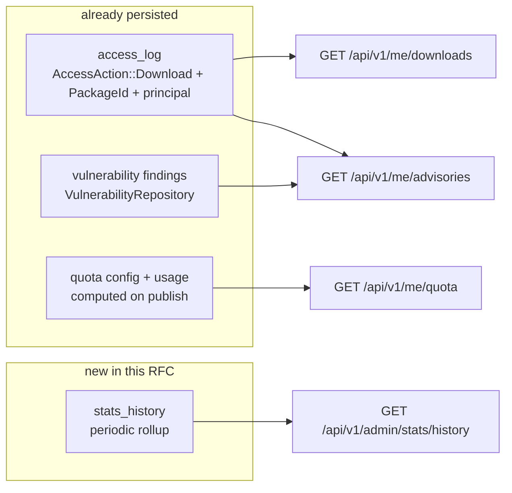

# RFC 0004 — Admin composition, and the API surface the console is missing

| Field       | Value                                                        |
| ----------- | ------------------------------------------------------------ |
| Status      | In review                                                     |
| Author      | Max Batleforc <maxleriche.60@gmail.com>                       |
| Co-author   | Claude Opus 5 (1M context) <noreply@anthropic.com>            |
| Created     | 2026-08-12                                                    |
| Supersedes  | —                                                             |
| Complements | RFC 0003 (web console redesign)                               |
| Touches     | `crates/core`, `crates/adapters`, `crates/web`, `server`, `ui`, docs |

---

## 1. Summary

RFC 0003 rebuilt the console and left four things behind, three of them because they are not
frontend problems at all. This RFC takes them together, because they are one problem seen from
different ends: **the console cannot show what the API does not describe or does not expose.**

1. **The admin pages are laid out, not composed.** Their grammar is now correct and measured at
   every commit — faces, both ramps, the palette, tracking, contrast, one Display-step title per
   view. What no gate can judge is whether a page is *well cut*, and three of the fifteen are over
   550 lines.
2. **73 % of the API's documented `200` responses declare no body.** 126 of them say only
   `description`; 47 declare a schema. The console pays for this directly: six of the twenty-one
   endpoints it calls are untyped, so `ui/src/lib/registry-types.ts` re-declares their DTOs by hand.
3. **`AdminDashboard` cannot answer its own question.** `StatsResponse` counters are named
   `since_startup` and reset with the process, so "is the cache saving me anything" has no answer
   spanning a restart, and "is it getting better or worse" has no answer at all.
4. **`/` has room for the two things a developer actually arrives with** — *am I near my quota* and
   *is anything I just pulled known-vulnerable* — and the data for both already exists server-side
   with no read path for the person it concerns.

### Before / after

```text
# today
/                     identity-aware, but static: counts, and a link
/admin/*              15 pages, 5 205 lines; grammar correct, composition inherited
GET /api/v1/admin/*   126 × "200, description"   ← the client types these `unknown`
                       47 × "200, description, body = T"
GET /api/v1/admin/quota/{registry}/{user_id}     ← admin-only: I cannot see my own
StatsResponse.since_startup                      ← resets on deploy

# with this RFC
/                     + quota meter (mine), + advisories on what I recently pulled
/admin/*              re-cut around the question each page answers
GET /api/v1/…         every 200 declares a body; a CI gate refuses new ones that do not
GET /api/v1/me/quota          my usage against my limits, per registry
GET /api/v1/me/downloads      what I pulled, most recent first
GET /api/v1/me/advisories     findings for the coordinates I pulled
GET /api/v1/admin/stats/history?window=30d       persisted, survives a restart
```

---

## 2. Motivation

### 2.1 Composition is the last thing RFC 0003 could not measure

RFC 0003 §13 closes with the honest limit: *"whether a page's layout is well cut is not something a
ramp check can answer, and no gate here claims to."* The measurements it does make are all green.
What is left is editorial, and it is visible in the line counts:

| Page | Lines |
| --- | --- |
| `AdminPackages.vue` | 716 |
| `AdminConfigReload.vue` | 632 |
| `AdminNotifications.vue` | 566 |
| …11 others | 91–405 |
| **Total** | **5 205** |

Phase 6 of RFC 0003 split `AdminConfigReload`'s read-only path into its own screen and replaced
`AdminPackages`'s three `window.confirm()` calls — both real improvements, both *surgical*. Neither
page was re-cut around the question it answers, and `AdminNotifications` was never touched: it
carries channels, subscriptions and inbound events on one page with a hand-rolled tab strip.

### 2.2 The API describes 27 % of what it returns

Counted over `crates/web/src/handlers/`:

```
126  (status = 200, description = "…")                 ← no schema
 47  (status = 200, description = "…", body = T)
```

This is not a missing-annotation problem — the handlers *are* annotated with `utoipa::path`, and the
DTOs already derive `ToSchema`. `BlockedIpDto` is the worked example: it derives `ToSchema`, the
handler returns `Vec<BlockedIpDto>`, and the response declares `(status = 200, description = "List
of blocked IPs")` with no `body`. The fix per endpoint is one clause.

The cost is concrete and already being paid:

- `ui/openapi.json` documents no body, so `@hey-api/openapi-ts` emits `unknown`.
- `ui/src/lib/registry-types.ts` re-declares four of those DTOs by hand, each carrying the comment
  *"SDK response is untyped"*. A hand-written mirror of a contract is a contract that can drift
  silently, and nothing checks it against the server.
- RFC 0003's `fixtures.test.ts` pins the count at six *of the twenty-one endpoints the console
  calls*. The console is a small consumer; the docs site's API reference is generated from the same
  spec and is equally blank.

### 2.3 The dashboard's numbers cannot outlive a deploy

`StatsResponse` is:

```rust
pub struct StatsResponse {
    /// When this process started (counters reset on restart).
    pub since_startup: DateTime<Utc>,
    pub aggregate: AggregateStats,
    pub per_registry: Vec<RegistryStatsDto>,
}
```

The doc comment states the defect plainly. RFC 0003 §6.4 rebuilt this page around the operator's two
real questions — *is it healthy*, *is it saving me anything* — and the second is answered with a
number that a restart sets to zero. "Is the hit rate improving since we added the warming job" is
not answerable at all. RFC 0003 listed this as open question 2 and deferred it here on purpose:
it is an API change, not a layout change.

### 2.4 The two things a developer wants on `/` are the two the API hides from them

- **Quota.** `QuotaConfig` carries `max_storage_bytes_per_user`, `max_packages_per_user` and
  `warn_threshold_pct` (default 80). The server computes usage and can already emit a warning
  *header*. But the only read paths are `/api/v1/admin/quota`, `/api/v1/admin/quota/{registry}` and
  `/api/v1/admin/quota/{registry}/{user_id}` — **all admin-only**. A developer cannot see their own
  usage until a publish fails with 429.
- **Advisories.** `VulnerabilityRepository::list_for_coordinate(registry, name, version)` exists and
  is persisted (`crates/adapters/src/db/vulnerability.rs`). The only HTTP surfaces over
  vulnerabilities are *proxy passthroughs* — the NuGet vulnerability index and the security-advisories
  route — which serve upstream data to package managers, not this instance's findings to a person.
- **What was pulled.** `AccessAction::Download` is recorded per request with a `PackageId` and a
  principal. The only reader is `/api/v1/admin/audit-log`, admin-only.

All three widgets are therefore **read-path** work, not storage work. The one exception is §2.3,
which needs persistence that does not exist.

---

## 3. Goals / non-goals

**Goals**

- Every `200` in the OpenAPI document declares a body, and a CI gate refuses new ones that do not.
- Make the generated client sufficient, so no response DTO is re-declared by hand in `ui/`.
- Cache statistics that survive a restart, with enough history to answer "better or worse".
- A user can see their own quota and their own recent pulls, and be told when one of those pulls has
  a known advisory — without an admin.
- Each admin page is re-cut around one question, with the pages over 550 lines split along the seams
  that already exist in them.

**Non-goals**

- **A new scanner, or new vulnerability data.** This exposes findings the SBOM re-scan already
  produces (`docs/security-scanning.md`). If the data is thin, that is a scanning problem.
- **A metrics/observability replacement.** `/metrics` and the Prometheus stack stay the operator's
  time series, and this RFC neither reshapes what they emit nor moves the console onto them. §2.3
  adds the small persisted rollup the *console* needs, not a TSDB. Adding an on/off switch for the
  exporter (§6.4) is not a replacement — it is the control that was missing.
- **Changing the design system.** RFC 0003's DESIGN.md is the authority; this RFC composes within it
  and adds no colour, face or step.
- **Reworking the catalog or package pages.** They were re-cut in RFC 0003 Phase 5.
- **Per-user rate limiting or quota enforcement changes.** Enforcement is unchanged; only the read
  path is added.

---

## 4. User-facing design

### 4.1 The API contract

Every documented response declares its body. Mechanically:

```rust
// before
responses(
    (status = 200, description = "List of blocked IPs"),
    (status = 403, description = "Admin role required"),
),

// after
responses(
    (status = 200, description = "List of blocked IPs", body = Vec<BlockedIpDto>),
    (status = 403, description = "Admin role required"),
),
```

Two consequences the RFC treats as requirements rather than side effects:

- `ui/src/lib/registry-types.ts` loses its four hand-written DTOs to the generated ones. Its other
  two exports — the `Visibility` union and `VISIBILITY_OPTIONS`, which are UI configuration rather
  than a mirror of a response — move to `src/config/`, where that kind of data already lives. Any
  field the hand-written version has that the generated one does not is a finding about the server,
  recorded, not papered over.
- `fixtures.test.ts`'s undocumented count (RFC 0003 §13, pinned at 6) becomes `0` and the assertion
  flips from a ceiling to an equality.

### 4.2 What a developer sees on `/`

Two widgets, on the identity-aware home RFC 0003 §4.3 built. Both are absent for an anonymous
viewer, because both are about *you*.

| Widget | Shows | Empty state |
| --- | --- | --- |
| **Quota** | Per registry that has a quota: bytes used against the limit, versions used against the limit, and which threshold has been crossed. | Registries without a quota are not listed. If none has one, the widget does not render — an empty meter is worse than no meter. |
| **Advisories** | Findings on the **5 most recent coordinates you pulled in the last 7 days**, and on **every package you own**, with the highest severity per coordinate and a link to the package page. The two are labelled, because they are different relationships: one you are exposed to, the other you can fix. | "Nothing you pulled recently, and nothing you own, has a known advisory" — a real answer, not a blank. |

The quota widget is a **meter, not a number**: the useful fact is the distance to the limit, and
`warn_threshold_pct` already defines when that distance is worth colouring. The colour is
`--copper` — "waiting rather than refused" in DESIGN.md's One Synthetic Rule — and crimson only once
the limit is reached, because at that point a publish *is* refused.

### 4.3 What an operator sees on `AdminDashboard`

The verdict sentence RFC 0003 §6.4 introduced stays first. Below it, the hit rate gains a **trend**:
the same number over the retained window, and the delta against the previous window. The wording
follows the same rule as the verdict — a sentence a reader can act on, not a sparkline that only
says "something changed".

Restart no longer resets what is shown. `since_startup` remains in the payload, because "counters
since this process started" is still the honest label for the live counters; the history is a
separate, explicitly-dated series.

### 4.4 Admin composition

Each page answers one question and is cut to it. The three heaviest are split along seams that
already exist inside them:

| Page | Question | Cut |
| --- | --- | --- |
| `AdminPackages` (716) | "What is in this instance, and what should not be?" | The block/unblock form is a different job from the package list. The list keeps the page; blocking becomes a dialog opened from it, as `DestructiveConfirm` already is. |
| `AdminConfigReload` (632) | "What is about to change, and do I accept it?" | Editor, validation report, pending diff and change history are four screens sharing one scroll. The diff and the history are the operator's decision surface; the editor is a tool. |
| `AdminNotifications` (566) | "Where do events go, and what arrives?" | Three nouns behind a hand-rolled tab strip. Split by what actually depends on what (R8): **inbound events** becomes its own route, since it reads nothing the others produce; **channels and subscriptions stay one route**, because the subscription form's channel `datalist` is populated from the channel list. Routed either way, so both deep-link. |

The remaining twelve are reviewed against the same test — *what is the one question, and what on
this page does not serve it* — and re-cut only where the answer is clear. **No page is redesigned to
look different**; the grammar is already correct and gate-enforced.

---

## 5. Architecture

### 5.1 What exists, and what has to be built



Three of the four new endpoints are **read paths over data that is already there**. Only the stats
history adds storage, and it is the smallest thing that answers the question: a periodic rollup row
per registry, not per-request retention.

### 5.2 Why a rollup and not the access log

The access log already holds every download, so "hit rate over 30 days" could in principle be
derived from it. It should not be:

- The access log is an **audit** trail with its own retention and purge semantics
  (`AccessAction::AuditPurge`). Deriving operational charts from it couples two lifetimes that must
  stay separable — purging the audit trail would silently rewrite history on a dashboard.
- A hit/miss ratio is a counter question, and scanning an audit table per dashboard load is the kind
  of query that is fine at ten thousand rows and a problem at ten million.

A rollup writes one row per registry per interval, is cheap to read, and can be retained on its own
schedule.

### 5.3 Endpoint shape

All four are `GET`, all four are scoped by the caller's identity or by admin:

| Endpoint | Auth | Returns |
| --- | --- | --- |
| `/api/v1/me/quota` | any authenticated | per-registry usage vs limits, only for registries with a quota |
| `/api/v1/me/downloads?limit=` | any authenticated | recent `Download` entries for the caller |
| `/api/v1/me/advisories` | any authenticated | findings for the caller's 5 most recent pulls in 7 days, **and** for the packages they own, each side labelled |
| `/api/v1/admin/stats/history?window=` | admin | the rollup series |

`/api/v1/me/advisories` is a join the server performs, not the client: asking the browser to fetch
findings per coordinate would be N requests and would leak the list of coordinates into the network
log of a shared machine.

---

## 6. Detailed design

### 6.1 `crates/web` — the contract sweep

The 126 responses are fixed in one pass, per handler module. Where a response has no natural DTO
because the handler returns an ad-hoc `json!`, that is itself the finding: it gets a named DTO
deriving `ToSchema`, in the same module.

A gate makes the sweep stick — a test in `crates/web` that walks the generated `ApiDoc` and asserts
every `200` (and every `201`) has a schema. It fails on the *next* undocumented response rather than
on a lint of the source, so it cannot be satisfied by a comment.

### 6.2 `crates/core` — ports

- `AccessLogRepository` gains a caller-scoped read: recent entries for one principal, filtered to
  `AccessAction::Download`. Scoping happens in the port, not in the handler, so no future caller can
  forget the filter.
- `VulnerabilityRepository` gains `list_for_coordinates(&[PackageId])` — one query for the join in
  §5.3, rather than the existing single-coordinate call in a loop.
- `OwnershipStore` gains a **reverse lookup**: the packages a principal owns. Today it only answers
  the forward question (`list_owners` for one package), which is why R7 records ownership as the
  expensive half of that widget. The namespace half needs nothing new — the packages under a claimed
  prefix are already reachable per user.
- New `StatsHistoryRepository`: append a rollup row; read a window.

### 6.3 `crates/adapters` — storage

- One migration in `crates/adapters/migrations/`, added through the `mig!` macro
  (`crates/adapters/src/migrations.rs`), for the rollup table: registry, window start, hits, misses,
  cached bytes.
- An in-memory implementation alongside it, so `crates/web/tests/*` keep running without Postgres,
  as every other port does.

### 6.4 `server` — the rollup writer, and `[stats]`

A periodic task writes one row per registry per hour (R9). The new `[stats]` block is the only
configuration this RFC adds, and it governs **both** of the instance's statistical outputs, because
an operator deciding "do I want this instance keeping numbers" is asking one question, not two:

```toml
[stats]
# The rollup behind the dashboard's trend.
history_enabled = true      # default
history_retention_days = 30 # 0 disables retention pruning

# The Prometheus recorder and the /metrics endpoint.
metrics_enabled = true      # default: today's behaviour
```

The interval is fixed at one hour rather than configured (R9): it is the resolution the data is
*kept* at, and a deployment that wants daily figures aggregates on read. A configurable interval
would make two instances' histories incomparable for no gain.

`metrics_enabled` closes a real gap rather than adding a preference. Today `PrometheusBuilder`
is installed unconditionally in `server/src/main.rs` with no configuration consulted, and
`/metrics` is served unauthenticated — the handler's own doc comment says so. An operator who does
not run Prometheus has no way to stop publishing cache hit rates, per-registry pull volumes and
upstream latencies. Wiring the flag also makes the handler's existing `None` branch ("metrics not
configured") reachable in a real server for the first time; today it exists only for tests.

### 6.5 `ui`

- `src/lib/registry-types.ts`: the four DTOs give way to `@/client/types.gen`; `Visibility` and
  `VISIBILITY_OPTIONS` move to `src/config/`. The file itself disappears.
- Two new home widgets, built from the primitives RFC 0003 Phase 3 added — `EmptyState` for the
  "nothing to report" case, and the meter as a new `ui/` primitive with its own test, since a
  progress meter has an accessibility contract (`role="meter"`, an accessible name, and a text
  alternative — a bar alone is not a value).
- `AdminDashboard` gains the trend sentence.
- The three splits in §4.4, each landing with its existing tests moved rather than rewritten.

---

## 7. Security considerations

- **Three new endpoints return data about the caller, and must return *only* that.** The scoping is
  in the port (§6.2) rather than in the handler for exactly this reason: a handler-side filter is one
  forgotten `where` clause away from returning another user's download history. Each gets a test
  that asserts a second user's rows are absent, not merely that the caller's are present.
- **`/api/v1/me/advisories` tells you what is vulnerable in what you pulled.** That is the same
  information the SBOM endpoints already serve for a coordinate, scoped down to the caller — it adds
  no new disclosure about *packages*, but it does disclose *what this user pulled* to that user. It
  must not accept a `user_id` parameter; the identity is the token's, and nothing else.
- **The quota endpoint discloses limits.** Limits are configuration, not secrets, and the user is
  already told about them by a 429 and a warning header. It must not disclose *other* users' usage,
  which is why it reuses neither the admin handler nor its path.
- **The rollup table holds no principal and no coordinate** — registry, window, counters. It is
  operational data, and keeping it free of identity means its retention is not a privacy question.
- **`/metrics` is unauthenticated and, today, unconditional.** It exposes cache hit rates,
  per-registry pull volumes and upstream latencies to anyone who can reach the port. That is a
  defensible default for an instance behind an ingress that does not route it, and indefensible for
  the self-hoster RFC 0003 R3 names as a first-class audience, who currently cannot turn it off at
  all. `metrics_enabled` is therefore a security control, not a preference — it defaults to today's
  behaviour so no scrape breaks, but it can now be closed.
- **The rollup table holds no principal and no coordinate**, so `history_enabled` is an operational
  choice rather than a privacy one. The distinction matters: turning metrics off is about exposure,
  turning history off is about storage.
- **The contract sweep is not a security change**, but it removes a real hazard: a client that types
  a response `unknown` is a client whose validation is whatever the developer remembered. RFC 0003
  §13 already caught the console rendering a string as an array and dying.

---

## 8. Alternatives considered

| Alternative | Why rejected |
| --- | --- |
| Fix only the six undocumented endpoints the console calls | It leaves 120, and the docs site's API reference stays blank for them. The sweep is mechanical; the gate is what makes it durable, and a gate that exempts 120 endpoints is not a gate. |
| Derive the dashboard trend from the access log | §5.2: couples operational charts to audit retention, and a purge would silently rewrite the chart. |
| Scrape Prometheus from the server for the trend | Puts a second data path and a network dependency behind a page load, to answer a question a table answers. `/metrics` stays for operators who already run a TSDB. |
| Ship the quota widget by calling the admin endpoint | It is admin-only by design; widening it to self-service would mean one endpoint serving two authorisation rules, which is how the wrong row gets returned. |
| Let the browser join advisories per coordinate | N requests per page load, and it leaks the coordinate list into the network log of a shared machine (§5.3). |
| Redesign the admin pages visually as well | The grammar is correct and gate-enforced (RFC 0003 §13). Changing it here would put two variables in one change and make a regression unattributable. |

---

## 9. Rollout and compatibility

- **The contract sweep is additive to the document, invisible at runtime.** No response body changes;
  only its description does. `task dump-spec` + `task ui:generate` regenerate the client, and the
  existing spec-drift gate proves the two are in step.
- **Emptying `registry-types.ts` is the one breaking-ish change**, and only inside `ui/`: its DTOs
  become the generated ones and its two config exports move. Every call site is caught by `vue-tsc`,
  not at runtime.
- **The new endpoints are additive.** A console built before them degrades to not showing the
  widgets, because they are the only callers.
- **Both `[stats]` flags default to today's behaviour.** `metrics_enabled = true` keeps `/metrics`
  exactly as it is, so no existing scrape breaks on upgrade; `history_enabled = true` starts the
  rollup, and `history_retention_days = 0` turns pruning off rather than turning history off.
  Setting `history_enabled = false` restores today's dashboard, trend and all.
- **One migration**, forward-only, creating one table. Rollback drops it; nothing else references it.
- **`CURRENT_CONFIG_VERSION` moves** for the new `[stats]` block, per the repo's config-change rules.

---

## 10. Test plan

- **Contract gate** (`crates/web`): every `200`/`201` in the generated `ApiDoc` has a schema. This is
  the test that keeps §4.1 true; it must land *with* the sweep, not after it.
- **Scoping** (`crates/web/tests/`): for each of the three `me` endpoints, seed two users and assert
  the second user's rows are absent from the first user's response. Absence, not presence, is the
  assertion that matters.
- **Rollup** (`crates/adapters/tests/pg_*.rs` + in-memory): a window boundary writes exactly one row
  per registry; reading a window returns only rows inside it; retention deletes only rows outside it.
- **Quota edges**: usage at 0, just under `warn_threshold_pct`, just over, and at the limit — the
  four states the meter renders differently.
- **`ui`**: the meter primitive ships with its accessibility contract tested (name, value, text
  alternative). The two widgets get the four states of RFC 0003 §4.4. The three admin splits move
  their existing tests; a split that needs its tests rewritten has changed behaviour, which is a
  review signal.
- **The RFC 0003 gates stay green throughout** — detector at both viewports, axe over the
  unauthenticated routes, and the 23 authenticated route/role combinations. New widgets and split
  pages are new surface, so they extend the authenticated route list rather than bypassing it.
- **`fixtures.test.ts`** flips from "at most 6 undocumented" to "none", and the fixtures for the four
  new endpoints are captured the same way the first twenty-one were.

---

## 11. Decisions and open questions

### Resolved

| # | Question | Decision |
| --- | --- | --- |
| R1 | Fix the whole contract, or only what the console calls? | **The whole contract, with a gate.** 126 of 173 documented `200`s have no body; the console is one consumer among the docs site and every generated client. The per-endpoint fix is one clause and the DTOs already derive `ToSchema`. |
| R2 | Where does the dashboard trend come from? | **A new rollup table**, not the access log and not Prometheus (§5.2, §8). Audit retention and operational charts must not share a lifetime. |
| R3 | Do the `me` endpoints reuse the admin quota handler? | **No.** One endpoint serving two authorisation rules is how the wrong row gets returned. `/api/v1/me/quota` takes no `user_id`. |
| R4 | Are the admin pages redesigned as well as re-cut? | **Re-cut only.** The grammar is gate-enforced by RFC 0003; changing both at once makes a regression unattributable. |
| R5 | Does `registry-types.ts` survive? | **No, but it is not all SDK mirror.** Four of its six exports exist only because the SDK types those responses as `unknown`, and they go once the responses are documented — a hand-written mirror of a contract is the thing most likely to drift. The other two (`Visibility`, `VISIBILITY_OPTIONS`) are UI configuration and move to `src/config/` rather than being deleted. |
| R6 | What does "recently pulled" mean? | **The 5 most recent coordinates pulled in the last 7 days.** Bounded on both axes on purpose: a count alone degenerates the moment a CI job pulls twenty versions of one package, and a window alone is unbounded for a busy user. Distinct coordinates, so those twenty versions collapse to one row. |
| R7 | Does the widget cover packages the user *owns*, or only ones they pulled? | **Both, labelled separately** — they are different relationships: you are *exposed to* what you pulled, and you can *fix* what you own. Note the asymmetry in cost: "packages under a namespace my groups claim" is already answerable (`GET /api/v1/me/namespaces/{registry}/{prefix}/packages`), while **explicit per-package ownership has no reverse index** — `OwnershipStore::list_owners` answers "who owns this package", and nothing answers "what does this principal own". That reverse lookup is new work, called out in §6.2. |
| R8 | `AdminNotifications`: three routes, or one with tabs? | **Split where they do not need each other.** Measured rather than assumed: the subscription form's channel `datalist` is populated from the channel list, so channels and subscriptions share a route; inbound events read nothing the other two produce and gets its own. Two routes, not three. |
| R9 | Rollup interval, and where retention lives | **Hourly, and a `[stats]` block that governs both statistical outputs.** Hourly because it is the resolution the data is *kept* at — daily figures can always be aggregated on read, never recovered — and under 9 000 rows a year per registry is not a storage argument. The block carries `history_enabled` / `history_retention_days` *and* `metrics_enabled`, because "should this instance keep and publish numbers" is one operator question. Keeping it separate from the audit-log retention is what §5.2 argues for: purging the audit trail must not rewrite a dashboard. |

### Still open

None. Every question this RFC opened is answered above; what remains is implementation, and
anything discovered during it belongs in a new decision row rather than here.

---

## 12. Implementation phases

Each phase leaves the tree green: `cargo test --workspace`, `cargo clippy -- -D warnings`,
`vue-tsc`, `vitest`, `oxlint`, and every RFC 0003 design gate.

| Phase | Content | Useful on its own? |
| --- | --- | --- |
| 1 | **The contract sweep and its gate.** All 126 responses declare a body; the `ApiDoc` test lands with them; `task dump-spec` + `task ui:generate`; `registry-types.ts` emptied and removed; `fixtures.test.ts` flipped to zero. | Yes — it fixes the docs site's API reference and every generated client, independently of anything else here. |
| 2 | **The `me` read paths.** Port-level scoping, three endpoints, the absence-based scoping tests. No UI. | Yes — the CLI and any external client can use them immediately. |
| 3 | **Home widgets.** The meter primitive with its accessibility contract, the two widgets, their four states, and the authenticated gate extended to cover them. | Yes — the first user-visible result. |
| 4 | **Stats history and `[stats]`.** Migration, port, in-memory and Postgres adapters, the hourly rollup task, the `[stats]` block wiring **both** `history_*` and `metrics_enabled`, `CURRENT_CONFIG_VERSION` bump, and the trend sentence on `AdminDashboard`. Making `metrics_enabled` real means `main.rs` consults config before installing the recorder, which it does not today. | Yes — the metrics switch stands alone even if the trend slips. |
| 5 | **Admin composition.** The three splits in §4.4, then the twelve-page review, one page per commit so each is reviewable against its own question. | Yes — page by page. |

Phase 1 is deliberately first and deliberately alone: it is the only phase whose absence makes the
others harder, because every endpoint added afterwards would otherwise be added to a contract that
does not describe itself.
