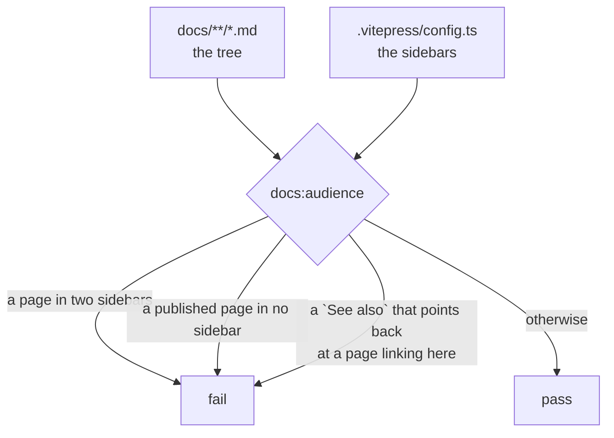

# RFC 0005-bis — Two readers, one home per instruction, and pages that end

| Field       | Value                                                                 |
| ----------- | --------------------------------------------------------------------- |
| Status      | **Implemented** — all ten phases landed; see the implementation notes in §13, including phase 7's snippet check, which lives in `ui/` rather than `docs/build/` for the reason recorded there |
| Short       | Two readers, one home each |
| Settles     | Splitting the guide by audience, giving every instruction one home, cutting each page down to one subject, and turning the showcase back into an introduction |
| Author      | Max Batleforc <maxleriche.60@gmail.com>                                |
| Co-author   | —                                                                      |
| Created     | 2026-08-14                                                             |
| Supersedes  | —                                                                      |
| Touches     | `docs/`, `.vitepress/config.ts`, `docs/build/`, `ui/src/config/registryTypes.ts` |

---

## 1. Summary

RFC 0005 gave the documentation one tree and put the design system on it. It
sorted documents by **who reads them** — and it did that at the top level only,
because re-authoring prose was an explicit non-goal (§3). So the sort stopped
where the tree stopped: `guide/` inherited both audiences at once and is now a
single sidebar of **25 links** in which "deploy this server behind Postgres" and
"point npm at it" sit in the same list.

This RFC finishes the sort, and does three things with it. It splits `guide/`
into the space for someone who **runs** BatleHub and a new `use/` for someone who
**consumes** it. It gives every instruction one home and makes the other places
link rather than restate. And it **cuts the pages down to one subject each** —
because the sort and the de-duplication both fail on a page that is four
documents in one file, and the documentation has one of those: `guide/configuration.md`
is 15 716 words, a quarter of everything published, with 237 headings to depth 5
and a section numbered 6.16 sitting inside section 11.

The home page gets the same treatment from the other end: thirteen equal-weight
feature cards is a specification, and a visitor deciding whether to install
needs an introduction.

The duplication worth naming is not textual. Exactly **19 code blocks out of
558** appear on more than one published page, and 14 of those are the
configuration reference quoting something it is the reference for — that is a
reference doing its job. What is actually duplicated is *restatement*: the same
instruction, written twice, in different words, sliced two different ways, with
neither copy marked as the one to trust. No hash finds that, which is why the
fix here is a rule about where a thing lives rather than a de-duplication pass.

### Before / after

```text
# today
docs/
  guide/          22 pages, 25 sidebar links, 5 groups, two audiences
                  ├─ installation · configuration · access-control · caching
                  │  host-routing · high-availability · admin-* (×5)   ← operator
                  ├─ user · publishing · package-explorer (×4) · troubleshooting ← developer
                  └─ security-scanning · check-registries               ← neither
  registries/     21 pages, each with `## Proxy setup` and
                  `## Publishing (local / hybrid)`
  index.md        13 feature cards + a registry list the reference already holds

  publishing instructions exist in three places, sliced three ways:
    guide/publishing.md            1 118 lines, 11 numbered per-registry sections
    registries/<name>.md           21 pages × `## Publishing (local / hybrid)`
    ui/src/config/registryTypes.ts 1 749 lines of SnippetDef, rendered at /setup

  one page is a quarter of the corpus:
    guide/configuration.md         15 716 words of 61 984 · 237 headings · depth 5
                                   151 code blocks · 469 table rows · 87 minutes
                                   12 numbered sections + an appendix, of which
                                   §7 and §11 are other pages written again

# with this RFC
docs/
  use/            the developer: I have a package manager and a token
  guide/          the operator: I run this server
  registries/     unchanged — already one page per reader question
  index.md        3 cards; the feature list keeps existing, one click away

  one home per instruction, and the others link to it
  one subject per page — configuration.md keeps the reference and gives up the
  six topics it had swallowed, each of which becomes reachable by name
```

The published URLs of the operator's pages do not change: `guide/` keeps the 17
pages that were already its own, and the five that move leave a stub behind
(§6.5), because this site is served by `git-pages` and nothing here has ever
proven it can issue a redirect.

---

## 2. Motivation

1. **One sidebar, two readers, 25 links.** `guide/` is five groups deep and its
   membership is decided by history rather than by audience:

   | Group | Pages | Reader |
   | --- | --- | --- |
   | Getting started | installation · configuration · user · config-generator | 3 operator, 1 developer |
   | Publishing & clients | publishing · cli · check-registries | 2 developer, 1 operator |
   | Administration | administration · admin-config · admin-storage-health · admin-policies · admin-access | operator |
   | Reference | caching · access-control · host-routing · package-explorer (+3) · sbom · high-availability · vulnerability-proxy · security-scanning · troubleshooting | mixed |
   | Project | roadmap | neither |

   A developer who wants to publish a crate scrolls past Postgres tuning,
   storage backends and the SOC 2-adjacent RBAC model to reach it. An operator
   looking up a config key scrolls past `npm audit`. RFC 0005 established that a
   document's home is chosen by who reads it; that rule stops at the directory
   boundary and nothing enforces it below.

2. **Publishing is written twice, sliced two different ways, and neither copy is
   marked as the authority.** `guide/publishing.md` is 1 118 lines in eleven
   numbered per-registry sections (npm, Cargo, VS Code, Go, RubyGems, Maven,
   Terraform, Composer, NuGet, JetBrains). `registries/*.md` is 21 pages each
   carrying `## Publishing (local / hybrid)`. Both are correct today; nothing
   makes them stay that way, and a reader who finds one has no way to know the
   other exists.

3. **The tree already contains the answer, and publishing did not adopt it.**
   *Proxy* setup had the same problem and it was solved: `guide/user.md`
   §"Per-registry setup" is now a 21-row table that points at
   `/registries/<name>` and says nothing itself. That is the shape. It was
   applied to setup and not to publishing, which is the whole difference between
   a convention and a rule.

4. **A third copy lives in TypeScript.** `ui/src/config/registryTypes.ts` is
   1 749 lines of `SnippetDef`, and its labels are the documentation's headings
   — `npm / npm workspaces`, `Yarn Berry (.yarnrc.yml)`, `pnpm (.npmrc)`,
   `npm audit`. It renders the Setup Guide at `/setup`, and `guide/user.md`
   sends readers there *before* the manual steps. So the same snippet is
   maintained in a Vue app and in a markdown page, in two languages, with no
   check that they agree — the same class of defect as the token copy RFC 0005
   found, one layer up.

5. **Sixteen pages carry a table of contents that the theme already draws.**
   Nine hand-maintain a `## Table of Contents` list of anchors — one of them
   spelled `## Table of contents`, which is how the count was fifteen until a
   case-sensitive grep was replaced by a case-insensitive one; seven use
   `[[toc]]`. VitePress renders the outline in the right rail on every page, and
   `custom.css` hides the inline one above 960px *because* it is a duplicate. So
   on a desktop the hand-written list is invisible, and on a phone the reader
   gets two. Eight of them are hand-maintained anchors, which is a second thing
   that silently rots when a heading is renamed.

6. **Two pages are in a space for an audience they are not written for.**
   `guide/security-scanning.md` opens *"batlehub is scanned for CVEs
   continuously, across every layer it ships. This page describes the layers, how
   to reproduce them locally"* — that is the project's own CI pipeline, which is
   contributor material. `guide/check-registries.md` documents
   `scripts/check-registries.sh`, a script in the repository that an operator
   runs against a running instance. Neither is a user guide, and both are in the
   guide.

7. **The showcase introduces the product with thirteen feature cards.** Artifact
   Caching, Private Registries, Role-Based Access Control, Actions OIDC Auth,
   Release Age Gate, Multi-Upstream Fanout, Distributed Rate Limiting,
   OpenTelemetry, Cache Warming & Eviction, Beta/Pre-Release Channel, IP-Based
   Blocking, Storage Deduplication, Hashed Static Tokens — every one at the same
   weight, which is a specification rather than an introduction and makes each
   of them equally unimportant. Below them, a "Supported registries" section
   restates the list the Registries reference exists to hold. PRODUCT.md names
   an audience deciding whether to install at all; thirteen cards is what you
   show someone who already did.

8. **The cross-references circle.** `registries/npm.md` ends "See also → User
   Guide → npm" pointing at `/guide/user#registries`, which is the table that
   points back at `/registries/npm`. Twenty-one pages do this. A "see also" that
   returns you to where you started is not a link, it is a loop.

9. **One page is a quarter of the documentation.** The 59 published pages hold
   61 984 words. `guide/configuration.md` holds **15 716 of them — 25.4%** — with
   237 headings nested to depth 5, 151 code blocks and 469 table rows. At the
   Reading role DESIGN.md authored for this site, that is an **87-minute page**.
   It is also the most cross-referenced document in the project. Length is not a
   defect in a reference; being simultaneously the reference and the only place
   six other topics are documented is.

   | Page | Words | Minutes | Headings | Depth |
   | --- | ---: | ---: | ---: | ---: |
   | `guide/configuration.md` | 15 716 | 87 | 237 | 5 |
   | `guide/roadmap.md` (generated) | 4 826 | 26 | 18 | 3 |
   | `contributing/contributing.md` | 3 596 | 19 | 44 | 4 |
   | `guide/publishing.md` | 2 296 | 12 | 126 | 3 |
   | *nine pages over 1 500 words* | | | | |

10. **It is at least four documents.** Twelve numbered sections and an appendix:
    a quick start (§1), how configuration resolves (§2), the TOML reference
    (§§3–5), worked examples (§6), a CLI reference (§7), then tokens, hot
    reload, self-hosted registries and SBOM (§§8–11), then capacity planning.
    Two of those are pages that already exist:

    - **§7 "CLI Reference" documents a different CLI than the page called
      "Command-line client".** It covers `dump-spec` and `hash-token` — two
      *server binary* subcommands — while `guide/cli.md` is twelve sections
      about `batlehub-cli`. The same title, on two pages, naming two different
      programs. A reader who searches "CLI" gets both and cannot tell.
    - **§11 "SBOM Generation" restates `guide/sbom.md` heading for heading.**
      Configuration, API endpoints, PURL mapping and worked examples appear on
      both, written twice.

11. **The biggest page has drifted inside itself, and nothing could see it.** A
    subsection titled `### 6.16 Corporate HTTP Proxy (air-gapped environments)`
    sits between `## 11. SBOM Generation` and the appendix. Either the number is
    wrong or the placement is. It has been that way through every green build,
    because every gate this project owns reads *rendering* and none reads
    *structure* — the same shape as RFC 0005's dead token copy, one layer up.

12. **The reader has to choose before they know how to choose.**
    `guide/installation.md` presents Prerequisites, Pre-built releases, Docker
    Compose, Binary from source, Helm chart and First-time setup, in that order.
    The recommendation is a parenthesis inside the third heading — "*(quickest
    path)*" — so a visitor deciding whether to install at all reads two
    alternatives before reaching the one meant for them. PRODUCT.md names that
    visitor as the audience.

13. **Anchors are not checked, and two are already dead.** RFC 0005 phase 8
    established that every cross-reference resolves — to a *file*. Nothing reads
    the fragment. `README.md` links twice to
    `docs/guide/configuration.md#9-self-hosted--private-registries`; that
    section was renumbered and its heading is now `## 10. Self-Hosted / Private
    Registries`, which the page's own table of contents links to correctly on
    line 53. So the repository's front page has two references that land at the
    top of an 87-minute page and leave the reader to find the section
    themselves. Eight anchor links point into that page in total; a quarter of
    them are wrong, and §6.8 is about to move six sections.

---

## 3. Goals / non-goals

**Goals**

- **One space, one reader.** A sidebar is one person's list. A page two people
  need lives in one space and is linked from the other.
- **One home per instruction.** Where an instruction exists twice, one copy is
  the home and the rest become links. Where it exists in code *and* in prose,
  one of them generates the other or a gate compares them.
- **One subject per page, and the page ends.** A reference is allowed to be
  long; four documents in one file are not. Where a section of a page could be
  linked from elsewhere and read on its own, it is a page.
- **A showcase that introduces rather than enumerates.** Nothing is deleted; the
  feature list stops being the first thing a visitor reads.
- **Structure is measured, not felt.** Depth, numbering and length are read by a
  check, because the 6.16-inside-11 defect survived every gate this project owns
  and would survive an opinion too.
- **The rule extends below the top level**, and something checks it — RFC 0005's
  own finding was that a rule with no call site was never adopted.

**Non-goals**

- **Re-authoring prose.** Again. This RFC moves, merges, splits and links; where
  two copies disagree on fact, that is flagged for the author, not guessed.
  "Simplify" here means *fewer subjects per page and a named default*, not
  shorter sentences — rewriting 62 000 words for tone is a different project and
  a worse use of the same effort.
- **Shortening the reference.** `guide/configuration.md` stays long after §6.8
  takes six topics out of it, because the TOML surface it documents is large.
  The goal is that it is *only* the reference, not that it is small.
- **Changing the published URLs of pages that keep their audience.** The
  operator's 17 pages stay where they are; the five that move leave a stub
  (§6.5).
- **Touching the design system.** RFC 0005 settled it and its gates hold; every
  page this RFC adds or moves is measured by the same `docs:design:rendered`.
- **Restructuring `registries/`.** It is already one page per reader question,
  with a consistent template across all 21. It is the model, not the problem.
- **Removing the Setup Guide UI.** `/setup` is a good surface. §6.4 is about
  where its snippets come from, not about whether it exists.
- **Deleting anything.** Every fact on the site today is still on the site
  afterwards; some of it is one click further from the front door.

---

## 4. User-facing design

### 4.1 Two spaces, and the question each answers

| Space | "I am here because…" | Reader |
| --- | --- | --- |
| `use/` | I have a package manager and a token, and I need this to work | developer |
| `guide/` | I run this server | operator |
| `registries/` | I need the page for *my* ecosystem | either |
| `operations/` | something is broken, or an auditor is asking | on-call |
| `contributing/` | I am changing the code | contributor |
| `rfc/` | I want to know why it is like this | anyone |

`registries/` sits deliberately outside the split. It is the one space both
readers enter from opposite directions — a developer arrives from `use/` wanting
a snippet, an operator arrives from `guide/` wanting to know what a registry type
supports — and its per-page template already serves both, which is why it is the
model this RFC copies rather than a space it changes.

### 4.2 Why `guide/` keeps its name and `use/` is the new one

Seventeen of `guide/`'s twenty-two pages are already the operator's, and five are
the developer's. Splitting the smaller half out moves five URLs instead of
seventeen.

That is not the only argument, but it is the decisive one here, because **this
site has never demonstrated that it can redirect.** `docs/public/_redirects.off`
is a disabled SPA-fallback rule, not a redirect map, and `git-pages` publishes
static files. Every moved URL is therefore a stub page this repository has to
carry, and seventeen stubs is a maintenance surface; five is a footnote.

The cost is that `guide/` is a weaker name than `admin/` would be. It is paid in
the nav, where the entry is labelled for what it is, and in the space's own index
page, which says who it is for in its first line. §8 records the alternative and
its price.

### 4.3 The showcase

The hero copy is factual and stays. Below it, three cards instead of thirteen —
not three *features*, but the three things a visitor is deciding between:

| Card | Says |
| --- | --- |
| **Cache what you already pull** | Every artifact fetched once and served from disk or S3 after. The reason most people install it. |
| **Publish what is yours** | Private npm, Cargo, Maven, NuGet and more, on the same server, in the same URL space. |
| **Decide who gets what** | RBAC, OIDC and CI tokens, release-age gating, per-registry policy. |

Each links into `use/` or `guide/` rather than expanding in place. The thirteen
features are not deleted: they move to a single **Features** page, linked once
from the home page and once from the guide's index, where the reader who wants
the specification can read the specification.

The "Supported registries" section on the home page becomes one line and a link,
because the Registries reference is the thing it was summarising.

### 4.4 Behaviour rules

- **The One Audience Per Space Rule.** A page appears in exactly one sidebar. A
  page two readers need is linked from the other space, never listed in both —
  a page in two sidebars is a page that will be edited for one reader and read
  by the other.
- **The One Home Rule.** An instruction has one home. A second place that needs
  it links to it and states, in one line, what it would have said. "See also"
  points *outward*: a link back to the page that linked here is a loop and is
  removed.
- **The table of contents is the theme's.** No page hand-maintains a list of its
  own anchors, and no page carries `[[toc]]`. The right rail already draws it,
  from the headings, correctly, on every page.

### 4.5 Three rules for size

The split and the de-duplication both stop at the file boundary, and a file that
is four documents defeats them from inside: you cannot put a page in one
audience's space when a sixth of it is written for the other, and you cannot
give an instruction one home when its home is a section of something else. These
are the rules that make the other two applicable.

- **The One Subject Rule.** A page answers one question. A section that could be
  linked from somewhere else and read on its own **is** a page, and stays inside
  only when the surrounding page is its sole entry point. `guide/configuration.md`
  §11 fails this twice over: it can be read on its own, and it is *also* a page
  already.

- **The Named Default Rule.** Where a page offers a choice, the first sentence
  names the option most readers should take, and the alternatives follow it. Not
  a parenthesis in the third heading. The reader who knows enough to want the
  other three is the reader who will keep reading; the one deciding whether to
  install is not.

- **The Structure Is Checked Rule.** Heading depth, section numbering and page
  length are read by a gate, not judged by a reviewer. A page over 4 000 words
  is not forbidden — a reference is long because its subject is — but it
  **declares itself** with `reference: true` in frontmatter. An exception you
  have to write down is an exception someone can argue with; a silent one is how
  a 15 716-word page arrives without anyone deciding.

  **The rule does not apply to `rfc/`.** This document is 6 873 words and would
  trip its own threshold, which is the right moment to say why rather than to
  quietly raise the number. These rules are about pages a reader *uses* — a
  reference is consulted, a guide is followed, and both are worse when they
  carry a second subject. An RFC is a record of an argument, read once, in
  order, by someone who came for the argument. `docs:links` already carves out
  `rfc/` for exactly this distinction (RFC 0005 phase 8); `docs:structure` uses
  the same carve-out and the same reason. Depth and numbering still apply
  everywhere: a record with a section filed under the wrong number is a record
  that misleads.

---

## 5. Architecture

### 5.1 Where the audience is declared

Nothing today records which reader a page is for, which is exactly why the
mixture accumulated without anyone deciding to create it. The space *is* the
declaration — that is the point of sorting by reader — so the check is not a new
frontmatter field but a comparison between two things that already exist:



The orphan half of this already exists — `docs:links` shipped it in RFC 0005
phase 8. This adds its mirror image: a page listed *twice* is as much a defect as
a page listed never, and both are computable from the same two inputs.

### 5.2 Where the registry snippets come from

Three copies, and the honest options are two: generate one from another, or
compare them. Generation is the stronger guarantee and the larger change —
`registryTypes.ts` carries fields (`label`, ordering, per-tool grouping) that the
markdown pages do not, and the markdown carries prose the console does not want.

This RFC proposes **comparison first**: a check that every fenced snippet in
`registries/<name>.md` appears, normalised, in that registry's `SnippetDef` list
and vice versa, failing on either side. It is a smaller change, it is the thing
that catches the drift, and it makes the generation direction obvious once the
first mismatch shows which side is richer. Generating is left as the follow-on
the check will justify (§11 O2).

---

## 6. Detailed design

### 6.1 What moves into `use/`

| From | To | Why |
| --- | --- | --- |
| `guide/user.md` | `use/index.md` | it is the space's entry point already |
| `guide/publishing.md` | `use/publishing.md` | see §6.2 — it also loses most of its length |
| `guide/package-explorer.md` + `-search` + `-access` + `-cache` | `use/package-explorer*.md` | a developer's surface; the `-access` page describes what a developer sees, not what an operator sets |
| `guide/troubleshooting.md` | `use/troubleshooting.md` | its content is client-side symptoms |
| `guide/cli.md` | **split** — `use/cli.md` and `guide/cli-admin.md` | 547 lines covering both `batlehub publish` and `batlehub hash-token`; the split follows the command, and each half links to the other |

### 6.2 Publishing gets one home

`registries/<name>.md` §"Publishing (local / hybrid)" becomes the home for
per-registry publishing instructions — it is already the page a reader lands on
from `use/`, from `/setup`, and from the home page's registry line.

`use/publishing.md` keeps only what is not per-registry, which is what its own
section numbering already isolates: prerequisites (§1), getting an API token
(§2), and troubleshooting (§13). In place of §§3–12 it carries the same 21-row
table `guide/user.md` already uses for setup. Expected outcome: a page
substantially shorter than 1 118 lines, containing no per-registry instruction.

**Where the two copies disagree on fact, the diff goes to the author** — the same
rule RFC 0005 §6.6 used for its four duplicates, for the same reason.

### 6.3 The two mis-homed pages

- `guide/security-scanning.md` → `contributing/security-scanning.md`. It is the
  project's CI matrix and how to reproduce it locally. Its one operator-facing
  half — matching a future-disclosed CVE against a build already deployed — is
  linked from `operations/index.md`, which is where the person who needs it is.
- `guide/check-registries.md` → `operations/check-registries.md`. It documents a
  repository script an operator runs against a running instance.

Both leave a stub (§6.5).

### 6.4 The snippet check

`docs/build/check-snippets.mjs`: for each registry type, normalise the fenced
blocks in `registries/<name>.md` and the `SnippetDef.code` values in
`ui/src/config/registryTypes.ts`, and fail on a block present in one and absent
from the other. Runs in `docs:design`, next to the token and roadmap drift
checks it is the third instance of.

Its first run is expected to fail, and the finding is the point: the two have
never been compared.

### 6.5 Stubs, because this host cannot redirect

Each of the seven moved pages leaves a file at its old path containing frontmatter
only:

```yaml
---
title: Moved
head:
  - - meta
    - http-equiv: refresh
      content: 0; url=/use/publishing
---
```

A `<meta refresh>` works on any static host, is indexed as a redirect by every
major crawler, and needs nothing from `git-pages`. The stub also renders a
visible line for a reader whose browser refuses the refresh, and
`docs:links` treats a stub as reachable so the orphan check stays honest.

Stubs are dated in a comment and are not permanent furniture: §9 sets their
removal at the release after next.

### 6.6 The tables of contents

Delete the eight hand-maintained `## Table of Contents` sections and the seven
`[[toc]]` directives. Delete the `@media (min-width: 960px) { nav.table-of-contents { display: none } }`
rule from `custom.css`, which exists only to hide them.

This is the one place in this RFC where prose is removed rather than moved, and
it is removal of navigation rather than of content: every anchor in those lists
is a heading the right rail already renders.

### 6.7 The home page

`index.md`: thirteen `features:` entries become three (§4.3). The removed twelve
move verbatim into `guide/features.md` — verbatim, because they are accurate and
this RFC does not re-author prose. The "Supported registries" section becomes one
sentence and a link.

**Deliberately untouched:** the hero name, text and tagline. They are factual,
they are Read mode rather than Persuade, and RFC 0005 already settled that.

### 6.8 `guide/configuration.md` gives up what it is not

It keeps being the TOML reference — that is its job and it is good at it. It
stops being the only place six other subjects are documented:

| Section | Words it is roughly worth | Becomes |
| --- | --- | --- |
| §1 Quick Start · §2 How Configuration Works | — | **stay.** The first screen of a reference is what makes it usable. |
| §3 Full Reference · §4 Permissions · §5 Environment overrides | — | **stay.** This *is* the reference. |
| §6 Worked Examples | | `guide/configuration-examples.md` — an example is a page you send someone to, not a section you scroll to. |
| §7 CLI Reference | | folded into the operator half of the CLI split (§6.1) and **retitled to name its binary**, which is the actual defect. |
| §8 User-Generated API Tokens | | one home, chosen per O5 — the operator's `access-control` or the developer's `use/index`, linked from the other. |
| §9 Hot Reload & Dynamic Config | | `guide/hot-reload.md`. It is a behaviour of the running server, not a field table. |
| §10 Self-Hosted / Private Registries | | folded into `registries/index.md`, which is the page that already answers "what can this registry type do". |
| §11 SBOM Generation | | folded into `guide/sbom.md`. The two overlap heading for heading; **where they disagree, the diff goes to the author** (§6.2's rule). |
| Appendix — Capacity Planning | | `guide/capacity-planning.md`. An operator sizes an instance once, from a page they can find by name. |
| stray `### 6.16 Corporate HTTP Proxy` | | **resolved by the author**: either its number is wrong or it is in the wrong section. This RFC will not guess which, because guessing is how it got there. |

Expected outcome: a page that is long because TOML is large, and long for no
other reason. Every heading it gives up becomes findable by name in search and
in a sidebar, which is the part a 237-heading page cannot offer however good its
outline is.

**Deliberately not done:** shortening §§3–5. A field table is as long as the
fields.

### 6.9 `guide/installation.md` leads with the answer

The six sections stay; the order changes and one sentence is added. The page
opens by naming the path most readers should take and why, then Prerequisites,
then that path, then the alternatives, then First-time setup. Docker Compose is
already flagged as the quickest — this puts the flag where the decision is made
rather than two sections after it.

This is the only page §6 touches for the Named Default Rule. The rule applies to
every page that offers a choice; the others are handled as they are edited, not
in a sweep, because a sweep of prose is the non-goal this RFC keeps naming.

---

## 7. Security considerations

- **Splitting the operator's documentation out of the developer's is not
  hiding it.** Every page stays published at a stable URL, and `operations/`
  keeps the compliance material where an auditor looks. Documentation that is
  hard to find is not a control, and treating it as one is how a checklist ends
  up describing a system nobody can operate.
- **The snippet check narrows a real gap.** A setup snippet that drifts between
  the console and the docs is a reader configuring authentication from a stale
  example — `_authToken`, `npmAuthToken` and the token exchange in
  `use/index.md` are all credentials-handling instructions.
- **A security-relevant section is currently unfindable.** `### 6.16 Corporate
  HTTP Proxy (air-gapped environments)` is filed under §11 SBOM Generation with
  a §6 number (motivation 11). Air-gapped egress control is the configuration an
  operator in a restricted network needs most, and it is in the one place a
  reader of that page would not look. Structure is not decoration when the
  document is a security reference.
- **No new surface.** The site is static and unauthenticated before and after.

---

## 8. Alternatives considered

| Alternative | Why rejected |
| --- | --- |
| Rename `guide/` → `admin/` and keep the user pages in `guide/` | The clearer pair of names, and it moves 17 URLs instead of 5 on a host with no redirect (§4.2). Reconsider the day the site gains real redirects — the split itself is what matters, and the rename is then a cheap follow-on. |
| Leave `guide/` alone; just re-group its sidebar | Free, and it lasts until the next page. Grouping is a convention; a directory that a check can read is a rule. The mixture arrived by grouping. |
| Delete `guide/publishing.md` outright | It carries the cross-cutting half — prerequisites, token exchange, troubleshooting — that no per-registry page should each restate. Deleting it would move that restatement into 21 pages. |
| Generate `registries/*.md` from `registryTypes.ts` now | The right end state and the wrong first step: the two carry different fields, and picking a direction before a single mismatch is visible is guessing. §6.4's check makes the direction obvious and is a tenth of the work. |
| Keep 13 cards, reorder them by importance | Ordering is not weight when every card is the same size in the same grid. The overload is the count. |
| Keep the hand-written tables of contents for offline readers | They are anchors into a rendered page; read as raw markdown they are as broken as the right rail is absent. |
| Leave `guide/configuration.md` whole — it is a reference, references are long | Length is not the finding. Two of its sections are pages that already exist under other names, one of its headings is numbered for a section it is not in, and a reader searching "CLI" gets two pages about two different binaries. A reference that is also five other documents is not long, it is four documents. |
| Split `configuration.md` by generating it from the config schema instead | The right answer for §§3–5 and a much larger change — `crates/config` would have to carry the prose, and most of the value here is in §§6–11, which no schema can generate. Worth its own RFC once the field table is the only thing left. |
| Cap page length outright | A cap forces a reference to lie about its subject, and the first exception makes the cap advisory. Declaring `reference: true` costs one line and leaves the number visible (§4.5). |

---

## 9. Rollout and compatibility

- **Default behaviour.** No config, no flags. The product is untouched; this is
  documentation and one Vue config file.
- **URL compatibility.** Seven pages move and each leaves a stub (§6.5). No page
  loses its address in this release. **Stub removal is scheduled for the release
  after next**, and a stub older than that is a finding, not furniture.
- **Anchor compatibility.** §6.8 moves six sections out of the most-linked page
  in the project, so `#7-cli-reference`, `#11-sbom-generation` and their
  neighbours stop resolving. Every *known* inbound anchor is updated in the same
  phase — there are eight, and the anchor check added in phase 2 is what makes
  that number trustworthy rather than a grep's opinion. External links into a
  section anchor cannot be preserved and are not: a fragment that no longer
  names anything lands the reader at the top of the page, which is what the two
  dead README anchors have been doing already.
- **Contributor prerequisites.** After phase 2 there is a rule to follow when
  adding a page: it goes in the space of its reader, and it appears in exactly
  one sidebar. `docs:audience` tells you when you got it wrong.
- **Rollback.** Every phase is file moves and config; nothing is generated at
  runtime and nothing is persisted. Phase 4's snippet check is the only piece
  that can fail for a reason outside this RFC, and it fails loudly.
- **Sequencing.** Phases 1, 2, 3 and 8 are independently shippable and change no
  page's address: the showcase, the two gates, and the tables of contents. The
  gates come before the moves, which is §12's one deliberate departure from how
  RFC 0005 sequenced itself.

---

## 10. Test plan

- **`docs:audience`** (new) — no page in two sidebars, no published page in
  none, no `See also` that points back at a page which links to it. Its first
  run must find the 21 circular references in motivation 8.
- **`docs:snippets`** (new, §6.4) — every registry snippet agrees between
  `registries/<name>.md` and `registryTypes.ts`. Expected to fail on its first
  run; that is the finding.
- **`docs:links`** — extended in two ways it should have been from the start.
  **Anchors**: a `#fragment` must match a heading on the target page, generated
  by VitePress's own slug rules or declared with `{#explicit}`. Its first run
  must find the two dead README anchors in motivation 13, and it is the gate
  that makes §6.8 safe to perform at all — six sections are about to move out of
  the most-linked page in the project. **Stubs**: every stub's target resolves,
  because a stub pointing at a page that moved again is worse than no stub.
- **`docs:design:rendered`** — unchanged and must stay clean over the new page
  count. `use/`, the three cards and `guide/features.md` are pages like any
  other: axe at WCAG 2.2 AA, both ramps, both renditions, 1440 and 390.
- **The build** — `pnpm run docs:build` still fails on a server-render error
  (RFC 0005 §13), which is what catches a moved page whose markdown carried a
  <code v-pre>{{ … }}</code>.
- **`docs:structure`** (new, §4.5's third rule) — over every published page:
  heading depth at most 4; section numbers monotonic within a page and matching
  the section they sit under, which is the assertion that finds `### 6.16` under
  `## 11`; and a word count over 4 000 only on a page declaring
  `reference: true`. Its first run must find the 6.16 defect and exactly one
  undeclared long page (`guide/configuration.md`, until §6.8 lands).
- **Counted, not asserted** — the home page has three `features:` entries, the
  `use/` sidebar and the `guide/` sidebar are each under fifteen links, and no
  page contains `## Table of Contents` or `[[toc]]`. Three greps, in
  `docs:audience`, because "we reduced it" is not a test.
- **The corpus, tracked rather than gated** — `docs:structure --report` prints
  words, minutes, headings and depth per page. No threshold; the point is that
  the next 15 716-word page is visible while it is being written rather than
  after. RFC 0005 phase 9's lesson: the baseline is the deliverable.

---

## 11. Decisions and open questions

### Resolved

| # | Question | Decision |
| --- | --- | --- |
| 1 | Split by audience, or re-group the existing sidebar? | **Split by directory.** A grouping is a convention and the current mixture arrived by convention; a directory is a rule a check can read (§5.1). |
| 2 | Which side keeps the name `guide/`? | **The operator.** 17 of its 22 pages are already his, and this host cannot redirect, so the smaller half moves (§4.2). The clearer `admin/` naming is recorded in §8 against the day redirects exist. |
| 3 | Where do per-registry publishing instructions live? | **`registries/<name>.md`.** It is already where every entry path lands, and the same delegation already works for proxy setup — `guide/user.md` proved the shape and publishing simply never adopted it. |
| 4 | Does `guide/publishing.md` survive? | **Yes, as `use/publishing.md`, minus §§3–12.** Prerequisites, the token exchange and troubleshooting are cross-cutting; pushing them into 21 pages would be de-duplication that adds duplication. |
| 5 | Generate the registry snippets, or compare them? | **Compare first** (§6.4). Generation is the end state; choosing its direction before a single mismatch is visible is guessing. |
| 6 | How many cards on the home page? | **Three**, and they name decisions rather than features. Thirteen equal-weight cards is a specification, and the specification keeps existing at `guide/features.md`. |
| 7 | Do the hand-written tables of contents stay? | **No**, and neither does `[[toc]]`. The theme draws the outline from the headings; `custom.css` already hides the duplicate above 960px, which is the admission. |
| 8 | Redirect or stub? | **Stub, with `<meta refresh>`.** `_redirects.off` is a disabled SPA fallback, not a redirect map, and nothing here has shown `git-pages` can do better. Stubs expire (§9). |
| 9 | Does `registries/` change? | **No.** It is the model: one page per reader question, one template across 21 pages, entered from both sides. |
| 10 | Does `guide/configuration.md` get split? | **It gives up what it is not** (§6.8) — six topics leave, the reference stays. Splitting the field table itself is a different change with a different justification (§8). |
| 11 | A page-length cap? | **No — a declaration.** Over 4 000 words a page states `reference: true`. A cap makes the first honest exception into a lie; a declaration keeps the number in the diff. |
| 12 | Who resolves the `### 6.16` under `## 11`, and the §11/`sbom.md` overlap? | **The author.** Both are content decisions, and RFC 0005 §6.6 already set the rule: a merge that picks winners silently is how a paragraph disappears for a year. The RFC's job is to surface them and to add the check that would have. |

### Still open

| # | Question | Why it is not settled here |
| --- | --- | --- |
| O1 | Does `guide/cli.md` split, or stay whole with two sections? | 547 lines covering both a developer's `publish` and an operator's `hash-token`. Splitting follows the rule; staying whole keeps one page for a tool that is one binary. Needs a look at how many of its sections are genuinely single-audience — a measurement, not an opinion. |
| O2 | Which way does the snippet generation eventually run? | §6.4's check is deliberately agnostic. The first mismatch report is the evidence: whichever side turns out to be systematically richer is the source. |
| O3 | Do `sbom.md`, `access-control.md` and `vulnerability-proxy.md` belong to one reader or two? | Each describes a thing an operator configures and a developer encounters. The rule says one space plus a link; which space is the content decision this RFC declines to guess, and the three are the only pages where the answer is not obvious. |
| O4 | Does the Features page belong in `guide/` at all? | It is a product statement rather than an operator's instruction, and PRODUCT.md may be its real home. Parked because it does not block the split. |
| O5 | Where does `configuration.md` §8 (user-generated API tokens) land? | Same class as O3, and the sharpest instance of it: issuing a token is a developer's action, authorising one is an operator's setting, and the section covers both. Needs the section read against the two audiences, which is a measurement of its paragraphs, not an opinion. |
| O6 | Is 4 000 words the right declaration threshold? | Chosen because it sits above every page but one and below that one by a factor of four, so it declares exactly the thing that needs declaring today. That is calibration against one data point; a second long reference will say whether it generalises. |

---

## 12. Implementation phases

Each phase leaves the tree green — `docs:design`, `docs:design:rendered` and
`docs:links` all pass — and is independently reviewable.

| Phase | Content | Fixes |
| --- | --- | --- |
| 1 | The showcase: thirteen cards → three, and the three name decisions rather than features; the thirteen move verbatim to `guide/features.md`; the registry section becomes a line and a link. No page changes address. | 7 |
| 2 | Anchor checking in `docs:links`. Fix the two dead README anchors. **This ships before anything moves**, because it is what makes the moves safe. | 13 |
| 3 | `docs/build/check-structure.mjs` and `task docs:structure`: depth, section numbering, and the `reference: true` declaration, plus the `--report` baseline. Surface `### 6.16`; the author decides number or placement. | 11, and the corpus baseline |
| 4 | Create `use/`; move the five developer pages and the two mis-homed ones; write the stubs; split the sidebars; relabel the nav. | 1, 6 |
| 5 | `guide/configuration.md` gives up its six non-reference topics (§6.8) and declares `reference: true`; `guide/installation.md` leads with the answer (§6.9). Conflict diffs for §11 vs `sbom.md` to the author. | 9, 10, 12 |
| 6 | Publishing gets one home: `use/publishing.md` keeps §§1–2 and §13 and delegates the rest; the 21 `## Publishing (local / hybrid)` sections become the authority; conflict diffs to the author. | 2, 3 |
| 7 | `docs/build/check-snippets.mjs` and `task docs:snippets`; wire into `docs:design`. Report the first run's mismatches; fix or file them. | 4 |
| 8 | Delete the 16 tables of contents and the CSS rule that hid them. | 5 |
| 9 | `docs/build/check-audience.mjs` and `task docs:audience`: one sidebar per page, no orphan, no circular "See also", and the three counted assertions from §10. Remove the 21 loops it finds. | 8, and the rule itself |
| 10 | Re-run `critique` and `audit` over `use/`, the new home page and the split reference; record the delta in the surface brief. | — |

Phases 2 and 3 are the two gates, and they come **before** the moves rather than
after them. That ordering is the one thing in this table worth arguing about, and
the argument is RFC 0005's own: it built its rendered gate in phase 4 and then
spent phases 5–8 moving 21 documents behind it. Here, phase 5 moves six sections
out of the most cross-referenced page in the project, and the check that catches
a broken fragment does not exist yet.

---

## 13. Implementation notes

All ten phases landed. What follows is what the plan did not predict.

### The order changed, once, for a reason the plan could not have known

Phase 2 shipped the anchor check and it reported **143 dead anchors**. Phase 8 —
deleting the tables of contents — was then pulled forward to third, because
**130 of the 143 were inside them**.

That is the finding of this RFC, and it is worse than motivation 5 said. The
typed tables of contents had never worked. VitePress prefixes a slug that starts
with a digit with `_`, so `## 1. Prerequisites` is reached at
`#_1-prerequisites`; every hand-written entry pointing at a numbered section was
dead the day it was typed. Nine pages, every numbered line, for as long as the
pages have existed — and invisible, because a fragment that names nothing lands
the reader at the top of the page rather than erroring.

There were **sixteen**, not fifteen: `contributing/contributing.md` spelled it
`## Table of contents`, and a case-sensitive grep had never seen it.

The remaining thirteen were repaired mechanically, by matching each dead
fragment against the target page's real anchors on letters and digits alone —
which resolves the em dash (`—` survives slugify), the doubled dash that
punctuation produces, and `9.2` written as `92`. Three needed a person, because
the section had genuinely been renumbered.

### The anchor parser was validated against the build, and it needed to be

Transcribing VitePress's `slugify` was not enough. The parser was checked
against the `id=` attributes in all 68 built pages until it agreed exactly — 0
anchors missed, 0 invented — and reaching that found two bugs that a plausible
implementation would have shipped:

- Stripping `_` as emphasis markup before slugifying. Inside a code span it is
  literal, and slugify turns it into `-`, so `path_routing` is reached at
  `#path-routing` and the parser was computing `#pathrouting`.
- Stripping `<…>` as HTML. In `` `registry info <name>` `` it is a placeholder
  the reader types, and VitePress keeps it: `#registry-info-name`, not
  `#registry-info`.

A gate that is wrong about the cases that matter is worse than no gate, and both
of those are exactly the cases that matter.

### `configuration.md`

**15 706 → 11 955 words.** Six topics left, as five new pages and two folds:
worked examples, the server binary's subcommands, hot reload, private upstreams
and capacity planning became pages; personal API tokens joined `use/index.md`,
and the SBOM section was removed in favour of `guide/sbom.md`.

`### 6.16` needed no decision after all. Its first sentence is "In this example",
§6 is Worked Examples and 6.15 was the last of them: **the number was right and
the placement was wrong.** It travelled with §6.

§7 was the sharpest find in motivation 10 and the fix is a rename as much as a
move. It is now `guide/server-cli.md`, "Server binary subcommands", and it says
in its second paragraph that it is not `batlehub-cli`.

The page declares `reference: true`. Its two `h5` headings were promoted to
`h4`: both were the only child of their parent, and the outline the right rail
draws stops at `h3` anyway.

### `publishing.md`

**1 099 → 145 lines.** Ten walkthroughs moved into their registry pages, which
is where every entry path already landed. What each registry page said *before*
the substitution is preserved in `internal/rfc-0005-bis-publishing-overlap.md`,
because a three-line summary can contain a sentence a walkthrough does not.

### The snippet check could not be written as §6.4 described it

§6.4 assumed `SnippetDef.code` values to compare. They are
`template: (ctx) => string` — functions of a live context — so there is nothing
to read statically, and a checker in `docs/build/` cannot execute TypeScript
without gaining a build step it was written to avoid.

It lives in `ui/` instead, as `src/config/registryTypes.docs.test.ts`: it renders
every snippet against a context whose values *are* the documentation's
placeholders, normalises both sides so that a token, a host and a registry name
spelled differently are not reported as drift, and asks whether the
documentation contains the line at all.

**First run: 37 snippets whose lines appear in the console and nowhere in the
documentation** — VSCodium's `product.json` extension gallery, the `mise` URL
replacements that intercept downloads, the generic mirror's environment
variables. Real gaps, not formatting. Writing them up is content authoring,
which §3 excludes, so the test is **pinned at 37 and may only fall**; the list
is `internal/rfc-0005-bis-snippet-drift.md`.

That also answers **O2**: the console is systematically the richer side, so if
generation ever runs, it runs from `registryTypes.ts` to the pages.

### The open questions, closed

| # | Resolution |
| --- | --- |
| O1 | **`cli.md` stays whole, in `use/`.** Measured: §10 "Commands — admin" is 48 lines of 528. Splitting a page to move a twelfth of it is worse than the rule's own remedy — one home, linked from the other space. |
| O3 | **`access-control` and `sbom` to `guide/`, `vulnerability-proxy` to `use/`.** The third was not the close call it looked: its first paragraph is about making `govulncheck` and `npm audit` work, which is a developer's problem. |
| O5 | **§8 to `use/index.md`.** It is a developer's action end to end — create, list, revoke your own token — and it landed next to the token section it half-duplicated. |
| O6 | **4 000 kept.** Two pages declare `reference: true`: the configuration reference, and the generated roadmap. |

### Where the numbers landed

`/guide/` 20 links · `/use/` 9 · `/operations/` 7 · `/contributing/` 6 ·
`/rfc/` 8 · `/registries/` 22.

§10 asked for `guide/` and `use/` each under fifteen. `use/` is nine; `guide/` is
twenty, because the split moved seven pages out and phase 5 created five. Rather
than shuffle a sidebar to hit a round number the rule never justified, the cap is
**a ratchet at 20 that may only fall** — the point is that the next page has to
displace one. `/registries/` is exempt and says so: it is 22 because BatleHub
supports 21 registry types, which is a property of the domain and not of anyone's
editing.

### Left for the author

- The **37 snippet gaps** (`internal/rfc-0005-bis-snippet-drift.md`).
- The **§11 / `sbom.md` overlap** (`internal/rfc-0005-bis-sbom-overlap.md`) — the
  removed section's full text, so anything it said that `sbom.md` does not can be
  folded in deliberately.
- The **thin publishing sections** (`internal/rfc-0005-bis-publishing-overlap.md`).
- **The eleven stubs.** Dated 2026-08-14, due for removal in the release after
  next. `docs:links` checks their targets, so nothing rots silently in the
  meantime.

### Postscript: why the rendered gate passed a page that carried a 4.15:1

`ConfigGenerator.vue` was declared out of scope twice — RFC 0005 §6.9 said it
"styles itself entirely off `--vp-*` variables, so the bridge repaints it for
free", and this RFC repeated it. Running the hook's own check over the theme
found 34 design-system findings in it, so the claim was wrong: twelve literal
radii, four raw palette tokens the bridge never mapped, and a hand-rolled TOML
highlighter carrying sixteen hex values in two hand-maintained renditions.

The radii were dead — the zero-radius law overrides them at paint time. The
palette tokens were not: `--vp-c-green-2` and `--vp-c-yellow-2` resolved to
VitePress's own green and yellow, two hues this world does not contain,
painting in the published generator. The bridge now maps all six raw hues by
the *job* each conventionally carries rather than by its name, and the
highlighter takes four design tokens instead of sixteen literals, which also
retires its eight `.dark` overrides.

**One of the eight highlighter colours failed AA, not three.** The first count
came from converting OKLCH to sRGB by hand and was wrong in the direction that
manufactures failures. Measured in the browser instead, and calibrated first —
axe returns 5.63:1 for `--accent` and 7.24:1 for `--ink-dim`, the two figures
`tokens.css` asserts — the comment token was 4.15:1 and the other seven were
4.60 to 6.93. The correction is worth recording because the method is the
finding: a ratio computed from a token value is a claim, and a ratio measured
off the painted pixels is evidence.

Why the gate missed the one real failure has two answers, and neither is the
one first assumed (an empty preview pane — it renders 408 characters and 59
highlighted spans on load):

1. **The gate measures one state per page.** With the default form state the
   generator emits no `#` comment at all, so `.cg-hl-comment` renders zero
   times. The failing colour was in markup the scanned page never contained.

2. **axe returns no verdict for punctuation-only text.** Not a pass, not an
   incomplete — nothing. Proven by swapping one span's text on a live page and
   changing nothing else: `"["` gets no verdict, `"section"` is judged at
   4.74:1. Twelve of the generator's rendered tokens are single brackets.

**The first is now closed.** The gate drives the generator before measuring it:
it refuses the `hash-wasm` chunk so the component takes its own documented
plain-text fallback — the only path in the whole file to a `#` line — fills a
token, and ticks every checkbox. Ticking all of them rather than the four that
matter keeps this form's current shape out of the gate. Each seed declares the
selectors it means to produce and the gate fails if they are absent, because a
seed that quietly stops working restores exactly the blind spot it exists to
close.

Verified the only way worth trusting: the failing colour was put back and the
gate reported `4.15:1 (#6e7781 on #faf3f3)` at 1440·light, where it had
previously reported nothing. Then reverted, and green again.

**The second is deliberately not fixed.** Closing it would mean writing a second
contrast implementation next to axe's — the same hand-rolled arithmetic that
produced the wrong numbers above, and there is no reason to think a second
attempt would be better calibrated than the first. It is recorded in the gate's
header instead. What makes it tolerable is that the fix here does not depend on
a scan reaching anything: the highlighter's colours are tokens whose ratios
`tokens.css` asserts and `ui/src/design/tokens.test.ts` tests, in both
renditions.

One defect found while proving all this, in the gate itself: its cleanup killed
`pnpm` and not the `vitepress` child actually holding the port, so every run
left a server listening and the *next* run tripped the port guard and refused to
measure. Two consecutive clean runs are now the test that it is fixed.
