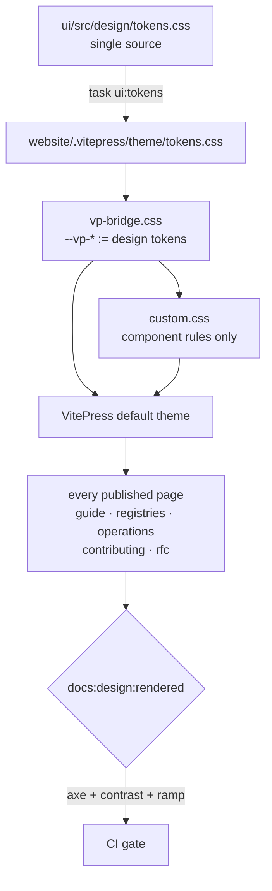

# RFC 0005 — One documentation tree, wearing the design system

| Field       | Value                                                                 |
| ----------- | --------------------------------------------------------------------- |
| Status      | In review — open questions resolved, §6.6 agreed, awaiting sign-off     |
| Author      | Max Batleforc <maxleriche.60@gmail.com>                                |
| Co-author   | —                                                                      |
| Created     | 2026-08-14                                                             |
| Supersedes  | —                                                                      |
| Touches     | `website/` → `docs/`, `Taskfile.yml`, CI workflows, `.impeccable/`     |

---

## 1. Summary

This project has two documentation trees. `website/` is the public site — 41
published pages, the first thing anyone evaluating BatleHub reads. `docs/` is 21
more documents plus the RFCs, in the repo, unpublished. Four documents exist in
both and have silently drifted. Neither tree uses the design system, and neither
has a rendered design gate.

RFC 0003 settled what this world looks like and `ui/` now implements it. The
public site still wears the world that preceded it: its own `--bh-*` colour
tokens, glows DESIGN.md removed by name, rounded corners in a system whose radius
is zero, a body face in a world that has no sans, and fonts fetched from Google
on first paint. Meanwhile `task ui:tokens` copies the real token file into the
site on every check — and nothing imports it.

This RFC does two things that turn out to be one thing. It **merges the two trees
into one**, split into spaces by reader rather than by which folder somebody
happened to save a file in, and renames `website/` to `docs/` once it holds
everything — because a directory called `website` that contains the project's
documentation is named after its implementation, not its job. And it **puts the
design system on the result**: the token copy becomes load-bearing, the forbidden
material goes, both renditions get authored, and the site lands behind the same
class of gate the console has.

The design work runs through Impeccable rather than by hand: a surface brief in
Read mode, a critique and audit pass whose findings are the baseline, and a
rendered detector in CI.

### Before / after

```text
# today
docs/                 21 documents + future-feature/ (6 RFCs + template), unpublished,
                      4 of them duplicated in website/guide/ with up to 296
                      divergent lines, 2 dead cross-references
website/              the published site
  .vitepress/theme/
    tokens.css        ← copied by `task ui:tokens`, gate-checked, imported by NOTHING
    custom.css        ← 459 lines: 12 --bh-* colour tokens, 6 glows, 8 rounded
                        corners, 4 box-shadows, 1 @import from fonts.googleapis.com
    index.ts          ← imports './custom.css' only

gates: `impeccable detect … website/.vitepress` (static source scan)
       no rendered gate, no axe, no contrast-in-browser, no link check

# with this RFC
docs/                 the site, and the only documentation tree
  guide/              user & operator          (published)
  registries/         per-registry protocols   (published)
  operations/         runbooks & compliance    (published)
  contributing/       contributor              (published)
  rfc/                design history           (published)
  internal/           generated & point-in-time artifacts (srcExclude'd)
  .vitepress/theme/
    tokens.css        ← the same copy, now the only place a colour is decided
    vp-bridge.css     ← maps VitePress's --vp-* contract onto the design tokens
    custom.css        ← component rules only; no colour literals, no forbidden effects
    fonts/            ← self-hosted woff2, same faces as the console

gates: `task docs:design`           static detector + token drift
       `task docs:design:rendered`  axe + contrast + ramp, 2 viewports, every page
       `task docs:links`            no dead cross-reference, no orphan page
```

The published URL does not change. It is set by `BASE_URL: /batlehub/` and
`git-pages-cli` in `.forgejo/workflows/website.yaml`, neither of which mentions
the directory name.

---

## 2. Motivation

1. **The design system is copied into the site and imported nowhere.**
   `task ui:tokens` copies `ui/src/design/tokens.css` to
   `website/.vitepress/theme/tokens.css`, and `ui:tokens:check` fails the build if
   the copy drifts — it runs as part of `task ui:design`. But
   `theme/index.ts` imports `./custom.css` and nothing else, and `custom.css`'s
   only `@import` is a Google Fonts URL. Grepping `.vitepress/` for `tokens.css`
   returns no import site. A gate has been guarding the freshness of a file no
   stylesheet reads. This is the same defect RFC 0003 §13 and RFC 0004-bis §14.9
   each found once already: *a token that reaches no call site was never
   adopted*, and the check that "passes" is measuring the wrong thing.

2. **`custom.css` is the world DESIGN.md replaced, still in production.**
   459 lines declaring 12 `--bh-*` colour tokens over the top of the ones
   `tokens.css` already decides. Measured against the design system it is meant
   to express:

   | Found in `custom.css` | Count | The rule it contradicts |
   | --- | --- | --- |
   | `--bh-cyber-glow` / `--bh-steam-glow` references | 6 | DESIGN.md: *"no glow — the Monofolio `--cyber-glow` / `--steam-glow` utilities do not survive into this world."* |
   | `box-shadow` declarations | 4 | The Flat-At-Rest Rule: the system has exactly two, both zero-blur, both on the primary action |
   | non-zero `border-radius` | 8 | `--radius: 0` — *"Zero radius everywhere. The world has no rounded corner."* |
   | `--bh-primary: oklch(0.65 0.26 25)` | 1 | The In-Gamut Rule. `tokens.css` records max chroma **0.2359** at that L/H and ships 0.235; the site ships the unclamped Monofolio source |
   | `--vp-font-family-base: 'IBM Plex Sans'` | 1 | *"There is no sans in this world — every fact is set in the mono text face."* |

   An out-of-gamut token is not a cosmetic difference: engines disagree on what
   they paint outside sRGB, so the value cannot carry a contrast guarantee. The
   site's primary colour is the one value in the project that has never been
   measurable.

3. **The fonts come from a third party, which is also how the console's text face
   silently never painted.** `custom.css` opens with one
   `@import url('https://fonts.googleapis.com/…')`. `ui/` shipped exactly this
   and it did not work: its own CSP (`font-src 'self' data:`, `build/csp.ts`)
   refused the request, so — in the words of the fix — *"the specimen's text face
   has never actually painted, and every surface has been falling back to
   `ui-monospace`."* The docs site has no CSP today, so the import does resolve;
   the cost is instead that every reader's IP reaches Google before the first
   paragraph renders, on a page whose whole job is to be read by people
   evaluating a self-hosted product.

4. **The light rendition is unauthored.** `custom.css` carries a single
   `.dark`-scoped rule in 459 lines. DESIGN.md is explicit that this world has
   two authored grounds — *"Light is not a filter over dark, and dark is not a
   filter over light: both are authored"* — and `tokens.css` ships measured
   ratios for each. What the site shows in light mode is VitePress's defaults
   wearing a crimson accent.

5. **Four documents are maintained twice and have drifted, with nothing
   watching.** `docs/` is *not* copied into the site — nothing in
   `website/package.json`, `config.ts` or the Taskfile copies it, and the site
   builds from `website/` alone. CLAUDE.md line 174 states the opposite
   ("Markdown files in `docs/` are copied to the static site"), which is how the
   second copy came to feel like a mirror rather than a fork.
   `website/guide/` holds its own copies:

   | Document | `docs/` | `website/guide/` | Divergent lines |
   | --- | --- | --- | --- |
   | `access-control.md` | 483 | 457 | 296 |
   | `sbom.md` | 286 | 247 | 203 |
   | `high-availability.md` | 433 | 425 | 102 |
   | `ROADMAP.md` → `roadmap.md` | 226 | 277 | 393 |

   Nobody decided these should differ. A reader of the public site and a
   contributor reading the repo are being told different things about access
   control, and neither copy is marked as the authority.

6. **No rule decides which tree a document belongs to, so the split does not
   follow the reader.** `docs/` currently mixes at least four audiences with no
   marker distinguishing them: operator runbooks (`incident-response.md`,
   `disaster-recovery.md`, `production-hardening.md`), compliance material
   (`soc2-checklist.md`, `change-management.md`), contributor guides
   (`adding-a-registry.md`, `contributing.md`, `testing.md`), and generated
   artifacts (`i18n-review-fr.md`, 702 lines produced by `task ui:i18n:review`).
   Meanwhile `configuration.md` — 3 666 lines, the single most cross-referenced
   document in the repo at 27 inbound links — is unpublished, so the canonical
   configuration reference for a self-hosted product is the one page the public
   cannot read.

7. **Nothing checks that a documentation link resolves.** Two are already dead:
   `incident-response.md` links to `docs/post-mortem-template.md` and
   `soc2-checklist.md` links to `docs/monitoring.md`; neither file exists. The
   site's own nav is fine — 46 internal links over 41 distinct targets, all
   resolving — but that is `config.ts` only, and nothing looks inside the prose
   in either tree.

8. **The public site has less design coverage than the internal console.**
   `impeccable detect ui/src website/.vitepress` runs a *static source* scan over
   both (Taskfile lines 731, 819). Beyond that the console gets
   `build/design-routes.mjs` — axe plus the type-ramp and display-face check, at
   1440 and 390, over 30 route/role pairs — and the site gets nothing rendered at
   all. The surface seen by every prospective user is the one nobody measures in
   a browser.

9. **Impeccable holds no brief for the site.** `.impeccable/surfaces/` contains
   exactly one brief, and it is for `ui/design-proof/index.html`. Forty-one
   published pages, zero recorded design intent — so every future change to the
   site is a fresh argument from first principles.

---

## 3. Goals / non-goals

**Goals**

- **One documentation tree.** A document has exactly one home, chosen by who
  reads it, and there is no second copy to drift from.
- One place decides a colour, a step and a duration for the whole project,
  including the public site.
- The site renders in both authored renditions, with the same measured contrast
  guarantees the console has.
- No third-party request is needed to paint the page.
- The directory is named for its job. Once it holds the documentation, it is
  `docs/`, not `website/`.
- The site is measured in a browser, at two viewports, on every page, in CI, and
  every internal link resolves.
- The design intent is recorded once as a surface brief instead of re-argued per
  change.

**Non-goals**

- **Rewriting documentation content.** This RFC moves, de-duplicates and re-homes
  prose; it does not re-author it. Where two copies disagree on fact, resolving
  that is a content decision for the author, flagged rather than guessed.
- **Changing the published URLs of existing pages.** Pages that are published
  today keep their paths, so external links and search results survive. The new
  spaces are additive.
- **Migrating off VitePress.** The default theme is extended, not replaced.
- **Setting body text in Silkscreen.** The display face is drawn on an 8px em and
  is for headings and pixel-scale labels; a docs site is prose and must read as
  prose. §4.2 is explicit about which ramp applies where.
- **Adding a CSP to the site.** Self-hosting the fonts removes the *reason* the
  console needed one; adding a policy to a static site is a separate change with
  its own deployment surface.
- **Publishing everything.** Two classes of file stay in the repo and out of the
  built site — see §6.7. Merging the trees is not the same as publishing the
  contents of both.

---

## 4. User-facing design

### 4.1 What a reader sees

The site keeps its structure and gains the console's material vocabulary:
authored grounds, hairline rules instead of shadows, square corners, the crimson
accent used once per view rather than as a wash.

The mode is **Read** in Impeccable's vocabulary — the visitor is there to
understand something. That includes the home page: a docs index is Read, not
Persuade, so the hero states what the product is and gets out of the way rather
than selling. The existing hero copy is factual and stays; only its material
changes.

### 4.2 Two ramps, and which one applies

DESIGN.md's ramp was authored for a console: 12/13/15px steps for dense rows of
data. Prose at 13px is not a reading size, and this is the one place where
applying the console's system literally would make the site worse.

The design system already contains the answer and the site simply has not used
it. `tokens.css` ships two ramps because Silkscreen is drawn on an 8px em:

- **Display/pixel ramp** (Silkscreen, integer multiples of 8) — page titles and
  section headings, exactly as the console spends it on a registry name.
- **Data ramp** (JetBrains Mono, 12/13/15/16) — tables, code blocks, metadata
  lines, the config generator's fields.

**Prose gets a third role — settled, and measured.** DESIGN.md had no long-form
reading role because the console has no long-form text. It is now **Reading:
JetBrains Mono 16px, line-height 1.7, 68ch** — promoted into DESIGN.md as The
Reading Role Rule, with the pick recorded in the site's surface brief.

The step is not new. DESIGN.md already declared Sub (16px) and parked it —
*"declared in the ramp but not exercised by this surface… treat their usage as
unset, not as established"* — so this is the surface it was waiting for rather
than an invented token. Three candidates were built against real content from
`guide/installation.md` and measured in a browser at 1440:

| | step / leading / measure | rendered | leading |
| --- | --- | --- | --- |
| A | 15px / 1.6 / 72ch — the console's Row step | 71 chars | 9.0px |
| **B** | **16px / 1.7 / 68ch** | **67 chars** | **11.2px** |
| C | 16px / 1.75 / 62ch | 61 chars | 12.0px |

A is the console reading: dense, and tight leading under a 71-character line. C is
the most comfortable per line but breaks technical identifiers
(`ghcr.io/batleforc/batlehub:<version>`) noticeably more often, which is a real
cost in this content. B sits mid-band.

Two notes worth keeping, because both are places the generic advice and this
system disagree:

- **Tracking is not part of the light-on-dark compensation.** The usual guidance
  asks for leading, tracking and weight together; the Tracking Ladder Rule ends at
  *"lowercase text is never tracked"*, and the system wins. The leading carries it.
- **`ch` is exact here.** JetBrains Mono's advance measured 0.6em precisely — 9.0px
  at 15px, 9.6px at 16px — so the 45–75ch band is a literal character count rather
  than the approximation it is in a proportional face.

### 4.3 Behaviour rules

- Theme follows **The Stored-Preference Rule**: store `system|light|dark`, never
  the resolved value. VitePress already stores a preference and resolves before
  first paint; the bridge inherits that rather than adding a second mechanism.
- Every wide element — code blocks, tables, the config generator — scrolls inside
  its own container. The body never scrolls horizontally.
- No element changes state on colour alone. Links in body text carry an
  underline at rest, which is the defect the console's `link-in-text-block`
  failure taught: crimson on dim ink measured 1.28:1 against surrounding text.

### 4.4 Five spaces, sorted by reader

The site gains three sections and keeps two. Each has its own sidebar, so a
reader never scrolls past material written for somebody else:

| Space | "I am here because…" |
| --- | --- |
| `guide/` | I am setting this up or running it |
| `registries/` | I need the snippet for *my* package manager |
| `operations/` | something is broken, or an auditor is asking |
| `contributing/` | I am changing the code |
| `rfc/` | I want to know why it works this way |

This is the rule the current split lacks. Today a document's home records which
folder somebody had open, and the reader is the one who pays: the canonical
configuration reference is unpublished while a partial copy of the access-control
guide is published twice.

---

## 5. Architecture

### 5.1 Where the tokens enter

VitePress's theme contract is a set of `--vp-*` custom properties. The design
system's contract is `tokens.css`. Today `custom.css` re-declares raw colours
into both. Instead, one bridge file maps one contract onto the other, and it is
the only file allowed to name a `--vp-*` variable.



The invariant: **`custom.css` contains no colour literal and no `--vp-*`
declaration.** If a component needs a colour it reaches for a design token, and
if VitePress needs one it gets it from the bridge. That is what makes
`ui:tokens:check` meaningful — today the check guards a file with no readers, and
after this change a drifted token visibly repaints the site.

### 5.2 Load order

`theme/index.ts` imports in dependency order: `tokens.css` (declares), then
`vp-bridge.css` (maps), then `custom.css` (uses). A component stylesheet that
loads before the tokens it references is the failure mode this ordering exists to
prevent.

---

## 6. Detailed design

Paths below are written as they exist **today** (`website/…`). Phase 7 renames the
directory; nothing else about these sections changes when it does.

### 6.1 `website/.vitepress/theme/index.ts`

Import the three stylesheets in order. Currently imports `custom.css` alone.

### 6.2 `website/.vitepress/theme/vp-bridge.css` (new)

Maps the `--vp-*` variables VitePress actually reads onto design tokens, for both
renditions. Roughly 36 declarations, matching the count `custom.css` carries
today, so the mapping is a move rather than an expansion:

- `--vp-c-bg` → `--ground`, `--vp-c-bg-alt` → `--ground-sunk`,
  `--vp-c-bg-soft` → `--ground-raised`
- `--vp-c-text-1` → `--ink`, `--vp-c-text-2` → `--ink-dim`
- `--vp-c-divider` / `--vp-c-border` → `--rule-soft` / `--rule-strong`, split by
  the job each does — separators take the soft rule, interactive edges the strong
  one, which is the distinction the console's `--border` alias got wrong once
  already
- `--vp-c-brand-1/2/3` → `--accent` and its measured neighbours;
  `--vp-button-brand-text` → `--accent-ink`, per *"put `--accent-ink` on every
  crimson fill"*
- `--vp-font-family-base` and `--vp-font-family-mono` → both to the text face

### 6.3 `website/.vitepress/theme/custom.css`

- Delete the 12 `--bh-*` colour tokens and every reference; they resolve to
  design tokens or to nothing.
- Delete the 6 glow references, the 4 `box-shadow`s and the 8 non-zero
  `border-radius` values.
- Delete the remote `@import`.
- Keep the component-level layout and rhythm rules, re-expressed in `--s*`
  spacing tokens.

Expected outcome: a file substantially shorter than 459 lines, containing no
colour.

### 6.4 `website/.vitepress/theme/fonts/` (new)

Self-hosted `woff2` for the two faces, `font-display: swap`, preloaded from the
head — the same arrangement `ui/` uses. Reuse the files already in
`ui/public/fonts/` rather than sourcing them twice.

### 6.5 `.impeccable/surfaces/` — the brief

Before any of the above is written, record the site's design intent as a surface
brief via `scripts/surface-brief.mjs`, in **Read** mode. The brief is what makes
§4.2's prose-ramp decision reviewable, and what stops the next change to the site
from re-deriving it. This is the step the project has skipped for 41 pages.

### 6.6 The merge — where each document lands

Every file in `docs/` moves into a space chosen by **who reads it**, which is the
rule the current split lacks. The four spaces below are new; `guide/` and
`registries/` already exist and keep their paths.

| Space | Reader | Documents moved in |
| --- | --- | --- |
| `guide/` | operator setting the product up | `configuration.md`, `publishing.md`, `cli.md`, `check-registries.md`, `troubleshooting.md`, `vulnerability-proxy.md`, `security-scanning.md` |
| `operations/` | the person on call, and the auditor | `incident-response.md`, `disaster-recovery.md`, `production-hardening.md`, `change-management.md`, `soc2-checklist.md` |
| `contributing/` | someone changing the code | `contributing.md`, `testing.md`, `adding-a-registry.md`, `adding-a-vulnerability-scanner.md` |
| `rfc/` | someone asking why it is like this | `future-feature/000*.md` (6 RFCs; the template goes to `internal/`) |

`configuration.md` moving into `guide/` is the single highest-value line in this
table: 3 666 lines, 27 inbound references, and today unreadable by anyone who has
not cloned the repo.

**The four duplicates** (Q2, decided): the **public copy is canonical** for
`access-control`, `sbom` and `high-availability` — they are user-facing guides
and the site's version is the one that has been maintained against readers.
`ROADMAP.md` stays canonical **at the repo root**, and `guide/roadmap.md` becomes
a generated copy rather than a hand-edited one, because the roadmap is a project
artifact that happens to be worth publishing.

Where the two copies disagree on fact — 296 divergent lines in `access-control`
alone — the diff is produced for the author to resolve. This RFC does not pick
winners line by line; that is content review, and doing it silently during a move
is how a merge loses a paragraph nobody notices for a year.

### 6.7 What does not publish

Merging the trees is not the same as publishing both. Three classes stay in the
repo, under `docs/internal/`, listed in `srcExclude` so VitePress does not build
them:

- **Generated artifacts.** `i18n-review-fr.md` (702 lines) is output from
  `task ui:i18n:review`, not a document. The task's output path moves to
  `docs/internal/` with it, so the producer and its product stay together and
  generated files have one recognisable home.
- **Point-in-time security findings.** `security-survey-2026-06-12.md` catalogues
  weaknesses as of a date.
- **Forms.** `0000-template.md` is the RFC template — something you copy, not
  something you read.

That distinction is the rule, and it is worth stating plainly because the RFCs
are candid: **design history publishes, security findings do not.** RFC 0003 and
0004-bis are unflattering about the console's past state, and publishing them is
a deliberate choice — for an open-source infrastructure product, visible rigour
about one's own defects reads as competence. A dated vulnerability survey reads
as a map.

### 6.8 The RFC status banner

Every RFC publishes, and every RFC page opens with a banner naming its status.
The banner exists because these documents are candid about defects that were live
in shipped versions, and a reader arriving from a search result has no way to know
they are reading history rather than a description of the product today.

**The banner is generated from the RFC's own `Status` row, never hand-written.**
Every RFC already carries one in its header table, and the template already
defines the vocabulary — Draft, In review, Accepted, Implemented, Rejected,
Superseded by NNNN. A second, hand-maintained copy of that fact on the page would
drift from the table above it, which is the defect this whole RFC keeps finding.

Mechanism: `transformPageData` in `config.ts` matches the `| Status | … |` row,
normalises the leading token to the template's vocabulary, and sets it as
frontmatter; a theme component renders it above the title.

Two things the parser must handle, because the existing files already do them:

- **The value is prose, not an enum.** RFC 0001 reads
  `**Implemented** — all phases landed; see the implementation notes in §13`. The
  leading token is the status; the remainder is a note worth rendering with it.
- **The statuses are not uniform, and the banner is what makes that safe to
  publish.** Today: 0001, 0003 and 0004-bis are Implemented; 0002, 0004 and this
  RFC are In review. An `In review` RFC on the public site is honest — it says a
  decision is proposed and not yet taken. The same page with an `Implemented`
  banner would be a claim about the product that is not true.
- **The value moves.** This paragraph said "0005 is Draft" until the moment 0005
  stopped being a draft, which is the argument for generating the banner in three
  lines rather than in the abstract.

A status that does not parse fails the build rather than rendering an unlabelled
page (§10). An RFC whose banner is missing is exactly the page that misleads.

The template is not an RFC and does not publish — see §6.7.

### 6.9 The rename, and the reference sweep

Once `docs/` is empty, `git mv website docs`. The name matters because
`website/` describes the implementation (it is a site) rather than the job (it is
the documentation), and after the merge that mismatch is the only thing left
suggesting there are two trees.

This is the risky half, and it is risky by volume rather than by difficulty.
There are **84 references to `website/` across 19 files** outside the directory
itself, including four CI workflows:

| File | What breaks if missed |
| --- | --- |
| `.forgejo/workflows/website.yaml` | the deploy — `paths:` filter, `cd website`, `cp -R .vitepress/dist` |
| `.github/workflows/front-design.yaml` | `paths:` filter, the detector invocation, the token-drift check |
| `.github/workflows/dep-audit-frontend.yaml` | `paths:` filter, `pnpm audit` working directory |
| `.github/workflows/postmortem.yaml` | the per-root job's `path:` and lockfile filters |
| `Taskfile.yml` | `dir: website` in 6 tasks, the `ui:tokens` copy target, `website:audit` |
| `mise.toml`, `gitleaks.toml` | tool scoping and secret-scan paths |
| `CLAUDE.md`, `README.md`, `PRODUCT.md`, `CHANGELOG.md`, `ROADMAP.md` | prose that tells a contributor where things are |

The `website:*` task names become `docs:*`. Keeping the old names pointed at the
new directory would preserve exactly the confusion the rename exists to remove.

**The deploy is unaffected in the only way that matters to a reader.** The public
URL comes from `BASE_URL: /batlehub/` and the `git-pages-cli` argument, neither of
which names the directory. No published page changes address.

**Deliberately not done in the same commit:** the move (§6.6) and the rename
(§6.8) are separate phases. A single commit that both re-homes 21 documents and
renames the directory produces a diff no reviewer can read, and if the deploy
breaks there is no way to tell which half did it.

**Deliberately untouched**, so reviewers do not go looking:

- `website/.vitepress/components/ConfigGenerator.vue` (91 KB) — it styles itself
  entirely off `--vp-*` variables, so the bridge repaints it for free. Rewriting
  it to reference design tokens directly is churn with no visible result.
- `website/.vitepress/config.ts` — nav and sidebar are correct; all 41 internal
  links resolve.
- Existing published URLs — the merge is additive; pages that have a public
  address today keep it (§3 non-goals).
- `config.example-space.toml` — while gathering evidence I found two real defects
  there (a comment and a token concatenated on line 34; the block labelled
  "Example Argon2id hash" ships a plain-text value on line 43 with the actual
  hash commented out). Out of scope here — flagged so it is not lost.

---

## 7. Security considerations

- **One third-party dependency at paint time is removed.** Today every visitor
  resolves `fonts.googleapis.com` before the first paragraph renders, disclosing
  their IP and user-agent to Google. Self-hosting removes the request. For a
  product whose value proposition is *not* sending your traffic to someone else,
  this is on-message as well as correct.
- **No new authenticated surface.** The site is static and unauthenticated before
  and after; the change is presentational.
- **Supply chain narrows slightly.** A remote `@import` is executable CSS from a
  host outside the release process. `pnpm audit` and the postmortem gate never
  saw it, because it is not a package.
- **Contrast becomes a measured property of the public site.** Today no ratio on
  the site is asserted anywhere. After §10 every page is checked in a browser at
  two viewports, which is a security-adjacent accessibility guarantee the project
  claims elsewhere and does not currently make here.

---

## 8. Alternatives considered

| Alternative | Why rejected |
| --- | --- |
| Leave `custom.css` alone; just import `tokens.css` | The import would change nothing: `--bh-*` and `--vp-*` are declared *after* it and win. The duplicate layer is the problem, not the missing import. |
| Delete the token copy and the `ui:tokens` task | Honest about today's state, but gives up the goal. The public site is the one people see; excusing it from the design system is the wrong direction. |
| Keep two trees; just de-duplicate the four proven overlaps | The overlaps are the symptom. Nothing would stop the next document being written in the wrong tree, because there is still no rule saying which tree is right — and `configuration.md`, the most-referenced document in the repo, would stay unpublished. |
| Merge the trees but keep the directory called `website/` | Free, and it leaves the last signal that there are two things. The rename is 84 references across 19 files: real work, entirely mechanical, and checkable by a grep that must return zero. |
| Rename to `docs/` without merging first | Impossible in one step — the destination is occupied — and attempting it as move-then-rename in a single commit produces an unreviewable diff (§6.8). |
| Publish the RFCs' security survey along with the rest | It is a dated catalogue of this instance's weaknesses. §6.7 draws the line at design history. |
| Adopt the console's data ramp for prose | 13px body over a 72ch measure is a console reading, not a docs reading. §4.2 and §11 keep this a decision rather than an accident. |
| Hand-roll the design pass instead of using Impeccable | The project already owns the tooling, a detector hook, and a `DESIGN.md` sidecar. Not using them on the one surface that has never been measured would repeat exactly how the site drifted in the first place. |

---

## 9. Rollout and compatibility

- **Default behaviour.** No config, no flags, nothing to enable. The product is
  not touched: this RFC changes documentation and the stylesheet that presents it.
- **Config migration.** None. `CURRENT_CONFIG_VERSION` does not move.
- **URL compatibility.** Pages published today keep their addresses. The merge
  only adds paths (`/operations/`, `/contributing/`, `/rfc/`), and the rename does
  not touch the published prefix, which comes from `BASE_URL` and the
  `git-pages-cli` argument.
- **Contributor prerequisites.** After phase 7 the muscle memory changes: the
  site builds from `docs/`, and `task website:*` no longer exists. This is the
  one user-visible cost of the rename and it is why the task names change rather
  than being aliased — a stale alias would let the old name survive in scripts
  and in people's heads.
- **Rollback.** Phases 1–6 revert cleanly; nothing is persisted or generated at
  runtime. Phase 7 is a `git mv` plus a mechanical sweep, so reverting it is
  another `git mv` plus the same sweep in reverse — cheap, but *not* free, which
  is why it ships alone and is verified against the real deploy first.
- **Sequencing.** Phase 1 is independently shippable and fixes the two costliest
  defects (dead token copy, third-party fonts) without touching a single page of
  prose. Phases 5–8 are shippable without any of the design work landing.

---

## 10. Test plan

The point of this section is that the site ends up with the same class of
evidence the console has, generated by the same tooling.

- **Static** — `task docs:design` (new): `impeccable detect docs/.vitepress` plus
  `ui:tokens:check`, which becomes meaningful for the first time because the copy
  is now loaded.
- **Rendered** (new, `docs/build/design-routes.mjs`, modelled on the console's):
  axe plus contrast and type-ramp assertions over every published page at 1440 and
  390. The console's version scans 30 route/role pairs; the site has no auth to
  seed, so it is a straight sweep of every built page.
- **Token drift** — `ui:tokens:check`, unchanged, now load-bearing.
- **Links** — `task docs:links` (new): every relative link in the merged tree
  resolves to a file that exists, and no published page is unreachable from the
  sidebar. Its first run must find and fix the two dead references in motivation 7.
- **No second tree** — a grep for `website/` outside the renamed directory must
  return zero. This is the whole verification for phase 7, and it is exact.
- **RFC status** — every file under `rfc/` yields a status in the template's
  vocabulary, or the build fails. Asserted over all six of today's RFCs, which
  currently span three different statuses; a seventh RFC added without a parseable
  `Status` row is caught before it publishes unlabelled.
- **Build** — `task docs:build` must succeed with no remote request; verified by
  building with the network denied, which is also the proof that the Google Fonts
  import is gone rather than merely unused.
- **Deploy** — phase 7 is verified by running `.forgejo/workflows/website.yaml`
  on a branch and confirming the published output is byte-identical to the
  pre-rename build apart from the intended design changes. A rename that breaks
  publishing is the one failure in this RFC with no local signal.
- **Existing suites that must pass unchanged** — `ui/`'s entire suite and
  `design-routes.mjs`. Nothing in this RFC touches `ui/src`, so any change there
  is a mistake, and those gates are the signal.

---

## 11. Decisions and open questions

### Resolved

| # | Question | Decision |
| --- | --- | --- |
| 1 | Bridge the `--vp-*` contract, or override VitePress wholesale? | **Bridge.** One mapping file keeps the default theme's behaviour, accessibility work and upgrade path; a wholesale override buys control the site does not need and inherits maintenance forever. |
| 2 | Which mode does the site design for? | **Read**, including the home page. A docs index is Read, not Persuade — the visitor is evaluating, and hype costs credibility with the audience PRODUCT.md names. |
| 3 | Self-host the fonts, or add a CSP and keep the CDN? | **Self-host.** A CSP would block the import, which is how `ui/` discovered its own text face was never painting. Self-hosting fixes the cause; the CSP is then optional. |
| 4 | Silkscreen for docs headings? | **Yes, at the pixel ramp's integer steps only.** It is the world's display face and the site should look like the product. Body copy is never Silkscreen (§4.2). |
| 5 | Canonical home for the four duplicates? | **Public copy wins for `access-control`, `sbom`, `high-availability`; `ROADMAP.md` stays canonical at the repo root** and its published copy becomes generated. The three guides are user-facing and the site's versions were maintained against readers; the roadmap is a project artifact that happens to be publishable. Line-level conflicts go to the author (§6.6). |
| 6 | Merge the two trees, or keep them separate? | **Merge.** The duplication is a symptom of there being no rule about where a document lives; a second tree with no rule will re-acquire duplicates. The merge sorts by reader into five spaces (§6.6), which is a rule. |
| 7 | Rename `website/` → `docs/`? | **Yes, and as its own phase.** The directory is named after its implementation, not its job, and after the merge that is the last thing implying two trees exist. 84 references across 19 files, mechanical, verified by a grep that must return zero (§6.8). The public URL is unaffected. |
| 8 | Publish everything that moves in? | **No.** Generated artifacts and dated security findings stay in the repo and out of the build (§6.7). The rule: design history publishes, security findings do not. |
| 9 | Do the RFCs publish, and from which number? | **All of them, each under a status banner generated from its own `Status` field** (§6.9). Not a uniform "Implemented" label: three of the six are not implemented, and printing that they are would be a false public claim about the product — the exact misreading the banner exists to prevent. |
| 10 | Where does `task ui:i18n:review` write? | **`docs/internal/`.** The sheet stays in the documentation tree, out of the build. Keeps the producer's output path in one recognisable place rather than scattering generated artifacts into `ui/`. |
| 11 | The prose ramp (§4.2). | **Reading: JetBrains Mono 16px / line-height 1.7 / 68ch**, promoted into DESIGN.md as The Reading Role Rule. Three candidates rendered against real content and measured in a browser; 16px is the parked Sub step rather than a new token. Recorded in the site's surface brief. |
| 12 | The h2/h3 size inversion found in the same proof. | **Accepted as-is.** A Silkscreen 16px `h2` measures a 27.2px box against a mono 20px `h3`'s 34px, so the subordinate heading is physically larger — but the level is not carried by size here. The face changes, the case changes and the tracking changes, and those three read as a rank before size is consulted at all. This is the system doing what it already says: *combine size, weight, space and tone rather than asking size alone to do the work.* Conditions under which it stops being true, and which phase 3 must check rather than assume: a page whose `h3` runs long enough to wrap, and the 390px rendition, where the reflowed column narrows the gap the face change is carrying. |
| 13 | Do surface briefs reach the repository? | **Yes — `!/.impeccable/surfaces/`.** The `.gitignore`'s own argument for tracking the detector config applies unchanged to a brief: a record only its author can read cannot be the thing that stops each change re-arguing the design. Everything else under `.impeccable/` stays per-developer state; the generated `design.json` sidecar in particular is rebuilt from the tracked DESIGN.md and would only ever be diff noise. |

### Still open

None. Per the template, the RFC is ready for sign-off — `Status` moves to
`In review` when the author is satisfied with §6.6's canonical-copy assignments,
which are the one place this document commits to a content decision.

Two items were open until the design pass and have been folded into Resolved
above as decisions 12 and 13.

---

## 12. Implementation phases

Each phase leaves the tree green — builds, gates pass — and is independently
reviewable. Phases 1 and 2 are useful even if the rest never lands.

The design phases (0–4) and the merge phases (5–8) are independent and can run in
either order or in parallel; they are numbered this way because the design work
is shippable sooner and the merge is the one that can break a deploy.

| Phase | Content | Fixes | Impeccable |
| --- | --- | --- | --- |
| 0 | Record the surface brief for the site in **Read** mode; run `critique` and `audit` against the site as it stands and keep the findings as the baseline this RFC is measured against. | — | `surface-brief.mjs`, `critique`, `audit` |
| 1 | Self-host the fonts; import `tokens.css`; add `vp-bridge.css`; delete the `--bh-*` colour layer and the remote `@import`. | 1, 2 (colour), 3 | detector hook on every edit |
| 2 | Delete glows, shadows and radii; author the light rendition against the measured tokens. | 2 (material), 4 | `polish`, `adapt` for the two viewports |
| 3 | Apply the Reading role (decided, §4.2); settle the heading hierarchy the same way — candidates, rendered, measured (open question 1). | — | `typeset`, then update the brief |
| 4 | `build/design-routes.mjs` for the site; wire `docs:design` and `docs:design:rendered` into the CI job the console's gates run in. | 8 | `detect --viewport` per page |
| 5 | Resolve the four duplicates per Q5; produce the conflict diffs for the author. Tree still has two directories. | 5 | — |
| 6 | Move `docs/**` into the site's spaces (`guide/`, `operations/`, `contributing/`, `rfc/`, `internal/`); add `srcExclude`; update the sidebars. `docs/` ends empty. | 6 | `critique` on the new spaces |
| 6b | The RFC status banner: `transformPageData` parser, theme component, and the build failure on an unparseable status (§6.8). Ships with phase 6 — publishing the RFCs without it is the thing the banner exists to prevent. | — | `critique` on one Implemented and one In-review page |
| 7 | `git mv website docs`; sweep the 84 references; rename `website:*` tasks to `docs:*`. **Deploy must be verified on a branch before this merges.** | — | — |
| 8 | `task docs:links` — dead cross-references and orphan pages, over the merged tree. Fixes the two already-dead links. | 7 | — |
| 9 | Re-run `critique` and `audit`; diff against phase 0's baseline and record the delta in the brief. | 9 | `critique`, `audit`, `doctor` |

---

## 13. Implementation notes

All nine phases landed. What follows is what the RFC did not predict, because
that is the part worth reading later.

### What changed from the plan

- **Phases 1–3 shipped as one rewrite of `custom.css`.** The RFC splits colour
  (phase 1) from material (phase 2), but the `--bh-*` layer *defines* the glows,
  so deleting the colour layer deletes them; splitting the file's rewrite into
  two commits would have produced two unreadable diffs of the same 459 lines
  rather than one readable one. The Reading role (phase 3) went in with them
  because DESIGN.md already carried The Reading Role Rule.

- **The fonts live in `public/fonts/`, not `.vitepress/theme/fonts/`.** §6.4
  asks for both that path *and* a preload from the head, and those are
  incompatible: a font referenced from theme CSS gets a content hash, and a
  preload needs a stable URL. `public/` is also what §6.4's "the same
  arrangement `ui/` uses" actually means. Verified: Vite rewrites the
  root-absolute `url()` with `BASE_URL`, so the published site resolves
  `/batlehub/fonts/…`.

- **Phases 6 and 7's reference sweeps were done once, after the rename.** Doing
  them in order would have meant rewriting every `docs/*.md` reference to
  `website/guide/*.md` and then immediately to `docs/guide/*.md`. The two
  *commits* stay separate as §6.9 requires; only the sweep is shared.

### Five things the plan did not know about

1. **The default theme ships Inter.** 14 woff2 files, 652 KB, in every
   published build, for a typeface this world does not contain — nothing ever
   requested them, because `--vp-font-family-base` resolves to the mono face, so
   they were pure weight. A `resolve.alias` cannot remove them (the theme
   imports its own stylesheet by a relative path); a ten-line Vite plugin that
   resolves by *importer* can.

2. **VitePress exits 0 on a page that fails to server-render.** It prints the
   stack and ships the page as an empty shell, which every reader with
   JavaScript sees as fine and every crawler sees as blank. Two pages were doing
   it the moment this RFC published them, both because VitePress runs markdown
   through Vue and a <code v-pre>{{ … }}</code> is an interpolation *even inside
   a code span* — as this paragraph proved by failing the build it describes.
   `docs/build/build.mjs` turns it into a build failure; `<code v-pre>` is the
   fix in the page.

3. **Syntax highlighting misses AA on this world's paper by hundredths.** Three
   palettes were measured and rejected: VitePress's defaults at 4.35:1, Primer's
   defaults at 4.41:1, `light-plus` at 4.47:1. The cause is that
   `--ground-sunk` in the light rendition is `oklch(0.99 0.004 18)` and not
   `#ffffff`, and a palette tuned against pure white does not survive the move.
   `github-{light,dark}-high-contrast` clears both grounds.

4. **`--t-display` does not fit the hero.** Silkscreen's advance measures
   0.848em and the face has no hyphenation, so "BatleHub" needs 706px at the
   104px step against a 592px hero column and breaks *between glyphs*. The hero
   takes 40px below 640 and 72px above — both integer multiples of the 8px em,
   which is the rule that actually governs the face.

5. **Every override has to outrank a `[data-v-…]`.** The default theme's rules
   are single-file-component styles, so `.VPButton.medium[data-v-…]` is three
   selectors and a two-class override loses to it *silently*. Three fixes read
   as landed when they had not. Zero radius is therefore stated once as a law
   over every box — the theme's only `!important` — and the rest carry a `:root`
   prefix where a measurement showed they needed one.

### What the gates now measure

- `task docs:design` — the static detector, the token copy (load-bearing for the
  first time), the generated roadmap page, and every cross-reference.
- `task docs:design:rendered` — **clean over 67 pages × 3 plans**: axe at WCAG
  2.2 AA, both type ramps per face, zero radius, no blurred shadow, no off-box
  request, at 1440 dark, 1440 light and 390 dark.
- `task docs:links` — every markdown link *and* every code span naming a `.md`
  path resolves, and no published page is orphaned. Records (the CHANGELOG, the
  older RFCs) are exempt from the code-span check and only from that, because an
  RFC quoting `docs/configuration.md` is quoting the tree as it stood.

### Deliberately left

- **The deploy has not been run.** §10 requires `.forgejo/workflows/website.yaml`
  to be exercised on a branch before phase 7 merges, and that needs the Forgejo
  runner. The workflow's `paths:` filter, `cd` and lockfile path are updated; the
  published prefix comes from `BASE_URL` and the `git-pages-cli` argument and is
  untouched, so no page changes address.
- **The workflow file is still `website.yaml`,** and its job is still named
  "Publish batlehub website". Renaming either would change a check name that
  branch protection may reference. §10's test is a grep for `website/` — a path —
  and that returns zero outside `docs/`.
- **`config.example-space.toml`'s two defects** (§6.9) are still there, still out
  of scope, still worth fixing.
- **This document's `Status` row.** §11 says it moves when the author is
  satisfied with §6.6's canonical-copy assignments, which is the one place this
  RFC commits to a content decision. The banner reads `In review` until then, and
  that is the banner doing its job.
