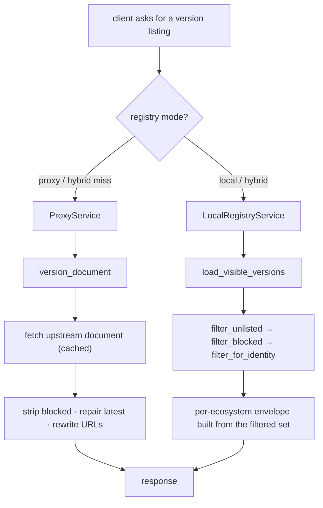
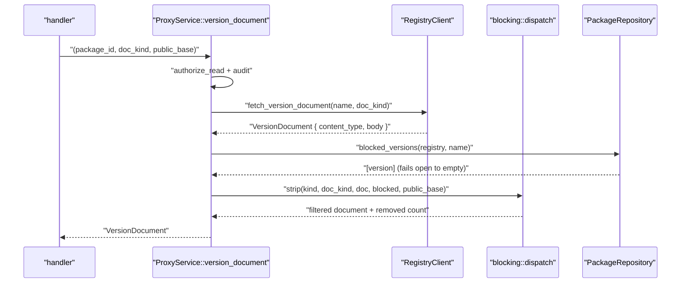

# RFC 0006 — A block that every ecosystem can see

| Field       | Value                                                                 |
| ----------- | --------------------------------------------------------------------- |
| Status      | **Implemented** — all eight phases landed; see the implementation notes in §13 |
| Author      | Max Batleforc <maxleriche.60@gmail.com>                                |
| Co-author   | —                                                                      |
| Created     | 2026-08-15                                                             |
| Supersedes  | —                                                                      |
| Touches     | `crates/core/src/services/blocking/`, `crates/core/src/ports/registry/`, `crates/core/src/services/proxy/`, `crates/core/src/services/metrics.rs`, `crates/adapters/src/registry/`, `crates/web/src/handlers/proxy/`, `ui/src/components/admin/`, `docs/guide/admin-policies.md` |

---

## 1. Summary

Blocking a package version has two halves. The **download gate** — a `403` with
the operator's stated reason — has worked for every registry since the
`BlockListRule` existed. The **listing half** — leaving the version out of what a
client is told exists, so a resolver never picks it in the first place — was
built last for npm, and only for npm.

The difference is what an install looks like. With both halves, blocking
`lodash@4.17.21` moves `dist-tags.latest` to `4.17.20` and `npm install lodash`
succeeds on the version the operator does allow. With only the download gate,
the client reads the upstream listing, resolves `latest` to the blocked version,
and the install **fails**. The block reads as breakage rather than as policy, and
the operator gets a ticket instead of a working proxy.

Twenty registry kinds still behave the second way in proxy mode. This RFC
generalises the npm mechanism to all of them that have a listing document,
states which ones do not and why, and makes that coverage a compiler-enforced
fact rather than a paragraph in the admin guide that has to be remembered.

Local and hybrid mode are already complete: `filter_blocked` sits inside
`load_visible_versions`, the one chokepoint every ecosystem's local listing
resolves through. This RFC is almost entirely about the proxy path.

### Before / after

```text
# today

  block lodash@4.17.21  →  npm      packument omits it, latest → 4.17.20   ✔
                           NuGet    flat index still lists 4.17.21         ✘
                           Maven    maven-metadata.xml still lists it      ✘
                           PyPI     simple index still links its wheels    ✘
                           cargo    sparse index still advertises it       ✘
                           Go       @v/list still lists it, @latest is it   ✘
                           … 15 more

  the client resolves to a version it will then be refused:
    $ npm install lodash          ✔ 4.17.20
    $ dotnet add package X        ✘ 403 on the version NuGet chose
    $ pip install X               ✘ 403 on the wheel the resolver picked
    $ cargo build                 ✘ 403 mid-build, lockfile now poisoned

  one document shape is understood — `strip_blocked_from_packument` takes a
  `serde_json::Value` and knows npm's `versions` / `dist-tags` / `time`.
  Maven is XML, PyPI is HTML, Go is newline text, cargo is NDJSON: none of
  them fit through that signature.

# with this RFC

  block lodash@4.17.21  →  every registry whose protocol has a version
                           listing omits it, and repairs whatever that
                           protocol's "latest" is

  a registry that cannot filter says so, in a generated table, because
  `RegistryKind::listing_filter()` is an exhaustive match that will not
  compile until a new registry answers the question
```

---

## 2. Motivation

1. **A block that only denies the download turns policy into an outage.** The
   download gate refuses a version the client has already committed to. npm
   resolves `latest`, pip resolves a range, cargo writes a lockfile — and the
   `403` arrives after the decision, not before it. The operator's intent was
   "do not use this version"; what the developer experiences is "the registry is
   broken". This is the entire argument for the listing half, and it applies
   identically to every ecosystem.

2. **The gap is documented but not closed.** `docs/guide/admin-policies.md`
   currently ships a warning box naming the limitation:

   > For **proxied** registries the filtering currently applies to npm
   > packuments; other proxied ecosystems still list the blocked version in
   > their upstream index.

   A published caveat is honest, but it is also a feature the product does not
   have on nineteen of twenty registry kinds.

3. **The seam that npm uses cannot carry the other protocols.**
   `RegistryClient::fetch_version_document(&str) -> Result<serde_json::Value>`
   assumes one document per package and assumes it is JSON. Maven's
   `maven-metadata.xml` is XML; PyPI's simple index is HTML (or PEP 691 JSON,
   depending on `Accept`); Go's `@v/list` is newline-delimited text; cargo's
   sparse index is NDJSON. NuGet, RubyGems and Terraform each have **two**
   listing documents for the same package, which the current one-method-per-name
   signature cannot address at all.

4. **Every non-npm listing route currently streams upstream bytes opaquely.**
   `serve_local_or_proxy_json` falls through to `proxy_stream` →
   `RegistryClient::fetch_artifact` with a magic artifact name — `"list"` for Go
   (`goproxy.rs:237`), `"p2"` for Composer (`composer/impl_registry.rs:26`),
   `maven-metadata.xml` as the *version* for Maven (`maven/client.rs:80`),
   `"versions"` for Terraform (`terraform/client.rs:47`). The proxy never parses
   these documents, so it cannot alter them. That is also why the npm packument
   route was serving the `latest` tarball as `application/octet-stream` before
   `serve_local_or_proxy_document` existed — the same class of defect, one
   protocol at a time.

5. **Cargo's sparse index bypasses `ProxyService` entirely.**
   `proxy_upstream_index` (`crates/web/src/handlers/proxy/cargo/index.rs:133`)
   is a bare `reqwest` GET forwarded to the client. No rule chain, no audit
   event, no metadata cache. Blocked-version filtering is the reason to route it
   properly, but the authorisation and audit gap is the more serious finding and
   is fixed by the same change.

6. **Version strings are not comparable across protocols without normalising
   them.** The blocked set arrives from `package_statuses` as literal text.
   NuGet folds `1.0.0.0` to `1.0.0`; PEP 440 normalises `1.0.0-RC1` to `1.0rc1`;
   Go carries a `v` prefix and `+incompatible` suffixes; Maven has qualifiers.
   A block recorded in one spelling and compared against a listing in another
   silently fails to hide anything, and nothing in the system reports that it
   did not work. Today this only affects npm, where semver spelling is
   near-canonical, so the problem has not surfaced.

---

## 3. Goals / non-goals

**Goals**

- An administratively blocked version is absent from the version listing of
  every proxied registry whose protocol has one, in the shape that protocol's
  clients read.
- Each protocol's notion of "newest" — `dist-tags.latest`, `<release>`,
  `@latest`, a registration page's `upper` bound — is repaired to name a version
  that is still allowed, or removed when none is.
- A direct request for a blocked version still returns `403` with the operator's
  reason. Hiding governs resolution; it does not replace diagnosis.
- Which registries filter their listings is answerable from the code, and the
  admin guide's table is generated from that answer rather than maintained
  beside it.
- Adding a registry kind forces an explicit decision about listing filtering, in
  the same way `server/src/builders.rs`'s exhaustive match already forces a
  decision about client construction.

**Non-goals**

- **Filtering signed repository indexes** (deb `Packages`/`Release`, rpm
  `repomd.xml`, pacman database tarballs). Editing them invalidates the GPG
  signature and the client rejects the repository outright — a worse failure
  than the one being fixed. These stay download-gate-only and say so.
- **Filtering RubyGems' Marshal indexes** (`specs.4.8.gz`,
  `quick/Marshal.4.8/*`). Possible, disproportionate: it means a Ruby Marshal
  encoder in Rust to hide a version the JSON APIs already hide for every client
  released this decade.
- **A configuration switch to disable listing filtering.** See §8 — a block that
  can be configured to be half-applied is a block whose behaviour an operator
  cannot state.
- **Changing what a block *is*.** No new admin API, no new status, no new
  column. This RFC changes what existing blocks do on read paths.
- **Vulnerability-driven auto-hiding.** RFC 0002 governs what BatleHub does with
  CVE knowledge; this RFC is about explicit administrative blocks only. The two
  meet only if an operator chooses to block something a scan found.
- **Search endpoints.** `nuget/v3/query`, `api/search/plugins` and friends
  return packages, not versions, and a blocked version rarely blocks a whole
  package. Out of scope, revisit if asked.

---

## 4. User-facing design

### 4.1 Configuration

None. This RFC adds no configuration surface: no key in `[registry]`, no global
toggle, no `CURRENT_CONFIG_VERSION` bump. Blocking already means "clients must
not use this version", and an operator who blocks something has stated their
intent completely. See §8 for why the alternative was rejected.

### 4.2 Behaviour rules

**A block hides the version from listings and refuses its download.** Both
halves, always, for every registry in the supported column of §4.3.

**Hiding is listing-scoped; diagnosis is not.** A blocked version is absent from
the listing and still reachable by exact coordinate, where it returns `403` and
the operator's reason. A lockfile pinning it fails with a message that explains
itself rather than with a `404` that looks like a yanked release.

**A block on a bare version covers every file in that version** — the npm
tarball, a Maven classifier, a Terraform provider binary for one os/arch. This
is `BlockListRule`'s second lookup, added alongside the npm work: a download
coordinate carries an `artifact` the operator's block does not.

**A block on a single artifact hides the whole version from listings, while
leaving the version's other files downloadable.** This asymmetry is deliberate
and is the one behaviour in this RFC that a reasonable reviewer will want to
argue about. `blocked_versions_impl` matches on `(registry, package_name)`
regardless of `package_artifact`; `BlockListRule` matches all four fields.
The reasoning: a version whose bytes are *partly* refused should not be
advertised as installable, because a resolver that selects it has no way to know
which of its files it may have. Someone who knows the exact coordinate of an
unblocked sibling artifact may still fetch it.

The reasonable objection is that an operator blocking one Maven classifier will
be surprised to see the whole version vanish. The answer is not to change the
behaviour — the alternative leaves a version listed whose main artifact is
refused, which is the exact failure this RFC exists to remove — but to **say so
where the block is made**: the admin console states the consequence at block
time rather than leaving the operator to discover it from a listing (§6.8).

**Repairing "newest" is per protocol.** Every listing has some field that names
a preferred version, and each is repaired in the way that protocol's clients
expect — recomputed where the field has a defined meaning, dropped where it is a
publisher's deliberate label:

| Protocol | Field | Treatment |
| --- | --- | --- |
| npm | `dist-tags.latest` | recomputed to the highest surviving version — highest stable, else highest pre-release |
| npm | any other `dist-tag` | **dropped**, not repointed: a tag is a label on one specific release and moving it misrepresents the publisher |
| Maven | `<latest>`, `<release>` | recomputed; `<release>` skips qualified versions as Maven does |
| Go | `@latest` | re-resolved from the filtered `@v/list` |
| RubyGems | `/api/v1/gems/{n}.json` | the document *is* the newest version; rebuilt from the newest surviving one |
| NuGet | registration `lower` / `upper` / `count` | recomputed per page |
| cargo | — | no such field; see below |
| Terraform, Composer, PyPI | — | no such field; the client picks from the list |

**Cargo marks rather than removes.** A blocked crate version is emitted into the
sparse index with `"yanked": true` instead of being dropped. This is cargo's own
mechanism for "exists, do not select": resolution skips it, and an existing
`Cargo.lock` that already pins it still resolves — then hits the download gate,
which is the correct place for that conversation. Deleting the line makes cargo
report the crate as never having had that version, which breaks lockfile
diagnostics for no gain.

**Everything fails open.** A repository error while loading blocked versions
logs a warning and serves the unfiltered listing, matching `BlockListRule` and
`filter_blocked`. A database blip degrades to showing more versions than
intended, never to reporting every package as empty. The download gate re-checks
the concrete coordinate and denies as soon as the store recovers.

**Blocks apply on top of the cache, never into it.** What the metadata cache
holds is the upstream document as received. Filtering and URL rewriting happen
per request. A block therefore takes effect on the next request rather than when
`metadata_ttl` expires, and a document cached by one ingress never hands its own
hostnames to clients of another.

### 4.3 Coverage, and where the operator reads it

The admin guide's warning box is replaced by a table generated from
`RegistryKind::listing_filter()`. Its content at the end of phase 4:

| Registry | Listing document | Filtered |
| --- | --- | --- |
| npm | packument | yes |
| NuGet | flat index | yes |
| NuGet | registration pages | yes when inline; paged registrations pass through |
| Maven | `maven-metadata.xml` | yes |
| PyPI | simple index (HTML and PEP 691 JSON) | yes |
| cargo | sparse index | yes — marked `yanked` |
| Go | `@v/list`, `@latest` | yes |
| RubyGems | versions and gem JSON APIs | yes |
| RubyGems | `specs.4.8.gz`, `quick/Marshal.4.8` | no — Marshal binary |
| Composer | p2 metadata | yes |
| Terraform | module and provider versions | yes |
| Conda | `repodata.json`, `current_repodata.json` | yes |
| JetBrains, JetBrains Marketplace | `updatePlugins.xml`, plugin updates | yes |
| OpenVSX, VSCode Marketplace | extension version listings | yes |
| GitHub, GitLab, Forgejo | release listings | yes |
| deb, rpm, pacman | signed repository indexes | no — signature |
| generic | — | no listing exists |

The three "no" rows carry the reason inline, from the `Unsupported(reason)`
variant, so the published table cannot drift from the code that decides it.

### 4.4 Observability

Filtering is invisible when it works, which is exactly when an operator wants
evidence it did:

- `tracing::debug!` per filtered document with `registry`, `package`, `removed`
  count — the existing npm line, extended to carry the document kind.
- A counter `listing_versions_hidden_total{registry,kind}`, so "did the block
  take effect" is answerable from the metrics endpoint without turning on debug
  logging on a production proxy.
- A `warn!` when the blocked set is non-empty but nothing was removed **and** at
  least one blocked string differs from every listed version only after
  normalisation. This is the tripwire for motivation 6: a block that silently
  matches nothing is the failure mode with no other symptom.

### 4.5 What a listing writes to the audit trail

A listing is not a download, and it is about to happen a great deal more often
than one. Both facts change what the audit trail should record.

**An allowed listing is counted, not filed.** It increments a per-registry
`listing_reads` counter in `ProxyMetrics`, which `StatsRollupService` already
turns into one durable row per registry per hour. No row is written per request.
A `cargo build` over a 400-crate graph moves a counter 400 times and writes
nothing.

**A denied listing is filed individually**, as an `AccessEvent` carrying the
identity, the coordinate and the refusal reason. A denial is a security event
that has to be inspectable one at a time; there are few of them, and an operator
asking "who was refused, and why" needs the answer, not a count.

**Both use `AccessAction::ViewMetadata`, not `Download`.** The variant already
exists and has always been the correct one for this. Recording a listing as
`allowed_download` — which the npm path does today — puts downloads in the audit
trail that transferred no bytes, which is worse than not recording the listing
at all.

What this gives up, stated plainly: **per-package and per-identity attribution
for allowed listing reads.** "Who downloaded this artifact" and "who was
refused" both survive intact; "who looked at this package's version list"
becomes a per-registry hourly count. That is the right thing to trade — it is
the weakest of the three questions, it is the only one whose volume scales with
dependency-graph size, and for nineteen of twenty registries it is not a
regression because listings are not audited there at all today.

---

## 5. Architecture

### 5.1 The two halves, and which one is done



The left branch is complete. `filter_blocked` sits inside
`load_visible_versions` (`crates/core/src/services/local_registry/read.rs:507`),
and cargo, npm, PyPI, Maven, NuGet, RubyGems, Go, JetBrains, Terraform and
Composer all resolve their local version sets through it. One filter, ten
ecosystems, because the local path had already been funnelled to a single
chokepoint before this work started.

The right branch has exactly one implementation. There is no equivalent
chokepoint on the proxy path and there cannot be a single one, because the
documents are not a single shape — the funnel has to be the *dispatch*, not the
filter.

### 5.2 Why the current seam does not generalise

Three assumptions are baked into `fetch_version_document(&str) -> Value`:

- **JSON.** Four of the target protocols are not.
- **One document per package.** NuGet has flat plus registration, RubyGems has
  versions plus gem plus compact index, Terraform has modules plus providers.
- **The filter knows the shape.** `strip_blocked_from_packument` is npm
  vocabulary — `versions`, `dist-tags`, `time` — living in a module named for the
  general concept. That was right for one implementation and is wrong for
  eleven.

### 5.3 The generalised seam



The invariant the design protects: **`ProxyService::version_document` is the
only path by which a proxied listing reaches a client.** Anything that
short-circuits it — `proxy_stream` on a listing coordinate, cargo's
`proxy_upstream_index` — is a hole, and closing those is as much of this RFC's
work as writing the filters. A protocol filter is a pure function over a
document; it cannot be forgotten at a call site if there is only one call site.

### 5.4 Caching

The existing key `doc:{registry}/{name}` collides the moment a registry has two
listing documents: NuGet's flat index and its registration page for the same
package are different documents for the same name. The key becomes
`doc:{registry}:{kind}:{name}`, where `kind` is the `DocumentKind` discriminant.

What is cached stays the *unfiltered, unrewritten* upstream document, for the
two reasons already stated in `cached_version_document`: a cached filtered
document keeps serving a version for the rest of the TTL after it is blocked,
and a cached rewritten document pins one ingress's hostnames.

Stale-on-error behaviour is unchanged and inherited by every protocol: when the
registry's policy sets `serve_stale_metadata`, an upstream outage degrades to
slightly old version lists rather than to a broken registry.

---

## 6. Detailed design

### 6.1 `crates/core` — ports

`crates/core/src/ports/registry/client.rs`:

```rust
pub enum DocumentBody { Json(serde_json::Value), Text(String) }

pub struct VersionDocument {
    pub content_type: String,
    pub body: DocumentBody,
}

/// Which of a registry's listing documents is being asked for.
pub enum DocumentKind {
    /// The registry's primary version listing.
    Versions,
    /// A second listing with a different shape — NuGet registration pages,
    /// RubyGems' single-gem document, Terraform providers as against modules.
    Secondary(&'static str),
}

async fn fetch_version_document(
    &self,
    package: &str,
    kind: DocumentKind,
) -> Result<VersionDocument, CoreError>;
```

XML and HTML travel as `DocumentBody::Text` with an honest `content_type`. A
third variant for bytes is deliberately absent: nothing in the supported set is
binary, and adding the variant invites someone to put deb indexes through a path
that must not accept them.

`crates/core/src/ports/registry/package_repo.rs` gains, for §6.6:

```rust
/// Every blocked (name, version) in one registry.
async fn blocked_in_registry(&self, registry: &str)
    -> Result<Vec<(String, String)>, CoreError>;
```

with a default implementation over `list_packages` mirroring the existing
`blocked_versions` default, and a single-`SELECT` Postgres override beside
`blocked_versions_impl` in `crates/adapters/src/db/packages/crud.rs`.

### 6.2 `crates/core/src/services/blocking/`

`blocking.rs` becomes a directory:

| File | Contents |
| --- | --- |
| `mod.rs` | `dispatch()`, `best_latest()` (protocol-neutral, already written), `normalize()` |
| `npm.rs` | `strip_packument`, `rewrite_tarball_urls` (moved out of `proxy/handle.rs`) |
| `nuget.rs` | flat index, registration pages |
| `maven.rs` | `maven-metadata.xml` |
| `pypi.rs` | simple HTML and PEP 691 JSON |
| `cargo.rs` | sparse index NDJSON, `yanked` marking |
| `goproxy.rs` | `@v/list`, `@latest` |
| `rubygems.rs` | versions and gem JSON |
| `composer.rs` | p2, including the minified format |
| `terraform.rs` | module and provider versions |
| `conda.rs` | `repodata.json` |

`strip_blocked_from_packument` stays re-exported from
`crates/core/src/services/mod.rs` under its current name; nothing outside the
module needs to change import paths in phase 0.

`rewrite_tarball_urls` moves into `npm.rs`. It is npm vocabulary sitting in
`proxy/handle.rs` today, and every protocol rewrites its download URLs
differently — Composer's `dist.url`, PyPI's `<a href>`, cargo's `dl` — so each
rewrite belongs beside the strip it pairs with.

**Version normalisation.** `normalize(kind, version) -> Cow<str>` in `mod.rs`,
applied to both the blocked set and the listing's versions before comparison.
Per kind: NuGet drops a trailing zero component and lowercases the pre-release
tag; PyPI applies PEP 440; Go strips the `v` prefix and any `+incompatible`;
Maven and npm are identity for now, with the function present so the decision is
recorded rather than assumed. Unit-tested per kind with the spellings that
actually differ, because a normaliser with no test is a guess.

### 6.3 Per-protocol filters

Each is a pure function taking the document, the normalised blocked set and the
public base, returning the removed versions. Notes on the ones that are not
mechanical:

- **NuGet registration** (`/registration5/{id}/index.json`) — leaf items live at
  `items[].items[].catalogEntry.version`. Removing them requires recomputing each
  page's `count`, `lower` and `upper`; a page emptied entirely is removed and the
  outer `count` adjusted. Registrations whose inner `items` are a URL rather than
  inline are **passed through unfiltered and logged at `warn!`** — filtering them
  means one upstream request per page on a metadata path, and the flat index,
  which is what `dotnet restore` actually reads to resolve a version, is filtered
  either way. The `warn!` is what makes the gap visible if a real upstream serves
  it often enough to matter.

- **Composer p2** — Packagist serves `"minified": "composer/2.0"`, in which each
  entry after the first omits keys identical to the previous entry. Removing a
  middle entry changes what the entries after it inherit, silently corrupting
  them. The filter **expands, filters, then re-minifies**. Note that
  `get_composer_p2_response` (`eco_composer.rs:72`) labels its output minified
  while emitting full entries — harmless, since expanding full entries is
  idempotent, but it means the local path cannot be used as a reference for the
  encoding.

- **PyPI simple** — two representations behind one route, chosen by `Accept`.
  Both need filename → version, which does not exist yet:
  `crates/adapters/src/registry/pypi/` has `normalize_name` and nothing that
  parses a distribution filename. Add `version_from_filename` covering wheel
  (`{name}-{version}-{python}-{abi}-{platform}.whl`) and sdist
  (`{name}-{version}.tar.gz`), returning `None` for anything unrecognised — and
  an unparseable filename is **kept**, not dropped, so a filename convention this
  proxy has not seen degrades to over-listing rather than to hiding a package's
  entire file set.

- **Maven** — `<versions>` is filtered, then `<latest>` and `<release>` are
  recomputed and `<lastUpdated>` refreshed. XML is edited with the parser already
  in the Maven adapter rather than by string surgery; a document that does not
  parse is passed through unchanged and warned about.

- **Go `@latest`** — the document names one version and carries no list, so
  filtering it means re-resolving. When the named version is blocked, fetch
  `@v/list`, filter it, take the highest surviving version by semver, and rebuild
  `{"Version", "Time"}`. When no version survives, `404` — which is what the Go
  client already handles for a module with no releases.

- **cargo** — NDJSON, one line per version, each with `vers` and `yanked`. Set
  `"yanked": true` on blocked lines; preserve line order and every other field.
  Lines that do not parse as JSON are passed through untouched.

### 6.4 `crates/core/src/services/proxy/handle.rs`

`version_document` gains the `DocumentKind` parameter and delegates the strip to
`blocking::dispatch`. Its RBAC and audit behaviour is unchanged — only
`authorize_read` runs, not the whole rule chain, because judging a listing by the
rules that judge a concrete version would deny the entire document on account of
one gated version in it, which is the opposite of letting a client resolve past
that version to one it may have.

One change to audit, per §4.5. `version_document` currently calls
`AccessEvent::allowed_download` on success, which is wrong twice: the action did
not download anything, and one row per listing does not survive being applied to
every registry — a `cargo build` over a 400-crate graph is 400 listing fetches on
the hottest path in the system.

The allowed branch becomes `metrics.record_listing_read(&registry)`, a new
per-registry `AtomicU64` beside `artifact_hits`/`artifact_misses` in
`crates/core/src/services/metrics.rs`. `StatsRollupService` already writes the
*difference* in these counters to `StatsHistoryRepository` once an hour, so the
durable record comes for free: no new table, no new rollup, no per-request
write, and nothing that a restart can turn into an absurd delta.

The denied branch keeps its `AccessEvent` and changes only its action, from
`Download` to the `ViewMetadata` variant that already exists in
`crates/core/src/entities/access_log.rs`. Sampling is not needed and is not
implemented: the volume problem was the per-request row, and there is no longer
one.

### 6.5 `crates/web/src/handlers/proxy/`

Each listing route moves from `serve_local_or_proxy_json` (which falls through to
`proxy_stream`) to `serve_local_or_proxy_document`, passing its `DocumentKind`:

| Handler | Route |
| --- | --- |
| `nuget/flat.rs:41` | `/nuget/v3/flat/{id}/index.json` |
| `nuget/registration.rs` | `/nuget/v3/registration5/{id}/index.json` |
| `terraform/shared.rs:70` | `/v1/{modules,providers}/…/versions` |
| `goproxy/read.rs:161` | `{module}@v/list` |
| `goproxy/read.rs:111` | `{module}@latest` |
| `rubygems/download.rs:129` | `/api/v1/versions/{name}.json` |
| `rubygems/download.rs:80` | `/api/v1/gems/{name}.json` |
| `composer/metadata.rs:96` | `/p2/{path}` |
| `maven/proxy.rs` | `maven2/…/maven-metadata.xml` |
| `pypi/simple.rs:76` | `/simple/{package}/` |

`serve_local_or_proxy_document` grows a content-type parameter: it hard-codes
`application/json` today, which is right for npm and wrong for Maven and PyPI.

PyPI is the one route that does not currently go through `ProxyService` at all on
the proxy path — `pypi_simple_package` calls `fetch_simple_page` and
`rewrite_simple_page` directly from the handler. It moves behind the service for
the same reason as cargo below.

### 6.6 Multi-package indexes

Conda's `repodata.json`, JetBrains' `updatePlugins.xml` and `plugins/list`, and
the Git-forge and marketplace release listings each describe *many* packages in
one document. `blocked_versions(registry, name)` is the wrong query shape; these
use `blocked_in_registry` (§6.1) with a short-lived cached snapshot, because
`repodata.json` for a busy channel is tens of megabytes and is requested on every
`conda install`.

**The snapshot TTL is 30 seconds**, and it is the one place in this RFC where a
block is not effective on the very next request. Every other path reads the
blocked set through on each request; this one cannot, because `repodata.json` is
requested on every `conda install` and re-querying per request would put the
whole channel's block list on that path. Thirty seconds is short enough that no
operator waits on it during an incident and long enough to collapse a burst of
`conda install` traffic into a single query. The asymmetry is documented in the
admin guide rather than left for someone to discover — an undocumented delay is
indistinguishable from a block that did not work.

The filter cost is proportional to document size rather than to the number of
blocks, so a registry whose snapshot is empty must short-circuit before parsing.

### 6.7 cargo's bypass

`proxy_upstream_index` becomes a `ProxyService` call. This is a behaviour change
beyond filtering, and deliberately so: the route currently answers without
consulting the rule chain, without recording an access event, and without using
the metadata cache. After the change a cargo sparse index request is
authorised, audited and cached like every other proxied read.

Flagged for review attention because it is the one place in this RFC where a
request that used to succeed can start returning `403` — for a client that was
never authorised to read the registry in the first place.

### 6.8 The admin console states what a block will do

§4.2 keeps the behaviour that an artifact-level block hides the whole version
from listings. That is defensible and it is also surprising, so the console says
it at the moment the operator commits rather than leaving it to be inferred:

- `ui/src/components/admin/PackageVersionsTable.vue` — the per-version block
  action. Its confirmation states both halves in one line: the version stops
  being listed, and downloading it returns `403` with the reason given.
- The same component's artifact-scoped block, where the wording is the one that
  matters: blocking one file hides the whole version from listings, while the
  version's other files stay downloadable by exact coordinate.
- `ui/src/pages/AdminBulk.vue` — the bulk path. Same statement, once, above the
  list rather than per row.

No new API and no new field: this is copy on an existing confirmation, and it is
in scope because a behaviour a reviewer called surprising is one the product
should explain where it happens.

**Deliberately untouched**, so reviewers do not go looking:

- `crates/core/src/services/local_registry/` — the local half is complete;
  `filter_blocked` in `read.rs:507` needs no change. Only its per-ecosystem
  tests grow.
- `crates/core/src/rules/block_list.rs` — the download gate is correct,
  including the version-level second lookup added with the npm work.
- The admin block/unblock API, `package_statuses`, and the migrations. No schema
  change: this RFC changes what existing rows do on read.
- `nuget/v3/query`, `api/search/plugins` and other search routes — §3 non-goal.
- `crates/web/src/handlers/proxy/generic.rs` and the deb/rpm/pacman path proxies
  — no listing to filter, by protocol.

---

## 7. Security considerations

- **This is a defence-in-depth improvement, not a new control.** Hiding is not a
  security boundary: the download gate is, it already exists, it is unchanged,
  and it is the thing that actually refuses the bytes. An attacker who knows a
  blocked version's exact coordinate gains nothing from it being hidden or
  listed — they get the same `403` either way.

- **Failing open is a deliberate availability trade.** A repository error serves
  an unfiltered listing. An attacker who can induce database errors can therefore
  cause blocked versions to appear in listings — and still cannot download them,
  because `BlockListRule` fails open on *listing* decisions while the download
  path re-checks the concrete coordinate on every request. The property that
  holds is: **no failure mode of the listing path makes blocked bytes
  retrievable.**

- **Filtering never adds attacker-controlled data to a document.** Every filter
  removes entries or recomputes a field from surviving entries. The one thing
  written in is a URL built from `public_base` and the request's own path
  components, which are already validated by `validate_package_name` at the
  handler edge.

- **Cargo's route moves from unauthenticated to authorised.** §6.7 closes a hole
  rather than opening one: the sparse index currently answers without consulting
  the rule chain, so a private cargo registry's crate names and versions have
  been readable by anyone who can reach the port. This is worth calling out as a
  finding in its own right, independent of the rest of the RFC.

- **Documents are parsed, which is new attack surface on upstream responses.**
  XML in particular: the Maven filter must use the adapter's existing parser with
  entity expansion disabled, or a hostile upstream gets an XXE primitive against
  the proxy. A document that fails to parse is passed through and logged, never
  partially rewritten.

- **Coalescing allowed listings does not weaken the audit trail's security
  role.** What §4.5 turns into a counter is the *allowed* case. Every denial
  keeps its own row with identity, coordinate and reason, and every artifact
  download keeps its own row unchanged — the two questions an incident actually
  asks. The property given up is "which identity enumerated this package's
  versions", which was recorded for one registry out of twenty before this RFC
  and recorded there under the wrong action.

- **Blocked-version listings are not a covert channel.** The filtered document
  is identical for every identity — the per-identity filtering that exists
  (`filter_for_identity`, visibility) happens on the local path and is unchanged.
  Two users with different roles see the same proxied listing, as they do today.

---

## 8. Alternatives considered

| Alternative | Why rejected |
| --- | --- |
| A per-registry `hide_blocked_versions` toggle | An operator cannot state what a block does without also quoting a config file. The failure it would mitigate — a filter corrupting a document — is better mitigated by passing unparseable documents through unchanged, which the design already does. |
| Filter in each `RegistryClient` rather than in `core` | Puts policy in the adapter layer, needs the `PackageRepository` in every client, and breaks `core ← adapters`. Filters are pure functions over documents; they belong beside the rules. |
| Cache the *filtered* document | Blocks would take effect when `metadata_ttl` expires rather than on the next request. An operator blocking a version during an incident cannot wait out a TTL. |
| Rewrite the upstream response as a byte stream, without parsing | What `proxy_stream` does today, and the reason nothing is filtered. Streaming edits cannot recompute `dist-tags.latest` or a registration page's `count` — those need the whole document. |
| Return `404` for a blocked version instead of `403` | Hides the operator's reason and makes a policy decision look like a missing package. The reason is the point: it is what turns a failed install into an answerable question. |
| Delete rather than mark blocked cargo versions | Cargo reports the crate as never having had the version, breaking lockfile diagnostics. `yanked` is the protocol's own word for exactly this. |
| Filter signed deb/rpm indexes and re-sign with a proxy key | Every client must be reconfigured to trust the proxy's key, converting an opt-in feature into a fleet-wide trust change. Firmly out of scope. |
| One `strip` function taking a `RegistryKind` and a `&mut Value` | Forces every protocol through JSON, which four of them are not, and produces one function that knows eleven vocabularies. |

---

## 9. Rollout and compatibility

- **Default behaviour.** Filtering is unconditional and needs no configuration.
  A deployment with no blocked packages sees no change in output; the added cost
  is one indexed `SELECT` per listing request, short-circuited before parsing
  when the result is empty.
- **Config migration.** None. `CURRENT_CONFIG_VERSION` does not move.
- **Operator prerequisites.** None.
- **Behaviour change on upgrade.** Operators who already have blocks recorded
  will see those versions disappear from proxied listings on upgrade, which is
  the point, and should be the release note's headline. The one case that can
  look like a regression: a client pinning a blocked version moves from
  `403 Forbidden` to a resolution failure naming a missing version, depending on
  the package manager. The `403` still happens on a direct request.
- **The cargo route becomes authorised.** Called out separately in the release
  notes: a client that could read a private cargo registry's index without
  credentials will stop being able to. That is the fix, but it will look like a
  break to whoever was relying on it.
- **Rollback.** Nothing is persisted and no schema changes, so rollback is
  deploying the previous image. Cached documents are stored unfiltered, so an
  older build reads them correctly; only the `doc:` key shape changes, and a
  changed key is a cache miss rather than a mis-read.

---

## 10. Test plan

- **Unit** (`crates/core/src/services/blocking/*.rs`): per protocol — a blocked
  version is absent; the protocol's "newest" field is repaired; blocking a
  version the upstream does not serve changes nothing; blocking every version
  leaves a well-formed empty document; a malformed document is returned
  unchanged. The npm suite in `blocking.rs` already covers this shape and is the
  template.
- **Unit** (`blocking/mod.rs`): `normalize` per kind, with the spellings that
  actually differ — `1.0.0.0`/`1.0.0` for NuGet, `1.0.0-RC1`/`1.0rc1` for PyPI,
  `v1.2.3+incompatible` for Go.
- **Unit** (`blocking/composer.rs`): a minified p2 document with a middle entry
  removed expands to the same fields the unfiltered document expanded to, minus
  the removed version. This is the regression that catches silent corruption.
- **Unit** (`blocking/pypi.rs`): `version_from_filename` over wheel and sdist
  names, and the rule that an unrecognised filename is kept.
- **Integration** (`crates/web/tests/blocked_versions_hidden_<registry>.rs`, one
  per registry, following the existing npm file): proxy mode hides and repairs;
  local mode hides; hybrid mode hides on both sides of the fall-through; a direct
  request for the blocked version is still `403` with the reason; the response
  content type is the protocol's, not `application/octet-stream`.
- **Integration** (cargo): the sparse index route returns `403` for an identity
  without read access — the authorisation gap from §6.7 — and records an access
  event.
- **Integration** (audit, §4.5): an allowed listing writes **no** `AccessEvent`
  and moves the `listing_reads` counter; a denied listing writes exactly one,
  with action `ViewMetadata` and the refusal reason; an artifact download still
  writes its own row unchanged. The first of these is the regression test for the
  volume problem and is the one that fails loudly if someone reinstates a
  per-request row.
- **Unit** (`crates/core/src/services/stats_rollup.rs`): the new counter is
  rolled up as a difference like the existing two, and a restart produces no
  negative delta.
- **Component** (`ui/src/components/admin/PackageVersionsTable.test.ts`,
  `ui/src/pages/AdminBulk.test.ts`): the block confirmation states both halves,
  and the artifact-scoped variant states the whole-version listing consequence.
- **Existing suites** that must pass unchanged, and what they prove: the whole of
  `crates/web/tests/local_*_registry.rs`, that the local path's behaviour is
  untouched by the proxy-path work; `crates/core/src/rules/block_list.rs`'s
  tests, that the download gate is unchanged; `openapi_contract.rs`, that the
  response-body schemas survive the handler migration.
- **Docs gates**: `task docs:links`, `task docs:audience`, `task docs:structure`
  after the admin-policies table is generated.

---

## 11. Decisions and open questions

### Resolved

| # | Question | Decision |
| --- | --- | --- |
| 1 | Configurable, or always on? | **Always on.** A block whose effect depends on a config key is a block an operator cannot describe. |
| 2 | Where do the filters live — `core` or the adapters? | **`core`.** They are pure functions over documents with no I/O, and putting them in adapters would drag `PackageRepository` across the dependency direction. |
| 3 | Cargo: remove the line, or mark it `yanked`? | **Mark.** It is the protocol's own mechanism for "exists, do not select", and it keeps lockfile diagnostics honest. |
| 4 | Cache the filtered document? | **No.** Blocks must take effect on the next request, and a rewritten document pins one ingress's hostnames. |
| 5 | Filter signed deb/rpm/pacman indexes? | **No.** The signature breaks and the client rejects the whole repository — a worse failure than the one being fixed. |
| 6 | One `fetch_version_document` per package, or per document? | **Per document.** NuGet, RubyGems and Terraform each have two, and the current signature cannot address the second. |
| 7 | Can the per-listing audit events be merged rather than sampled? | **Yes — allowed listings become a counter, denials stay rows.** `ProxyMetrics` plus `StatsRollupService` already coalesce per-registry counters into one durable row per hour, so the merge needs no new table and no per-request write. Sampling was the wrong question: it would have thinned rows that should not exist. §4.5, §6.4. |
| 8 | What action does a listing record? | **`ViewMetadata`.** The variant already exists; `allowed_download` put downloads in the trail that transferred no bytes. |
| 9 | NuGet paged registrations: inline the pages, or skip them? | **Skip, and `warn!`.** Filtering costs one upstream request per page on a metadata path, and the flat index — what `dotnet restore` reads to resolve — is filtered either way. The warning makes the gap visible if a real upstream serves it often. §6.3. |
| 10 | Should an artifact-level block hide the whole version from listings? | **Yes, and the console says so at block time.** The alternative leaves a version listed whose main artifact is refused, which is the failure this RFC exists to remove. The surprise is answered with copy on the confirmation, not with a behaviour change. §4.2, §6.8. |
| 11 | Conda snapshot TTL | **30 seconds, documented.** Short enough that nobody waits on it during an incident, long enough to collapse an install burst into one query. It is the only path here where a block is not effective on the next request, so the guide states it. §6.6. |

### Still open

None. Every question above is resolved; the RFC is ready for sign-off.

---

## 12. Implementation phases

Each phase leaves the tree green: builds, clippy clean, tests pass.

| Phase | Content |
| --- | --- |
| 0 | The seam. `VersionDocument`/`DocumentKind`, `blocking/` split with npm moved into it unchanged, `normalize`, the `doc:` cache key, `RegistryKind::listing_filter()`, and the audit change of §4.5 — `listing_reads` counter, `ViewMetadata` on denials. No behaviour change to what a client receives; the npm tests are the regression signal. |
| 1 | The JSON listings: NuGet flat, Terraform modules and providers, RubyGems versions and gem, Go `@v/list` and `@latest`. Same document shape as npm, so they land together. |
| 2 | The other encodings: Maven XML, PyPI HTML and PEP 691, cargo NDJSON. Includes cargo's move behind `ProxyService` (§6.7) and PyPI's. |
| 3 | Composer p2, including expand/re-minify — separated from phase 1 because the minified format is the one place a naive filter corrupts the document. |
| 4 | Multi-package indexes: `blocked_in_registry`, its 30-second snapshot, conda `repodata.json`, JetBrains, the forge and marketplace listings. |
| 5 | NuGet registration pages, inline only. |
| 6 | The admin console's block confirmations (§6.8). Independent of every phase above — it describes behaviour that already ships. |
| 7 | Docs: generate the coverage table from `listing_filter()`, delete the warning box in `admin-policies.md`, state the conda snapshot delay, extend the per-registry pages the way `registries/npm.md` was extended. |

Phases 1 and 2 are each useful on their own: they close the gap for the
ecosystems whose users hit it most, and neither depends on the ones after it.
Phase 0 is a prerequisite for all of them and is the only phase with no
user-visible effect.

---

## 13. Implementation notes

All eight phases landed. Everything below is a place where the implementation
departed from the design above, or where the design turned out to rest on a
wrong assumption about the codebase.

### 13.1 The coverage table was wrong about five registry kinds

§4.3's table was written from the RFC's reading of the protocols rather than
from this server's routes, and `RegistryKind::listing_filter()` — being the
generated source of the published table — had to be corrected to what actually
ships:

| Kind | §4.3 said | What ships, and why |
| --- | --- | --- |
| **openvsx** | extension version listings, filtered | Filtered — **once the gallery existed**. When this RFC landed there was no listing route at all: `crates/web` exposed `GET`/`PUT` of `…/{extension}/{version}/vsix` and nothing else. See §13.1-bis. |
| **vscode-marketplace** | extension version listings, filtered | Same: filtered now, via the same handlers. |
| **jetbrains** | `updatePlugins.xml`, filtered | **No listing document.** `jetbrains` is the path-addressed *IDE archive* mirror (`download.jetbrains.com`); `updatePlugins.xml` belongs to `jetbrains-marketplace`, which is a separate kind and *is* filtered — see the row below. |
| **jetbrains-marketplace** | plugin updates, filtered | Filtered, and **wider than stated**: `updatePlugins.xml`, `/plugins/list` and `/api/plugins/{id}/updates` all render from one intermediate version list, so the filter sits on that list rather than on three documents. |
| **conda** | `repodata.json`, filtered | Filtered as designed, through `dispatch_multi` rather than `dispatch`. |

### 13.1-bis BatleHub cannot serve as an editor's extension gallery

Following the openvsx and vscode-marketplace rows above to their conclusion:
an editor discovers, searches and updates extensions through a **gallery** —
`extensionsGallery.serviceUrl` in `product.json`, queried with
`POST {serviceUrl}/extensionquery` for the Microsoft marketplace, or
`/vscode/gallery` + `/vscode/item` for Open VSX. BatleHub exposes none of those
routes, so it cannot be set as an editor's marketplace. It caches and gates the
VSIX **bytes**, by coordinate.

`docs/registries/openvsx.md` said otherwise — it published a
`vscode-extension-marketplace.serviceUrl` snippet pointing an editor at
BatleHub, which is neither a real VS Code setting nor a route this server
answers. Corrected to state the limitation where an operator would otherwise
try it.

Out of scope for this RFC, which was about hiding blocked versions from listings
that exist — but named here because "openvsx has no listing to filter" was true
of this server and *not* of the protocol, which made it a feature gap rather
than a design decision.

**Since closed.** `crates/web/src/handlers/proxy/vsx/` now serves both the VS
Code gallery and the OpenVSX REST API, and `docs/registries/openvsx.md` carries
the working `product.json`. Both kinds moved from `Unsupported` to `Filtered` in
`listing_filter()`, and into `FILTERED_ELSEWHERE` in `blocking/mod.rs`: the
gallery response is selected by a POST body rather than a URL, so `strip`'s
`(kind, document, package)` signature cannot address it, and the same entries
render into two protocols — so the filter sits on the entries in
`vsx/source.rs`, exactly as JetBrains Marketplace does.

### 13.2 `<lastUpdated>` in `maven-metadata.xml` is not refreshed

§6.3 asks for it. It is deliberately left alone.

Filtering happens per request (§4.2), so a filter has to be a pure function of
`(document, blocked set)`. A clock in that function makes two identical requests
produce different bytes, which breaks `ETag`/`If-Modified-Since` on a metadata
path and makes Maven's multi-repository metadata merge non-deterministic. The
staleness decision the field would drive is one Maven makes from its own
local `.lastUpdated` marker and update policy, not from this field, so the cost
is real and the benefit is not.

### 13.3 `@latest` and the gem document are repaired by composition

§6.3 describes Go's `@latest` re-resolving from `@v/list`. Both that and
RubyGems' single-gem document name exactly one version and carry no list, so
neither can be repaired by a pure function over its own bytes. Both are handled
the same way: the handler fetches *both* documents through
`ProxyService::version_document` — so both are authorised, cached and filtered —
and repairs the single-version document against the filtered list.

Both fail open on the *list* fetch: an unreachable `@v/list` serves `@latest`
unrepaired rather than turning a metadata blip into a broken module.

### 13.4 PyPI's two representations are two `DocumentKind`s

§6.3 treats the HTML and PEP 691 JSON simple pages as one document chosen by
`Accept`. They cannot share a metadata-cache key: whichever representation
warmed the entry would be served to clients that asked for the other. They are
`DocumentKind::Versions` and `DocumentKind::SIMPLE_JSON`, and the `Accept` sent
upstream is derived from the kind rather than forwarded from the client.

### 13.5 The conda snapshot lives in the metadata cache

§6.6 specifies a 30-second snapshot without saying where it lives. It is a
`blocks:{registry}` entry in the existing metadata cache rather than a
process-local map, so a Redis-backed deployment shares one query across
replicas instead of paying for one per replica. The TTL mechanism is the store's,
already tested.

### 13.6 Terraform's proxy-mode download is not gated, and was not by this RFC

`…/{version}/download` in proxy mode resolves the upstream's `X-Terraform-Get`
and hands the client a URL to fetch **directly**, so no bytes pass through this
proxy and the rule chain never runs on them. That predates this work and is
unchanged by it; the blocked-versions test asserts the `403` in local mode,
where the artifact route does go through the gate. Worth a look in its own
right — it is the same class of finding as cargo's index (§6.7), on a download
path rather than a metadata one.

### 13.6-bis Conda's download gate did not work, and now does

Found by this RFC's own test, and worth calling out because it contradicts §7's
central claim.

Conda's proxy-mode download route addressed its coordinate as
`PackageId::new(registry, filename_stem, platform)` — so a block recorded
against `numpy@1.1.0` was compared against
`("numpy-1.1.0-py311_0", "linux-64")` and matched nothing. **The `403` never
fired.** Conda would have been the one ecosystem where hiding a version from
the channel index was the entire block, with the "download gate is the thing
that actually refuses the bytes" property simply false — and with the 30-second
snapshot delay meaning there was a window where neither half worked.

The route now addresses the package coordinate the filename encodes
(`parse_conda_filename`, splitting from the right because conda names may
contain hyphens), with the filename kept as the artifact sub-coordinate so two
builds of one version stay distinct in the cache. Conda artifacts cached under
the old key shape are a cache miss on upgrade, not a mis-read.

`blocked_versions_hidden_conda.rs::a_block_does_not_reach_an_already_warm_snapshot`
pins both halves of the trade: the listing lags by up to the TTL, the `403` does
not.

### 13.7 What the exhaustive matches actually enforce

Three compile-time or test-time contracts hold the design together:

- `RegistryKind::listing_filter()` is an exhaustive match — a new registry kind
  does not compile until it answers the question.
- `blocking::strip` is exhaustive over `RegistryKind` for the same reason.
- `every_advertised_filter_is_reachable_from_dispatch` checks the two against
  each other, so the generated admin-guide table cannot promise filtering the
  code declines to do. Conda and JetBrains Marketplace are explicitly exempt
  (they filter through `dispatch_multi` and a handler chokepoint respectively),
  and the exemption list carries the reason for each.

### 13.8 Test and gate additions

- `crates/web/tests/blocked_versions_hidden_<registry>.rs` for npm (pre-existing),
  NuGet, Terraform, RubyGems, Go, Maven, PyPI, cargo, Composer, conda, and the
  forges.
- `crates/web/tests/listing_audit.rs` — the §4.5 regression: an allowed listing
  writes **no** `AccessEvent` and moves `listing_reads`; a denial writes exactly
  one, with action `ViewMetadata`.
- `task docs:listing-coverage` / `:check`, wired into `task docs:design`, so the
  published table cannot drift from `listing_filter()`.
- Migration `033_stats_history_listing_reads.sql` for the rolled-up counter.
