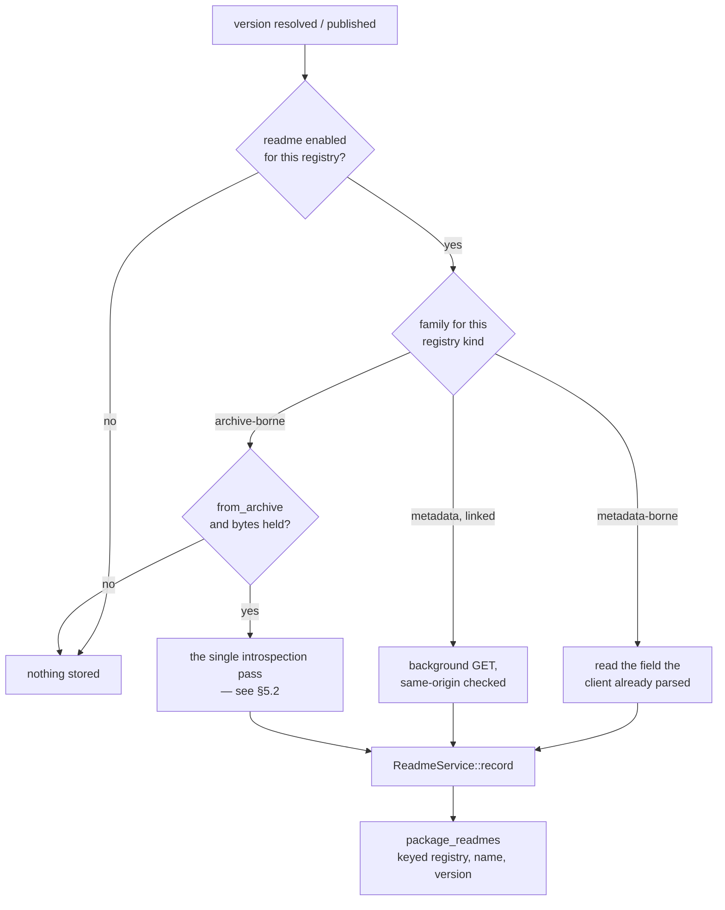
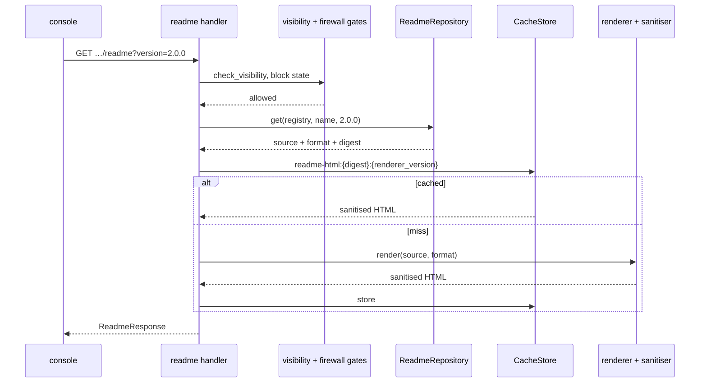

# RFC 0007 — The README, per version, on the page that already has the versions

| Field       | Value                                                        |
| ----------- | ------------------------------------------------------------ |
| Status      | Draft — deferred behind RFC 0009, which found six shipped protocol defects and argues the testing gap that let them ship |
| Author      | Max Batleforc <maxleriche.60@gmail.com>                       |
| Co-author   | —                                                             |
| Created     | 2026-08-15                                                    |
| Supersedes  | —                                                             |
| Complements | RFC 0004-bis §13.1 (single-pass manifest extraction), RFC 0006 (what a blocked version may still show) |
| Touches     | `crates/core`, `crates/adapters`, `crates/config`, `crates/web`, `server`, `ui`, `cli`, docs |

---

## 1. Summary

Every registry BatleHub proxies that has a notion of *a package as a thing a person reads about*
carries a README, and most of them carry a **different one per version** — that is the point of a
README, it describes the code that shipped with it. BatleHub already receives that text on four
separate code paths and throws all four away, then renders a package page that can say what a
version costs, what it depends on and whether it is vulnerable, but not what it *is*.

This RFC stores the README **per `(registry, name, version)`**, from whichever source the registry
type actually has — the metadata document it already fetches, or the artifact it already caches —
renders it to sanitised HTML **on the server**, and puts it on the package detail page under a
version selector, with the CLI able to print the source. Sanitisation is the whole security story
and it is server-side, allow-listed and fuzzed, because the console serves the console's own origin.

### Before / after

```text
# today — four sources arrive, four are discarded

npm publish         body.readme            dropped: npm/write.rs reads `versions` + `_attachments`
cargo publish       metadata.readme        dropped: metadata_to_index_entry → CargoIndexEntry
PyPI  /pypi/…/json  info.description       dropped: PypiVersionJson keeps only `urls`
OpenVSX /api/…/…    files.readme           dropped: OpenVsxFiles keeps download/signature/manifest/icon

GET /api/v1/explore/packages/npm1/express
  versions[]: version, source, firewall, downloads, licence, vulnerabilities, deprecation
  …and nothing that says what the package is

/packages/npm1/express     a versions table, and the reader opens npmjs.com in another tab

# with this RFC

GET /api/v1/explore/packages/{registry}/{name}                 versions[].has_readme
GET /api/v1/explore/packages/{registry}/{name}/readme?version=4.18.2
  { version, requested_version, is_fallback, format, source, truncated,
    rendered_html, source_text, extracted_at }

/packages/npm1/express     README panel below the header, following the selected version,
                           labelled when it is showing a different version's
batlehub package readme npm1/express@4.18.2
```

---

## 2. Motivation

### 2.1 The text arrives and is discarded, on four paths, today

This is not a "we would have to go and fetch it" feature for the majority of the catalogue. Four
paths already have the bytes in hand:

- **`crates/web/src/handlers/proxy/npm/write.rs`** reads `body["versions"]` and
  `body["_attachments"]` out of the publish document and nothing else. npm's publish document
  carries the README at the document root, and per-version in `versions[v].readme`. What is kept as
  `index_metadata` is the version object minus `dist.tarball`; the root is dropped on the floor.
- **`crates/web/src/handlers/proxy/cargo/helpers.rs::metadata_to_index_entry`** narrows the publish
  metadata to a `CargoIndexEntry` — `name`, `vers`, `deps`, `cksum`, `features`, `yanked`, `links`,
  `rust_version`, `v`. Cargo sends `readme` (the full text) and `readme_file` alongside; the
  workspace's own fixture proves it, `crates/web/tests/common/mod.rs` builds a publish payload with
  `"readme": null, "readme_file": null` in it. Neither field has anywhere to go.
- **`crates/adapters/src/registry/pypi/models.rs`** declares `PypiVersionJson { urls }`. The
  document it is deserialised from is `/pypi/{name}/{version}/json`, whose `info.description` *is*
  the long description with `info.description_content_type` naming its markup. Both are per-version
  by construction — a wheel's `METADATA` ships inside the wheel.
- **`crates/adapters/src/registry/openvsx.rs`** declares `OpenVsxFiles { download, signature,
  manifest, icon }`. The upstream returns `readme` in the same object.

Four registry types, four discards, no new upstream contract needed for any of them.

### 2.2 The package page answers every question except the first one

`ExplorePackageDetailResponse` is a rich document: per version it carries source, firewall status,
download count, last access, publication time, pre-release flag, vulnerabilities, licence, socket
badge, deprecation and unlisting. RFC 0004-bis added the licence; RFC 0002 added the advisories.

All of it is *judgement about* a package. None of it is *the package's own account of itself*. A
developer landing on `/packages/npm1/some-internal-lib` — which for an internal package is the only
page that exists anywhere — gets a versions table and no answer to "what is this and how do I call
it". For a proxied public package they open npmjs.com in another tab, which on a deliberately
inward-facing deployment is both the wrong answer and a disclosure of what they are looking at.

### 2.3 A README is a per-version fact, and treating it otherwise is wrong in the direction that hurts

npm's packument carries `readme` per version *and* at the document root; PyPI's description is part
of the version's `METADATA`; a `.crate`, a `.nupkg` and a `.vsix` each contain exactly one README,
theirs. A package whose 2.x README documents an API the 1.x README does not is the normal case, not
an edge case — it is what a major version is.

So "show the README" cannot mean "show *a* README". The store has to be keyed by version from the
start; retrofitting a version key onto a package-level column later means either a migration that
cannot backfill or a page that lies. Where a source genuinely is package-level (npm's root
`readme`), the design has to say which version it is being attributed to and label it, rather than
present a guess as a fact.

### 2.4 The archive is already being read, once, for something else

`ProxyService::maybe_trigger_sbom` spawns a task that pulls the freshly-cached artifact back out of
storage and hands it to `SbomExtractor::extract`, which returns an `ExtractedManifest` — dependencies
*and* licence, together, because RFC 0004-bis established that they come from the same file and
opening the archive twice for two facts is waste.

The README is in that same file, for exactly the same reason. `.crate`, `.nupkg`, `.tgz`, the Go
module `.zip`, a Terraform module tarball, a Composer dist zip — the archive is open, decompressed
and in memory. A README feature that opens it a second time repeats the mistake 0004-bis fixed.

### 2.5 Rendering untrusted markdown is the security question, and it should be answered once

Whatever renders this text is handling attacker-authored input: anyone who can publish to a proxied
upstream can author it, and on a local registry anyone with publish rights can. The rendered result
is displayed on the console origin, to an operator who is very often an admin with a live session.

There is exactly one place that question should be answered, and it should be a place that has unit
tests, a fuzz target and `cargo audit`/`cargo deny` over its dependencies. That is the server. A
markdown renderer plus a DOM sanitiser in the SPA bundle would put the boundary where the fuzz suite
cannot reach it, and would have to be reimplemented for every other client.

---

## 3. Goals / non-goals

**Goals**

- A README is stored, served and displayed **for the version it belongs to**, for every registry
  type that has one, from proxied and locally published versions alike.
- The reader can move between versions and see each version's own README, and is told plainly when
  what they are looking at came from a different version than the one selected.
- Untrusted markup can neither execute nor phone home from the console origin.
- Nothing new is fetched from upstream on a request path; extraction happens where the metadata and
  the bytes already are.
- A registry type with no README has that recorded as a fact the operator can read, not as a blank
  panel that looks like a bug.

**Non-goals**

- **Rendering reStructuredText.** PyPI descriptions may declare `text/x-rst`, and the only faithful
  implementation is docutils. RST is displayed as escaped preformatted source with its declared type
  shown. Guessing at a subset would render some documents subtly wrong, which is worse than plainly
  showing the source.
- **Loading remote images by default.** See §4.4 and §7.3 — this is a decision, not an omission.
- **A README for path-addressed registries** (`deb`, `rpm`, `pacman`, `jetbrains`, `generic`). They
  have no package identity to hang one on; `RegistryKind::is_path_addressed` already names the set.
- **A README for `github`/`gitlab`/`forgejo`.** For those the README is a file the proxy will already
  serve you by path — `/proxy/gh/{owner}/{repo}/raw/main/README.md` is in the setup snippets today.
  Re-fetching and re-rendering it under a second URL would be a second answer to a solved question.
- **Substituting the manifest `description` when there is no README.** A one-line description is not
  a document; putting it where a reader expects one makes every package look like it has thin
  documentation. The description belongs in the page header, which is a separate change.
- **Full-text search over README bodies.** The catalogue's search is over names. Indexing prose is a
  different feature with a different cost profile (open question 2).
- **Editing or overriding a README from the console.** BatleHub reports what the package says.
- **Changelogs, icons, or the rest of the marketplace asset set.** The mechanism generalises; the
  scope here does not.

---

## 4. User-facing design

### 4.1 Configuration

```toml
[registries.readme]
enabled       = true      # store and serve READMEs for this registry
from_archive  = true      # extract from the cached artifact when the metadata carries none
max_bytes     = 262144    # cap on stored source (256 KiB); larger is truncated and flagged
remote_images = "strip"   # "strip" | "proxy"
```

- **Absent block means enabled**, unlike `[registries.sbom]`. For the metadata-borne types the text
  is inside a document the proxy already fetches and parses, so the default costs one deserialised
  field. `from_archive` rides the artifact read that SBOM already performs when SBOM is on, and adds
  one storage read per newly-cached version when it is not — stated here because it is the one part
  of the default that is not free.
- `max_bytes` is a cap on the **stored source**, applied after decompression, at the point of
  extraction. Truncation is recorded (`truncated = true`) and surfaced, never silent.
- `remote_images` takes no `"allow"` value. The SPA's CSP is baked into the document at build time by
  `ui/build/csp.ts` (`img-src 'self' data:`), so a setting that only worked in a custom UI build
  would be a trap: the operator would set it and see broken images with no error anywhere.

### 4.2 Where it appears

**API.** Two changes to the explore surface:

```
GET /api/v1/explore/packages/{registry}/{name}                  → versions[].has_readme: bool
GET /api/v1/explore/packages/{registry}/{name}/readme?version=X&format=html|source|both
```

`ReadmeResponse`:

| Field | Meaning |
| --- | --- |
| `registry`, `name`, `version` | the coordinate the returned text belongs to |
| `requested_version` | what the caller asked for |
| `is_fallback` | `version != requested_version` — the panel labels it |
| `format` | `markdown` \| `html` \| `rst` \| `plain` — what the source *is* |
| `source` | `upstream-metadata` \| `archive` \| `local-publish` — where it came from |
| `truncated` | the source hit `max_bytes` |
| `rendered_html` | sanitised HTML, present unless `format=source` |
| `source_text` | the stored source, present unless `format=html` |
| `extracted_at` | when this instance obtained it |

`has_readme` is on the version DTO rather than requiring a probe per version, so the version selector
can mark which versions have one before anything is fetched.

**Console.** A README panel on `PackageDetailPage.vue`, below the header and above the versions
table, bound to the page's selected version. Selecting a version in the table swaps the panel. When
the selected version has none and a fallback is shown, the panel header says so in words — *"README
from 1.4.2; version 2.0.0-rc1 ships none"* — rather than showing prose that belongs to different code.

**CLI.** `batlehub package readme <registry>/<name>[@version]` prints the source. Markdown in a
terminal is readable; rendering it to ANSI is a separate concern and not in scope.

### 4.3 Where a README comes from, per registry type

Two families, and which one a type belongs to is a property of the *protocol*, not a preference:

- **Metadata-borne** — the text (or a link to it) is in a document the proxy already fetches to
  resolve a version. Available for every version upstream knows about, including versions this
  instance holds no bytes for.
- **Archive-borne** — the text is a file inside the artifact. Available only for versions this
  instance has cached or hosts, which is the honest limit and matches how `license` already behaves.

| Type | Family | Source | Per version |
| --- | --- | --- | --- |
| npm | metadata, archive fallback | `versions[v].readme`; root `readme` attributed to `dist-tags.latest` and labelled; else `README*` in the tarball | yes |
| PyPI | metadata | `info.description` + `info.description_content_type` | yes |
| OpenVSX | metadata (linked) | `files.readme` URL, same-origin checked | yes |
| VS Code Marketplace | metadata (linked) | `Microsoft.VisualStudio.Services.Content.Details` asset | yes |
| JetBrains Marketplace | metadata | plugin `<description>`, `text/html` | yes |
| cargo | archive; local publish | `README*` named by `Cargo.toml [package] readme`; on publish, the `readme` field of the publish metadata | yes |
| NuGet | archive | `.nuspec` `<readme>` → that file inside the `.nupkg` | yes |
| Go | archive | `README*` at the module root of the `.zip` | yes |
| Terraform | archive | `README*` at the root of a module tarball. Providers have none | modules only |
| Composer | archive | `README*` at the root of the dist zip | yes |
| conda | archive | `info/about.json` → `description`, as `text/plain` | yes |
| RubyGems | archive (phase 3) | `README*` in `data.tar.gz`; there is no declared field, so this is a convention match | yes |
| Maven | none | the POM has `<description>`, which is a sentence, not a document | — |
| deb, rpm, pacman, jetbrains, generic | none | path-addressed; no package identity | — |
| GitHub, GitLab, Forgejo | none | the README is a file the proxy already serves by path | — |

The three rightmost rows are not gaps to be closed later; they are the non-goals of §3 written per
type, and `readme_support()` on `RegistryKind` returns them so that the console and the config
validator quote the same list rather than each carrying a copy.

### 4.4 Behaviour rules

- **Version selection.** The panel requests the version the page has selected. The page's initial
  selection is unchanged by this RFC — the first row of the existing sort (stable before
  pre-release, newest first).
- **Fallback.** If the requested version has no README, the response carries the newest version that
  does, with `is_fallback = true`. Fallback never crosses a firewall state: a blocked or unlisted
  version is not eligible as a fallback source.
- **No README anywhere.** `200` with `rendered_html: null` and `source: null` is not used —
  the endpoint returns `404` with a body distinguishing *this package has none stored* from *this
  registry type has none to give* (`readme_support() == None`). The panel renders the second as a
  statement, not an error.
- **Blocked versions.** A version an administrator has blocked serves no README: `403`, carrying the
  same block reason the download path returns. RFC 0006 removes blocked versions from protocol
  listings; the console still shows them to operators with a `Blocked` badge, so `403`-with-reason is
  consistent with both — the operator sees that it exists and why it is refused.
- **Yanked versions** serve their README normally. A yank withdraws a recommendation, not the
  documentation, and the version remains downloadable by exact coordinate.
- **Deprecated / unlisted versions** serve their README. Both remain downloadable.
- **Staleness.** A stored README is refreshed when the version's metadata is re-resolved and the
  extracted text differs. Upstream mutating a published version's README is npm-specific and rare;
  the record carries `extracted_at` so the page can say when it was read.

### 4.5 Validation

`AppConfig::validate()` rejects:

| Condition | Rationale |
| --- | --- |
| `remote_images` not in `{"strip", "proxy"}` | An unrecognised value must not silently become the default; the two behaviours differ in what leaves the network. |
| `max_bytes == 0` with `enabled = true` | Stores nothing while claiming to be on — a configuration that cannot do its job should not start. |
| `max_bytes` > 4 MiB | The value is a row in a transactional store read on a page load. |

Warnings (logged and surfaced to the admin, following `crates/config/src/schema/warnings.rs`):

| Condition | Behaviour |
| --- | --- |
| `enabled = true` on a type whose `readme_support()` is `None` | Accepted and inert. Names the type and says nothing will ever be stored, in the same shape as `LICENSE_GATE_SBOM_DISABLED`. |
| `from_archive = true` on a metadata-borne-only type | Accepted and inert; the archive is never opened for it. |
| `enabled = true`, `from_archive = true`, and the registry is `firewall_only` | `firewall_only` streams without buffering, so no artifact is ever cached to extract from. Metadata-borne sources still work; archive-borne ones never will. |

---

## 5. Architecture

### 5.1 Two families, one store



The invariant the shape protects: **nothing on this diagram runs on a request path.** Metadata-borne
capture happens where `resolve_metadata` already parsed the document; linked and archive-borne
capture happen in the same detached task that SBOM generation already uses. A page view reads one
row and, on a miss in the render cache, runs the renderer — it never reaches upstream.

### 5.2 One pass over the archive, not two

RFC 0004-bis §13.1 made dependencies and licence come back from a single decompression because they
live in the same file. The README lives in the same file again.

`ExtractedManifest` gains a third field, and `SbomExtractor::extract` keeps its signature:

```rust
pub struct ExtractedManifest {
    pub dependencies: Vec<SbomDependency>,
    pub license: Option<String>,
    pub readme: Option<ExtractedReadme>,   // new
}

pub struct ExtractedReadme {
    pub content: String,
    pub format: ReadmeFormat,
    /// The archive-relative path it was read from, for the operator to check.
    pub path: String,
    pub truncated: bool,
}
```

`ProxyService::maybe_trigger_sbom` becomes `maybe_introspect_artifact` and its early return changes
from *SBOM is off* to *SBOM is off **and** README-from-archive is off*. The storage read, the
`collect_byte_stream` and the `extract` call happen once; the results fan out to `SbomService` and
`ReadmeService` independently, each still non-fatal and each still logging its own failure.

This is the one place the RFC changes existing behaviour rather than adding to it, and it is why
`crates/core/src/services/proxy/` tests are named in the test plan as the regression signal.

### 5.3 The read path



**The store keeps the source, not the HTML.** Two reasons, and the second is the one that matters: a
fix to the sanitiser has to apply to everything already stored, and it does — the cache key carries
`renderer_version`, so bumping it invalidates every rendering in one commit with no backfill. The
first is the argument `ExtractedManifest::license` already makes in its doc comment: keeping what the
package actually said, rather than a transformation of it, is what lets an operator check the
transformation.

The render cache is the existing `CacheStore` port, keyed by content digest, so two versions with an
identical README (the common case for a patch release) render once.

### 5.4 What survives what

- A README **survives artifact eviction**. The catalogue is deliberately able to describe versions it
  holds no bytes for — `ResolutionState::Pending` exists for exactly that — and a README panel that
  emptied itself when LRU eviction ran would be inexplicable.
- A README is **deleted with its version**: local delete removes the row, and the package's rows go
  when the package does. Foreign keys and the migration in §6.2 carry this.
- A README is **not part of the cached explore detail payload** (`explore_cache.rs`). The panel
  fetches it separately, so the catalogue cache TTL never holds a stale document and the detail
  response does not grow by a megabyte per package.

---

## 6. Detailed design

### 6.1 `crates/core`

**`src/entities/readme.rs`** (new):

```rust
pub struct PackageReadme {
    pub registry: String,
    pub name: String,
    pub version: String,
    pub content: String,
    pub format: ReadmeFormat,
    pub source: ReadmeSource,
    /// SHA-256 of `content`, the render cache key and the change detector.
    pub digest: String,
    pub truncated: bool,
    pub extracted_at: DateTime<Utc>,
}

pub enum ReadmeFormat { Markdown, Html, Rst, Plain }
pub enum ReadmeSource { UpstreamMetadata, Archive, LocalPublish }
```

**`src/entities/registry_kind.rs`** — `readme_support(&self) -> ReadmeSupport`, returning
`Metadata`, `MetadataLinked`, `Archive`, `MetadataThenArchive` or `None`, exhaustively matched so a
new registry kind cannot be added without answering the question. `RegistryKind::ALL` plus an
exhaustive match is the existing enforcement pattern here (`supports_local_mode`,
`is_path_addressed`), and §4.3's table is generated from it in the docs build.

**`src/ports/readme.rs`** (new) — `ReadmeRepository`: `upsert`, `get(registry, name, version)`,
`get_latest_with_readme(registry, name, exclude_states)` for the fallback, `list_versions_with_readme`
for the `has_readme` flags in one query, `delete_for_version`, `delete_for_package`.

**`src/ports/sbom.rs`** — `ExtractedManifest.readme` as in §5.2; a `README_EXTRACTION_TYPES` constant
beside `LICENSE_EXTRACTION_TYPES`, with the same drift test in `extractor/mod.rs` refusing a type
listed without a parser or a parser added without a listing.

**`src/services/readme/`** (new):

| File | Contents |
| --- | --- |
| `mod.rs` | `ReadmeService`: `record_from_metadata`, `record_from_archive`, `record_from_publish`, `get_for_version` with the fallback rule of §4.4 |
| `render.rs` | `render(source, format, opts) -> String`. CommonMark + GFM tables, strikethrough and task lists via `pulldown-cmark`; `Html` skips straight to the sanitiser; `Rst`/`Plain` are HTML-escaped into a `<pre>` |
| `sanitize.rs` | the allow-list, `id` prefixing, link and image handling — §7.1 and §7.3 |
| `detect.rs` | filename → `ReadmeFormat` (`.md`/`.markdown` → Markdown, `.rst` → Rst, `.html` → Html, else Plain) and `description_content_type` → `ReadmeFormat` |

**`src/services/proxy/resolve.rs`** — `maybe_trigger_sbom` → `maybe_introspect_artifact` (§5.2).

**`src/services/hot_config.rs`** — `ReadmeConfig { enabled, from_archive, max_bytes, remote_images,
registry_type }` and `pub readme: HashMap<String, ReadmeConfig>` on `HotConfig`, mirroring
`SbomConfig` exactly, including carrying `registry_type` for dispatch.

### 6.2 `crates/adapters`

- **`migrations/033_package_readmes.sql`** — `package_readmes(registry, package_name, version,
  content, format, source, digest, truncated, extracted_at)`, primary key on the coordinate, plus a
  `(registry, package_name)` index for the `has_readme` and fallback queries. Add the `mig!` entry to
  `embedded_migrator()`; the `sqlx::migrate!` macro stays unused, per the security constraint.
- **`src/db/readme.rs`** — the `ReadmeRepository` impl. Falls in `COVERAGE_EXCLUDE` with the other DB
  adapters; its behaviour is covered by `tests/pg_readmes.rs` under `task test:pg-readmes`.
- **`src/in_memory/readme_repo.rs`** — the in-memory impl the web tests use.
- **`src/sbom/extractor/`** — each existing parser returns the README alongside what it already
  returns: `cargo.rs` (the file `Cargo.toml`'s `readme` names, defaulting to a root `README*` match),
  `npm.rs`, `nuget.rs` (via the `.nuspec` `<readme>` element), `pypi.rs` (the `METADATA` body, when
  the JSON API was not the source). New: `goproxy.rs`, `composer.rs`, `terraform.rs`, `conda.rs`,
  `rubygems.rs`. Every one of them reads at most `max_bytes` decompressed bytes and refuses an entry
  whose path escapes the archive root.
- **Registry clients** — the four discards of §2.1 stop being discards: `NpmVersionMeta.readme`,
  `PypiVersionJson.info`, `OpenVsxFiles.readme`, and the VS Code Marketplace `Content.Details` asset
  are deserialised and handed to `PackageMetadata::extra` under a `readme` key, which is the existing
  channel for registry-specific fields and needs no signature change to `RegistryClient`.

### 6.3 `crates/config`

`ReadmeConfig` on `RegistryConfig` beside `sbom`, deserialised from `[registries.readme]`, with
`enabled` defaulting to `true` via `default_true` (already in the module). `validate()` gains the
three rejections and three warnings of §4.5; `CURRENT_CONFIG_VERSION` does not move — the block is
additive and its absence is a valid configuration meaning "on".

### 6.4 `crates/web`

- **`src/handlers/front_office/explore/readme.rs`** (new) — the endpoint of §4.2. It runs
  `check_visibility` and returns `404` on refusal, exactly as `detail.rs` does and for the reason
  stated there: a `403` would confirm that a package someone is not allowed to see exists.
- **`src/handlers/front_office/explore/detail.rs`** — `has_readme` on `ExploreVersionDto`, from one
  `list_versions_with_readme` call rather than a lookup per version.
- **`src/lib.rs`** — route registration and the `utoipa` tag. `ReadmeResponse` is a named `ToSchema`
  DTO: `crates/web/tests/openapi_contract.rs` fails a `200` without a `body`, and an untyped response
  here would land in the SPA client as `unknown` and in the docs site's API reference as a blank.
- **Publish handlers** — `npm/write.rs` passes the publish document's root and per-version `readme`
  to `ReadmeService::record_from_publish`; `cargo/publish.rs` passes `meta_json["readme"]` with
  `readme_file` naming its format. Neither changes what goes into `index_metadata`: the README is not
  index data, and widening the index entry would change what package managers receive.

### 6.5 `ui`

- **`src/components/package/ReadmePanel.vue`** (new) — the only component in the console that uses
  `v-html`, containing the sanitised HTML in a scoped-typography wrapper. A vitest asserts that no
  other component in `src/` uses `v-html`, so the boundary stays where it is described.
- **`src/pages/PackageDetailPage.vue`** — the panel, bound to the selected version; the versions
  table marks rows whose `has_readme` is false.
- **`src/locales/{en,fr}.json`** — new keys for the panel header, the fallback sentence, the
  truncation notice, the "this registry type has no README" statement and the stripped-image chip.
  French labels are written from what the panel does, not translated word-for-word from the English;
  `pnpm run i18n:check` stays at zero.
- **`openapi.json` / `src/client/`** — regenerated via `task dump-spec` then `task ui:generate`. Not
  hand-edited.

### 6.6 `cli`

`batlehub package readme <registry>/<name>[@version]`, calling the endpoint with `format=source`.
Covered by `cli/tests/integration.rs` against the in-memory server; note the store separation
documented in `CLAUDE.md` — the CLI test seeds the readme repository directly rather than expecting a
publish through the local-registry endpoint to appear in `AdminService`'s view.

**Deliberately untouched**, so reviewers do not go looking:

- `crates/core/src/services/blocking.rs` — READMEs are not in any protocol listing document, so RFC
  0006's filters have nothing to filter here. The block is enforced at the endpoint (§4.4).
- `crates/core/src/rules/` — a README is not an input to any gate. Reading one is not downloading.
- `artifact_storage_key` and the storage backends — READMEs are metadata and live in the database.
  Nothing new reaches `ensure_safe_key`.
- `crates/web/src/middleware/security_headers.rs` and `ui/build/csp.ts` — the policy is not widened
  by this RFC. That is the whole of §7.3.

---

## 7. Security considerations

This feature takes attacker-authored markup and renders it on the console's own origin, to a session
that is frequently an administrator's. It is the highest-risk surface added since the console
existed, and every decision below is downstream of that.

### 7.1 Cross-site scripting is the risk, and the answer is an allow-list

- **Deny by default.** `ammonia`'s allow-list model over an `html5ever` parse — not a regex, not an
  escape pass. Elements permitted: headings, paragraphs, emphasis, lists, tables, blockquotes, code,
  `hr`, `br`, `a`, `img`, `details`/`summary`. Everything else is dropped, including `script`,
  `iframe`, `object`, `embed`, `form`, `input` and `svg`.
- **`style` goes entirely** — both the `<style>` element and the `style` attribute. CSS is not
  decoration in this threat model: it is the mechanism for overlaying the console's own controls, and
  attribute selectors are an exfiltration channel.
- **URL schemes** are restricted to `http`, `https` and `mailto`. `javascript:`, `data:` and
  `vbscript:` are dropped rather than rewritten.
- **`id` attributes are prefixed** (`readme-`). Unprefixed ids from untrusted markup shadow
  `document.getElementById` and named-access properties on `window` — DOM clobbering — and can
  hijack the page's own anchor targets.
- **Links get `rel="nofollow ugc noopener noreferrer"` and `target="_blank"`**, so a README cannot
  reach back through `window.opener` and cannot lend the instance's reputation to a link farm.
- **Raw HTML inside markdown is not trusted.** `pulldown-cmark` passes it through; it goes to the
  same sanitiser as the `Html` format, on the same allow-list. There is no path from source to output
  that skips `sanitize.rs`, and the fuzz target in §10 exists to keep it that way.
- **A fuzz target** (`fuzz/fuzz_targets/fuzz_readme_render.rs`) asserts the invariant directly: for
  arbitrary input, the output contains no `<script`, no `on*=` attribute, and no non-allow-listed
  scheme.

### 7.2 What an attacker gains, and what they already had

A malicious package already runs code on a developer's machine at install time; that is not changed
here and is what the firewall rules, the release-age gate and the advisories exist to address. What
is genuinely **new** is a path from *publishing text* to *markup in an operator's authenticated
console session*. That is why the sanitiser is server-side, allow-listed, fuzzed, and applied on
read from a stored source rather than once at write — a defect in it is fixable for content already
stored (§5.3).

### 7.3 Remote images are a beacon, and default off

A README's images normally live on third-party hosts. Rendering them means every console page view
sends a request — with a `Referer` — to a host chosen by the package author, announcing that someone
inside this network is reading about this package at this moment. For an inward-facing proxy whose
reason to exist is partly *not* talking to the public internet on every developer action, that is a
regression delivered as a feature.

`remote_images = "strip"` (default) replaces the image with an inline chip carrying its `alt` text
and its host, so the reader can see that an image was there and where it points. `"proxy"` — phase 5,
open question 1 — would fetch through the server, and inherits the SSRF guards of §7.4 plus a size
cap and a decode-safe content-type allow-list. There is no `"allow"`: §4.1.

Data-URI images are also dropped, despite `img-src` permitting them: a data URI in a README is
megabytes of base64 in a database row, and SVG data URIs are script.

### 7.4 Fetching a linked README is an outbound request

OpenVSX and the VS Code Marketplace give a URL, not text. That fetch:

- runs `ensure_same_origin` against the configured registry base URL, the guard `npm.rs` already
  applies to tarball URLs — an upstream that has been compromised or misconfigured cannot use this to
  point BatleHub at an internal host;
- goes through the existing `UpstreamHttpOptions` client with its timeouts and the `ssrf.rs` guards;
- is capped at `max_bytes` with the body read incrementally, not `bytes()`-then-truncate;
- ignores the response `Content-Type` for format detection, using the registry protocol's declared
  format instead — an upstream declaring `text/html` for a document the protocol says is markdown
  should not be able to switch which renderer path runs.

### 7.5 Archive extraction is bounded

Archive-borne extraction is decompression of attacker-controlled input. It reads at most `max_bytes`
decompressed bytes from the single entry it wants, refuses entries whose path escapes the archive
root, and never writes to disk. The artifact was already fully buffered for SBOM extraction, so this
adds no new memory ceiling; `max_artifact_size_bytes` remains the outer bound.

### 7.6 The README is exactly as readable as the package

- **Visibility.** The endpoint calls `check_visibility` and returns `404` on refusal, matching
  `detail.rs`. An `internal` or `team` package's README must not be a side channel around the gate
  that hides its name.
- **Blocked versions** get `403` with the reason (§4.4), matching the download path.
- **Nothing is logged.** README content never appears in a log line or a span field; the extractor
  logs a coordinate, a byte count and a path, never a body.

---

## 8. Alternatives considered

| Alternative | Why rejected |
| --- | --- |
| Render markdown in the SPA (`markdown-it` + `DOMPurify`) | Moves the security boundary into the bundle, where the fuzz target and `cargo deny` cannot reach it; adds two dependencies to the JS audit surface; and every other client — CLI, docs, any API consumer — would need its own renderer and its own bugs. |
| Render into a sandboxed `iframe` | Contains script but not layout or beacons, needs `srcdoc` (a CSP widening) or a second origin to serve from, and gives up the console's typography and theme inside the panel. |
| Store the rendered HTML instead of the source | A sanitiser fix would not reach anything already stored without a backfill, and the operator loses the ability to see what the package actually said — the argument `ExtractedManifest::license` already makes. |
| Store both source and HTML | The HTML is derivable and content-addressed; a second copy in the transactional store is a cache that cannot be invalidated by bumping a key. |
| Fetch the README from upstream on each page view | Turns an authenticated console page into an upstream-request amplifier, gives nothing for versions upstream has removed, and fails entirely on an air-gapped deployment — which is a deployment this product is for. |
| Link out to npmjs.com / crates.io / PyPI | Discloses what is being read, fails when the upstream is unreachable, and answers nothing at all for locally published internal packages, which are the ones with no other documentation anywhere. |
| One `readme` column on `local_packages` | Covers only locally published versions; the proxied majority would have nowhere to live, and the version key would have to be retrofitted onto whatever came next. |
| A package-level README, not per-version | Wrong in the direction that hurts: it shows 2.x's API to someone reading 1.x. §2.3. |
| Show the manifest `description` when no README exists | Puts a sentence where the reader expects a document and makes every package look thinly documented. The description belongs in the header. |
| Widen `img-src` to `*` so images render | Every console page view becomes a beacon to a host the package author chose. §7.3. |
| A separate archive pass for READMEs | Decompresses the same artifact twice for two facts from one file — the exact waste RFC 0004-bis §13.1 removed. |
| Always on, no config | `from_archive` costs a storage read per newly-cached version on registries with SBOM off, and some operators will not want prose from public upstreams stored at all. The metadata-borne default is on precisely because it is free. |

---

## 9. Rollout and compatibility

- **Default behaviour when unconfigured.** `[registries.readme]` absent means enabled with
  `from_archive = true`, `max_bytes = 262144`, `remote_images = "strip"`. On a registry type whose
  `readme_support()` is `None` this is inert.
- **Config migration.** None. The block is additive; `CURRENT_CONFIG_VERSION` stays at 1.
- **Data migration.** `033_package_readmes.sql` creates one table. **There is no backfill**, and this
  is deliberate: backfilling archive-borne READMEs would mean re-reading every cached artifact in the
  store, and backfilling metadata-borne ones would mean re-resolving every known version upstream.
  The table fills as versions are resolved, published and cached. Operators who want it sooner have
  `task warm` — the warming service resolves and caches, and therefore extracts.
- **Operator prerequisites.** None. No new infrastructure, no new outbound host beyond the registry
  upstreams already configured.
- **New dependencies.** `pulldown-cmark` and `ammonia` (with `html5ever`). Both must pass
  `cargo deny check` — advisories, bans, licences and sources — before phase 4 merges; the `[bans]`
  invariants around `rsa`, `sqlx-mysql` and the legacy `rustls` line are unaffected by either, but
  the gate is the check, not this sentence.
- **Rollback.** Drop the config block and the feature is off; the table can be dropped with no effect
  on any other read path, because nothing else reads it. Uninstalling mid-phase is safe at every
  phase boundary.

---

## 10. Test plan

- **Unit** (`crates/core/src/services/readme/`):
  - `sanitize.rs`: a table-driven corpus of the standard vectors — `<script>`, ``,
    `<a href="javascript:">`, `<svg><script>`, `<style>` exfiltration, `<iframe srcdoc>`, an
    unprefixed `id` clobbering a console element id, a `<details>` wrapping raw HTML, an entity-encoded
    scheme, markdown that emits raw HTML. Each asserts the specific removal, not merely "no script".
  - `render.rs`: GFM tables/strikethrough/task lists render; `Rst` and `Plain` come back escaped
    inside `<pre>`; `Html` is sanitised but not re-rendered.
  - `detect.rs`: filename and `description_content_type` mapping, including unknown values → `Plain`.
  - `mod.rs`: the fallback rule — exact hit; fallback to the newest with one; blocked and unlisted
    versions ineligible as fallback; nothing anywhere → the two distinct 404 shapes.
- **Fuzz** (`fuzz/fuzz_targets/fuzz_readme_render.rs`, `task fuzz`): arbitrary bytes through
  `render` + `sanitize`; the output contains no `<script`, no `on*=`, and no scheme outside the
  allow-list.
- **Adapters** (`crates/adapters/src/sbom/extractor/*`): per format, a fixture archive with a README
  at the expected place; the `Cargo.toml`-named path case; a `.nuspec` `<readme>` pointing at a
  nested file; an entry whose path escapes the root is refused; an entry larger than `max_bytes`
  truncates and sets the flag; a non-archive body returns `None` rather than erroring. The
  `README_EXTRACTION_TYPES` drift test in `extractor/mod.rs`.
- **Registry clients**: `mockito` upstreams returning a README field — npm per-version and root,
  PyPI `info.description` with each `description_content_type`, OpenVSX `files.readme` (including a
  cross-origin URL, which must be refused), VS Code Marketplace `Content.Details`.
- **Integration** (`crates/web/tests/package_readmes.rs`, new): two versions with different READMEs
  each return their own; `has_readme` is correct per version in the detail response; the fallback
  response sets `is_fallback` and names the version; an `internal` package's README is `404` for an
  anonymous caller and readable for a member; a blocked version is `403` with the reason; a yanked
  one is `200`; a registry type with no support returns the "none to give" shape; `format=source`
  returns the source unrendered; a stored README containing `<script>` comes back without it through
  the real handler, not only through the unit test.
- **Config** (`crates/config/src/schema/tests.rs`): each rejection and each warning, following the
  `license_gate_without_sbom_enabled_warns_that_nothing_is_extracted` pattern.
- **Postgres** (`crates/adapters/tests/pg_readmes.rs`, `task test:pg-readmes`): upsert replaces,
  delete-for-version and delete-for-package cascade, the `has_readme` query returns one row per
  version.
- **UI** (`ui/src/components/package/ReadmePanel.test.ts`): renders the HTML it is given; switching
  the selected version refetches; the fallback label appears with the source version in it; the
  truncation notice appears; **no component other than this one uses `v-html`** — a repository-wide
  assertion, so the boundary cannot quietly move.
- **CLI** (`cli/tests/integration.rs`): `package readme` prints the source for an explicit version
  and for the default version; unknown coordinate exits non-zero with a readable message.
- **Existing suites that must pass unchanged**: `crates/web/tests/openapi_contract.rs` (the new `200`
  declares a body); the proxy service tests around `maybe_introspect_artifact` — they are the
  regression signal for §5.2, which is the only behavioural change to existing code; `explore_cache`
  tests (the detail payload does not grow); `ui` i18n audit at zero; `task coverage-check` ≥ 80 %.

---

## 11. Decisions and open questions

### Resolved

| # | Question | Decision |
| --- | --- | --- |
| 1 | Per-version or per-package? | **Per-version, keyed by `(registry, name, version)`.** A README describes the code that shipped with it; a package-level store shows 2.x's API to a 1.x reader, and the version key cannot be retrofitted without a migration that cannot backfill. |
| 2 | Render on the server or in the SPA? | **Server.** One implementation for console, CLI and any API consumer; the security boundary lands where the fuzz target, `cargo audit` and `cargo deny` already look. |
| 3 | Store the source or the rendered HTML? | **The source.** A sanitiser fix then applies to everything stored by bumping the render-cache key, and the operator can still see what the package actually said. |
| 4 | Reuse the SBOM archive pass or open the archive again? | **Reuse.** `ExtractedManifest` already returns two facts from one decompression for this exact reason (RFC 0004-bis §13.1); a second pass repeats a mistake already fixed. |
| 5 | Load remote images? | **No, by default.** Every page view would beacon to a host the package author chose, from inside the network. `"proxy"` is the opt-in; there is no `"allow"`, because the SPA's CSP is baked at build time and the setting would silently do nothing. |
| 6 | npm's root `readme` — attribute it to which version? | **The version `dist-tags.latest` names, and label it.** It is package-level in the document, and inventing a per-version claim from it would be a guess presented as a fact. |
| 7 | Blocked versions: serve the README? | **No, `403` with the reason.** It matches the download path, and the console already shows the operator that the version exists with a `Blocked` badge. |
| 8 | Yanked, deprecated, unlisted: serve it? | **Yes.** All three remain downloadable by exact coordinate; withdrawing a recommendation is not withdrawing the documentation. |
| 9 | Render reStructuredText? | **No.** docutils is the only faithful implementation; a partial one renders some documents subtly wrong. Escaped source, with the declared type shown. |
| 10 | Maven: use the POM `<description>`? | **No.** A sentence in the place a reader expects a document makes every package look thinly documented. |
| 11 | Does a README survive artifact eviction? | **Yes.** The catalogue already describes versions it holds no bytes for (`ResolutionState::Pending`); a panel that emptied on LRU eviction would be inexplicable. |
| 12 | Default on or off? | **On**, with `from_archive` on. The metadata-borne path is a field in a document already fetched and parsed; the one non-free part is named in §4.1 rather than hidden in a default. |

### Still open

1. **`remote_images = "proxy"` — phase 5, or never?** It is the only way images render at all, and
   there is real demand for badge rows in READMEs. Against: it makes BatleHub an open-ish image proxy
   for whatever a package author writes, and the SSRF surface has to be exactly right. Recommendation:
   phase 5, opt-in, with the fetch confined to the same `ssrf.rs` guards as upstream fetches, a hard
   size cap, an image-type allow-list that excludes SVG, and a cache. If phase 5 does not land, the
   chip in §7.3 is a complete answer to "was there an image and where did it point".
2. **Should README text feed the catalogue's search?** It would make "which internal package does
   X" answerable, which nothing currently answers. Against: a full-text index over prose is a
   different storage and ranking problem, and the search box currently promises name matching.
   Recommendation: no, and revisit as its own RFC if asked for.
3. **RubyGems convention matching.** There is no declared README field in a gemspec, so §4.3's
   RubyGems row is a filename convention over `data.tar.gz` — a double untar for a guess.
   Recommendation: phase 3, and drop the row if the fixture work shows the hit rate is poor.
4. **Refresh policy for a mutated upstream README.** §4.4 refreshes when metadata is re-resolved and
   the digest differs. npm permits this; most registries do not. Recommendation: keep it, and record
   nothing about the previous text — this is a cache of what upstream says, not an audit log of what
   it used to say. Reviewers who disagree should say so now, because adding history later is a
   schema change.

---

## 12. Implementation phases

Each phase leaves the tree green — builds, clippy clean, tests pass — and phases 1 and 2 are useful
on their own even if nothing after them lands.

| Phase | Content |
| --- | --- |
| 1 | The store. `PackageReadme`, `ReadmeFormat`, `ReadmeSource`, `ReadmeRepository`, `RegistryKind::readme_support()`, migration `033`, the Postgres and in-memory adapters, `ReadmeConfig` in config and `HotConfig`, `AppConfig::validate()` rules. No reader, no writer — nothing user-visible yet. |
| 2 | The four discards of §2.1 stop being discards: npm (metadata + publish), cargo (publish), PyPI, OpenVSX. `ReadmeService::record_from_metadata` / `record_from_publish`. Still no reader — verified by tests against the repository. |
| 3 | Archive-borne extraction. `ExtractedManifest.readme`, `maybe_trigger_sbom` → `maybe_introspect_artifact`, extractors for cargo, npm, NuGet, PyPI, Go, Composer, Terraform, conda, and RubyGems subject to open question 3. |
| 4 | Render and sanitise. `render.rs`, `sanitize.rs`, `detect.rs`, the render cache, the fuzz target, `pulldown-cmark` + `ammonia` through `cargo deny`. Pure library work with no HTTP surface — reviewable on its own, which is the point for the one component whose defects are exploitable. |
| 5 | The API: the readme endpoint, `has_readme` on the version DTO, `openapi.json` and the generated client. Optionally `remote_images = "proxy"` (open question 1). |
| 6 | The console: `ReadmePanel.vue`, the detail page binding, the versions-table marks, `en`/`fr` locales, the no-other-`v-html` assertion. |
| 7 | `batlehub package readme`, and docs: the per-type support table in `docs/registries/` generated from `readme_support()`, the config block documented in `docs/guide/`, and this RFC's status moved to Implemented. |
