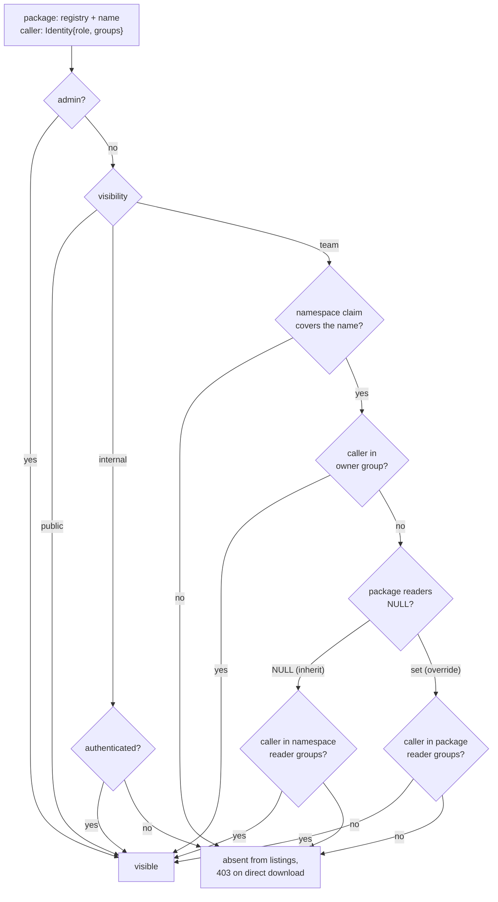

# RFC 0011-bis — Namespace-scoped package visibility

| Field      | Value                                                                  |
| ---------- | ---------------------------------------------------------------------- |
| Status     | **Superseded by 0015** — [RFC 0015](/rfc/0015-grants-on-the-resource-hierarchy) §9.1 proposed absorbing this document on acceptance; it is Implemented, so the absorption is done. Two of the three gaps landed with it: the per-ecosystem separator (§4.2) was carried over unchanged and is `namespace_separator` in `crates/core/src/entities/grant.rs`, and reader groups (§4.3) were taken by requirement rather than by spelling — the set became grant subjects and the empty-override case became `Visibility::Private`. **The third did not.** Groups on a PAT (§4.4, phase 1) is still unbuilt: `UserToken` carries no groups and `UserTokenAuthProvider` resolves every token to `groups: vec![]`, so 0015's `group:` subjects never match a PAT and `pat_is_within_owner` — the invariant check 0015 built for it — can only ever compare against an empty set. It is not a proposal awaiting review; it is a gap in a shipped feature, tracked on the roadmap under Authentication providers. §8's two open questions go with it: the PAT TTL policy is now live, group nesting stays flat |
| Short      | Namespace-scoped visibility |
| Settles    | Making a team's packages visible to that team and to the groups it grants read to: a namespace separator per ecosystem, reader groups with a per-package override, and groups on a PAT |
| Author     | batleforc                                                              |
| Co-author  | —                                                                      |
| Created    | 2026-08-20                                                             |
| Supersedes | —                                                                      |
| Touches    | `crates/core` (visibility resolution, namespace separator), `crates/adapters` (namespace matcher, SQL predicate, PAT groups, migration), `crates/web` (readers API), `ui/` (readers controls), docs |

---

## 1. Summary

An extension published under a team's namespace should be listed, searchable and downloadable by that team, by the groups that team grants read to, and by nobody else. Today it cannot be: a namespace claim on `digital` never matches `digital.pipeline-tools`, a namespace grants read to exactly one group, and a PAT identity carries no groups at all.

This RFC closes those three gaps in the visibility model that every Batlehub ecosystem already shares. It is **not** about how a caller authenticates — that is [RFC 0011](/rfc/0011-openvsx-login), which produces the credential this model reads. The two were drafted as one document and split because they are independently reviewable and independently shippable: everything here is testable through `ovsx` and `curl`, with no editor involved.

### Before / after

```
# today
Visibility::{Public,Internal,Team} is enforced on download and mirrored in the
SQL listing predicate — but "team" means exactly one owner group, and for a
VSX registry the namespace claim never matches a `publisher.name` id at all.
Sharing with two teams means `internal`: everyone with an account.

# with this RFC
A namespace grants read to a set of groups, and a package may override that set
— including with the empty set, to stay private inside a shared namespace.
The claim matcher knows each ecosystem's separator, so `digital` covers
`digital.pipeline-tools`. A PAT carries its creator's groups, so automation
sees what its owner sees.
```

---

## 2. Motivation

1. **A single tenant is not the deployment.** The estate has teams with proprietary extensions (`digital`, `sales`) and teams that publish for everyone or for a named subset (`ops`). An authenticated-but-flat registry answers "may you read the catalogue", when the question is "which packages are yours". Without per-namespace visibility, authentication only moves the leak from anonymous to any-employee: every package of every team stays readable by every other team.
2. **The mechanism already exists — for every ecosystem but this one.** `Visibility::{Public,Internal,Team}` (`crates/core/src/entities/local_package.rs`), team namespace claims (`crates/core/src/entities/team_namespace.rs`), the download gate `check_visibility`, and the SQL listing predicate `LOCAL_VISIBILITY_PREDICATE` are shipped and tested. The VSX gallery already threads the caller's `Identity` into search and skips packages the caller may not see. What is missing is three concrete gaps (§4.1), not a new subsystem.
3. **Sharing has exactly two shapes today, and neither is the one teams want.** `team` is one group; `internal` is everyone with an account. "These two teams and not the contractors" is unrepresentable, so operators reach for `internal` and the distinction stops meaning anything.
4. **A listing that disagrees with a download gate is the failure this codebase already documents.** `LOCAL_VISIBILITY_PREDICATE` carries an explicit warning about it. Adding a second, extension-specific authorization model would create exactly that divergence on purpose.

---

## 3. Goals / non-goals

**Goals**

- **Namespace-scoped visibility**: a package published under a team's namespace is listed, searchable, and downloadable only by that team, plus any group the namespace or the package explicitly grants read to.
- **Filtering server-side, in the documents every UI renders from**: the editor's native Extensions view, the OpenVSX REST documents, the CLI and the Batlehub catalogue all show the same thing — what the caller may see — because none of them does the filtering itself.
- One authorization model, shared with the download gate and the SQL listing predicate, extended rather than duplicated.
- Inert by default: an estate that sets no grants behaves exactly as it does today.

**Non-goals**

- **Per-*version* visibility.** Visibility is a property of the package name and applies to all versions at once, as `TeamNamespacePort` already documents. Withdrawing one version is yank/block, not visibility.
- **Per-*user* grants.** Grants name auth-provider groups, never individuals. A one-person grant is a one-person group at the IDP.
- **Visibility on proxied upstream packages.** Only locally published packages carry a visibility row; a package mirrored from open-vsx.org or crates.io is public upstream, and pretending otherwise would be theatre. Registry-level RBAC remains the gate there.
- **Client-side filtering as a security boundary.** A client may sort and group, but it never receives an entry it is expected to hide.
- **How the caller authenticates.** [RFC 0011](/rfc/0011-openvsx-login) owns credential acquisition; this RFC starts from an `Identity` that already carries groups.

---

## 4. Design

The requirement, stated as the estate states it:

> Team `digital` has extensions proprietary to `digital`. Team `sales` likewise.
> Team `ops` publishes extensions it wants `digital` and `sales` to have.
> Everyone sees exactly their own set, in their own editor, without knowing the
> others exist.

### 4.1 What is already there, and the three gaps

Reusing the platform's existing model is not an economy measure: a second authorization model is a second model to keep in agreement with the download gate, and the codebase already carries an explicit warning about what happens when a listing filter and a download gate disagree (`LOCAL_VISIBILITY_PREDICATE`, `crates/adapters/src/db/packages/mod.rs`).

| Already shipped | Where |
| --- | --- |
| `Visibility::{Public,Internal,Team}` per package name | `crates/core/src/entities/local_package.rs` |
| Namespace claim: `(registry, prefix) → group_id` | `crates/core/src/entities/team_namespace.rs`, admin UI `ui/src/pages/AdminTeamNamespaces.vue` |
| Download gate `check_visibility` / `check_team_visibility` | `crates/core/src/services/local_registry/` |
| Listing filter mirroring the gate in SQL | `LOCAL_VISIBILITY_PREDICATE` |
| Catalogue-side viewer (`is_admin`, `is_authenticated`, `groups`) | `ExploreViewer`, `crates/core/src/entities/explore.rs` |
| Gallery search already skips what the caller may not see | `get_openvsx_extensions`, `crates/core/src/services/local_registry/eco_openvsx.rs` |

Three gaps stand between that and the requirement. Each is small and each is load-bearing:

**G1 — PAT identities carry no groups.** `UserTokenAuthProvider` returns `groups: vec![]` (`crates/adapters/src/auth/user_token.rs`), and `UserToken` (`crates/core/src/ports/auth/user_token_repo.rs`) stores `user_id` and `role` only. A `digital` developer whose editor authenticates with a PAT is denied every `team` package, *including their own*. Fixed in §4.4.

**G2 — the namespace matcher is slash-delimited.** The claim matcher is `package == prefix || package.starts_with("{prefix}/")`, mirrored in SQL as `SUBSTRING(name, 1, LENGTH(prefix)+1) = prefix || '/'`. Extension ids are `publisher.name`: a claim on `digital` never matches `digital.pipeline-tools`. Today, namespace-scoped extensions are not merely unimplemented — they are unrepresentable. Fixed in §4.2.

**G3 — a namespace grants read to exactly one group.** `TeamNamespace.group_id` is a single group, so `ops` shares with everyone (`internal`) or with nobody. Fixed in §4.3.

### 4.2 The namespace of a package, per ecosystem

For an extension the namespace is the publisher segment of the id: `digital.pipeline-tools` → `digital`. It is the same string the OpenVSX API already exposes at `GET /api/{namespace}` and the same one `ovsx` checks before publishing, so nothing new is asked of publishers.

Each `RegistryKind` declares its namespace separator — `/` for the ecosystems that have one today, `.` for `openvsx` and `vscode-marketplace`. The matcher becomes:

```
package == prefix  ||  package.starts_with(prefix + separator)
```

Two constraints carry over from the existing implementation and must survive the change:

- **The SQL predicate is edited in the same commit as the Rust matcher.** They are compared character for character today; a separator threaded into one and not the other makes the listing more permissive than the download gate, which is precisely the leak the predicate exists to close.
- **The separator is compared literally, never as a pattern.** `SUBSTRING(...) = prefix || separator`, not `LIKE`. A `.` in a `LIKE` is harmless, but the rule that kept `%` and `_` literal is the rule that keeps this correct as separators multiply.

Longest prefix still wins outright, including across separators.

### 4.3 Grants: namespace default, per-package override

`Visibility::Team` stops meaning "the owning group" and starts meaning "the resolved reader set", which is the owning group plus grants:

- **Namespace default** — `team_namespaces` gains `reader_groups text[] NOT NULL DEFAULT '{}'`. `ops` claims `ops` and sets readers `{digital, sales}`.
- **Per-package override** — `local_packages` gains `reader_groups text[] NULL`. `NULL` means *inherit the namespace default*; a non-NULL value *replaces* it.

The distinction between `NULL` and `{}` is the whole point of having both, and it is the part an implementation gets wrong quietly: **`NULL` inherits, `{}` overrides with nothing** — owner group only, even when the namespace shares widely. `ops` can therefore keep one package to itself inside a namespace it otherwise shares, which is why the override exists. The API takes `{"readers": null}` and `{"readers": []}` as different requests, and the UI shows *Inherited from `ops` (digital, sales)* versus *Owner only (override)* as different states, with an explicit "reset to inherited" action rather than a `[]` that looks like a clear.

Resolution for one package and one caller, in order — first match wins:

1. `is_admin` → visible. (Unchanged; admins bypass visibility everywhere today.)
2. `visibility = public` → visible, including anonymously.
3. `visibility = internal` → visible to any authenticated identity.
4. `visibility = team`:
   a. no namespace claim covers the name → **denied**. Unchanged, and deliberate: falling back to "any authenticated user" when a claim is missing or deleted is how a team-private package becomes readable estate-wide.
   b. caller is in the owner group → visible.
   c. caller is in the effective reader set (override if non-NULL, else namespace default) → visible.
   d. otherwise → denied.



**A reader list holds literal group ids and nothing else.** There is no wildcard, no `*`, no `@authenticated` — "everyone with an account" is `Visibility::Internal`, which already means exactly that (§8 decision 7). A reserved token would add a second rule inside both the Rust comparison and the SQL predicate, in the one place this design depends on the two staying identical, and it would misfire the day an IDP emits a group actually called `*`. Entries are matched by equality after space-stripping; §5 warns when a list contains something wildcard-shaped, so an admin who tries it finds out at write time rather than from an access review.

Write access — publish, yank, visibility and grant edits — stays with the owner group and admins. **Reader grants never confer write.** `require_admin_or_namespace_member` (`crates/web/src/handlers/back_office/visibility.rs`) keeps comparing against `group_id` alone; adding readers there is the one-character mistake that would let `digital` yank an `ops` package.

### 4.4 Groups on a PAT

`UserToken` gains `groups text[]`, snapshotted from the creator's own `Identity.groups` at creation and capped to a subset of them — a PAT cannot grant its creator groups they do not have, and `--all-groups` is sugar for "all of mine, now".

The snapshot is a deliberate trade against re-resolving groups per request:

- **For it**: no IDP round-trip on a hot path (a gallery `extensionquery` runs on every editor start), no dependence on the IDP being reachable while an artifact streams, and it is the only option that works at all — a PAT has no refresh token and no session, so there is nothing to re-resolve *from*.
- **Against it**: a developer who leaves `digital` keeps reading `digital` packages until the PAT expires or is revoked.
- **Therefore**: PAT TTL is capped (§8, open question 1 — this makes the cap a security control, not a hygiene preference), the token's groups are shown wherever the token is shown (creation output, `TokensPage.vue`, admin listing), and offboarding revokes tokens. OIDC access tokens, which re-resolve groups on every refresh, stay the recommended posture for interactive users; PATs are for automation.

Group comparison is space-stripped on both sides, matching `check_team_visibility` and `ExploreViewer::normalised_groups` — one normalisation rule, applied everywhere, including the new reader-set comparison.

**A grant names the group id the provider actually emits, which is not always the one the operator has in mind.** `KubernetesAuthProvider::resolve_groups` (`crates/adapters/src/auth/kubernetes.rs`) keeps a Kubernetes group as-is when it appears in `role_mappings` and otherwise **prefixes it with the provider name** — so `system:serviceaccounts:digital` from a provider named `k8s` reaches this model as `k8s:system:serviceaccounts:digital`. The prefix exists to stop one provider's group names colliding with another's, and it is the string a reader list must contain. Writing the unprefixed form produces the §5 warning about a group no auth rule has emitted, and no access: the right failure, and an easy one to spend an afternoon on. `batlehub auth whoami` prints the groups as resolved, which is the reliable way to author a grant.

### 4.5 Where the filtering happens

In the entry builders that already receive the caller's identity and are already the single place documents are produced — for the gallery, `source::search_entries` and `source::extension_entry` (`crates/web/src/handlers/proxy/vsx/`). Every surface renders from them:

| Surface | Gets filtering because |
| --- | --- |
| Native Extensions view in an editor | `extensionquery` responses are built from filtered entries |
| `ovsx` / OpenVSX REST (`/api/-/search`, `/api/{namespace}`) | Built from the same entry list — the module already guarantees a version cannot be visible through one route and hidden in another |
| Batlehub catalogue and package detail | `ExploreViewer` + `LOCAL_VISIBILITY_PREDICATE`, unchanged apart from reader groups |
| CLI `package list`, `registry show` | Same server-side documents |

**Hidden means absent, not forbidden.** A listing, search, or namespace document omits what the caller may not see, exactly as `get_openvsx_extensions` already does (`AccessDenied → continue`) and as RFC 0006 established for blocked versions. An editor that receives a `403` from a search blanks its whole extension list; an editor that receives a shorter list renders it. A namespace document whose packages are all invisible to the caller is a `404`, not an empty document — an empty `digital` namespace confirms that `digital` exists.

**Direct download by exact coordinate keeps returning `403`** via `check_visibility` — today's behaviour, unchanged (§8 decision 6). Absence is the right answer where enumeration is cheap, which is listings; a caller who already holds `digital.pipeline-tools` learns nothing from a `403` that they did not have to know to ask. The two rules are not in tension, they answer two different questions, and keeping the download gate untouched keeps every other ecosystem's behaviour untouched with it.

### 4.6 The estate, worked through

| Extension | Namespace / visibility | Grants | `digital` dev | `sales` dev | `ops` dev | anonymous |
| --- | --- | --- | --- | --- | --- | --- |
| `digital.pipeline-tools` | `digital` / team | — (inherit `{}`) | visible | absent | absent | absent |
| `sales.crm-snippets` | `sales` / team | — | absent | visible | absent | absent |
| `ops.k8s-helper` | `ops` / team | ns readers `{digital, sales}` | visible | visible | visible | absent |
| `ops.incident-runbook` | `ops` / team | override `{}` | absent | absent | visible | absent |
| `ops.editor-theme` | `ops` / internal | — | visible | visible | visible | absent |
| `redhat.java` (proxied) | upstream | n/a | visible | visible | visible | per registry RBAC |

Three developers, one gallery URL, three different Extensions views. None of them ran a filter.

---

## 5. Validation

`AppConfig::validate()` rejects:

| Condition | Rationale |
| --------- | --------- |
| A registry declares a namespace separator that is not a single ASCII character | The matcher and the SQL predicate must agree character for character (§4.2); anything else is a divergence waiting to happen |

Warnings (logged and surfaced to the admin):

| Condition | Behaviour |
| --------- | --------- |
| Reader groups set on a `public` or `internal` package | Warn: the grant is stored but inert until visibility is `team`. Silently accepting it is how an admin concludes a package is restricted when it is not |
| A namespace's reader list contains its own owner group | Warn and store as-is; it is redundant, not wrong |
| A grant names a group no auth rule has ever emitted | Warn only. Groups are provider-defined and a team's first member may not have logged in yet — the same reason namespace claims accept unseen groups today |
| A reader list contains `*`, `@authenticated`, `all` or another wildcard-shaped entry | Warn: it is stored and matched as a literal group id, because there are no wildcards (§4.3). The admin meant `internal` visibility, and this is the moment to say so — the alternative is discovering it during an access review |
| PAT created without TTL | Warn at creation time; PAT is valid but flagged in the admin listing |

---

## 6. Detailed design

- **`crates/core`** — one resolution function implementing §4.3, called by `check_visibility` and by the entry builders. `RegistryKind::namespace_separator()` (default `/`, `.` for `openvsx`/`vscode-marketplace`) with a drift test asserting every variant declares one, in the shape of the existing `warm_artifact` drift guard. `TeamNamespace` gains `reader_groups`, `PublishedPackage`/`NamespacePackage` gain `reader_groups: Option<Vec<String>>`.
- **`crates/adapters`** — migration adding `team_namespaces.reader_groups text[] NOT NULL DEFAULT '{}'` and `local_packages.reader_groups text[] NULL` (new `mig!` entry, sequence incremented); `find_namespace` matcher takes the separator; `LOCAL_VISIBILITY_PREDICATE` gains the reader-set arms and the separator, edited in the same commit as the matcher (§4.2); `UserTokenAuthProvider` returns the token's stored groups instead of `vec![]`, and `create_token` takes and caps them.
- **`crates/web`** — `PUT/GET /api/v1/admin/registries/{registry}/namespaces/{prefix}/readers` and `…/packages/{name:.*}/readers`, both behind the existing `require_admin_or_namespace_member` (owner group or admin — **not** readers). `VisibilityResponse` grows `readers: Vec<String>` and `readers_source: "inherited" | "override"` so the console never has to infer which it is looking at. Both writes emit an audit event alongside the existing `AccessAction::SetVisibility`.
- **`ui/`** — group multi-select on `AdminTeamNamespaces.vue`; a readers control on the package detail/admin package view with the three states of §4.3 (inherited / override / owner-only) and an explicit reset; the same control on `MyNamespace.vue` for owners who are not admins. Labels name the behaviour, not the schema: *Who can see this* over *reader_groups*.
- **`cli/`** — `batlehub ns readers <registry>/<prefix> [--set <g1,g2>]` and `batlehub pkg readers <registry>/<name> [--set <g1,g2> | --inherit]`; `auth token create` gains `[--groups <g1,g2> | --all-groups]` and shows the snapshot in its output.

**Deliberately untouched**, so reviewers do not go looking:

- The download gate's `403`. Only listings change (§4.5).
- Write authorization. Readers appear in no write path.
- Anonymous read on any registry. A namespace with `reader_groups = '{}'` resolves exactly as it does today, in every ecosystem.

---

## 7. Security considerations

- **Listing and download must not disagree.** The SQL predicate and the Rust gate are compared character for character today, and the reader-set arms and the namespace separator are added to both or to neither. A listing more permissive than the gate leaks names, publishers and version counts of packages the same caller would be `403`'d for — a directory of what other teams are building, which is the exact failure mode namespace scoping exists to prevent.
- **Absence is the denial signal in listings; `403` remains the denial signal on download.** `404` on a namespace document with nothing visible and omission in search, because a `403` there distinguishes "exists but not yours" from "does not exist" across a space the caller can sweep. On a direct download the caller supplied the coordinate, so `403` discloses nothing they did not already hold, and the shared gate stays untouched.
- **Reader grants are read-only by construction.** Write authorization keeps comparing against the owner group alone; readers appear in no write path.
- **A PAT is a group snapshot, so its TTL is an access-control lifetime.** Group membership on a PAT does not follow the IDP; a capped TTL plus revocation is what bounds a stale grant. This is the argument for the hard cap in §8 open question 1 and against non-expiring PATs.
- **A missing claim denies.** When a namespace claim is deleted, `team` packages under it become invisible to everyone but admins, rather than falling back to `internal`. Denying on absence is the only safe direction here, and it is also a way to lock a team out of its own packages by deleting a claim — the audit event on claim deletion is what makes that diagnosable.

---

## 8. Decisions and open questions

### Resolved

| # | Question | Decision |
| --- | -------- | -------- |
| 1 | Scope of authorization: all-or-nothing read vs per-namespace visibility | **Per-namespace.** Authentication alone leaves every team's proprietary packages readable by every other team. |
| 2 | New ACL model vs the shipped `Visibility` + namespace model | **Reuse the shipped model.** A second model is a second thing to keep in agreement with the download gate and the SQL listing predicate. |
| 3 | Grant granularity | **Both**: namespace default (`team_namespaces.reader_groups`) with a per-package override (`local_packages.reader_groups`, `NULL` = inherit). Namespace-only cannot express "one private package in a shared namespace"; package-only makes grants drift within a namespace. |
| 4 | Where filtering happens | **Server-side, in the entry builders every protocol renders from.** No client filters; clients receive only what the caller may see. |
| 5 | How a PAT gets groups | **Snapshot at creation**, capped to the creator's own groups. A PAT has no session to re-resolve from; the cost is staleness, bounded by TTL and revocation. |
| 6 | Direct download of a `team` package by a non-member: `403` or `404` | **`403`**, keeping today's `check_visibility` behaviour. The caller already holds the exact coordinate, so the existence oracle is weak; changing it means touching a gate every ecosystem shares, to hide something the requester already knew. Listings stay on absence (§4.5). |
| 7 | "Share with all authenticated users": reserved group token in a reader list, or `internal` visibility | **`internal`.** One way to say a thing. A reserved token (`*`, `@authenticated`) would put a second, invisible rule inside the reader-set comparison and inside the SQL predicate, and would collide the day a real IDP group is named the same. |
| 8 | Scope of this RFC vs RFC 0011 | **Split.** Credential acquisition is [RFC 0011](/rfc/0011-openvsx-login); this document starts from an `Identity` with groups and is testable through `ovsx` and `curl` with no editor involved. They were one document; the visibility half touches every ecosystem and the credential half touches none. |

### Still open

1. PAT policy: maximum TTL and whether expiry is mandatory. Now an access-control question, not hygiene (§4.4): the TTL bounds how long a stale group snapshot grants read. Recommendation: default 90 days, hard cap 1 year, no non-expiring PATs.
2. Group nesting/transitivity: grants match flat group ids as the IDP emits them. If the IDP nests groups, expansion is the IDP's job. Recommendation: leave flat, revisit only if a deployment needs it.

---

## 9. Alternatives considered

| Alternative | Why rejected |
| ----------- | ------------ |
| One registry per team (`vsx-digital`, `vsx-sales`, …), registry-level RBAC only | Works, and is what an operator does today by hand. Every editor points at exactly one gallery URL, so a developer in two teams cannot see both; `ops`-shared packages must be published N times; and the registry count grows with the org chart |
| A separate ACL model for extensions | A second authorization model to hold in agreement with `check_visibility` and the SQL predicate. The known failure of two models is the listing/download divergence the existing predicate documents at length |
| Namespace reader groups only, no per-package override | Simpler schema and one lookup. Rejected: `ops` cannot keep a single package private inside a namespace it shares, so the workaround is a second namespace per sharing shape |
| Per-package grants only, no namespace default | Maximum flexibility, but every new package starts ungranted and sharing is re-declared per publish — grants drift apart within a namespace and nobody notices until someone cannot install |
| A shared-with-everyone visibility instead of grants (`internal` for `ops`) | Covers "share with all" and nothing else; `ops` sharing with `digital` and `sales` but not with contractors is unrepresentable |
| Keeping this inside RFC 0011 | Two independently shippable changes behind one review, one of which touches every ecosystem's SQL predicate and one of which touches none of it |

---

## 10. Rollout and compatibility

- **Inert by default**: `team_namespaces.reader_groups` defaults to `'{}'` and `local_packages.reader_groups` to `NULL`, so every existing package resolves exactly as it does today — `team` means owner group, in every ecosystem, until an operator grants otherwise.
- **Namespace separator change is not inert** and deserves its own line in review: a `digital` claim in a VSX registry starts matching `digital.*`, where before it matched nothing. Packages already published as `team` under such a namespace become visible to the owner group — which is the intent, and is still a widening. Audit existing VSX namespace claims before rollout.
- **Existing PATs** carry an empty group snapshot and therefore lose no access they had (they had none: PAT identities have never carried groups); a user who needs their PAT to reach team packages re-creates it. Say so in the release notes rather than letting it be discovered.
- **Rollback**: clear the reader groups (a grant nobody holds denies nobody extra) or revert the migration; the separator revert returns the matcher to `/`-only, which restores today's deny-everything behaviour for dotted ids.

---

## 11. Test plan

- **Unit** (`crates/core`): the resolution table of §4.3 exhaustively — admin bypass, `public` anonymous, `internal` authenticated, owner group, inherited readers, override readers, **`NULL` inherits vs `{}` denies**, missing claim denies, space-stripped group comparison. Separator drift test: every `RegistryKind` declares one; `openvsx`/`vscode-marketplace` declare `.`.
- **Unit** (`crates/adapters`): `find_namespace` matches `digital.pipeline-tools` for a `digital` claim in a VSX registry and does **not** match it in a slash-separator registry; longest prefix still wins; `%` and `_` in a prefix stay literal.
- **Equivalence** (`crates/adapters`, Postgres): the SQL predicate and the Rust gate agree on a fixture covering every row of §4.6 for every caller — the listing must never be more permissive than the download gate. This is the test that fails if only one of the two is edited.
- **Unit** (`crates/core`): a reader list containing `*` grants read to a group literally named `*` and to nobody else — the no-wildcard rule of §4.3, asserted rather than assumed, in the Rust gate and in the SQL predicate alike.
- **Unit** (`crates/adapters`): PAT groups round-trip through creation; a PAT cannot be created with a group its creator lacks; a groups-less PAT sees `public`/`internal` only.
- **Integration** (`crates/web`, new `local_openvsx_visibility.rs`): the §4.6 estate published once, then queried as `digital`, `sales`, `ops`, an authenticated no-group user, and anonymously — through `extensionquery`, `/api/-/search`, `/api/{namespace}` and the direct download route. Asserts the exact visible sets, that a hidden package is **absent rather than 403** in every listing, that `/api/digital` is `404` for `sales`, and that direct download is `403`.
- **Integration** (`crates/web`): a reader-group member cannot yank, delete, set visibility, or edit grants on the package they can read — the read/write split of §4.3.
- **Real client** (per the project's standing practice that route tests are not client tests): `ovsx get ops.k8s-helper` succeeds as `digital` and fails as a contractor, and `ovsx search` returns exactly the expected set for each of the three developers. No editor is required to prove this RFC.
- **Existing suites** that must pass unchanged: the full existing visibility/namespace suites with no reader groups set — proves the grant model is inert until used, in every ecosystem.

---

## 12. Implementation phases

| Phase | Content |
| ----- | ------- |
| 1 | PAT group snapshot (G1): `UserToken.groups`, `create_token` capping, `UserTokenAuthProvider` returning them, CLI flags. Independently useful — it is what makes any automation see its owner's packages. |
| 2 | Namespace separator per `RegistryKind` (G2): matcher and SQL predicate **in one commit**, with the equivalence test. |
| 3 | Reader groups (G3): migration, resolution function, readers API, audit events. |
| 4 | `ui/`: readers multi-select on `AdminTeamNamespaces.vue`, per-package override control with the inherited/override/owner-only states, owner-facing control on `MyNamespace.vue`, PAT groups on `TokensPage.vue`. |
