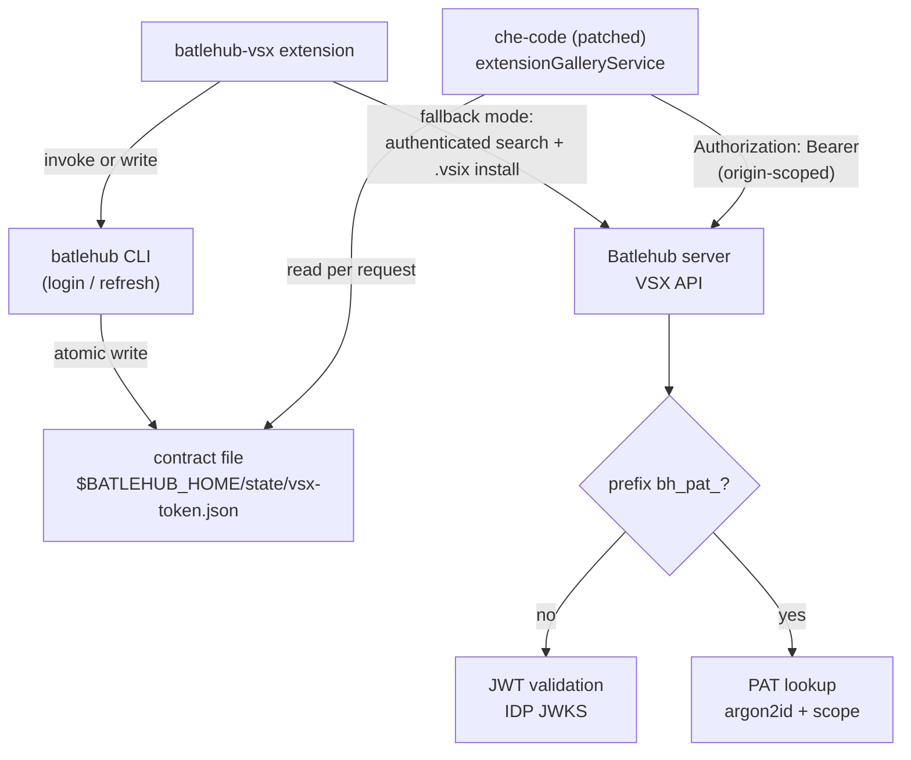
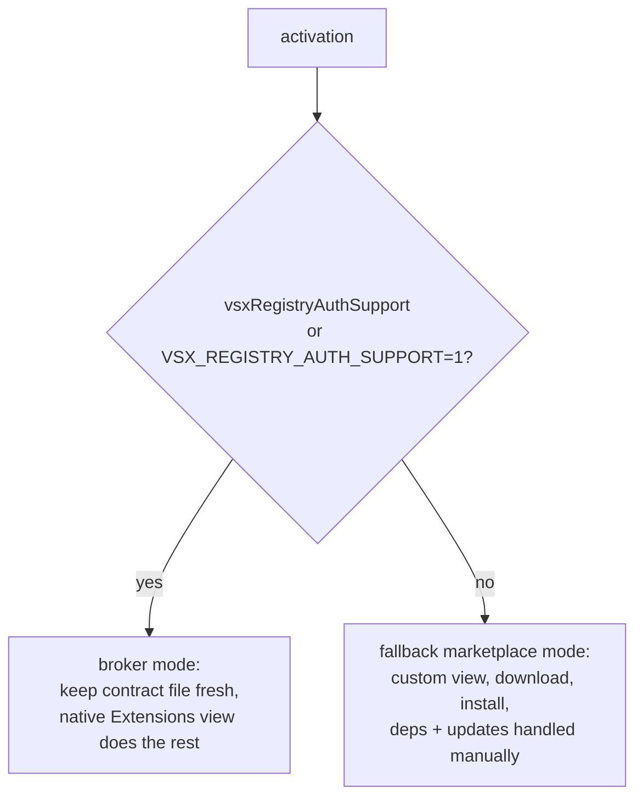
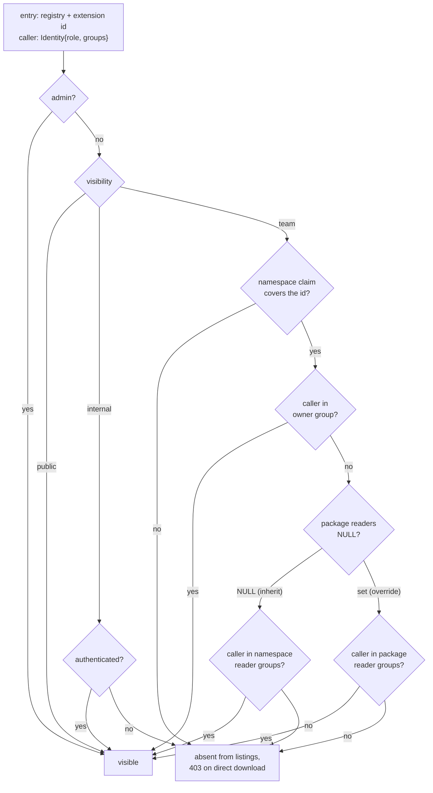

# RFC 0011 — Authenticated OpenVSX Registry Access

| Field      | Value                                                                  |
| ---------- | ---------------------------------------------------------------------- |
| Status     | Draft                                                                  |
| Author     | batleforc                                                              |
| Co-author  | —                                                                      |
| Created    | 2026-08-18                                                             |
| Supersedes | —                                                                      |
| Touches    | `server` (VSX API auth), `crates/core` (visibility resolution), `crates/adapters` (namespace matcher, PAT groups, migration), `crates/web` (readers API), `ui/` (readers controls), `crates/batlehub-cli` (new), `vscode-ext` (new), `che-code` patch (external), docs |

---

## 1. Summary

VS Code and its derivatives provide no mechanism to authenticate extension gallery requests: search, query, and `.vsix` download are performed by the editor core, outside the reach of extension APIs. Microsoft's Private Marketplace (2025) authenticates only the service-index discovery request and gates access on GitHub Enterprise/Entra accounts — unusable for Batlehub.

This RFC introduces four cooperating components so the Batlehub VSX registry can require authentication end to end:

1. A **Batlehub CLI** owning credential acquisition and refresh (OAuth2 PKCE against the IDP, plus PAT support).
2. A **JSON token contract file** under `$HOME`, written by the CLI/extension, read by the editor.
3. A **che-code patch** injecting an `Authorization` header on gallery requests, generic enough to be proposed upstream to `che-incubator/che-code`.
4. A **VS Code extension** (`batlehub-vsx`) acting as token broker when the patch is present, and as a fallback marketplace UI when it is not.

Authentication is the means, not the end. The end is that **an extension is visible to the teams it belongs to and to nobody else**, in the editor's own Extensions view — team `digital` sees its proprietary extensions, team `sales` sees its own, team `ops` shares a selected set with both. §4.4 defines that authorization model; it is what the credential is *for*.

### Before / after

```
# today
Batlehub VSX endpoints must be anonymously readable; any exposure of the
registry exposes every hosted extension. che-code / VS Code cannot send
credentials to a custom gallery.

# with this RFC
VSX endpoints require a Bearer credential (OIDC access token or bh_pat_*).
Patched che-code reads the contract file and authenticates natively;
stock VS Code gets an authenticated marketplace view via the extension.
The credential carries the caller's groups, so the gallery answers with
that caller's extensions: digital sees digital + what ops shares, sales
sees sales + what ops shares, neither sees the other. Same URL, same
Extensions view, different contents — filtered server-side.
```

---

## 2. Motivation

1. **The VSX registry cannot stay anonymous.** Network-level isolation (ClusterIP + NetworkPolicy) was rejected for security reasons, so authentication must happen at the application layer — but `extensionGalleryService` in the editor core offers no credential hook.
2. **Upstream will not solve it.** The VS Code Private Marketplace presents a bearer token only on service-index discovery; search/query/download stay unauthenticated, and access is tied to GitHub Enterprise/Copilot accounts.
3. **Credentials must be shared across registries.** Batlehub serves (or will serve) multiple package protocols; a per-tool credential story does not scale. A CLI as single credential authority mutualises login, refresh, and storage for VSX today and npm/cargo/OCI later.
4. **A single tenant is not the deployment.** The estate has teams with proprietary extensions (`digital`, `sales`) and teams that publish for everyone or for a named subset (`ops`). An authenticated-but-flat registry answers "may you read the gallery", when the question is "which extensions are yours". Without per-namespace visibility, authentication only moves the leak from anonymous to any-employee: every extension of every team stays readable by every other team.
5. **The mechanism already exists — for every ecosystem but this one.** `Visibility::{Public,Internal,Team}` (`crates/core/src/entities/local_package.rs`), team namespace claims (`crates/core/src/entities/team_namespace.rs`), the download gate `check_visibility`, and the SQL listing predicate `LOCAL_VISIBILITY_PREDICATE` are shipped and tested. The VSX gallery already threads the caller's `Identity` into search and skips packages the caller may not see. What is missing is three concrete gaps (§4.4.1), not a new subsystem.

---

## 3. Goals / non-goals

**Goals**

- Authenticated search, metadata, and `.vsix` download from both patched che-code and stock VS Code/VSCodium.
- OIDC access/refresh pairs and Batlehub PATs accepted interchangeably by the server.
- **Namespace-scoped extension visibility**: an extension published under a team's namespace is listed, searchable, and downloadable only by that team, plus any group the namespace or the extension explicitly grants read to.
- **Filtering server-side, in the documents every UI renders from**: the editor's native Extensions view, the fallback marketplace view, the OpenVSX REST documents, and the Batlehub catalogue all show the same thing — what the caller may see — because none of them does the filtering itself.
- A che-code patch with zero Batlehub-specific coupling, upstreamable as-is.
- One extension covering both modes (silent broker / fallback marketplace) with automatic detection.
- All client-side paths dynamic, resolved relative to `$HOME`.

**Non-goals**

- Authenticating the official marketplace or open-vsx.org — out of Batlehub's control.
- Extension publishing flows — already covered by OpenVSX PAT publishing.
- **Per-*version* visibility.** Visibility is a property of the package name and applies to all versions at once, as `TeamNamespacePort` already documents. Withdrawing one version is yank/block, not visibility.
- **Per-*user* grants.** Grants name auth-provider groups, never individuals. A one-person grant is a one-person group at the IDP.
- **Visibility on proxied upstream extensions.** Only locally published packages carry a visibility row; an extension mirrored from open-vsx.org is public upstream, and pretending otherwise would be theatre. Registry-level RBAC remains the gate there.
- **Client-side filtering as a security boundary.** The fallback marketplace may sort and group, but it never receives an entry it is expected to hide.
- OS keychain storage in the CLI — Che pods have no keychain; file-based storage first, keychain as later enhancement.

---

## 4. User-facing design

### 4.1 Configuration

Contract file — `$BATLEHUB_HOME/state/vsx-token.json`, where `BATLEHUB_HOME` defaults to `$HOME/.batlehub`:

```json
{
  "version": 1,
  "registries": {
    "https://hub.example.dev": {
      "token": "<bearer credential>",
      "kind": "oidc",
      "expires_at": "2026-08-18T12:00:00Z"
    }
  }
}
```

- `registries` is keyed by origin; the consumer selects the entry matching the configured gallery origin. One file serves every future registry protocol.
- `kind` is `"oidc"` or `"pat"`; `expires_at` is optional and absent for PATs. Absent `expires_at` means "treat as non-expiring"; an empty `registries` map is valid and means "no credentials yet".
- `token` is the raw credential; the consumer never interprets it beyond placing it in the header.

Environment variables (consumer side, i.e. the che-code patch):

```
VSX_REGISTRY_AUTH_TOKEN_FILE = <path>   # overrides the default contract path
VSX_REGISTRY_AUTH_TOKEN      = <token>  # inline credential, lowest precedence, CI only
VSX_REGISTRY_AUTH_SUPPORT    = 1        # advertised by patched builds (see 4.2)
```

CLI commands:

```
batlehub auth login [--pat | --oidc] [--registry <url>]   # PKCE (loopback or device code) or PAT entry
batlehub auth token [--output raw|json] [--min-ttl <dur>] # print a valid credential, refresh if < min-ttl (default 60s)
batlehub auth write-token-file [--path <p>]               # refresh if needed, atomically update the contract file
batlehub auth logout                                      # revoke refresh token, delete credentials + contract entry
batlehub pat create --scope vsx:read [--ttl <dur>]        # PAT management
                    [--groups <g1,g2> | --all-groups]     # group snapshot, subset of the creator's own (4.4.4)

batlehub ns readers <registry>/<prefix> [--set <g1,g2>]   # namespace default readers
batlehub pkg readers <registry>/<name>  [--set <g1,g2> | --inherit]   # per-extension override
```

CLI storage: refresh tokens and PATs in `$BATLEHUB_HOME/credentials.toml`, `0600`.

### 4.2 Behaviour rules

- **Contract file writes are atomic**: temp file + rename, `0600`, parent dirs `0700`. Writers update only their registry's entry, preserving others (read-modify-write).
- **Consumer resolution order** (patch): `VSX_REGISTRY_AUTH_TOKEN_FILE` → default contract path → `VSX_REGISTRY_AUTH_TOKEN`. First source yielding a credential for the gallery origin wins.
- **Extension credential chain** (both modes, first hit wins):
  1. Contract file, if it holds a still-valid entry for the registry.
  2. `BATLEHUB_TOKEN` environment variable (CI / injected secrets).
  3. Batlehub CLI if on `PATH`: `batlehub auth token --output raw`.
  4. Interactive OAuth2 PKCE via a registered `AuthenticationProvider`; refresh token in `SecretStorage`; access tokens written back to the contract file.
  5. Manual PAT entry (input box), stored in `SecretStorage` and written to the contract file.
- **Header scoping**: the patch injects `Authorization: Bearer <credential>` only when the request URL origin equals the configured gallery origin; redirects to foreign origins drop the header.
- **401 handling**: on `401`, the patch re-reads the credential source once and retries the request a single time. Short-lived OIDC tokens work without file watchers or IPC — the broker refreshes the file, the retry picks it up.
- **Mode detection** (extension, at activation): `vsxRegistryAuthSupport: true` in `product.json` or `VSX_REGISTRY_AUTH_SUPPORT=1` → broker mode (keep the contract file fresh, status-bar auth state only). Otherwise → fallback marketplace mode (custom view, authenticated search/download, install via `workbench.extensions.installExtension`, manual `extensionDependencies`/`extensionPack` resolution depth-first and cycle-guarded, daily update diff against the registry).
- **Server dispatch**: credentials with prefix `bh_pat_` are validated as PATs (argon2id hashed lookup, scope check `vsx:read`); anything else is validated as a JWT against the IDP JWKS (issuer, audience `batlehub`, expiry). Unauthenticated requests get `401` + `WWW-Authenticate: Bearer realm="batlehub"`.
- **Every credential resolves to groups, not just to a role.** `vsx:read` is the capability to talk to the gallery at all; *which* extensions come back is decided by the `Identity.groups` the credential carries (§4.4). A JWT gets them from the existing OIDC rule engine; a PAT gets them from the group snapshot taken at creation (§4.4.4). A credential with no groups sees `public` and `internal` extensions only — never a `team` one.

### 4.3 Validation

`AppConfig::validate()` rejects:

| Condition | Rationale |
| --------- | --------- |
| VSX auth enabled without an OIDC issuer URL and without PAT support enabled | No validation path could ever succeed; every request would 401 |
| Configured JWKS audience empty while OIDC validation enabled | Tokens for any audience would be accepted — confused-deputy risk |
| A registry declares a namespace separator that is not a single ASCII character | The matcher and the SQL predicate must agree character for character (§4.4.2); anything else is a divergence waiting to happen |

Warnings (logged and surfaced to the admin):

| Condition | Behaviour |
| --------- | --------- |
| OIDC access-token TTL at the IDP reported/configured below 10 min | Warn: long `.vsix` downloads may outlive the token; 401-retry covers one rotation only |
| PAT created without TTL | Warn at creation time; PAT is valid but flagged in the admin listing |
| Reader groups set on a `public` or `internal` package | Warn: the grant is stored but inert until visibility is `team`. Silently accepting it is how an admin concludes a package is restricted when it is not |
| A namespace's reader list contains its own owner group | Warn and store as-is; it is redundant, not wrong |
| A grant names a group no auth rule has ever emitted | Warn only. Groups are provider-defined and a team's first member may not have logged in yet — the same reason namespace claims accept unseen groups today |
| A reader list contains `*`, `@authenticated`, `all` or another wildcard-shaped entry | Warn: it is stored and matched as a literal group id, because there are no wildcards (§4.4.3). The admin meant `internal` visibility, and this is the moment to say so — the alternative is discovering it during an access review |

Client side: the CLI validates the contract file on write (schema version, origin is a valid URL, `expires_at` RFC 3339). The patch treats an unparseable file as "no credential" and logs once — it must never break extension installs for anonymous galleries.

### 4.4 Namespace-scoped extension visibility

The requirement, stated as the estate states it:

> Team `digital` has extensions proprietary to `digital`. Team `sales` likewise.
> Team `ops` publishes extensions it wants `digital` and `sales` to have.
> Everyone sees exactly their own set, in their own editor, without knowing the
> others exist.

#### 4.4.1 What is already there, and the three gaps

Reusing the platform's existing model is not an economy measure: a second authorization model for extensions is a second model to keep in agreement with the download gate, and the codebase already carries an explicit warning about what happens when a listing filter and a download gate disagree (`LOCAL_VISIBILITY_PREDICATE`, `crates/adapters/src/db/packages/mod.rs`).

| Already shipped | Where |
| --- | --- |
| `Visibility::{Public,Internal,Team}` per package name | `crates/core/src/entities/local_package.rs` |
| Namespace claim: `(registry, prefix) → group_id` | `crates/core/src/entities/team_namespace.rs`, admin UI `ui/src/pages/AdminTeamNamespaces.vue` |
| Download gate `check_visibility` / `check_team_visibility` | `crates/core/src/services/local_registry/` |
| Listing filter mirroring the gate in SQL | `LOCAL_VISIBILITY_PREDICATE` |
| Catalogue-side viewer (`is_admin`, `is_authenticated`, `groups`) | `ExploreViewer`, `crates/core/src/entities/explore.rs` |
| Gallery search already skips what the caller may not see | `get_openvsx_extensions`, `crates/core/src/services/local_registry/eco_openvsx.rs` |

Three gaps stand between that and the requirement. Each is small and each is load-bearing:

**G1 — PAT identities carry no groups.** `UserTokenAuthProvider` returns `groups: vec![]` (`crates/adapters/src/auth/user_token.rs`), and `UserToken` (`crates/core/src/ports/auth/user_token_repo.rs`) stores `user_id` and `role` only. A `digital` developer whose che-code authenticates with a PAT — the exact flow §4.1 designs — is denied every `team` package, *including their own*. Fixed in §4.4.4.

**G2 — the namespace matcher is slash-delimited.** The claim matcher is `package == prefix || package.starts_with("{prefix}/")`, mirrored in SQL as `SUBSTRING(name, 1, LENGTH(prefix)+1) = prefix || '/'`. Extension ids are `publisher.name`: a claim on `digital` never matches `digital.pipeline-tools`. Today, namespace-scoped extensions are not merely unimplemented — they are unrepresentable. Fixed in §4.4.2.

**G3 — a namespace grants read to exactly one group.** `TeamNamespace.group_id` is a single group, so `ops` shares with everyone (`internal`) or with nobody. Fixed in §4.4.3.

#### 4.4.2 The namespace of an extension

The namespace is the publisher segment of the extension id: `digital.pipeline-tools` → `digital`. It is the same string the OpenVSX API already exposes at `GET /api/{namespace}` and the same one `ovsx` checks before publishing, so nothing new is asked of publishers.

Each `RegistryKind` declares its namespace separator — `/` for the ecosystems that have one today, `.` for `openvsx` and `vscode-marketplace`. The matcher becomes:

```
package == prefix  ||  package.starts_with(prefix + separator)
```

Two constraints carry over from the existing implementation and must survive the change:

- **The SQL predicate is edited in the same commit as the Rust matcher.** They are compared character for character today; a separator threaded into one and not the other makes the listing more permissive than the download gate, which is precisely the leak the predicate exists to close.
- **The separator is compared literally, never as a pattern.** `SUBSTRING(...) = prefix || separator`, not `LIKE`. A `.` in a `LIKE` is harmless, but the rule that kept `%` and `_` literal is the rule that keeps this correct as separators multiply.

Longest prefix still wins outright, including across separators.

#### 4.4.3 Grants: namespace default, per-extension override

`Visibility::Team` stops meaning "the owning group" and starts meaning "the resolved reader set", which is the owning group plus grants:

- **Namespace default** — `team_namespaces` gains `reader_groups text[] NOT NULL DEFAULT '{}'`. `ops` claims `ops` and sets readers `{digital, sales}`.
- **Per-extension override** — `local_packages` gains `reader_groups text[] NULL`. `NULL` means *inherit the namespace default*; a non-NULL value *replaces* it.

The distinction between `NULL` and `{}` is the whole point of having both, and it is the part an implementation gets wrong quietly: **`NULL` inherits, `{}` overrides with nothing** — owner group only, even when the namespace shares widely. `ops` can therefore keep one extension to itself inside a namespace it otherwise shares, which is why the override exists. The API takes `{"readers": null}` and `{"readers": []}` as different requests, and the UI shows *Inherited from `ops` (digital, sales)* versus *Owner only (override)* as different states, with an explicit "reset to inherited" action rather than a `[]` that looks like a clear.

Resolution for one extension and one caller, in order — first match wins:

1. `is_admin` → visible. (Unchanged; admins bypass visibility everywhere today.)
2. `visibility = public` → visible, including anonymously.
3. `visibility = internal` → visible to any authenticated identity.
4. `visibility = team`:
   a. no namespace claim covers the name → **denied**. Unchanged, and deliberate: falling back to "any authenticated user" when a claim is missing or deleted is how a team-private extension becomes readable estate-wide.
   b. caller is in the owner group → visible.
   c. caller is in the effective reader set (override if non-NULL, else namespace default) → visible.
   d. otherwise → denied.

**A reader list holds literal group ids and nothing else.** There is no wildcard, no `*`, no `@authenticated` — "everyone with an account" is `Visibility::Internal`, which already means exactly that (§11 decision 14). A reserved token would add a second rule inside both the Rust comparison and the SQL predicate, in the one place this design depends on the two staying identical, and it would misfire the day an IDP emits a group actually called `*`. Entries are matched by equality after space-stripping; §4.3 warns when a list contains something wildcard-shaped, so an admin who tries it finds out at write time rather than from an access review.

Write access — publish, yank, visibility and grant edits — stays with the owner group and admins. **Reader grants never confer write.** `require_admin_or_namespace_member` (`crates/web/src/handlers/back_office/visibility.rs`) keeps comparing against `group_id` alone; adding readers there is the one-character mistake that would let `digital` yank an `ops` extension.

#### 4.4.4 Groups on a PAT

`UserToken` gains `groups text[]`, snapshotted from the creator's own `Identity.groups` at creation and capped to a subset of them — a PAT cannot grant its creator groups they do not have, and `--all-groups` is sugar for "all of mine, now".

The snapshot is a deliberate trade against re-resolving groups per request:

- **For it**: no IDP round-trip on the gallery hot path (`extensionquery` is called on every editor start and every extension view), no dependence on the IDP being reachable while a `.vsix` streams, and it is the only option that works at all — a PAT has no refresh token and no session, so there is nothing to re-resolve *from*.
- **Against it**: a developer who leaves `digital` keeps reading `digital` extensions until the PAT expires or is revoked.
- **Therefore**: PAT TTL is capped (§11, open question 2 — this makes the cap a security control, not a hygiene preference), the token's groups are shown wherever the token is shown (creation output, `TokensPage.vue`, admin listing), and offboarding revokes tokens. OIDC access tokens, which do re-resolve groups on every refresh, stay the recommended posture for interactive users; PATs are for automation and for pods that cannot run a browser flow.

Group comparison is space-stripped on both sides, matching `check_team_visibility` and `ExploreViewer::normalised_groups` — one normalisation rule, applied everywhere, including the new reader-set comparison.

#### 4.4.5 Where the filtering happens

In `source::search_entries` and `source::extension_entry` (`crates/web/src/handlers/proxy/vsx/`), which already receive the caller's identity and are already the single place gallery entries are produced. Every surface renders from them:

| Surface | Gets filtering because |
| --- | --- |
| Native Extensions view in patched che-code | `extensionquery` responses are built from filtered entries |
| Fallback marketplace view in `batlehub-vsx` | Same endpoints, same filtered entries |
| `ovsx` / OpenVSX REST (`/api/-/search`, `/api/{namespace}`) | Built from the same entry list — the module already guarantees a version cannot be visible through one route and hidden in another |
| Batlehub catalogue and package detail | `ExploreViewer` + `LOCAL_VISIBILITY_PREDICATE`, unchanged apart from reader groups |

**Hidden means absent, not forbidden.** A listing, search, or namespace document omits what the caller may not see, exactly as `get_openvsx_extensions` already does (`AccessDenied → continue`) and as RFC 0006 established for blocked versions. An editor that receives a `403` from a search blanks its whole extension list; an editor that receives a shorter list renders it. A namespace document whose extensions are all invisible to the caller is a `404`, not an empty document — an empty `digital` namespace confirms that `digital` exists.

**Direct download by exact coordinate keeps returning `403`** via `check_visibility` — today's behaviour, unchanged (§11 decision 13). Absence is the right answer where enumeration is cheap, which is listings; a caller who already holds `digital.pipeline-tools` learns nothing from a `403` that they did not have to know to ask. The two rules are not in tension, they answer two different questions, and keeping the download gate untouched keeps every other ecosystem's behaviour untouched with it.

#### 4.4.6 The estate, worked through

| Extension | Namespace / visibility | Grants | `digital` dev | `sales` dev | `ops` dev | anonymous |
| --- | --- | --- | --- | --- | --- | --- |
| `digital.pipeline-tools` | `digital` / team | — (inherit `{}`) | visible | absent | absent | absent |
| `sales.crm-snippets` | `sales` / team | — | absent | visible | absent | absent |
| `ops.k8s-helper` | `ops` / team | ns readers `{digital, sales}` | visible | visible | visible | absent |
| `ops.incident-runbook` | `ops` / team | override `{}` | absent | absent | visible | absent |
| `ops.editor-theme` | `ops` / internal | — | visible | visible | visible | absent |
| `redhat.java` (proxied) | upstream | n/a | visible | visible | visible | per registry RBAC |

Three developers, one gallery URL, three different Extensions views. None of them ran a filter.

---

## 5. Architecture

### 5.1 Component and credential flow



### 5.2 Mode selection in the extension



### 5.3 Visibility resolution for one extension

Applied per entry while the gallery response is built, so the same decision drives listing, search, metadata, and download.



---

## 6. Detailed design

### 6.1 `server`

- Bearer middleware on VSX routes: prefix dispatch (`bh_pat_` → PAT path, else JWT path), JWKS cached with rotation handling, no introspection round-trip on the hot path.
- PAT table: hashed secret (argon2id), scopes, optional expiry, revocation flag, **group snapshot**; CRUD API consumed by the CLI and the admin UI.

### 6.1-bis Visibility (`crates/core`, `crates/adapters`, `crates/web`, `ui/`)

- **`crates/core`** — one resolution function implementing §4.4.3, called by `check_visibility` and by the entry builders. `RegistryKind::namespace_separator()` (default `/`, `.` for `openvsx`/`vscode-marketplace`) with a drift test asserting every variant declares one, in the shape of the existing `warm_artifact` drift guard. `TeamNamespace` gains `reader_groups`, `PublishedPackage`/`NamespacePackage` gain `reader_groups: Option<Vec<String>>`.
- **`crates/adapters`** — migration adding `team_namespaces.reader_groups text[] NOT NULL DEFAULT '{}'` and `local_packages.reader_groups text[] NULL` (new `mig!` entry, sequence incremented); `find_namespace` matcher takes the separator; `LOCAL_VISIBILITY_PREDICATE` gains the reader-set arms and the separator, edited in the same commit as the matcher (§4.4.2); `UserTokenAuthProvider` returns the token's stored groups instead of `vec![]`, and `create_token` takes and caps them.
- **`crates/web`** — `PUT/GET /api/v1/admin/registries/{registry}/namespaces/{prefix}/readers` and `…/packages/{name:.*}/readers`, both behind the existing `require_admin_or_namespace_member` (owner group or admin — **not** readers). `VisibilityResponse` grows `readers: Vec<String>` and `readers_source: "inherited" | "override"` so the console never has to infer which it is looking at. Both writes emit an audit event alongside the existing `AccessAction::SetVisibility`.
- **`ui/`** — group multi-select on `AdminTeamNamespaces.vue`; a readers control on the package detail/admin package view with the three states of §4.4.3 (inherited / override / owner-only) and an explicit reset; the same control on `MyNamespace.vue` for owners who are not admins. Labels name the behaviour, not the schema: *Who can see this* over *reader_groups*.

### 6.2 `crates/batlehub-cli`

- New crate. `auth` subcommand tree per 4.1; PKCE with loopback redirect on desktop, device code flow when no browser is reachable (Che terminals, SSH).
- Contract-file writer: read-modify-write keyed by origin, atomic rename, schema validation.

### 6.3 `vscode-ext` (`batlehub-vsx`)

- `AuthenticationProvider` registration, `SecretStorage` for refresh tokens/PATs, credential chain per 4.2.
- Fallback marketplace: TreeView first iteration, webview detail page later; install ledger in workspace state to identify Batlehub-originated extensions for the update diff.
- Walkthrough + setting nudge steering users away from the native Extensions view when it points at an unauthenticated or absent gallery.

### 6.4 che-code patch (external repository)

- Touches `src/vs/platform/extensionManagement/common/extensionGalleryService.ts` and the gallery asset download call sites; adds credential resolution (4.2) and origin-scoped header injection; JSON parsing limited to the documented schema.
- Maintained as a rebase-friendly commit series on the Forgejo mirror, built into the workspace editor image; `product.json` of the patched build sets `vsxRegistryAuthSupport: true`.

**Deliberately untouched**, so reviewers do not go looking:

- Publishing endpoints and existing OpenVSX PAT publishing flow — unchanged by this RFC.
- Anonymous read on any other Batlehub registry. The *credential* work is VSX-only. The visibility work is not, and cannot be: the matcher, the SQL predicate and the PAT group snapshot are shared code. Every ecosystem gains reader groups, and none changes behaviour unless one is set — a namespace with `reader_groups = '{}'` resolves exactly as it does today, which is what the unchanged-suite line in §10 pins.
- che-code telemetry, product branding, and update channels — the patch stays confined to gallery request construction.

---

## 7. Security considerations

- **The contract file is the trust boundary on disk.** `0600` under `$HOME`, atomic writes, and no path outside the user's home; a local attacker able to read it already owns the session.
- **Header injection is origin-scoped.** The credential is attached only to requests whose origin equals the configured gallery origin, and dropped on cross-origin redirects — CDN asset hosts never see it.
- **PATs are identifiable and scoped.** The `bh_pat_` prefix enables secret scanning; scope `vsx:read` bounds blast radius; secrets are stored argon2id-hashed.
- **The 401-retry loop is bounded.** One re-read and one retry per request prevents hammering the IDP on revoked credentials.
- **Short-lived tokens are the default posture.** OIDC access tokens preferred over PATs for interactive users; IDP TTL must exceed the longest plausible `.vsix` download (recommendation ≥ 10 min, enforced as a warning in 4.3).
- **A PAT is a group snapshot, so its TTL is an access-control lifetime.** Group membership on a PAT does not follow the IDP; a capped TTL plus revocation is what bounds a stale grant. This is the argument for the hard cap in §11 open question 2 and against non-expiring PATs.
- **Listing and download must not disagree.** The SQL predicate and the Rust gate are compared character for character today, and the reader-set arms and the namespace separator are added to both or to neither. A listing more permissive than the gate leaks names, publishers and version counts of extensions the same caller would be `403`'d for — a directory of what other teams are building, which is the exact failure mode namespace scoping exists to prevent.
- **Absence is the denial signal in listings; `403` remains the denial signal on download.** `404` on a namespace document with nothing visible and omission in search, because a `403` there distinguishes "exists but not yours" from "does not exist" across a space the caller can sweep. On a direct download the caller supplied the coordinate, so `403` discloses nothing they did not already hold, and the shared gate stays untouched (§11 decision 13).
- **Reader grants are read-only by construction.** Write authorization keeps comparing against the owner group alone; readers appear in no write path.

---

## 8. Alternatives considered

| Alternative | Why rejected |
| ----------- | ------------ |
| In-workspace authenticating sidecar proxy, `VSX_REGISTRY_URL` → localhost | Rejected for security reasons (deployment constraint); also adds a per-pod component to operate |
| Network trust only (ClusterIP + Cilium NetworkPolicy) | No user identity; any workload in allowed namespaces reads everything; does not cover desktop |
| Pure extension, no patch | Loses native Extensions view, auto-updates, and dependency resolution in che-code — acceptable as fallback, not as the primary UX |
| VS Code Private Marketplace | Bearer only on service-index discovery, gallery ops unauthenticated, gated on GitHub Enterprise/Entra accounts |
| Raw single-line token file (no JSON) | Simpler consumer, but no multi-registry support, no expiry metadata, and a second file format the day npm/cargo need credentials |
| IPC between extension and patched core (named pipe/socket) | Cross-process protocol to design, version, and secure; the file + 401-retry achieves the same freshness with none of that surface |
| All-or-nothing `vsx:read`, per-extension authorization deferred to a later RFC (this RFC's original position) | Authentication without scoping only moves the leak from anonymous to any-employee: every team reads every other team's proprietary extensions. It also strands the shipped `Visibility`/namespace model, which every other ecosystem already honours, and would have to be undone the day scoping lands |
| One registry per team (`vsx-digital`, `vsx-sales`, …), registry-level RBAC only | Works, and is what an operator does today by hand. Every editor points at exactly one gallery URL, so a developer in two teams cannot see both; `ops`-shared extensions must be published N times; and the registry count grows with the org chart |
| A separate ACL model for extensions | A second authorization model to hold in agreement with `check_visibility` and the SQL predicate. The known failure of two models is the listing/download divergence the existing predicate documents at length |
| Namespace reader groups only, no per-extension override | Simpler schema and one lookup. Rejected: `ops` cannot keep a single extension private inside a namespace it shares, so the workaround is a second namespace per sharing shape |
| Per-extension grants only, no namespace default | Maximum flexibility, but every new extension starts ungranted and sharing is re-declared per publish — grants drift apart within a namespace and nobody notices until someone cannot install |
| A shared-with-everyone visibility instead of grants (`internal` for `ops`) | Covers "share with all" and nothing else; `ops` sharing with `digital` and `sales` but not with contractors is unrepresentable |

---

## 9. Rollout and compatibility

- **Default behaviour**: auth disabled on VSX endpoints until enabled in server config; unpatched editors against an anonymous registry are unaffected. The patch with no credential available sends no header — patched che-code remains compatible with anonymous galleries.
- **Config migration**: new server config section for VSX auth (issuer, audience, PAT toggle); additive, `CURRENT_CONFIG_VERSION` moves only if the config loader requires it at implementation time.
- **Visibility migration is inert by default**: `team_namespaces.reader_groups` defaults to `'{}'` and `local_packages.reader_groups` to `NULL`, so every existing package resolves exactly as it does today — `team` means owner group, in every ecosystem, until an operator grants otherwise. Existing PATs carry an empty group snapshot and therefore lose no access they had (they had none: PAT identities have never carried groups); a user who needs their PAT to reach team extensions re-creates it. Say so in the release notes rather than letting it be discovered.
- **Namespace separator change is not inert** and deserves its own line in review: a `digital` claim in a VSX registry starts matching `digital.*`, where before it matched nothing. Extensions already published as `team` under such a namespace become visible to the owner group — which is the intent, and is still a widening. Audit existing VSX namespace claims before rollout.
- **Rollback for visibility**: clear the reader groups (a grant nobody holds denies nobody extra) or revert the migration; the separator revert returns the matcher to `/`-only, which restores today's deny-everything behaviour for dotted ids.
- **Operator prerequisites**: IDP OAuth2 client (public, PKCE, loopback + device code grants), JWKS reachable from the server, patched che-code image published, CLI present in workspace images.
- **Rollback**: disable auth in server config (endpoints revert to anonymous); patched editors keep working (no header sent when no credential resolves); contract files and PAT table persist but become inert.

---

## 10. Test plan

- **Unit** (`server`): prefix dispatch, JWT validation (expiry, audience, issuer, key rotation), PAT hash lookup + scope + revocation, 401 challenge format.
- **Unit** (`crates/core`): the resolution table of §4.4.3 exhaustively — admin bypass, `public` anonymous, `internal` authenticated, owner group, inherited readers, override readers, **`NULL` inherits vs `{}` denies**, missing claim denies, space-stripped group comparison. Separator drift test: every `RegistryKind` declares one; `openvsx`/`vscode-marketplace` declare `.`.
- **Unit** (`crates/adapters`): `find_namespace` matches `digital.pipeline-tools` for a `digital` claim in a VSX registry and does **not** match it in a slash-separator registry; longest prefix still wins; `%` and `_` in a prefix stay literal.
- **Equivalence** (`crates/adapters`, Postgres): the SQL predicate and the Rust gate agree on a fixture covering every row of §4.4.6 for every caller — the listing must never be more permissive than the download gate. This is the test that fails if only one of the two is edited.
- **Unit** (`crates/core`): a reader list containing `*` grants read to a group literally named `*` and to nobody else — the no-wildcard rule of §4.4.3, asserted rather than assumed, in the Rust gate and in the SQL predicate alike.
- **Unit** (`crates/adapters`): PAT groups round-trip through creation; a PAT cannot be created with a group its creator lacks; a groups-less PAT sees `public`/`internal` only.
- **Unit** (`crates/batlehub-cli`): contract read-modify-write preserves foreign origins; atomic write; refresh triggered under `--min-ttl`; device code fallback selection.
- **Unit** (patch, upstream test layout): resolution order; origin scoping incl. redirect drop; single 401-retry; unparseable file treated as no-credential.
- **Integration** (`server` + CLI): full PKCE login → `write-token-file` → authenticated search/download; PAT lifecycle create → use → revoke → 401.
- **Integration** (canary workspace): patched che-code against short-TTL tokens; install a `.vsix` larger than one token lifetime to exercise the retry.
- **Integration** (`crates/web`, new `local_openvsx_visibility.rs`): the §4.4.6 estate published once, then queried as `digital`, `sales`, `ops`, an authenticated no-group user, and anonymously — through `extensionquery`, `/api/-/search`, `/api/{namespace}` and the direct download route. Asserts the exact visible sets, that a hidden extension is **absent rather than 403** in every listing, that `/api/digital` is `404` for `sales`, and that direct download is `403`.
- **Integration** (`crates/web`): a reader-group member cannot yank, delete, set visibility, or edit grants on the extension they can read — the read/write split of §4.4.3.
- **Real client** (per the project's standing practice that route tests are not client tests): `code --install-extension ops.k8s-helper` succeeds as `digital` and fails as a contractor, and the Extensions view lists exactly the expected set for each of the three developers.
- **Existing suites** that must pass unchanged: VSX API conformance tests with auth disabled — proves the anonymous path is untouched; extension publishing suite — proves publishing flow isolation; the full existing visibility/namespace suites with no reader groups set — proves the grant model is inert until used, in every ecosystem.

---

## 11. Decisions and open questions

### Resolved

| # | Question | Decision |
| --- | -------- | -------- |
| 1 | Sidecar proxy vs application-layer auth | **Application-layer.** Sidecar rejected for security reasons. |
| 2 | Contract file format | **JSON, versioned, keyed by registry origin.** Multi-registry from day one; expiry metadata included. |
| 3 | Contract file location | **Dynamic, `$HOME`-relative**: `$BATLEHUB_HOME/state/vsx-token.json`, `BATLEHUB_HOME` defaulting to `$HOME/.batlehub`. |
| 4 | Extension chain: env vs existing file | **Contract file first, then env.** |
| 5 | Token formats | **Both** OIDC access/refresh and PATs, prefix-dispatched server-side. |
| 6 | Patch ↔ extension coupling | **None.** The file is the contract; patch stays generic and upstreamable. |
| 7 | CLI existence | **To be created in this workstream**, with OAuth2 built in. |
| 8 | Scope of authorization: all-or-nothing `vsx:read` vs per-namespace visibility | **Per-namespace, in this RFC.** Authentication alone leaves every team's proprietary extensions readable by every other team. Reversed from the original draft's non-goal. |
| 9 | Grant granularity | **Both**: namespace default (`team_namespaces.reader_groups`) with a per-extension override (`local_packages.reader_groups`, `NULL` = inherit). Namespace-only cannot express "one private extension in a shared namespace"; extension-only makes grants drift within a namespace. |
| 10 | New ACL model vs the shipped `Visibility` + namespace model | **Reuse the shipped model.** A second model is a second thing to keep in agreement with the download gate and the SQL listing predicate. |
| 11 | Where filtering happens | **Server-side, in the entry builders every protocol renders from.** No client filters; clients receive only what the caller may see. |
| 12 | How a PAT gets groups | **Snapshot at creation**, capped to the creator's own groups. A PAT has no session to re-resolve from; the cost is staleness, bounded by TTL and revocation. |
| 13 | Direct download of a `team` extension by a non-member: `403` or `404` | **`403`**, keeping today's `check_visibility` behaviour. The caller already holds the exact coordinate, so the existence oracle is weak; changing it means touching a gate every ecosystem shares, to hide something the requester already knew. Listings stay on absence (§4.4.5) — that is where enumeration is actually cheap. |
| 14 | "Share with all authenticated users": reserved group token in a reader list, or `internal` visibility | **`internal`.** One way to say a thing. A reserved token (`*`, `@authenticated`) would put a second, invisible rule inside the reader-set comparison and inside the SQL predicate, and would collide the day a real IDP group is named the same. A namespace that wants everyone sets `internal` on the package. |

### Still open

1. Fully silent Che workspace startup: device code flow on first use vs a user-scoped PAT provisioned through the secrets pipeline. Trade-off: first-run friction vs a long-lived secret per user. Recommendation: device code by default, PAT provisioning as an opt-in per deployment.
2. PAT policy: maximum TTL and whether expiry is mandatory. Now an access-control question, not hygiene (§4.4.4): the TTL bounds how long a stale group snapshot grants read. Recommendation: default 90 days, hard cap 1 year, no non-expiring PATs.
3. Fallback marketplace offline behaviour: cache search results for degraded network, or fail visibly. Recommendation: fail visibly in v1. If caching lands, the cache is keyed by identity — a shared cache would serve one team's filtered list to another.
4. RFC number and `Touches` paths to be aligned with the repository layout at merge time.
5. Group nesting/transitivity: grants match flat group ids as the IDP emits them. If the IDP nests groups, expansion is the IDP's job. Recommendation: leave flat, revisit only if a deployment needs it.

---

## 12. Implementation phases

| Phase | Content |
| ----- | ------- |
| 1     | `server`: Bearer middleware (OIDC + PAT), PAT management API **with group snapshot** (G1). `crates/batlehub-cli`: `auth login/token/write-token-file/logout`, `pat create`. |
| 1-bis | Visibility: namespace separator per `RegistryKind` (G2), reader groups on namespace and package (G3), migration, matcher + SQL predicate in one commit, readers API, resolution tests and the equivalence test. Independent of the client work — **ships and is testable through `ovsx` and `curl` before any editor is patched**, which is also the order that keeps the two workstreams unblocked. |
| 2     | che-code patch: credential resolution, origin-scoped injection, 401-retry; patched image in CI; canary workspace with short-TTL tokens. |
| 2-bis | `ui/`: readers multi-select on `AdminTeamNamespaces.vue`, per-extension override control with the inherited/override/owner-only states, owner-facing control on `MyNamespace.vue`, PAT groups shown on `TokensPage.vue`. |
| 3     | `batlehub-vsx` broker mode: mode detection, credential chain, contract-file upkeep, status-bar state. |
| 4     | `batlehub-vsx` fallback marketplace: view, install, dependency resolution, update diff; desktop VS Code/VSCodium validation. Renders the server's filtered entries; no client-side filtering. |
| 5     | Upstream PR against `che-incubator/che-code`; adjust per review; fallback mode retained regardless of outcome. |