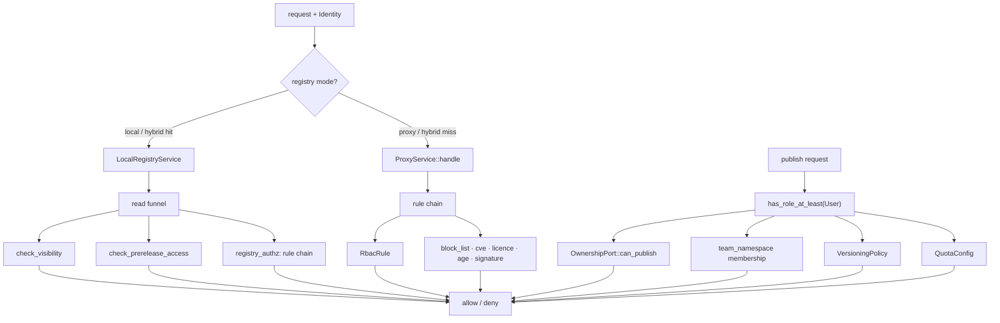
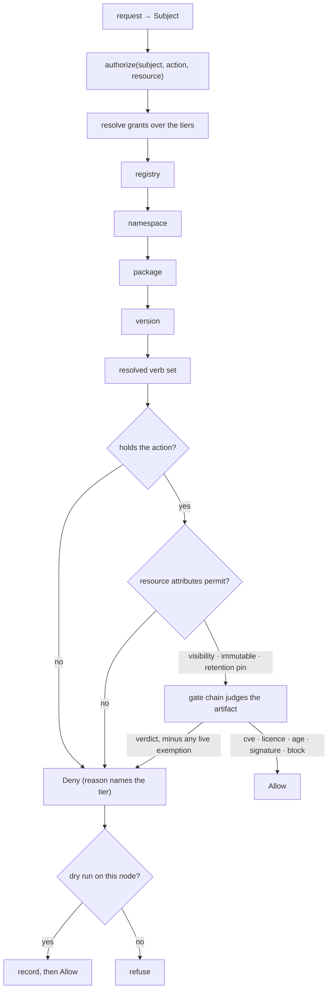

# RFC 0015 — Grants on the resource hierarchy

| Field       | Value                                                        |
| ----------- | ------------------------------------------------------------ |
| Status      | **Implemented** — **phase 0 has landed and is the only part built.** `crates/web/tests/authz_matrix.rs` now carries the write surface it could not previously see (40 route/verb pairs inventoried, 19 exercised, up from none) beside the read one (47 of 97, up from 43), and checks row coverage against the router instead of against a count — which found five routes claimed as covered with no row behind them and five exercised without the claim, a swap the old check could not detect. Nothing in §4–§6 exists: no `Action` enum, no grants, no decision function. **Phases 0b, 1 and 2 have landed and phase 3 is partly built.** Phase 0b: §11.7's document arms are measured at all three corpus sizes, and the naive filtered build is **806× slower** than the cached one at size M, scaling linearly in package count — so the grant-set cache key is load-bearing and phase 3 must be designed around it rather than retrofit it. Phase 1 shipped the closed `Action` vocabulary (18 verbs, four ecosystem-scoped), moved wildcard expansion to config load with §10 rule 3's legacy reading built in as a distinct type, made an unknown or wrongly-scoped verb a startup error, and added `task config:explain` — which immediately found three permissions this repository had been granting to nobody, one of them in the published docs. Phase 2 added `authorize(subject, action, resource)` in `crates/core/src/services/authz/` — `Subject`, `Resource`, `Tier` and `Decision` entities, `registry_authz.rs` absorbed, `check_visibility` and `check_prerelease_access` behind the same funnel — and deleted `RequireRole`, whose deferred comparison had silently turned every `bypass_roles` gate into a no-op at two call sites. Phase 3 has its model, its gate and its config surface — grants, subject matching, resolution with sealing and the administrative floor, the §10 translation, the §11.3 differential harness, a resolution fuzz target, and `[registries.grants]`/`[[registries.namespaces]]` built into node hierarchies and printed by `explain-config` — and **grants are on the request path**: `RbacRule` is out of the chain and resolution answers in its place, which the authorization matrix caught three ways before it was right. `explain` (§4.8) ships with its §11.6 oracle test, and §6.3's `grants` table supplies the package and version tiers. Ownership rows are migrated (§10 rule 9) and written through on publish — but **not** enforced from grants, because §5.1's claim that ownership becomes a package-level grant would *widen* every estate under §4.3's union: ownership narrows and grants only widen. Both §5.1 and rule 9 are corrected in place. **Phase 3 is complete.** §4.4's filtering is wired into every whole-registry document — the two RubyGems compact-index documents phase 0b measured, plus the JetBrains plugin list, the Open VSX search, Composer's `available-packages` and conda's `repodata.json` — each with a fast path that costs a caller holding a broad read grant nothing, and `DocumentCache` keying the measured pair by resolved grant set with generation-based invalidation. Wiring conda found a **disclosure that predates this RFC**: `repodata.json` was built from `backend.get_versions` with no visibility check at all, so a team-visible package was named to every caller who fetched the channel — which conda does on every `conda install`. Both halves of §11.7 have now run and **both pass**. *Resolution* is flat across a 250× estate-size difference, so it is bounded by hierarchy depth rather than estate size and phase 4 may build the `policy` table on this design. *Documents*: arm 3 lands within **1.0×** of arm 1's p99 against arm 2's 806×, a second caller sharing a grant set is served from the first one's entry, and arm 4 is therefore not built — §11.7 made it conditional on arm 3 missing. **Open question 5 is closed, and this document now has none.** The harness found a widening in **§10 rule 2 as this document originally wrote it**, which is corrected in place. **Phase 4 has landed.** The tier system carries all five remaining policies with §4.1's per-policy composition rules — `visibility` and `prerelease_visibility` deepest-wins, `versioning` and `quota` wholesale, `rules` per gate — plus the narrowing warnings that compensate for wholesale's sharp edge; §6.3's `policy` table and its admin API ship for the package and version tiers, which unblocks [RFC 0016](/rfc/0016-retention-and-the-permanence-of-a-published-name)'s retention tiers; `[[registries.namespaces]]` carries `visibility`, `versioning`, `quota` and `rules`, and `[registries.beta_channel]` translates to `prerelease_visibility` (§10 rule 6); §4.9's rejections and warnings are in; `immutable` and `monotonic` are enforced on the publish path; and gate exemptions ship with `gates:exempt`, the two-gate line, the required expiry and reason, and the self-approval marker. **The one user-visible change is the version table**: the two disagreeing definitions of "pre-release" are one, so `1.0-SNAPSHOT` is now labelled correctly and `2.0.0+build-1` stops being called one — and nothing broke, because nothing pinned the old behaviour at any of its three call sites. Two more of this document's own statements needed correcting in place: **§4.5's `immutable`** describes an overwrite capability that mostly does not exist (this server already refuses every republish except on Maven's multi-file path, and `releases:overwrite` is granted by rule 5 and consumed by nothing), and immutability turns out to be a question about *bytes* rather than about a coordinate — a Maven release is several files, so deciding on the version row made an `always` namespace refuse the jar of the publish that had just created it. **Phase 5 has landed, and with it every phase this document defines.** `batlehub authz explain` and `authz shadow` answer from a terminal; `/admin/security/authorization` gathers §4.8's five panels, with Shadow first because it is the only one that can be *currently wrong*; the operator documentation is merged into `/guide/access-control`. Building it required **§4.7, which no phase owned and nothing had implemented** — every `dry_run` in the tree was retention's — so shadow mode ships here with its counter, its structured line, its admin endpoint and the reload warning §4.7 asks for on every reload. Two of its details are decisions the section does not make: `grants.dry_run` cannot typecheck inside a `subject → [verb]` map, so it is a sibling `[…grants_shadow]` block whose **required `until` makes an expiry-less shadow unwritable**; and a shadow anywhere on the path covers the coordinate, because a denial is the absence of a grant rather than one node's decision. An **expired shadow enforces**. Phase 5 also found that `explain` could contradict the server — under a shadow the grants refuse and the request is served, and the §11.6 oracle could not catch it because no fixture had a shadow — so the answer now reports both facts rather than folding either into `decision`, and one shared `resolve_policy` serves the enforcement path and the diagnostic. **The write verbs are now on the request path too, and until they were, "every phase has landed" was not true.** `releases:publish`, `releases:overwrite`, `releases:yank` and `releases:delete` were translated by §10 rule 5, stored by migration 042 and reported by `explain` while being requested by *no route* — so a `[registries.grants]` block withholding publish, or a `grants = {}` seal on a namespace, changed nothing about who could publish there, and `explain` answered `deny` for a request the server served. §6.1's replacement of `has_role_at_least(&Role::User)` is what closes it — and *replacement* rather than addition, which took two passes: the first kept the role assertion as a floor, and a role assertion in front of the engine silently overrides the config it is supposed to enforce. All nine are deleted; publish keeps one **identified-principal** test, which is not a role question but survey finding 1's shape (an anonymous publish creates an owner-less package, and `can_publish` answers `true` for one). Roles still decide plenty — inside the engine, as one of §4.3's five subject forms (§8.3). The six hide-family mutations share `releases:yank` per §4.2 rule 3, and `releases:overwrite` is consumed at exactly `immutable`'s scope. **The three tests that would each have caught it independently — §11.5's dead-end check, §11.1's axis D and §11.6's oracle over write routes — none of them existed**, which is why a phase could report itself complete without them. `releases:list`, `catalogue:browse`, `stats:read`, `audit:read`, `packages:block`, the two `owners:` verbs and all four ecosystem verbs are **still granted and requested by nothing**, and §13.8 names them rather than leaving the next reader to find out. **Two more projections were one call site each rather than a rule.** §4.4's listing filter resolved the *registry node alone*, so `[[registries.namespaces]]` was invisible to all six whole-registry documents in both directions — a namespace grant did not widen (an empty index for the estate §1's example describes) and a namespace seal did not narrow (Composer's `available-packages`, the one document with no per-package fallback, enumerated a sealed namespace). And §10 rule 9's ownership projection covered **one of the five doors** ownership changes through, so `package_owners` and `grants` diverged from the first owner change on any estate and a removed owner kept `releases:publish` permanently; it is a decorator on `OwnershipPort` now, with the inline write on publish deleted rather than duplicated. Both are the same shape as the write verbs and as §13.5's 44 disclosing routes: **a funnel the callers do not all pass through is not a funnel.** **§4.2's deferred `require_admin` split is done too, and the helper is deleted**: thirteen new control verbs over 98 call sites in 28 files, every one granted to `role:admin` by §10 rule 5 so an administrator's reach is unchanged and each verb becomes delegable. It needed a **fifth tier** — about a dozen of those endpoints name no registry, and §4.1's hierarchy started at `registry`, so `instance` is added above it and prepended to every path; that is an extension of §4.1 rather than an application of it. Three bugs on the way, all caught by tests that already existed: an unknown registry refusing instead of contributing no node, a bulk request with **no items** skipping authorization entirely, and the admin bulk endpoints scoped to the registry — where rule 5 grants `releases:yank` to `role:user`, so a user reached an admin surface. `gates:exempt` is still granted to nobody, deliberately, including at the new tier. **A fourth bug was not caught by anything, because nothing was looking**: `explain`, `access-check` and the listing filter all built their path with `path_for`, which cannot see the instance tier — so both diagnostics answered `deny` where the server answered `allow`, §11.6's *"a diagnostic that can disagree with reality is worse than none"* arriving a second time after §13.7's shadow. One `resolution_path` builder now, and the tier is covered by direct `authorize_control` tests, an `explain` oracle fixture with an instance-only grant, config tests for `[grants]`, and a §11.3 assertion that the tier grants no verb the harness compares. **§4.4's aggregates are filtered too, and were the last part of this document with nothing behind it.** `registry_explore_stats` had no visibility predicate at all — so `package_count` and `total_downloads` were computed over `internal`, `team` and `private` packages alike, survey finding 12 one level up — and bound `NULL` for an empty scope, which `$1 IS NULL OR …` reads as *every* registry: **survey finding 2 verbatim, still live**, on an endpoint any browsing caller could reach. Both are closed, one visibility rule now serves all three tables that feed a tile, the stats cache key carries the viewer (finding 11, a third time), and `stats:read` replaces `require_admin` on the two admin endpoints with §4.4's boundary made explicit: **held nowhere is a `403`, held somewhere filters** — the reading that turns an admin-only surface into one answering `200` to anonymous is the one the two pre-existing tests caught. Grants are deliberately *not* in that filter: the aggregate must agree with the listing it summarises, and grants do not filter the explore catalogue yet, so closing that is one change covering both rather than a tile stricter than its own page. **§11.5's dead-end test is written** (§13.13), five phases after §13.3 deferred it: every verb in the enum is requested by some route, or is on a list with a reason that fails the day it stops being true. Six of 31 are on it — four name actions this server does not implement, and **two gate actions it does**: `releases:list` (every listing route still asks `releases:read`) and `catalogue:browse` (the explore routes still use the legacy access sets). Its own first two failures were bugs in the scan, one of them the dangerous direction — a test file read as a route. §13.1–§13.13 record what each phase found |
| Short       | Grants on the hierarchy                                       |
| Settles     | How a request is authorized: one permission vocabulary with write verbs, grants that attach to a registry/namespace/package hierarchy, and namespaces that carry visibility, immutability and gate policy for everything beneath them |
| Author      | Max Batleforc <maxleriche.60@gmail.com>                       |
| Co-author   | —                                                             |
| Created     | 2026-08-27                                                    |
| Supersedes  | — (proposes absorbing [RFC 0011-bis](/rfc/0011-bis-namespace-scoped-visibility) on acceptance, see §9.1) |
| Touches     | `crates/core` (permission vocabulary, decision function, namespace resolution), `crates/config` (grant blocks, namespace blocks, migration), `crates/adapters` (grant storage, SQL predicates, migration), `crates/web` (every handler's declared verb, admin API), `cli/`, `ui/`, docs |

---

## 1. Summary

Today an operator writes `user = ["releases:read", "source:read"]` and believes they have configured this server's authorization. They have configured **half of one third of it**. Those two strings are the entire permission vocabulary; there is no write verb at all, so that block says nothing about who may publish, yank, or delete. And a grant can only be attached to a whole registry, so "the payments team owns `@acme/billing-*`" is not expressible.

This RFC replaces that with one model: a **resource hierarchy** (registry → namespace → package → version), **grants that attach at any level of it** and inherit downward, and a **verb vocabulary that includes writes**. A namespace stops being a matching rule used only by the visibility check and becomes the unit an operator configures — carrying its grants, its default visibility, its immutability policy and its gate overrides for everything published beneath it.

The point is not more knobs. It is that the nine mechanisms which today answer "who may do what" — ownership, visibility, versioning policy, quota, beta channels, console browse, `bypass_roles`, signed URLs, `firewall_only` — exist because two read verbs and two roles could not say what each ecosystem needed. Each was built locally, with its own config block and its own place to forget it. That is the same defect the 2026-08-26 security survey found ten times on the read path, one layer up.

### Before / after

```toml
# today — the whole authorization vocabulary
[registries.rbac]
anonymous = []
user      = ["releases:read", "source:read"]
admin     = ["*"]
# who may publish? not expressible here. It is `has_role_at_least(Role::User)`
# in publish.rs, registry-wide, modulated by ownership and namespaces if those
# happen to be configured elsewhere.
```

```toml
# proposed
[registries.grants]
"*"                = ["releases:read"]              # anonymous, this registry
"group:*:engineer" = ["releases:read", "source:read"]

[[registries.namespaces]]
match      = "@acme/billing"
visibility = "team"                                  # default for what lands here
immutable  = "released"                              # SNAPSHOT overwritable, release not
[registries.namespaces.grants]
"group:oidc1:payments" = ["releases:*", "owners:write"]
"group:oidc1:audit"    = ["releases:read"]
```

A reader of the second block can answer "who may publish to `@acme/billing/cards`?" without reading any Rust.

---

## 2. Motivation

The survey's central conclusion was that authorization is applied *by convention rather than by construction*. RFC-less work since then moved every local read through one funnel (`crates/core/src/services/registry_authz.rs`), which closed that instance. It did not close the cause, because the cause is upstream of the funnel: **there is no language in which most authorization decisions can be stated**, so each one grew its own mechanism.

Three facts, each verifiable in the tree today:

1. **The vocabulary is two strings.** `crates/core/src/rules/mod.rs` defines `RELEASES_READ` and `SOURCE_READ` and nothing else, for twenty-one registry types.
2. **There is no write verb.** A search for one across `crates/` returns nothing. Publish authorization is a single `has_role_at_least(&Role::User)` at `local_registry/publish.rs:151`.
3. **There is no resource between registry and package.** conda channels, OpenVSX publishers, Terraform namespaces, deb components and Maven groupIds are all real units an operator wants to grant on, and none of them can hold a grant.

What filled those gaps:

| Question | Mechanism today | Lives in |
| --- | --- | --- |
| Who may publish *this* package | `OwnershipPort::can_publish` | code, cargo owners API |
| Who may *see* this package | `check_visibility` + `team_namespace` | code, RFC 0011-bis (Draft) |
| Who may overwrite a version | `VersioningPolicy` | its own config block |
| How much may be published | `QuotaConfig` | its own config block |
| Who receives pre-releases | `BetaChannelConfig` | its own config block |
| Callers with no credential | signed URLs | RFC 0012 |
| Per-rule exemptions | `bypass_roles` on seven rules, and once more outside them | inside each rule, plus the integrity block |
| Whether anything is cached | `firewall_only` | its own flag |
| Who may search or browse the catalogue | `rbac.explore` | a fourth field of `[registries.rbac]` |

Nine answers to one question, in nine shapes. An operator who wants "this team publishes here, that team only reads" must currently understand four of them and will still not be able to express it.

`bypass_roles` is the row that shows how far this spreads once a mechanism is available: `cve_gate`, `deny_latest`, `license_gate`, `release_age`, `signed_release`, `trusted_publisher` and `version_gate` each carry their own copy, and an eighth sits on the integrity block's `require_metadata` gate (`crates/config/src/schema/registry.rs:268`), which is not a rule at all. Eight independently-configured escape hatches, none of which can be listed, granted or audited together.

The last row is the one that makes the point best, because it hides inside the block this RFC quotes as the whole vocabulary. `RbacConfig` has four fields, not three: `anonymous`, `user`, `admin` — and `explore`, a per-registry anonymous/user/admin gate on the console's browse and search surfaces (`crates/config/src/schema/rules.rs:24`), with five call sites under `handlers/front_office/explore/` and its own computation in `server/src/hot_config.rs:387-430`. It exists because "may read packages" and "may enumerate the catalogue" are different exposures and the two read verbs could not tell them apart. §4.2 gives it a verb and §10 rule 2 translates it.

---

## 3. Goals / non-goals

**Goals**

- One vocabulary covering reads *and* writes, closed rather than stringly-typed, so a route cannot request a permission nothing grants — and **extensible per ecosystem**, because twenty-one protocols do not have twenty-one identical action sets (§4.2).
- Grants attachable at any tier of that hierarchy, inheriting downward by union with no precedence between tiers or subject forms (§4.3).
- The namespace as a configurable policy node: grants, default visibility, immutability, gate overrides.
- One decision function every path calls, reads and writes alike.
- Absence of a grant never meaning "everything".
- A migration in which every existing config keeps its current meaning.

**Non-goals**

- **Authentication.** How a caller proves identity is RFC 0011's problem and the provider chain's. This RFC starts from a resolved `Identity`.
- **Signed URLs.** RFC 0012 owns minting and redemption. This RFC only requires that a redeemed signed URL produces a subject the decision function can judge, which it already does.
- **A policy language.** No Cedar, OPA or embedded expression evaluator. See §8.1.
- **Per-request attribute conditions** (time of day, source IP). The subject/action/resource triple is the scope; conditions are a later RFC if ever.
- **Retention and tombstones.** Reclaiming locally published versions, and the permanence of a published coordinate, are [RFC 0016](/rfc/0016-retention-and-the-permanence-of-a-published-name) (§4.6). This document defines the tier they attach to and the `releases:delete` verb they exercise; it does not define what deletes.
- **Re-litigating the rule chain's contents.** `cve_gate`, `license_gate` and friends keep their semantics; this RFC changes only where they are configured and how they are reached.

---

## 4. User-facing design

### 4.1 The resource hierarchy

```
registry            npm1
  └── namespace     @acme/billing          (ecosystem-defined separator)
        └── package @acme/billing/cards
              └── version 1.4.2
```

All four are **policy tiers**, not only addressing: see below.

A namespace is matched, not enumerated: `match = "@acme/billing"` covers `@acme/billing/cards` and `@acme/billing/ledger`. Matching is on segment boundaries using the ecosystem's own separator, so `@acme/billing` never matches `@acme/billing-internal` — the bug RFC 0011-bis §4.2 records for `digital` vs `digital.pipeline-tools`.

The separator table from RFC 0011-bis §4.2 is carried over unchanged and becomes the definition of "namespace" for every ecosystem: `/` for npm scopes and Go modules, `.` for OpenVSX publishers and NuGet ids, `:` for Maven groupIds, the channel for conda, the namespace segment for Terraform, the component for deb.

#### Every tier carries policy

The hierarchy is not only what grants attach to. **Registry, namespace, package and version are a general tier system**, and policy may be declared at any of them:

| Policy | What it says | registry | namespace | package | version |
| --- | --- | :-: | :-: | :-: | :-: |
| `grants` | who may do what (§4.3) | ✓ | ✓ | ✓ | ✓ |
| `visibility` / `prerelease_visibility` | how wide the audience is (§4.5) — the model's one narrowing dimension, where `grants` only widen | ✓ | ✓ | ✓ | ✓ |
| `versioning` — naming | `enforce_semver`, `pattern`, `allow_prerelease`, `monotonic` (§4.5) | ✓ | ✓ | ✓ | — |
| `versioning` — `immutable` | whether these bytes may be replaced (§4.5) | ✓ | ✓ | ✓ | ✓ |
| `retention` | what is kept ([RFC 0016](/rfc/0016-retention-and-the-permanence-of-a-published-name)) | ✓ | ✓ | ✓ | ✓ |
| `quota` | how much may be published (§4.5) | ✓ | ✓ | ✓ | — |
| `rules` | which gates judge the artifact (§4.5) | ✓ | ✓ | ✓ | ✓ |

**Not every policy is meaningful at every tier, and the table says so rather than implying uniformity.** The naming half of `versioning` governs what a version may be *called*, and at version tier the name already exists — `enforce_semver` on `1.4.0` has nothing left to decide. `immutable` is the opposite: pinning one golden build as frozen inside a namespace that otherwise allows replacement is exactly what a version tier is for. Config load rejects the naming fields at version tier rather than silently ignoring them (§4.9).

The version tier is what makes three otherwise-awkward things expressible, each of which is today either impossible or a registry-wide switch:

- **A single public build** in an otherwise private package.
- **A pin against reclamation** — "our LTS customers run this one; retention never touches it, whatever the pull statistics say." The manual override every automatic policy needs. The tier is this document's; what pins to it is [RFC 0016](/rfc/0016-retention-and-the-permanence-of-a-published-name)'s (§4.6).
- **A gate exemption on one version** — a CVE assessed as not applying to this estate, accepted deliberately, instead of turning `cve_gate` off for the whole registry. §4.5 constrains this one, because it is a deliberate weakening.

Registry level is the **default for everything beneath it** — the place an administrator says "unless a team says otherwise, this is how this registry behaves". Some of that exists today, unevenly: `[registries.rbac]`, `[registries.rules]` and `[registries.versioning]` are already registry-level, while visibility and retention have no registry-level expression at all. The tier system regularises what is there rather than inventing it.

#### How tiers compose

The composition rule is **not the same for every policy**, and pretending otherwise would be the trap. Each is chosen so that the *mistake* fails in the recoverable direction, and the direction differs by what the policy does:

| Policy | Composition | Why |
| --- | --- | --- |
| `grants` | **additive** — union of every matching grant on the path | Fewer permissions is the safe direction, so a union of what matched fails closed when nothing does. |
| `visibility` | **deepest wins** | It is a single value; there is nothing to merge. Already the per-package override in RFC 0011-bis §4.3. |
| `versioning` | **deepest wins, wholesale** | See below. |
| `retention` | **deepest wins, wholesale** | See below. |
| `rules` | **deepest wins, per rule** | Each gate is independently configured. A wholesale override would force redeclaring `cve_gate` and `license_gate` to change `release_age`, and a forgotten one is a gate silently switched off — fail-open. |

The same rules apply at the version tier; it is a fourth level, not a special case.

`versioning` and `retention` are wholesale rather than merged because their motivating case is a *narrower* policy on a deeper tier: the one package in an ordinary namespace that publishes a 2 GB artifact per CI run, or the one that follows a different release convention. A per-field merge cannot express that — an inherited `keep_if_pulled` can never be dropped, so a deeper tier could only ever keep *more*. Wholesale is also greppable: what you see on the node is what runs.

The cost is a real sharp edge, and validation is what compensates. Declaring a block at a deeper tier that omits a keep condition (or a versioning constraint) its parent declared is a **warning on every reload** — narrowing is precisely the edit that reclaims something someone was relying on, or accepts a version its namespace would have refused.

Package- and version-level policy cannot live in the config file: a registry with 200 000 packages will not enumerate them in TOML, let alone their two million versions. Both are set through the admin API and stored in one `policy` table keyed by tier, covering every policy kind rather than one table per feature.

### 4.2 The verb vocabulary

A closed enum, not strings. The **shared core** — actions every ecosystem has, in the same shape:

| Verb | Covers |
| --- | --- |
| `releases:read` | artifact bytes |
| `releases:list` | version documents, protocol indexes and search results — including the cargo sparse index, which is a version listing whatever its URL suggests |
| `source:read` | source archives (Go `.zip`, GitHub tarball) |
| `catalogue:browse` | the console's explore and search surfaces |
| `releases:publish` | creating a new version |
| `releases:overwrite` | replacing an existing version — see §4.4 |
| `releases:yank` | yank and unyank |
| `releases:delete` | hard delete |
| `owners:read` / `owners:write` | the ownership list |
| `packages:block` | administrative block/unblock |
| `gates:exempt` | accepting a `cve_gate` or `license_gate` finding on one version (§4.5) |
| `stats:read` | download counts, storage totals and the aggregates the console dashboard is built from (§4.4) |
| `audit:read` | the access log |

`releases:*` and `*` expand at config-load time, never at evaluation time, so an expansion is a fact about the loaded model rather than something implied at each decision. Making it *visible* takes a new task — `task config:explain`, which dumps the expanded grants for a config file and does not exist today; it lands with the vocabulary in phase 1 (§13), because an expansion nobody can print is only half of the property this paragraph claims. Note what that means for `gates:exempt`: it lives under a different prefix from `releases:`, so `releases:*` never reaches it. Silencing a finding is not something a publisher acquires by being able to publish.

`releases:list` is new and splits today's overloaded `releases:read`: a listing names no single version, which is why `authorize_listing` exists as a separate function running only the `rbac` rule. Making that a verb rather than a special case removes the function — and lets a listing be *filtered* by the per-version grant rather than refused wholesale, which §4.4 settles.

The split does not fall cleanly along today's two constants, which is why §10 rule 4 exists rather than a field-for-field carry. Handlers pass `RELEASES_READ` for most listing documents — the npm packument (`npm/read.rs:63`), the NuGet flat index (`nuget/flat.rs:62`), Composer metadata (`composer/metadata.rs:69`) — while the cargo sparse index goes out under `SOURCE_READ` (`cargo/index.rs:217`). Both of today's verbs therefore authorise some listing, and a translation that gave `releases:list` to only one of them would take working access away from whichever estates granted the other.

**`catalogue:browse` is not `releases:list`**, and the distinction is load-bearing rather than fastidious. `[registries.rbac.explore]` is already a separate gate for the reason §2 gives: browsing a catalogue in a console and resolving a version document from a package manager are different exposures. "Build agents resolve everything, people browse nothing" is a real configuration and a common one on a mirror, and one verb could not express it. Folding the two together would either hand every browse-denied role the protocol listings or take the protocol listings from every console-denied one — a widening in one direction or a breakage in the other.

#### When one ecosystem needs a verb the others do not

The core above is what twenty-one ecosystems have in common. They also each have actions nobody else has, and some of those are authorization decisions in their own right:

| Ecosystem | Action with no equivalent elsewhere |
| --- | --- |
| npm | moving a `dist-tag` — neither publishing nor reading, but repointing what `latest` means |
| OpenVSX | claiming a publisher namespace |
| Terraform | registering the GPG key a namespace's providers are signed with |
| JetBrains Marketplace | assigning a plugin build to the stable or EAP channel |
| Maven | promoting a staged repository, if staging is ever supported |
| deb / rpm | re-signing repository metadata, managing components |

"Move `latest` to this version" is not `releases:publish` — the bytes already exist and nobody is adding any — and it is not `releases:read`. Forcing it into an existing verb makes the grant mean something different on npm than it does anywhere else, which is how a vocabulary stops being one.

**So the enum is extensible, and stays closed.** An ecosystem-specific verb is added as a variant like any other, under its ecosystem's prefix:

```
npm:dist-tags:write
openvsx:namespace:claim
terraform:signing-keys:write
jetbrains:channel:assign
```

Three rules keep that from becoming an escape hatch:

1. **It is still the enum.** There is no free-text verb, ever. Adding one is a code change the compiler propagates to every match, which is the property §4.2 exists for — a typo'd `resource_type` string is currently a permission nothing ever grants and nobody ever notices.
2. **A verb is scoped to the registry types that define it.** A grant naming `npm:dist-tags:write` on a Maven registry is **rejected at config load**, not silently inert. The registry type is known at that point, so this is checkable, and "I granted it and nothing happened" is the failure mode this removes.
3. **Prefer the shared verb when the action really is the same.** A new ecosystem's "hide this version from resolution" is `releases:yank`, not `myeco:unlist:write`. The test is whether an operator reading a grant on a mixed estate would expect them to mean the same thing; if yes, it is one verb. Ecosystem prefixes are for what is genuinely peculiar, not for what is merely spelled differently.

#### A different door is not a different action

The rule above has a second edge, and it is the one more likely to be crossed: **the same action reached through a different client is still the same verb.** Downloading an artifact from the console is `releases:read`, not a `console:download` of its own. The console calls the same `/proxy/{registry}/…` routes every package manager calls — `ui/src/client/sdk.gen.ts` is generated against them — with the same credential, so a verb that gated the button and not the route would deny nothing. It would hide an affordance while the request behind it kept working, which is the "authorization by convention" shape §2 opens by describing, arriving as a feature.

The combinations an operator actually wants are already expressible, because `catalogue:browse` and `releases:read` are ANDed like any two verbs: browse-without-bytes is the first and not the second, and CI-pulls-while-nobody-browses is the second and not the first. The one thing this cannot say — *this principal may pull with `mvn` but not from the console* — is a condition on the request rather than on the resource, which §3 rules out as a non-goal and which nothing here could enforce anyway.

`catalogue:browse` and `stats:read` are not counter-examples. Neither gates a door onto an existing resource; each names a distinct resource with its own disclosure surface — the catalogue as an enumerable list, and the aggregates computed over it.

> **Deferred, and recorded so it is not lost: decomposing `require_admin`.**
>
> `require_admin` guards about twenty handler files — health, notification subscriptions, the package admin API, the governance endpoints, and the ops controls for eviction, quota, warming and IP blocks. By this document's own logic that blob should become verbs, and it is **not** in this RFC.
>
> The line drawn for now is what a wrong answer costs. **Disclosure surfaces get verbs here**, because leaking private package names is the survey's entire finding class: `catalogue:browse`, `stats:read` and `audit:read`. **Control surfaces stay `role:admin`**, because a wrong answer there is an outage rather than a leak, and a role is a defensible granularity while the model beds in.
>
> The rest is a follow-on to [RFC 0004](/rfc/0004-admin-composition-and-api-surface), which owns the admin API's shape, rather than more of this document — which already changes every handler. `role:admin` is a subject form (§8.3), so decomposing it later adds verbs beside a grant that already exists instead of replacing one.
>
> **Done 2026-08-29 (§13.12), and the deferral's own reasoning is what made it
> cheap.** *"Adds verbs beside a grant that already exists"* is exactly how it
> landed: thirteen new verbs, all of them granted to `role:admin` by §10 rule 5,
> so every administrator reaches on upgrade precisely what they reached before
> and each verb becomes delegable on its own. `require_admin` is **deleted** —
> 98 call sites across 28 files — rather than deprecated.
>
> One thing this section did not anticipate, and it is why the deferral was
> right at the time: about a dozen of those endpoints **name no registry**, and
> §4.1's hierarchy starts at `registry`. There was no node their grants could
> attach to. §13.12 adds one.

Note that prefixing also does the right thing under expansion: `releases:*` reaches no ecosystem verb, and `npm:*` reaches only npm's. A grant cannot acquire the ability to repoint `latest` by being generous about releases.

#### Adding a verb never widens an existing config, and never breaks one silently

Absence of a grant is not permission (§4.3), so a newly added verb is granted to nobody the moment it ships. That is the correct default and it has an obvious hazard: the flow that verb now governs stops working for every estate that has not yet granted it, on upgrade, with no config change of their own.

That is what §4.7's shadow mode is for. **A new verb ships in dry-run for one release**: the action is permitted, every would-be refusal is recorded against the node that lacked the grant, and the authorization page (§4.8) shows an estate exactly which grants it is about to need. The following release enforces. An operator's first encounter with a new verb is a list, not an outage.

### 4.3 Grants

A grant is `subject → [verb]` attached to a node:

```toml
[registries.grants]                       # registry level
"*"                     = ["releases:read", "releases:list"]
"role:user"             = ["source:read"]
"group:oidc1:engineer"  = ["releases:publish"]
"user:release-bot"      = ["releases:publish", "releases:overwrite"]
```

Subject forms: `*` (anyone, including anonymous), `role:<role>`, `group:<provider>:<name>` with `group:*:<name>` for any provider, `user:<id>`, `token:<name>`. The `group:*:name` wildcard is today's behaviour, preserved.

**`token:` and a PAT are different principals, not competing mechanisms.** RFC 0011-bis settles that *"a PAT carries its creator's groups"* — so a personal access token **represents a user** and resolves to that user's subject plus a subset of their groups. It is a credential, not a principal. A **machine token has no user behind it** — a CI runner, a release bot — and is a subject in its own right, matched by `token:<name>`. The auth provider knows which kind it minted; nothing downstream has to guess.

The invariant that matters, and the reason this is worth stating rather than leaving implicit: **a PAT can never resolve to more than its user holds.** Its groups are a subset, never a superset, and its role is capped at the user's. A token that can exceed its owner is a privilege-escalation primitive, which is precisely what a leaked token is worth to an attacker.

#### Who may write a grant

`owners:write` is the verb that edits grants, and it **inherits downward like any other** — but it may only write grants *strictly below* the tier at which it is held. That single rule turns what would be escalation into delegation, and produces a hierarchy of authority that mirrors where each tier is stored:

| `owners:write` held at | May write grants at | Which live in |
| --- | --- | --- |
| *(nobody — the config file)* | registry, namespace | TOML, reviewed like any other change |
| registry | package, version — anywhere in the registry | the `policy` table |
| namespace | package, version — **within that namespace only** | the `policy` table |
| package | version — of that package only | the `policy` table |
| version | nothing | — |

The rule is not an extra thing to remember, because it is the storage split from §4.1 restated: **`owners:write` writes exactly what the API can write.** Registry and namespace grants are a config-file change and go through whatever review the estate already has; everything below is delegable.

Three properties fall out, and together they are why downward inheritance is safe here:

- **A delegate cannot extend their own reach.** Namespace-level `owners:write` cannot edit namespace or registry grants, so it cannot widen the subtree it applies to, and cannot make anyone an admin.
- **A delegate cannot revoke anything.** Grants are additive (§8.2), so a package-level grant can add permissions but never remove one an ancestor gave — and sealing, the one construct that does take access away, is not writable through the API at all (below). The namespace owner's access is not something a delegate can take away.
- **The blast radius is the subtree, and it is visible.** `explain` (§4.8) names the tier that granted each verb, so "who gave this package that" has an answer rather than an investigation.

What a namespace delegate *can* do is grant themselves `releases:publish` on any package in their namespace. That is intended: it is what being trusted with a namespace means, and it is the authority they already hold today through ownership — just now with a boundary written down and a tier recorded against it.

**Resolution is a union, and only a union.** The resolved permission set for a request is the union of every grant on the path from registry to version whose subject matches the caller. There is no precedence between tiers and none between subject forms: a deeper node does not replace a shallower one's set, and a more specific subject does not replace a broader one's. A grant only ever adds — there is no deny rule (§8.2), and no shape in which one grant subtracts from another.

**Replacement is excluded on purpose, because it is revocation wearing precedence's clothes.** Given registry `role:user = ["releases:read", "source:read"]` and package `role:user = ["releases:read"]`, a union keeps `source:read` and a "deepest wins" rule drops it. Every safety property in this document assumes the first: the delegation bounds above, §7's *a grant can never be revoked by a deeper node, only unmatched*, and §8.2's case against deny rules. A model that resolves by replacing has deny rules — it just does not call them that, and gets them without the trace §8.2 says a deny rule would require.

The cost is that a deeper node cannot narrow. Writing a smaller set further down does nothing at all, and the only way to withhold something an ancestor granted is to seal, which withholds everything. That is what buys order-independence, and it is what makes §11.2's shuffle test assertable: resolve the same hierarchy with the grants supplied in a random order and the result must be identical, which is a property a precedence rule would have to earn and a union has by construction.

**Absence is not "everything".** A node with no grants inherits its parent's. A node with an *empty* grant map (`grants = {}`) grants nothing and stops inheritance — the explicit way to seal a namespace. This is the modelling rule the survey's finding 2 broke, where an empty accessible-registry list read as *all* registries; it is stated once here and enforced by making the resolved set an `Option`-free type whose empty value means empty.

#### Sealing is a config-file construct, and only a config-file construct

`grants = {}` is the one thing in this model that takes access away, so it is the one thing a delegate may not write. **It is expressible at the registry and namespace tiers only** — the tiers that live in TOML (§4.1) — and the `policy` table has no column that can represent it, so a package- or version-tier seal is not a rejected request but an unwritable one.

Without that rule the delegation bounds above are decoration. A namespace delegate holds `owners:write` and may write package and version grants; if sealing were among them they could seal a package and lock out the registry owner who delegated to them — revocation reintroduced one tier below the model that excludes it, stored in a table only the API can edit. Confining seals to the config file means every seal is a reviewed diff and the recovery from a bad one is the same edit that made it.

**A seal also has a floor.** It stops inheritance including of a registry-level `role:admin = ["*"]`, which is what makes it useful and what makes it dangerous. So a sealed node still resolves `owners:read`, `owners:write` and `audit:read` for a subject holding them at the registry tier, and nothing else: an administrator can always see what a seal contains, change it, and read who reached it, and can never be locked out of a subtree of their own registry. `releases:read`, `releases:list` and `releases:publish` do not survive a seal — the floor is the ability to *administer* the sealed node, never to use it. A subtree nobody can reopen is a denial of service that looks like a configuration.

**A seal stops inheritance, it does not disable the nodes beneath it.** A grant written directly on a package inside a sealed namespace resolves normally; what a seal blocks is the namespace's own and its ancestors' grants flowing past it. That is what makes the floor useful rather than ceremonial — the administrator who can still write below a seal has a recovery that does not require reverting the seal itself, which is the difference between a mistake and an outage.

### 4.4 Listings filter, they do not refuse

A caller holding `releases:list` on a namespace but `releases:read` on only some of its packages asks for a version index. The index returns **what they may see**, not `403`.

This is not a new mechanism. It is the one [RFC 0006](/rfc/0006-blocked-versions-hidden-everywhere) already established for administrative blocks: a blocked version is removed from the listing so the resolver routes past it, which is why the Maven and NuGet handlers reach for `proxy_document` rather than `proxy_stream` on their index routes — streaming would deliver a document with the blocked version still in it, and the build would pick that version and fail at download. Grants filter the same document at the same point, for the same reason.

Three rules make it safe:

1. **Filter in the query, never after it.** Totals and pagination are computed on the filtered set. An accurate `total` over rows the caller may not see is a disclosure in itself, and page two of a filtered list is worse. Finding 12 of the 2026-08-26 survey is the direct precedent — private package names reaching the explore catalogue through `package_statuses`. Finding 2 is the sharper warning and a different defect: there the predicate ran, it was simply vacuous (an empty accessible set bound as `NULL`, which `= ANY` reads as *every* registry), and what turned a scoping bug into an enumeration of the whole private inventory was the paging metadata computed faithfully on top of it. A correct count over a wrong scope is not a smaller bug than no count at all; it is the thing that makes the wrong scope worth exploiting.
2. **Two levels, two answers.** No grant on the *package* → answer as though it does not exist, which is what `load_visible_versions_or_not_found` does today. A grant on the package but not on every version → return the filtered list. The caller named the package in the URL, so a filtered listing tells them nothing they did not already assert.
3. **A filtered listing is identity-dependent and must never be cached under an identity-blind key.** This is finding 11's lesson, paid for once already: the search cache held merged local hits under a key that named no identity, so one caller's private results were replayed to the next. The remediation was to cache the *upstream* answer only and merge per request. Any listing that grants filter takes the same treatment.

An empty filtered result is `200` with an empty document, not `404` — for a whole-registry index it discloses nothing, which is the property `crates/web/tests/authz_matrix.rs` already asserts through its `disclosed()` helper rather than through status codes.

#### An aggregate is a listing that has been counted

`stats:read` gates the dashboard's aggregates — top downloads, storage by registry, recent publishes, vulnerability counts. Holding it is not the interesting half. **Every one of those tiles is a query over packages, and it is filtered by the caller's grants exactly like a version index**, for the reason §4.4 rule 1 already gives: a number computed over rows the caller may not see is a disclosure whether or not the rows themselves are returned. "Your most-downloaded package is `@acme/billing-secrets`" discloses the name; "you have 47 packages" over a set the caller can see three of discloses the other 44 exist.

This is the surface where that rule is easiest to forget, because a tile reads as presentation rather than as a query. It is the same defect the survey found three times — finding 2's accurate `total` over an unscoped set, finding 11's search hits, finding 12's `package_statuses` counts — and a dashboard is where it will arrive a fourth time.

Two consequences follow directly rather than needing their own rules:

- **The filter is in the aggregation, not after it.** `SELECT count(*) … WHERE <grant predicate>`, never a count taken first and trimmed afterwards. A `SUM` cannot be trimmed at all, which is what makes this the version of rule 1 that fails silently.
- **A cached aggregate is keyed by grant set or it is not cached.** Dashboard tiles are expensive, so someone will cache them, and §4.4 rule 3 is finding 11's lesson about precisely that. The grant-set key §11.7 measures for listings is the same key here, and an aggregate is cheaper to key that way than a document is — there are far fewer distinct tiles.

`stats:read` without any package grants therefore resolves to a dashboard of zeroes rather than a `403`, which is the §4.4 rule 2 boundary applied one level up: the caller asked for their own view, and their own view is empty.

### 4.5 Namespace policy: visibility, versioning, and gates

The namespace block carries more than grants, because the things an operator wants to say about "everything my team publishes" are not only about who:

```toml
[[registries.namespaces]]
match      = "com.acme.internal"
visibility = "team"          # default visibility for versions published here

[registries.namespaces.grants]
"group:oidc1:platform" = ["releases:*", "owners:write"]
"group:*:qa"           = ["releases:read", "releases:list"]   # 0011-bis's readers, as grants

[registries.namespaces.versioning]    # what a version may be called, and whether it may change
enforce_semver   = true
allow_prerelease = false
pattern          = '^\d+\.\d+\.\d+$'
immutable        = "released"
monotonic        = true              # a new version must sort above the newest existing one

[registries.namespaces.retention]     # what is kept — the block itself is RFC 0016's
keep_if_pulled = "90d"

[registries.namespaces.rules]         # gate overrides, this namespace only
release_age = { min_age_secs = 0 }    # first-party code needs no quarantine
```

**`visibility`** is the default applied to a version published into the namespace, replacing "public unless someone sets it". A per-package override remains (RFC 0011-bis §4.3).

#### Why `visibility` survives alongside `grants`, and `readers` does not

Both answer "who may read this", and a document whose thesis is that two mechanisms for one question is the defect owes an account of why it ships two. The account is that they run in opposite directions, and each has the composition rule its direction needs:

| | Says | Composes | Direction |
| --- | --- | --- | --- |
| `grants` | *this subject may* | union over the path (§4.3) | only widens |
| `visibility` | *the audience is this wide* | deepest wins, one scalar | only narrows |

**A caller needs both**: a grant for the verb, and membership of the audience. That is the `ATTR` gate in §5.0's diagram, and it is an AND rather than a fallback — a `releases:read` grant does not make a `team` package public, and a `public` namespace does not serve a caller no grant matches.

If visibility only widened it would be sugar over subject forms — `public` is `"*"`, `internal` is `"role:user"` — and it should then collapse into grants, the way `readers` does below. It does not collapse, because grants can only add. A `team` package inside a `public` namespace, and its inverse in §4.1 — one public build inside a private package — are exactly the cases the tier system is sold on, and the union makes both inexpressible as grants. Visibility is the model's one narrowing dimension, kept deliberately separate from its one widening dimension so that neither has to carry both jobs and neither needs a deny rule.

Narrowing to *fewer subjects than the parent named* is the remaining case, and it takes one new value rather than a second subject list. **`visibility = "private"`**, at package or version tier, means inherited read grants do not apply — only grants written on that node or below. That is RFC 0011-bis §4.3's empty reader set, which is the shape it uses to keep one package private inside a shared namespace. It is a scalar, so it enumerates nobody and adds no second place to look; it composes deepest-wins like every other visibility value; and §4.3's administrative floor applies to it exactly as it does to a seal, so it cannot lock an operator out of their own registry.

**`readers` is therefore dropped.** It is a list of subjects who may read — which is a grant, spelled differently and composing by a different rule. Keeping it would give the widening direction two spellings and two semantics, in the one section of this document arguing that a single question deserves a single answer. RFC 0011-bis's reader groups become grant subjects (§9.1); nothing it expresses is lost, and the empty-set case is the `private` value above.

**`versioning`** is today's registry-level `VersioningPolicy` — `enforce_semver`, `allow_prerelease`, `version_pattern` — moved to the namespace and **extended with `immutable`**. Moving it is most of the value on its own: a policy that is right for `com.acme.internal` is rarely right for the vendored third-party namespace beside it, and one setting per registry forces the loosest of the two.

`immutable` is new. Nothing enforces immutability today at any level:

| Value | Meaning |
| --- | --- |
| `never` | any version may be replaced by a caller holding `releases:overwrite`, **on a path where a replacement is possible at all** — see the correction below |
| `released` | a release is immutable; a pre-release may be replaced |
| `always` | no version may ever be replaced; `releases:overwrite` grants nothing here |

> **Corrected 2026-08-28, by implementation (§13.6).** Two things this table
> assumed are not true of the tree it lands in.
>
> **`never` does not describe today's behaviour.** Every registry whose publish
> goes through `LocalRegistryBackend::publish` already refuses a republish
> unconditionally, before any policy is consulted, and `releases:overwrite` — which
> §10 rule 5 grants `role:user` on every local registry — was consumed by nothing
> until §13.8 wired it, and is consumed now only where a replacement is possible.
> The exception is the path this section's own example is about: Maven's non-POM
> artifacts, and the path-addressed publishers beside them, write to storage
> directly and a re-PUT overwrites. So `immutable` enforces there and is inert
> elsewhere, and **no value of it makes replaceable anything that is frozen
> today**. Implementing `never` as written would mean building an overwrite path
> and handing it to `role:user`, which is a widening this document has not argued
> for.
>
> **Immutability is a question about bytes, not about a coordinate.** A Maven
> release is a `.pom`, a `.jar`, a `-sources.jar` and their checksums, PUT one at
> a time — so the version row exists from the first file onward and every later
> file of the *same publish* reads as a replacement. Under `always` that made a
> Maven artifact impossible to publish rather than permanent. Multi-file
> publishers therefore name the storage key and immutability is decided on it.

`released` is the Maven shape — SNAPSHOT churns, releases do not — and is the default most estates want and cannot currently express.

`immutable` is also the one `versioning` field honoured at version tier (§4.1) — freezing a single golden build inside a namespace that otherwise permits replacement.

Note the interaction: **immutability is a property of the resource, the verb is a property of the subject, and a replace needs both.** That split is deliberate. It is what lets a namespace be append-only for *everyone, including admins*, which no role-based model can say — and it is why `immutable` lives here rather than becoming another verb.

**`monotonic`** refuses a publish whose version does not sort strictly above the newest existing one for that package — **when the coordinate is new.** A coordinate that already exists is not a new version, so `monotonic` says nothing about it and `immutable` decides; without that split the two collide on the multi-file publish above, where the jar of a coordinate whose `.pom` just landed does not sort above the version it is part of (§13.6), using `services::version_order::newest_first` — already the single ordering function in the tree, and currently carrying only one consumer. It catches what `immutable` cannot: republishing an *older* number after a bad release, which leaves a resolver picking a version that was never meant to come back.

Three consequences worth stating rather than discovering:

- **A yanked or deleted version still counts** as the newest — which the soft delete in [RFC 0016](/rfc/0016-retention-and-the-permanence-of-a-published-name) is what makes possible, and is why §4.6 records this as a cross-document dependency. Otherwise deleting `2.0.0` would let `1.9.9` be re-taken.
- **Pre-releases fall out correctly** without a special case: `1.3.0-rc1` sorts above `1.2.0` and is accepted, while `1.2.0-rc1` after `1.2.0` sorts below and is refused — which is what semver means and what a resolver expects.
- **Bulk import is incompatible with it**, by construction. Importing a package's history publishes oldest-first. The escape is to import with `monotonic = false` and turn it on afterwards; there is deliberately no bypass verb, for the same reason `immutable` has none — a rule an admin can step over is not an invariant, and the point of these two settings is that they hold for everyone.

**Pre-release visibility replaces `beta_channel`.** A namespace may declare a different default visibility for pre-releases:

```toml
visibility            = "public"
prerelease_visibility = "team"     # what [registries.beta_channel] used to say
```

This is one of §2's nine mechanisms folding into the model — the fifth row of that table, gone. `beta_channel` exists because "pre-releases are for members only" could not be said any other way; as a conditional visibility default it is one line at the tier that owns the packages, it composes with everything else by §4.1's rules, and a version-tier `visibility` overrides it for the one build you want to show someone. `check_prerelease_access` stops being a separate gate in the read funnel and becomes visibility resolution.

**One definition of "pre-release", used three times — and there are already two.** `immutable = "released"`, `allow_prerelease` and `prerelease_visibility` all turn on the same question, and today only the last of the three answers it. But it answers it twice, differently:

| Where | Rule | `1.0-SNAPSHOT` | `1.0.0rc1` | `1.0.0-beta.1` |
| --- | --- | :-: | :-: | :-: |
| `local_registry/read.rs:757`, behind `beta_channel` | strict semver parse, optional `v` prefix, Composer `dev-` aliases | **release** | release | pre-release |
| `upstream_detail/mod.rs:228`, the console's version table | `version.contains('-')` | **pre-release** | release | pre-release |

They disagree on Maven's spelling and both are wrong on PyPI's. `semver::Version::parse("1.0-SNAPSHOT")` fails on the two-component core, so the first rule falls through its `unwrap_or(false)` and calls a SNAPSHOT a release — the one case `immutable = "released"` exists to catch. The second calls it a pre-release for the right reason by accident, and would call `2.0.0+build-1` one too.

The crude rule is deliberate, and its doc comment says so: the detail page's two version lists sit in one table, and a row that sorted differently depending on which list it came from would be a visible inconsistency. That reasoning was sound while it had one consumer and no authorization attached to it. It stops being sound the moment a pre-release check decides whether a version may be *replaced* or *seen*.

So the single definition is neither of them as written. It is `local_registry`'s, **re-based on `services::version_order::parse`** — which already normalises `1.0-SNAPSHOT` to `1.0.0-SNAPSHOT` and says so in its own comment — with the console converged onto the result. That is a visible change to the detail page: versions the crude rule called releases will be labelled pre-releases, correctly, and the table's consistency argument is served better by one rule than by two. Five consumers silently disagreeing about what a pre-release is would be a worse outcome than not shipping three of them, and the two that exist already disagree.

#### Quota

`quota` is another of §2's mechanisms, and the one that is least about *who*: it answers how much, not whether. It attaches to tiers anyway, because "how much" is a question about a resource and the resource hierarchy is where resources now live.

```toml
[registries.namespaces.quota]
max_bytes_per_user    = "50GB"     # each publisher, within this namespace
max_packages_per_user = 500
enforcement           = "block"
```

Per-*subject* limits resolved per tier need no new accounting — the same counter `check_and_record_publish` already maintains, with the limit looked up at the deepest tier that declares one. Composition is wholesale, like `versioning` and `retention`, and for the same reason: a narrower quota deeper down is the point, and a field merge could only ever raise it.

Quota stops at the package tier. A per-version quota would be a limit on a thing that is published exactly once, which has nothing to constrain.

> **Deferred, and recorded so it is not lost: the aggregate cap.**
>
> `max_bytes` for a *namespace as a whole* — "the vendored namespace may hold 500 GB, whoever fills it" — is the version of this feature several estates will eventually want, and it is **not** in this RFC. It needs a counter keyed by namespace rather than by user, which is new accounting rather than a new lookup, and dragging it in would inflate a document that already changes every handler.
>
> It is deliberately left as a shape the config can grow into: `max_bytes` beside `max_bytes_per_user` reads naturally, and the tier attachment landing now is what makes adding it later a new field rather than a new model. When it is wanted, the work is the counter and the backfill — not this section.

**A gate exemption at version tier is a deliberate weakening, and is constrained like one.** "This CVE does not apply to how we use this library" is a real and common judgement, and today the only way to act on it is to turn the gate off for the whole registry — which is worse in every respect. So it is expressible:

An exemption is version-tier policy, so by §4.1 it cannot live in TOML — a registry does not enumerate two million versions in a config file. It is a request against the `policy` table:

```http
PUT /api/v1/admin/policy/version/{registry}/{package}/{version}/rules/cve_gate
```
```json
{
  "exempt": true,
  "exempt_until": "2026-12-01",
  "reason": "GHSA-… — the affected code path is not reachable from our usage"
}
```

Shown as the call rather than as a config block on purpose. Every other example in this section is TOML, and one more block in the same shape would read as a fourth thing an operator can write in their config file and then wonder why it does nothing — which is the failure mode §4.1 spends a paragraph preventing.

Setting one requires **`gates:exempt`** on the version's namespace or above — a verb of its own, not implied by `releases:*` and not held by an ordinary publisher. That is the approval model: not a workflow bolted beside the permission system, but a permission, granted by whoever owns the namespace to whoever they trust with it. A team that may publish to `@acme/billing` does not thereby get to decide which CVEs stop mattering there; the namespace owner decides who does, in the same block where they decide everything else about it.

It also means the answer scales with the estate rather than being fixed by this document. A small team grants `gates:exempt` alongside `releases:publish` and moves on; a regulated one grants it to a security group and nobody else. Neither needs a different mechanism.

`exempt_until` and `reason` are both **required**; config load and the API reject an exemption without them. This is the same discipline `grants.dry_run` carries in §4.7 and for the same reason: the realistic failure is not a wrong assessment, it is a right assessment nobody revisited. An exemption is audited on creation, surfaced in the console beside the finding it silences, and expires on its own.

#### Only two gates are exemptible, and the line is not arbitrary

`exempt` exists on `cve_gate` and `license_gate`. It does not exist on any other gate — **not as a rejected value, but as an absent field**, so an exemption on `release_age` is not a refusal at config load, it is a shape that cannot be written.

The line between the two groups is what a gate is *for*:

| Gate | Exemptible | Because |
| --- | :-: | --- |
| `cve_gate` | ✓ | It reports a finding a human can assess. "The affected path is unreachable from our usage" is a real judgement about a real fact, and the fact stays true — what is accepted is the risk. |
| `license_gate` | ✓ | Same shape: counsel approves a licence for one dependency. The declaration is unchanged; the decision is recorded. |
| `release_age` | — | It establishes an invariant, and an invariant with exceptions is not one. A quarantine a version can skip is not a quarantine — the value is entirely in its uniformity. |
| `require_signed_release` | — | An unsigned artifact is not a finding to assess, it is an **absence of evidence**. There is nothing to reason about and therefore nothing to accept. |
| `trusted_publisher` | — | Same family: provenance is established or it is not. |
| `block_list` | — | An administrative block is a decision by an admin. A namespace owner exempting it would be undoing someone else's authority from below. |
| `deny_latest`, `version_gate` | — | Both judge the *request* or the *name*, not the artifact. There is no finding for a per-version exemption to attach to. |

Stated once: **an exemptible gate reports an assessable finding; a non-exemptible gate establishes an invariant.** A future gate is exemptible only if it falls on the first side of that sentence, and adding the field is the decision — not a config value someone can set.

#### Self-approval warns, it does not block

Where `gates:exempt` is held by the same principal that published the version, the exemption is still accepted and is **flagged**. It carries a `self_approved` marker, which appears on the exemption wherever it is listed, in the audit event, and in the console beside the finding.

Blocking was the alternative and it is the wrong trade. Four-eyes enforced by the tool is friction a small team routes around — most often by granting `gates:exempt` more widely, which is strictly worse than the thing it was trying to prevent. A visible marker gives an auditor a filter (*show me every exemption nobody else looked at*) without giving anyone a reason to widen a grant. An estate that wants it as a rule has the ingredients to enforce it in review.

**`rules`** lets any tier override the one above it, per gate. This is the piece that answers the outstanding finding from the 2026-08-26 review: `release_age` quarantines first-party publishes because a rule written for upstream artifacts is applied registry-wide. With namespace rules, `min_age_secs = 0` on the namespace your CI publishes to states the intent directly, instead of choosing between quarantining your own builds and turning the gate off everywhere.

### 4.6 What happens to a version afterwards is RFC 0016

`retention` — reclaiming locally published versions nobody is using — and the **tombstone** that makes a published coordinate permanent are settled by [RFC 0016](/rfc/0016-retention-and-the-permanence-of-a-published-name), not here.

They belong beside each other and apart from this document. They share this RFC's tier system, its `policy` table and its `releases:delete` verb, and nothing else: they are the only features in either document that *destroy data*, and the reviewer who wants to argue about a reclamation policy is not the reviewer who wants to argue about a permission vocabulary. Keeping them here would also have made phases 0 to 2 wait on a schema change reaching every listing query in twenty-one ecosystems, which is the opposite of what §13's phasing is for.

Two couplings run the other way and are stated here rather than only there:

- **`monotonic` (§4.5) is not fully correct until RFC 0016 phase 1 lands.** Its point is catching a republish of an *older* number after a bad release, and that only holds if a deleted version still counts as the newest. Until delete becomes a soft delete, deleting `2.0.0` lets `1.9.9` be re-taken. Phase 4 either waits for it or ships `monotonic` with that hole named.
- **The version tier's retention pin** — "never reclaim this one, whatever the policy above says" — is one of the three things §4.1 gives the version tier, and it is RFC 0016 that gives it meaning. The tier attachment is this document's; what attaches to it is that one's.

`retention` therefore appears in §4.1's tier table and its composition table, because the tier system has to describe every policy that attaches to it, and nowhere else.

### 4.7 Dry run is a property of every policy

Every block in §4 either **refuses** a request or **destroys** data. Both are mistakes an operator wants to discover before they happen, on their own estate, rather than from a ticket. So `dry_run` is not a retention setting — it is available on `grants`, `versioning` and `retention` alike:

```toml
[registries.namespaces.versioning]
enforce_semver = true
monotonic      = true
dry_run        = true          # log what would be refused; refuse nothing
```

This generalises something the codebase has already invented twice, locally: `cve_gate` and `license_gate` both carry a `block` flag whose `false` default means "surface it, never deny". Two rules got warn-only because two authors needed it. Every policy needs it, and it should not be re-invented a third time under a third name.

In dry-run a policy evaluates fully, records what it *would* have done, and does not do it. The record is a structured log line, a `batlehub_policy_dryrun_total` counter labelled by policy and node, and an admin endpoint listing recent would-have-beens so the console can show them.

#### The two directions are not equally safe

This is the part that needs care, and it is why `dry_run` is a per-policy setting rather than one switch:

| Policy | Dry run means | Direction |
| --- | --- | --- |
| `retention` ([RFC 0016](/rfc/0016-retention-and-the-permanence-of-a-published-name)) | nothing is deleted | **safe** — the system does less |
| `versioning` | a badly-named or duplicate version is accepted | **mixed** — bad data lands, nothing leaks |
| `grants` | a request that would be refused is **served** | **fail-open** |

Dry-run on grants is the most useful setting in this document and the most dangerous. It is what makes §10's migration survivable in practice — enable the new model in shadow, watch a week of real traffic, then enforce — and it is also, if forgotten, an authorization bypass configured on purpose.

So it is constrained rather than merely documented:

- `versioning.dry_run` and `grants.dry_run` default to **`false`**. `retention.dry_run` defaults to **`true`**, which RFC 0016 argues from the fact that it is the only one of the three whose dry-run direction is unambiguously safe.
- `grants.dry_run` requires a companion `dry_run_until = "YYYY-MM-DD"`. Config load rejects the flag without it, and refuses to start on a date already past. **A shadow mode that cannot be forgotten is the entire point** — the failure this guards against is not a wrong decision, it is a right decision nobody revisited.
- Every reload logs a warning naming each node in grant dry-run and its expiry, and the config-warnings endpoint carries it, so it appears on the Config Reload page rather than only in a log nobody tails.

### 4.8 One page that shows what authorization did

Every mechanism this RFC removes had its own way of being invisible. Ownership lived in a table nobody rendered, `bypass_roles` was a field inside a rule, the beta channel was a config block, and the only way to answer "why was this refused?" was to read Rust. A single model deserves a single place to watch it, and without one an operator's first encounter with a denial is still a support ticket.

**`GET /api/v1/admin/authz/explain?subject=…&action=…&resource=…`** answers the question directly. It resolves without performing anything and returns the working:

```json
{
  "decision": "deny",
  "reason": "no grant for 'releases:publish'",
  "resolved": {
    "releases:read":  { "granted_by": "namespace:@acme/billing", "subject": "group:oidc1:audit" },
    "releases:list":  { "granted_by": "registry:npm1",           "subject": "*" }
  },
  "attributes": { "visibility": "team", "immutable": "released", "retention": "pinned" },
  "tiers_walked": ["registry:npm1", "namespace:@acme/billing", "package:@acme/billing/cards", "version:1.4.2"]
}
```

`granted_by` is the point. A resolved set without provenance tells an operator *what* they have; naming the tier and the subject form that produced each verb tells them **which line to edit** — which is the difference between a debugging tool and a diagnostic.

The console page gathers the five things this document otherwise scatters, because they are one operational question asked five ways:

| Panel | Answers |
| --- | --- |
| **Explain** | the endpoint above, with pickers instead of query parameters |
| **Recent denials** | what has actually been refused, by tier and reason — the view that turns "someone says it is broken" into a coordinate |
| **Shadow** | what `dry_run` *would* have refused (§4.7), per node, with each node's `dry_run_until` counting down |
| **Exemptions** | live gate exemptions (§4.5), their expiry, their reason, and a filter for `self_approved` |
| **Retention** | the last dry-run report ([RFC 0016](/rfc/0016-retention-and-the-permanence-of-a-published-name)) — what a live run would reclaim, before anyone lets it |

Three of those five are the fail-open or destructive directions of features decided elsewhere in this document. They are on one page on purpose: a shadowed grant, a self-approved exemption and a retention run about to go live are each individually easy to forget, and collectively they are the list of everything currently trusting an operator to remember.

#### The rest of the console reads the same endpoint, and renders instead of enforcing

`explain` has a second consumer beyond this page. **Every affordance in the console asks it what the caller holds, and does not offer what it knows will be refused** — no download button on a package the resolved set has no `releases:read` for, no publish form where there is no `releases:publish`, no exemption control without `gates:exempt`.

That is a rendering decision, not an authorization one, and the distinction is the point. The route still evaluates `authorize` on every request and still refuses; the console's copy of the answer only decides what to draw. A UI that hid a control and left the route open would be the second, weaker copy of the permission model that §4.2's *a different door is not a different action* rules out — and one that refused client-side while the route allowed would be a bug the server never sees. Hiding what would 403 is worth doing because a 403 the user could not have predicted is a support ticket, not because it protects anything.

It also gives the resolved set a second reader, which is a quiet argument for `explain` being an endpoint from phase 3 rather than a page from phase 5.

The same data is available to `batlehub authz explain` and, for the config-file half, to `task config:explain`, so this is not a reason to open a browser. Both are new: the task lands with phase 1 and the CLI command with phase 5 (§13). Neither exists today, and neither has a predecessor — "read the Rust" is the current answer to every question on this page, which is the whole argument for the section.

### 4.9 Validation

Config load rejects, rather than warns:

- a verb not in the enum (today a typo'd `resource_type` is silently never granted);
- an ecosystem-scoped verb granted on a registry of a different type — `npm:dist-tags:write` on a Maven registry is rejected, not inert (§4.2);
- a namespace `match` that cannot occur under the registry's ecosystem separator;
- two namespace blocks whose matches are identical;
- a `pattern` that is not a valid regex, and one that cannot match any string the ecosystem permits as a version;
- `enforce_semver = true` with a `pattern` that no semver string can satisfy — the pair is unsatisfiable and every publish would be refused;
- `monotonic = true` on a registry in `proxy` mode, where nothing is published and the setting can only mislead;
- `grants.dry_run` without `dry_run_until`, or with a date already in the past (§4.7);
- a `versioning` naming field (`enforce_semver`, `pattern`, `allow_prerelease`, `monotonic`) declared at version tier, where the name it governs already exists (§4.1);
- `visibility = "private"` at registry or namespace tier (§4.5), where "only grants written at this node or below" either says nothing or says what `grants = {}` already says properly — it is a package- and version-tier value, and accepting it higher up would give sealing a second, weaker spelling;
- a gate exemption without `exempt_until` or `reason`, or with a date already past (§4.5) — an `exempt` on any gate but `cve_gate` and `license_gate` is not rejected here because the field does not exist on them.

Config load warns for the states that are easy to reach and inert: `immutable = "always"` beside a `releases:overwrite` grant on the same node; a namespace with grants but no `visibility` on a registry whose default is `public`; `allow_prerelease = false` beside `immutable = "released"`, where the pre-release branch of the immutability rule can never be taken.

It warns — rather than rejects — for **`prerelease_visibility` on a registry in `proxy` mode**, which publishes nothing and where the setting can only mislead. Rejecting is the tidier rule and it is the wrong one: `[registries.beta_channel]` carries no mode restriction today (`crates/config/src/schema/registry.rs:159`), so a proxy-mode registry with a beta-channel block starts now, and §10 rule 5 translates that block into exactly this setting. A rejection would stop such an instance from booting on upgrade, which is the one thing §10 forbids. The codebase already settled this shape the same way: `require_signed_release_warnings` (`crates/config/src/schema/mod.rs:515`) skips proxy-mode registries rather than failing them.

`monotonic = true` on a proxy-mode registry stays a rejection, and the difference is not inconsistency. Nothing in today's config can produce it, so no existing instance can be broken by refusing it; a new operator writing it by hand is better told immediately than warned in a log.

It warns for a `prerelease_visibility` *wider* than the `visibility` beside it — pre-releases more visible than releases is legal and is almost always a typo.

It warns, on every reload, for every node in **grant dry-run**, naming the node and its expiry — a fail-open mode belongs on the Config Reload page, not only in a log.

RFC 0016 §4.6 carries the `retention` and `tombstone_detail_for` rules, which are the same discipline applied to the policy that deletes.

---

## 5. Architecture

### 5.0 How authorization works, before and after

Today a request is judged by whichever mechanisms its handler remembers to call, and which ones exist depends on the path it took:



Eight boxes answer one question, and the publish path shares none of its answers with the read path. The 2026-08-26 survey's finding class is what the top fork looks like when a handler takes the left branch and forgets one of the three boxes under it.

After:



One entry point, one resolution, and the same path whether the bytes came from local storage or an upstream. `dry_run` sits at the end deliberately: a shadowed policy still evaluates in full and still records, which is what makes §10's migration observable rather than theoretical.

### 5.1 One decision, four inputs

```rust
pub fn authorize(
    subject: &Subject,          // resolved Identity, or a redeemed signed URL
    action: Action,             // the closed verb enum
    resource: &Resource,        // registry / namespace / package / version
) -> Decision
```

`Decision` is `Allow` or `Deny { reason }`. `RequireRole` disappears: it exists today because `bypass_roles` needed to say "this is fine for a sufficiently privileged caller", which becomes an ordinary grant. Removing it also removes the class of bug where a caller-side `.resolve()` is forgotten — two such sites were found in `registry_authz.rs` during the 2026-08-26 remediation review, both silently reading `RequireRole` as allow.

The six existing mechanisms become inputs rather than parallel paths:

| Today | Becomes |
| --- | --- |
| `RbacRule` | grant resolution over the hierarchy |
| `check_visibility` | a resource attribute the resolver reads |
| `check_prerelease_access` | visibility resolution, via `prerelease_visibility` (§4.5) |
| `OwnershipPort::can_publish` | a package-level grant, written by `register_initial_owner` |
| `rbac.explore` | a `catalogue:browse` grant (§4.2), read by the same resolver as every other verb |
| `has_role_at_least(&Role::User)` on publish and the six `lifecycle.rs` operations | the write verbs, resolved by the same union as every read (§4.3) |

Ownership becoming a package-level grant is the largest simplification: a crate owner *is* a subject holding `releases:publish` and `owners:write` on one package. The cargo owners API becomes a view over grants rather than a second store, and the survey's finding 1 — an unowned crate being claimable by anyone — cannot recur, because "no grant" is not "everyone".

**Corrected 2026-08-28 (§13.5).** The first half holds and has shipped: ownership rows *are* package-tier grants, the owners API can be a view over them, and `explain` shows them. The second half does not, as written. Ownership **narrows** — it refuses a caller who holds `releases:publish` but does not own the package — and §4.3's union only widens, so rule 5's registry-tier `releases:publish` is final and a package-tier grant cannot take it back. Migrating the *enforcement* as this paragraph describes would let any user publish over any other user's package. Ownership belongs on the narrowing side of the model, beside `visibility` in §4.5 and in §5.0's `ATTR` gate, not in the grant union; the row in the table above should move there.

### 5.2 What stays where it is

The rule chain keeps its shape and its position: `authorize` resolves grants first and, if they allow, runs the gates. Gates judge the *artifact* (age, licence, CVEs, signature) where grants judge the *caller*. Keeping them separate is what makes namespace-level `rules` overrides coherent.

`registry_authz.rs`'s two funnels stay. This RFC changes what they call, not that they are the only way in.

---

## 6. Detailed design

### 6.1 `crates/core`

- `entities/permission.rs` (new): `Action`, `Subject`, `Resource`, `GrantSet`.
- `services/authz/` (new module, absorbing `registry_authz.rs`): resolution, precedence, the `authorize` entry point.
- `rules/rbac.rs`: deleted. Its group-wildcard matching moves into subject matching.
- `rules/mod.rs`: `resource_type` string constants deleted; `RuleContext.resource_type` becomes `Action`.
- `services/local_registry/publish.rs`: `has_role_at_least(&Role::User)` replaced by `authorize(subject, Action::ReleasesPublish, resource)`, and a replace additionally requires `Action::ReleasesOverwrite` **and** the resource's `immutable` setting to permit it.
- `services/local_registry/read.rs`: `is_prerelease` becomes the single definition §4.5 describes, reusing `version_order::parse`'s normalisation, and is consumed by the beta-channel gate, `allow_prerelease`, `prerelease_visibility` and `immutable = "released"` alike. It moves beside `version_order` rather than staying a `pub(super)` helper on the service, because it now has consumers outside `local_registry`.
- `services/upstream_detail/mod.rs`: `is_prerelease` — the `version.contains('-')` rule — is deleted, and the console's version table calls the shared definition. This is the drift §4.5 documents, and leaving it in place would mean shipping a fifth opinion in the same release that promises one.

### 6.2 `crates/config`

- `GrantMap` and `NamespaceConfig` in `schema/registry.rs`.
- `RbacConfig` retained and **translated** at load into grants (§10), not deleted.
- `VersioningPolicy` gains `immutable` and becomes valid at namespace level as well as registry level; a registry-level block keeps working and acts as the default for namespaces that declare none.

### 6.3 `crates/adapters`

- A `grants` table keyed `(registry, node_kind, node_match, subject)`; ownership rows migrate into it.
- One `policy` table keyed `(registry, tier, node_key)` carrying every policy kind for the package and version tiers (§4.1) — not a table per feature, and not one per tier. Written through the admin API, since the config file can enumerate neither packages nor versions.
- The SQL visibility predicate becomes a grant predicate; the `explore` CTEs already carry a visibility gate and inherit this. "Predicate" understates it: a visibility check compares a column on the row, where a grant check walks four tiers and unions what matches, so this is a hierarchical join and is the part of the design most likely to be too slow. §11.7 measures it separately from the documents it filters, with its own threshold, before phase 4 builds the `policy` table on top of it.

### 6.4 `crates/web`

Every handler's `resource_type` argument becomes an `Action`. The compiler enumerates the call sites, which is the mechanism that made the `get_artifact` `resource_type` parameter work when it was threaded through by hand during the survey remediation.

---

## 7. Security considerations

- **Migration is the risk.** A translation that widens any existing config is a silent privilege escalation across every deployment. §10 makes the translation assert-equal against the current evaluator rather than trusting review.
- **Additive-only grants** mean a grant can never be revoked by a deeper node, only unmatched. An operator expecting "deny beats allow" will be surprised; §8.2 argues why that is still right, and validation warns on the shapes where the surprise is likely.
- **Sealing is the one construct that takes access away, so it is confined to the config file** (§4.3). It is expressible at the registry and namespace tiers only and has no representation in the `policy` table, because a delegate who could seal a package could lock the registry owner out of it — revocation reintroduced one tier below the model built to exclude it. Three tests: a registry-level `*` grant does not leak into a sealed node; a package-tier seal is unrepresentable rather than merely refused; and the administrative floor — `owners:read`, `owners:write` and `audit:read` held at the registry tier — survives a seal while `releases:*` does not. The floor is a security control in its own right: a subtree an administrator cannot reopen is a denial of service that looks like a configuration.
- **Ownership migration** must not convert "no owner rows" into "everyone". The survey's finding 1 was exactly that reading; the migration writes no grant for an unowned package, and no grant denies.
- **A version-tier gate exemption is a deliberate acceptance of a known finding**, and is gated on `gates:exempt` — a verb no `releases:*` expansion reaches, so publishing to a namespace never confers the ability to silence its gates. Mandatory expiry and reason, audited on creation, shown beside the finding it silences. It replaces what operators do today, which is disable the gate registry-wide, so the control is net stronger even though the mechanism is new.
- **An ecosystem verb widens nothing it does not name.** Prefix-scoped expansion means a generous `releases:*` grant cannot acquire `npm:dist-tags:write`, so repointing what `latest` resolves to stays a decision someone made rather than one they inherited. That matters more than it sounds: moving a tag changes what every unpinned consumer installs, without publishing anything.
- **The gates that establish invariants are not exemptible at all**, and that is enforced by the field being absent rather than validated (§4.5). `release_age`, `require_signed_release`, `trusted_publisher` and `block_list` derive their value from holding uniformly; an escape hatch on any of them converts a control into a suggestion. A future gate joins the exemptible list only by someone adding the field, which is a code review rather than a configuration.
- **Self-approved exemptions are visible, not forbidden.** Blocking them pushes a small team toward granting `gates:exempt` more widely, which is worse than the state it prevents; the `self_approved` marker gives an auditor the filter without giving anyone that incentive.
- **Grant dry-run is a deliberate authorization bypass** for as long as it is on. The mandatory `dry_run_until` (§4.7) exists because the realistic failure is not a bad decision but a good one nobody came back to. It must also be impossible to set globally: per-node only, so the blast radius is what the operator named.
- **Deleting is a supply-chain decision, and it is [RFC 0016](/rfc/0016-retention-and-the-permanence-of-a-published-name)'s.** Tombstones, the permanence of a coordinate and the retention policy that reclaims bytes are argued there, including the three properties this section would otherwise carry: a tombstone is a control rather than bookkeeping, retention destroys the only copy, and the download signal it trusts was incomplete before 2026-08-27. What stays this document's problem is that `releases:delete` is the verb both paths need, and that no expansion of `releases:*` should reach it more readily than any other write.
- **Filtered listings are per-identity.** Any cache in front of one must key on the subject or hold only the unfiltered upstream answer. The search path already had this bug and its fix is the pattern to copy (§4.4, rule 3).
- **Counts and pagination are part of the disclosure surface**, not presentation. §4.4 rule 1 is a security requirement, not an implementation detail.
- **A dashboard tile is a query, not a decoration.** Aggregates over packages disclose the set they were computed over — a top-N names it outright, a total sizes it — so they filter by grants exactly as a listing does (§4.4). A `SUM` is the dangerous shape, because unlike a row set it cannot be trimmed after the fact, so an unfiltered one is invisible in review and correct-looking in tests written by someone who can see everything.
- **`stats:read` and `catalogue:browse` are reductions in privilege, like `audit:read`.** All three come out of `require_admin` and must not be applied silently to the console's own calls, which today authenticate as an admin and expect everything.
- **`audit:read` is new.** Splitting it out of `require_admin` is a reduction in privilege for existing admins and must not be applied silently to the console's own calls.

---

## 8. Alternatives considered

### 8.1 A policy language (Cedar, OPA/Rego, CEL)

Rejected. It is the natural destination for "richer authorization" and the wrong direction for this codebase: it moves the decision out of the type system into a string evaluated at runtime. The finding class this RFC addresses was *routes that did not ask the question at all* — a problem an exhaustive `Action` enum and a compiler-enumerated call-site list solve, and a policy engine does not. Revisit if per-request conditions ever become a requirement.

### 8.2 Deny rules

Rejected for the first iteration. Deny rules make the resolved set order-dependent and make "why was I refused" require a trace rather than a lookup. Every case raised so far ("this group may read everything except `@acme/secrets`") is expressible by sealing the exception with `grants = {}`. Reconsider if a case appears that sealing cannot express.

### 8.3 More roles

Rejected as the primary axis. A fourth and fifth role would still be registry-wide and still could not say "publishes to this namespace only". Roles remain as a subject *form* (`role:user`) for the common case and for backward compatibility, not as the model.

### 8.4 Leaving ownership as a separate port

Tempting, because the port works. Rejected because it is the clearest instance of the pattern this RFC exists to end: a per-package permission living outside the permission model, with its own store, its own API and — as the survey found — its own authorization bug.

---

## 9. Relationship to other RFCs

### 9.1 RFC 0011-bis is absorbed

0011-bis (Draft) settles namespace-scoped visibility: the per-ecosystem separator, reader groups with a per-package override, and groups on a PAT. All three are prerequisites of this document rather than neighbours of it — a namespace that cannot be matched cannot hold a grant, and a PAT with no groups cannot match a `group:` subject.

Carrying both as Drafts guarantees drift. This RFC takes 0011-bis's §4.2 (separators) **as written** — the table is reproduced unchanged in §4.1 and is the definition of "namespace" here.

**§4.3 it takes by requirement rather than by spelling**, which is the one place the absorption is not a copy. 0011-bis needs three things: a namespace grants read to a set of groups, a package may override that set, and the override may be empty so a package can stay private inside a shared namespace. All three survive — the set becomes grant subjects, the override becomes a package-tier grant, and the empty case becomes `visibility = "private"` (§4.5). What does not survive is `readers` as its own key, because a list of subjects who may read is a grant, and shipping it twice under two names with two composition rules is the defect this document opens by describing. An absorption that carried the spelling as well as the requirement would import the problem along with the solution.

**The absorption is proposed, not done.** 0011-bis stays `Draft` and keeps its two open questions until *this* document is Accepted; only then does it become `Superseded by 0015`. A draft that has not been agreed must not close another one — if 0015 is rejected, 0011-bis is still the live answer to a real problem, and it should not have to be resurrected.

### 9.2 RFC 0012 is untouched

Signed URLs mint and redeem a coordinate-scoped credential. Redemption already produces an `Identity`; under this RFC it produces a `Subject`. Nothing in 0012's construction changes.

---

## 10. Rollout and compatibility

Every existing config must keep its exact meaning. The mechanism is a **translation with a differential test**, not a rewrite:

1. **The three role fields and the `groups` map** translate to registry-level grants: `anonymous = [v]` → `"*" = [v]`, `user = [v]` → `"role:user" = [v]`, `admin = [v]` → `"role:admin" = [v]`, group entries → `group:*:<name>` subjects, which is the wildcard form §4.3 preserves.

2. **`RbacConfig.explore` translates to `catalogue:browse` — but the flag is only half of it.** It is the fourth field of the struct rule 1 reads (§2), and it has no other target. Mapping it onto `releases:list` instead would hand every console-denied role the protocol listings, or take the protocol listings from every browse-denied one — a configured control silently widened in one direction or broken in the other. The failure mode of skipping this rule is worse than either: a gate that quietly stops existing.

   **Corrected 2026-08-28, by the harness in rule 10.** This rule previously read "a role whose flag is `true` gains `catalogue:browse` at registry level; a role whose flag is `false` does not", and implementing exactly that produced **19 disagreements** on the first differential run (§13.5). `explore` alone never granted console access. `server/src/hot_config.rs` gates it on a conjunction with the registry's *proxy* tier, cumulative across roles, and then intersects the result with the caller's own access:

   ```text
   (has_anonymous || has_group) && rbac.explore.anonymous
   (has_user      || has_group) && rbac.explore.user
   (has_admin     || has_group) && rbac.explore.admin
   ```

   So the translation is: a role gains `catalogue:browse` when its `explore` flag is set **and** that role's proxy tier is non-empty (or the registry has group grants). A role with the flag set and no permissions of its own reaches nothing today and must reach nothing afterwards.

   Because the second half of that condition is computed from `AccessConfig` rather than from `[registries.rbac]`, this rule lands with the config wiring rather than with the rbac→grants translation, which emits no `catalogue:browse` at all. Stated here rather than left as an implementation note: as originally written, this rule was a specification for a privilege escalation.

3. **A legacy `"*"` does not become the new `"*"`.** `crates/core/src/rules/rbac.rs:47` accepts `"*"` for *any* role, not only `admin`, and today it means "both of the two verbs that exist". Under §4.2's load-time expansion the new wildcard reaches publish, overwrite, yank, delete, `packages:block`, `gates:exempt` and `audit:read`. So a `"*"` found in an `RbacConfig` expands to **today's reachable read set, written out** — `["releases:read", "releases:list", "source:read", "catalogue:browse"]` — and never to the new wildcard. `admin = ["*"]`, which `config.example.toml` ships eight times, is included in that rule: an administrator's write access today does not come from that string, it comes from `has_role_at_least`, and rule 4 restores it explicitly rather than smuggling it through a wildcard whose meaning has changed underneath it.

4. **The read verbs gain `releases:list` together.** Both of today's constants authorise some listing document (§4.2), so any subject holding `releases:read` *or* `source:read` gains `releases:list`. Splitting the new verb out of only one of them would take working access away from whichever estates granted the other, and which one that is varies by ecosystem rather than by intent.

5. **Today's write authority is registry-wide and role-based, and translates that way.** Publish is `has_role_at_least(&Role::User)` at `publish.rs:151`, and yank, unyank, unlist and delete are the same check at six sites in `lifecycle.rs` — none of it expressed in `[registries.rbac]`, so no reading of that block reproduces it. On every local- and hybrid-mode registry the translation writes `"role:user" = ["releases:publish", "releases:overwrite", "releases:yank", "releases:delete"]` at registry level, with `releases:overwrite` still subject to `immutable`, which rule 7 defaults to `never`. Proxy-mode registries get none of it, because they accept no publishes. `packages:block`, `owners:write` at registry scope, `stats:read` and `audit:read` go to `"role:admin"`, which is `require_admin` today — `stats.rs:72` among them, so the dashboard stays admin-only on upgrade and only becomes grantable when an operator writes the grant. `gates:exempt` goes to nobody: it is new, and §4.2's shadow release is how an estate discovers it needs one.

6. `BetaChannelConfig` translates to `prerelease_visibility` at registry level, with its member group becoming a registry-level grant of `releases:read` and `releases:list` rather than a reader list (§4.5) — on proxy-mode registries too, where it is inert and warned about rather than refused (§4.9).

7. `QuotaConfig` is carried over field-for-field at registry level, which is where it lives today; nothing about its enforcement changes.

8. `VersioningPolicy` is carried over field-for-field at registry level; `immutable` defaults to `never`, which is today's behaviour (nothing enforces immutability now, so any other default would change the meaning of an existing config).

9. Ownership rows migrate to package-level grants — `releases:publish`, `owners:read` and `owners:write` on the one package, which is the scope `OwnershipPort` already has. Registry-wide `owners:write` is rule 5's admin grant and nothing else; a publisher does not acquire it by publishing.

   **The rows migrate; the enforcement does not.** See §5.1's correction and §13.5: under §4.3's union a package-tier grant cannot narrow rule 5's registry-tier `releases:publish`, so reading these rows as the *authority* for publishing to an existing package would widen every estate. They are migrated so ownership has one home and one reader; the narrowing check stays a resource attribute until §5.1's row is moved, and moving it is a behaviour change that wants §4.7's shadow mode rather than a quiet release.

10. A differential harness runs both evaluators — the current chain and the new resolver — over the cartesian product of every fixture config, every subject shape and every verb, and fails on any disagreement. This is the gate for phase 3; the RFC is not implementable without it.

Rules 2 to 5 are the ones that are not carries, and they exist because three of this document's own changes — a fourth `RbacConfig` field, a wildcard whose meaning grew, and a read verb that split — each break a field-for-field translation in a way that is silent rather than loud. §11.3 names the fixtures that catch them.

`[registries.rbac]` remains accepted indefinitely and is documented as the shorthand it becomes. There is no flag day.

---

## 11. Test plan

The 2026-08-26 survey found one authorization defect ten times. A model change touching every handler will introduce its own if the tests are written after the code, so this section is a precondition of the phases in §13, not a description of them.

Two conventions this repo already runs on, restated because they are load-bearing here:

- **Every security test is confirmed red against the pre-change code before it is accepted as green.** Every remediation in the survey did this; it is what distinguishes a test that asserts the fix from a test that asserts the fixture.
- **Coverage is enforced by construction, not by intent.** `crates/web/tests/authz_matrix.rs` fails when a registered route has no entry, which is why it can be trusted; anything added here inherits that property or it is decoration.

### 11.1 Extending the authorization matrix

`authz_matrix.rs` today asserts two axes per route — the rule chain, and per-package visibility — over **43 of 97** package-read routes and **zero** write routes. It needs three things before phase 3:

1. **Write routes in the inventory.** The `ROUTE_INVENTORY` completeness gate filters on `item.get`; the same pattern over `put`/`post`/`delete` yields the write surface, which currently has no coverage of any kind. Publish, yank, delete and the owners API are where the new verbs land.
2. **Two new axes.**
   - *Axis C — inheritance.* A grant at registry level reaches a package; a grant at namespace level reaches packages in it and not their neighbours; a sealed namespace (`grants = {}`) is not reached by either. The row asserts the same request against the same package under four grant placements.
   - *Axis D — verb granularity.* A subject holding `releases:read` and not `releases:publish` is served the artifact and refused the publish, on the same coordinate. This is the axis that does not exist today because the verbs do not.
3. **Raising read coverage toward the whole 97.** Mechanical, parallelisable, and valuable whether or not this RFC lands — which is why it is phase 0.

Every row keeps its positive control. A row whose permitted caller is *also* refused proves nothing, and under a model where refusal is the default that failure mode gets much easier to hit.

### 11.2 Grant resolution

Unit-level, in `crates/core`, on the resolver rather than through HTTP:

- **Resolution is order-independent.** For any hierarchy and subject, shuffling the grant input produces an identical result. This is the property the union in §4.3 exists to give and the one a precedence rule would have had to earn.
- **A deeper node never narrows.** Registry `role:user = ["releases:read", "source:read"]` with package `role:user = ["releases:read"]` resolves to both verbs. The intuitive implementation is "deepest wins" and it is wrong; this is the assertion that says so, and it is the same shape as §11.5's wholesale-versus-merge test one policy over.
- **A seal is unrepresentable below the namespace tier.** Not refused by the admin API — absent from the `policy` model, so the test is that the type cannot be constructed (§4.3).
- **The administrative floor survives a seal.** A subject holding `owners:write` and `audit:read` at registry tier resolves them inside a sealed namespace; the same subject's `releases:read` does not.
- **Grants and visibility are an AND, in both directions** (§4.5). A subject with `releases:read` from the registry is refused a `team` package it is not in the audience for; a subject inside a `public` namespace's audience is refused a package no grant matches. Two tests, because a single implementation that got one of them backwards would pass the other.
- **`visibility = "private"` drops inherited read grants and keeps the floor.** A package marked `private` inside a namespace granting `group:*:eng` read is refused that caller and served one named by a grant on the package itself, while the registry-tier administrative floor still resolves. This is the only construct below the namespace tier that narrows, so it gets the same three assertions sealing does.
- **Empty is not all.** A property test over random hierarchies asserting that a subject matched by no grant resolves to the empty verb set, never a populated one. This is survey finding 2 as an invariant: it shipped because an empty list meant "all registries" in four repository implementations that all agreed with each other.
- **Sealing stops inheritance**, including from a registry-level `*` grant.
- **Expansion happens at load, not evaluation.** `releases:*` in a config produces an explicit verb set in the loaded model, asserted by comparing against the hand-written equivalent.

A fuzz target over grant hierarchies fits the existing `fuzz/` workspace and is cheap; `task fuzz:check` already gates compilation.

### 11.3 The migration differential harness

The single highest-risk item in this RFC (§10). Not a test so much as the gate for phase 3:

Run **both** evaluators — today's chain and the new resolver — over the cartesian product of every fixture config in the tree, every subject shape (anonymous, user, admin, each group form, a PAT, a redeemed signed URL) and every verb, and fail on any disagreement. Translation is only correct if it is *observably* identical; a review cannot establish that across four repository implementations and twenty-one registry types.

**Four fixture shapes go in the corpus by name**, because each is a §10 rule whose failure is silent, and none of them appears in a corpus of realistic configurations — which is exactly why they have to be added deliberately rather than harvested:

- **`"*"` on a non-admin subject.** `user = ["*"]` and `groups = { eng = ["*"] }` are legal today and mean two read verbs. §10 rule 3 is the only thing standing between them and the whole enum, and a harness that never sees one will pass while that rule is missing.
- **`[registries.rbac.explore]` with a role set to `false`.** §10 rule 2. The disagreement to catch is a caller the console refuses today and answers afterwards.
- **A registry granting `source:read` but not `releases:read`, and one granting the reverse.** §10 rule 4, asserted from both sides: each must reach the listing documents its own verb reaches today, and the cargo sparse index is the coordinate where the two disagree.
- **A proxy-mode registry with a `[registries.beta_channel]` block**, which must still load (§4.9) — a config-load assertion rather than an evaluator one, and the only entry here that fails as a startup error rather than as a wrong answer.

The harness is deleted when phase 3 lands, and its deletion is the signal that the old evaluator can go.

### 11.4 Filtering

- **Counts and pagination are computed on the filtered set.** A caller who may see 3 of 50 versions gets `total = 3`, and page 2 is empty rather than containing the other 47. Asserted against real Postgres, in `crates/adapters/tests/pg_*`, because it is a property of the query and an in-memory repository will agree with an incorrect one.
- **The cache cannot replay another identity's view.** The shape of finding 11's regression test: caller A with broad grants populates the cache, caller B with narrow grants makes the same request, and B's response contains nothing A could see and B could not.
- **A filtered-to-empty listing is `200`, a package with no grant is `404`.** Both spellings asserted, because the difference is the disclosure boundary in §4.4 rule 2.
- **Dashboard aggregates are computed over the caller's visible set.** A caller who can see 3 of 50 packages gets counts, sums and top-N lists over those 3 — asserted against real Postgres for the same reason the pagination test is, and asserted on a `SUM` as well as a `count(*)`, because a sum is the one that cannot be trimmed after the fact and so fails silently (§4.4).
- **`stats:read` with no package grants is a dashboard of zeroes, not a `403`.** The rule 2 boundary one level up.
- **A cached aggregate cannot replay another identity's view**, in the shape of finding 11's regression test: a broad caller populates the tile cache, a narrow caller reads it, and the narrow caller's numbers are their own.

### 11.5 Versioning, verbs and gates

- A table test over `{enforce_semver} × {allow_prerelease} × {pattern} × {immutable} × {monotonic}` at publish, since these compose and their interactions are where the surprises are.
- **The single pre-release definition is asserted from all five consumers** — beta channel, `allow_prerelease`, `immutable = "released"`, `prerelease_visibility`, and the console's version table — against one shared table including `1.0-SNAPSHOT`, `1.0rc1`, `1.0.0-beta.1`, `2.0.0+build-1` and `1.0.0`. The first two rows are the ones today's two implementations disagree on (§4.5); the console is included because it is the consumer that already drifted, and a shared table nobody asserts the fifth consumer against is how it drifts again.
- **Monotonicity counts yanked and deleted versions**, asserted directly. This is the cross-document dependency in §4.6 written as a test: it cannot pass until RFC 0016's soft delete exists, and it is the reason phase 4 is ordered against that RFC's phase 1.
- **A version-tier gate exemption expires**: the same request is served before `exempt_until` and refused after, with no config change between.
- **An exemption cannot be set without `gates:exempt`**, including by a subject holding `releases:*` on the same namespace — the expansion boundary asserted directly rather than assumed from the prefix.
- **The vocabulary has no dead ends in either direction**, asserted structurally and in the same spirit as §11.1's route inventory: every verb in the enum is requested by at least one route, and every verb a route requests is in the enum. A verb nothing asks for is a grant an operator can write that does nothing; a route asking for a verb nobody can hold is a route nobody can reach. Both have shipped in this tree before, which is why it is a test rather than a review item. **This one test cannot use the `/proxy/` filter §11.1 uses**: `catalogue:browse` is requested by the console's explore routes under `/api/v1/`, and a dead-end check scoped to the proxy surface would report the verb unreachable and be wrong. Scope it to every registered route, which is also the only way it stays honest as ecosystem verbs land on write routes.
- **An ecosystem verb is refused on the wrong registry type** at config load, per ecosystem prefix.
- **Expansion respects prefixes**: `releases:*` grants no ecosystem verb, `npm:*` grants no `openvsx:` verb, and neither reaches `gates:exempt`.
- **The exemptible list is closed**, asserted structurally: a test over every gate in the chain requiring that exactly `cve_gate` and `license_gate` expose `exempt`. A gate added later fails this until someone decides which side of §4.5's line it falls on — which is the point, and is the same construction the route inventory in §11.1 uses.
- **A self-approved exemption is accepted and marked**, and one approved by a different principal is accepted and not marked.
- **`prerelease_visibility` is applied by the single pre-release definition**, asserted from the same shared table as `allow_prerelease` and `immutable = "released"`, and overridden by a version-tier `visibility`.
- **Each policy kind composes by its own rule** (§4.1's table), asserted as a matrix: the same registry/namespace/package configuration exercised for `grants` (additive), `versioning` and `retention` (wholesale), and `rules` (per-rule). Five policies with three composition semantics between them is the shape a later contributor will assume is uniform.

RFC 0016 carries the retention and tombstone tests, including the per-ecosystem `deleted_at IS NULL` assertion. **One of them is this document's dependency rather than that one's**: monotonicity counting deleted versions is asserted here, because `monotonic` is a §4.5 feature whose correctness rests on a mechanism that lives there.

#### Dry run (§4.7)

One test per policy class this document owns, because the classes fail in different directions. `retention.dry_run` is the third class and is tested in RFC 0016, where the policy lives:

- `versioning.dry_run` — a version violating `pattern`/`monotonic`/`immutable` is **accepted**, and the counter increments.
- `grants.dry_run` — a request the resolved grants refuse is **served**, the counter increments, and the audit event records that it was permitted by dry run rather than by a grant. An operator reading the trail afterwards must be able to find every request that only succeeded because the mode was on.
- **`dry_run_until` in the past refuses to start**, and a missing `dry_run_until` beside `grants.dry_run` refuses to start. Both are config-load tests, and both are the kind that only exist if someone writes them deliberately.

### 11.6 `explain` agrees with the decision

`explain` (§4.8) resolves without performing, which makes it a second implementation of the thing it describes — and a diagnostic that can disagree with reality is worse than none, because it is trusted.

So it is tested as an oracle rather than on its own: for every row of the §11.1 matrix, the `explain` verdict for that subject/action/resource must equal the verdict the real request received. A disagreement fails the matrix, not a separate suite.

The provenance is asserted too — `granted_by` must name the tier a test placed the grant at, since "which line do I edit" is the entire value and it is the part most likely to drift as resolution changes.

### 11.7 Measuring what filtering costs (open question 5)

RubyGems' `/versions` and `/names`, the cargo sparse index and conda's `repodata.json` are single documents naming every package in the registry. Filtering them per identity is correct by §4.4 and makes them uncacheable in their current form. Whether that is affordable is a measurement, and the answer plausibly differs by an order of magnitude across estate sizes — so it is measured at three, before the design commits.

The harness exists: `perf/k6/scenarios/` with `task perf:seed` and `task perf:run:*`, driving a real server with Postgres and MinIO.

**Corpora.** Seeded by extending `perf/scripts/seed.sh`:

| Size | Packages | Versions | Represents |
| --- | --- | --- | --- |
| S | 1 000 | 5 000 | a team registry |
| M | 25 000 | 250 000 | an enterprise estate |
| L | 200 000 | 2 000 000 | a public mirror at rubygems.org scale |

**Arms**, each at each size:

1. *Today* — unfiltered, shared cache. The baseline, and the number any regression is judged against.
2. *Filtered, uncached* — the naive correct implementation. Establishes the worst case.
3. *Filtered, keyed by resolved grant set* — the proposed fix. Callers sharing a grant set share a cache entry, so the real question is how many distinct sets an estate has, not how many users.
4. *Filtered, keyed by grant set, with a precomputed per-set document* — only if arm 3 misses.

**Measured:** p50/p95/p99 latency, bytes served, cache hit ratio, RSS, and *number of distinct grant sets exercised* — arm 3's whole viability rests on that last number being small, and it is a property of real configurations rather than of the code.

#### The second number: what resolution itself costs

Everything above measures the *document* — its size, and how well it caches. It does not measure the resolver, and the two can fail independently. §6.3 describes "the SQL visibility predicate becomes a grant predicate", which understates the change: today's predicate is a comparison against a column on the row, where a grant predicate has to walk registry → namespace → package → version and union what matches at each. That is a hierarchical join, and on the L corpus it runs against two million version rows.

So each arm also reports **resolution cost in isolation**, separated from serialisation and transfer:

- p99 of `authorize` for a single artifact read — the hot path, one coordinate, and the number that decides whether every proxy request pays for this.
- p99 of resolving a whole listing — the same work amortised over a package's versions, which is where a per-row lookup would show up as a cliff rather than a slope.
- rows examined per resolution, at each corpus size, which is the number that says whether the cost is bounded by the hierarchy's depth (four) or by the estate's size (two million). Depth is fine; size is a redesign.

**Threshold:** a single-coordinate `authorize` adding more than 2 ms at p99 on the M corpus sends the storage design back before phase 4 builds the `policy` table on top of it. That is deliberately stricter than the 20 % document threshold, because a listing is served occasionally and cached, where `authorize` runs on every request that reaches this server and has nowhere to hide.

Both numbers run in the same harness and at the same three sizes. Arms 1 and 2 measure the document without grants and stay in phase 0b; the resolution numbers need grants and run with arms 3 and 4 in phase 3.

#### What the number decides

A measurement with no decision attached is a number in a wiki. §4.4 has already decided that listings filter, so the branch is not *whether* to filter but what happens to the four documents that cannot afford it:

- **Arm 3 passes.** Filtering applies everywhere, the grant-set cache key ships with phase 3, and open question 5 closes.
- **Arm 3 misses, arm 4 passes.** Whole-registry documents are precomputed per grant set and served from that, accepting staleness bounded by the recompute interval. Package-scoped listings stay live-filtered.
- **Both miss.** The honest fallback is to serve whole-registry documents **only to subjects whose grant set covers the whole registry**, and refuse them to everyone else — who still have the package-scoped routes, which are what a resolver uses anyway. That is a worse client experience for a narrow-grant caller and it is not a disclosure; the alternative, leaving these documents unfiltered, would be. §4.4 would need amending to say so, which is the point of naming the branch now rather than improvising it later.

**Thresholds, stated before measuring** so the result cannot be rationalised afterwards: arm 3 within 20 % of arm 1's p99 at size M is a pass; worse than 2× at size M sends the design back. Size L is informational for the first iteration — a public mirror serving one anonymous grant set to everyone is arm 1 by another name.

## 12. Decisions and open questions

### Resolved

- **Grants attach to the hierarchy** rather than staying a flat per-registry map with namespaces as a filter. Decided 2026-08-27: the flat form cannot express conda channels or Maven groups, which is the requirement.
- **Namespaces carry policy, not only grants** — visibility, versioning and gate overrides. Decided 2026-08-27.
- **`releases:list` filters, it does not refuse** (§4.4). Decided 2026-08-27. It is the behaviour RFC 0006 already established for administrative blocks, so this extends a mechanism rather than adding one — with the three safety rules in §4.4, each of which is a bug the 2026-08-26 survey already found and fixed somewhere else.
- **Versioning policy moves to the namespace and grows**, rather than being replaced by a scalar. Decided 2026-08-27: it keeps `enforce_semver`, `allow_prerelease` and `pattern`, and gains `immutable`. A version's *name* and a version's *mutability* are the same question — what a version is allowed to be — and belong in one block scoped to the namespace whose convention they encode.
- **`versioning` carries monotonicity** (§4.5). Decided 2026-08-27. It reuses the ordering function already in the tree, catches the republish-as-older mistake `immutable` cannot, and has no bypass verb for the same reason `immutable` has none.
- **Dry run is a property of every policy** — grants, versioning and retention alike (§4.7). Decided 2026-08-27. It generalises the `block` flag `cve_gate` and `license_gate` each invented separately, and grant dry-run carries a mandatory expiry because it is the one direction that fails open.
- **Registry, namespace and package are a general tier system** (§4.1). Decided 2026-08-27. Every policy kind attaches at any tier; registry level is the administrator's default for everything beneath; package level is one `package_policy` row rather than a table per feature. Composition differs per policy kind and is tabulated once, because three semantics presented as one is how a later contributor gets it wrong.
- **Version is a policy tier** (§4.1). Decided 2026-08-27. It carries grants, visibility, `immutable`, a retention pin and gate exemptions — but not the naming half of `versioning`, which has nothing left to decide once the version exists. Not every policy is meaningful at every tier and the table says so.
- **Gate exemptions are gated on a verb, not a workflow** (§4.5). Decided 2026-08-27. `gates:exempt` is grantable at any tier, is not reached by `releases:*`, and lets the namespace owner decide who may accept a finding there — so the approval model scales from a two-person team to a regulated estate without a second mechanism.
- **`beta_channel` folds into `prerelease_visibility`** (§4.5). Decided 2026-08-27. It becomes a conditional visibility default at whichever tier owns the packages, overridable per version, and `check_prerelease_access` stops being a separate gate.
- **The pre-release definition is re-based on `version_order::parse`, and the console converges onto it** (§4.5). Decided 2026-08-27. There are already two implementations and they disagree on `1.0-SNAPSHOT` — the exact case `immutable = "released"` exists to catch — because the local-registry one parses strict semver and falls through to `false` on a two-component core. Neither is kept as-is. The console's deliberately-crude rule loses its argument the moment a pre-release check decides whether a version may be replaced or seen, so the detail page changes visibly rather than keeping a fifth opinion.
- **Only `cve_gate` and `license_gate` are exemptible** (§4.5). Decided 2026-08-27. An exemptible gate reports an assessable finding; a non-exemptible one establishes an invariant, and an invariant with exceptions is not one. Enforced by the field being absent from the other gates rather than by validating a value.
- **Self-approval warns, it does not block** (§4.5). Decided 2026-08-27. Blocking pushes small teams toward granting `gates:exempt` more widely, which is worse than the state it prevents; a `self_approved` marker gives an auditor the filter without creating that incentive.
- **There is one authorization page, and `explain` names the tier that granted each verb** (§4.8). Decided 2026-08-27. Shadowed grants, live exemptions and pending retention runs share it, because they are the list of things currently trusting an operator to remember.
- **The verb enum is extensible per ecosystem and stays closed** (§4.2). Decided 2026-08-27. Ecosystem-peculiar actions — npm dist-tags, OpenVSX namespace claims, Terraform signing keys, JetBrains channels — get prefixed variants rather than being forced into a shared verb that would then mean something different per registry type. A verb is rejected on a registry type that does not define it, and prefix-scoped expansion keeps `releases:*` away from all of them.
- **A new verb ships shadowed for one release** (§4.2). Decided 2026-08-27. Absence is not permission, so a new verb is granted to nobody on upgrade; dry-run turns that from an outage into a list of grants the estate is about to need.
- **`quota` attaches to tiers; the aggregate cap is deferred** (§4.5). Decided 2026-08-27. Per-subject limits resolve per tier on the existing counter; a namespace-wide `max_bytes` needs accounting that does not exist and is recorded as a deliberate deferral rather than dropped.
- **`owners:write` inherits downward and may only write grants strictly below its own tier** (§4.3). Decided 2026-08-27. That is the §4.1 storage split restated — it writes exactly what the API can write — and it makes delegation bounded, non-revoking and attributable.
- **A PAT and a machine token are different principals** (§4.3). Decided 2026-08-27. A PAT resolves to its user and a subset of their groups, never a superset; `token:<name>` is for identities with no user behind them.
- **No grants editor before phase 4** (§13). Decided 2026-08-27. Config-file-first is right for the registry and namespace tiers because those grants are reviewable and diffable; the editor is only needed for the package and version tiers, which do not exist until phase 4. `explain` is the early need and lands with phase 3.
- **Grant resolution is a union and nothing else** (§4.3). Decided 2026-08-27. No precedence between tiers, none between subject forms, and no shape in which a deeper node narrows a shallower one — because replacement is revocation under another name, and the delegation bounds, §7 and §8.2 all rest on revocation being impossible. Order-independence is then a property rather than an obligation.
- **Sealing is confined to the config file, and has an administrative floor** (§4.3). Decided 2026-08-27. `grants = {}` is the only construct that removes access, so it exists at the registry and namespace tiers only and has no representation in the `policy` table — otherwise a namespace delegate could seal a package and lock out the registry owner who delegated to them. `owners:read`, `owners:write` and `audit:read` held at registry tier survive a seal; nothing else does.
- **`rbac.explore` becomes `catalogue:browse`** (§4.2, §10). Decided 2026-08-27. It is a fourth field of `RbacConfig` and a ninth mechanism in §2's table, gating the console's browse and search surfaces separately from protocol listings because those are different exposures. It gets its own verb rather than folding into `releases:list`, which would widen or break the configuration in whichever direction it was folded.
- **The migration has four rules that are not carries** (§10). Decided 2026-08-27. A legacy `"*"` expands to today's reachable read set rather than the new wildcard; both read verbs gain `releases:list` together; and today's role-based write authority — `has_role_at_least(&Role::User)` at seven sites, expressed nowhere in `[registries.rbac]` — is written out explicitly. Each is a silent widening or a silent breakage otherwise, and §11.3 names the fixture that catches each one.
- **`prerelease_visibility` on a proxy-mode registry warns rather than rejects** (§4.9). Decided 2026-08-27. `beta_channel` has no mode restriction today, so §10 rule 6 generates that shape from configs that boot now, and rejecting it would be a flag day. `monotonic` stays a rejection because nothing in today's config can produce it.
- **`visibility` survives beside `grants`; `readers` does not** (§4.5, §9.1). Decided 2026-08-27. They run in opposite directions and each takes the composition rule its direction needs — grants union and only widen, visibility is a scalar that only narrows — and a caller needs both. `readers` is a list of subjects who may read, which is a grant under a second name and a second rule, so 0011-bis §4.3 is absorbed by requirement rather than by spelling. Its empty-reader-set case becomes `visibility = "private"` at package or version tier: inherited read grants do not apply, only grants written at that node or below.
- **Package-tier policy dies with the package** ([RFC 0016](/rfc/0016-retention-and-the-permanence-of-a-published-name) §4.4). Decided 2026-08-27. Deleting a package's last version deletes its package-tier `policy` rows, grants and migrated ownership included; the version tombstones stay because they are the invariant. Grants keyed by a name that outlive the package would leave a previous owner holding `releases:publish` on a name someone else may take — finding 1's stale-claim shape arriving through the back door.
- **§11.7 measures two numbers, not one** (§11.7). Decided 2026-08-27. The document arms say whether a filtered index is affordable; a separate `authorize` measurement says what resolution costs on one coordinate, because a grant predicate walks four tiers where a visibility predicate compares a column. The second threshold is stricter and gates phase 4, since a slow resolver runs on every request and has no fallback branch.
- **A different door is not a different action** (§4.2). Decided 2026-08-27. A console download is `releases:read`, not a verb of its own: the console calls the same `/proxy/` routes with the same credential, so gating the button and not the route would deny nothing. `catalogue:browse` AND `releases:read` already expresses browse-without-bytes and its inverse; "pull with `mvn` but not from the console" is a condition on the request and stays a non-goal (§3).
- **The console renders from `explain`, it does not enforce from it** (§4.8). Decided 2026-08-27. Affordances the resolved set would refuse are not drawn, because an unpredictable 403 is a support ticket — but the route evaluates `authorize` regardless, so the UI never becomes a second copy of the model.
- **Disclosure surfaces get verbs; control surfaces keep `role:admin`** (§4.2). Decided 2026-08-27. `catalogue:browse`, `stats:read` and `audit:read` land here because leaking private package names is the survey's finding class; the twenty-odd `require_admin` control endpoints are deferred to a follow-on to RFC 0004, since a wrong answer there is an outage rather than a leak and `role:admin` is a subject form that later verbs sit beside rather than replace.
- **Dashboard aggregates filter like listings** (§4.4). Decided 2026-08-27. A tile is a query over packages, so a count or a sum over rows the caller cannot see is a disclosure on the same terms as a `total` — findings 2, 11 and 12 one abstraction level up. Filter inside the aggregation, key any cache by grant set, and answer an entitled caller with zeroes rather than a `403`.
- **Retention and tombstones are RFC 0016, not this document** (§4.6). Decided 2026-08-27. They share this RFC's tier system, `policy` table and `releases:delete` verb and nothing else, they are the only features that destroy data, and keeping them here made phases 0 to 2 wait on a schema change reaching every listing query in twenty-one ecosystems. The split is one direction only: 0016 depends on this document, except `monotonic`, whose correctness depends back on 0016's soft delete.
- **Filtering applies to whole-registry documents, and the grant-set cache key is what makes it affordable** (§4.4, §11.7). **Closed 2026-08-28** by measurement, not by argument. The resolution number is bounded by the hierarchy's depth rather than by the estate's size — flat across a 250× difference — so phase 4 may build the `policy` table on this design. The document number takes §11.7's first branch: arm 3 lands **within 1.0× of arm 1's p99** at size M, against arm 2's 806×, and a second caller resolving to the same grant set is served from the first one's entry. Arm 4 is not built, because §11.7 makes it conditional on arm 3 missing and it did not. §13.5 has the figures.
- **No policy language** (§8.1).
- **Additive grants, no deny rules**, for the first iteration (§8.2).

### Still open

**Nothing.** The one question this document carried was waiting on a number rather than on a decision, and both of its numbers have now been measured (§13.5). It is recorded in **Resolved** above; §13.5 has the figures and the branch they took.

Every question this document raised has been settled.

---

## 13. Implementation phases

**Phase 0 — coverage before change.** §11.1: raise `crates/web/tests/authz_matrix.rs` from its current 43-of-97 read-route coverage, and extend the inventory pattern to write routes, which have none. A vocabulary change touches every handler; without the matrix underneath, each subsequent phase is a leap rather than a step. Independently valuable, and the gate for phase 1.

**Phase 0b — the baseline half of the §11.7 measurement.** Build the three corpora and run arms 1 and 2: today's unfiltered cached document, and the naive filtered-uncached one. Neither needs grants, so both can run before a line of this RFC is implemented, and together they bracket the problem — the baseline to regress against, and the worst case to design away from.

This is phase **0**, not phase 4, because its answer changes what phase 3 builds. If arm 2 at size M is close to arm 1, the grant-set cache key is an optimisation and phase 3 can ship without it. If it is an order of magnitude worse, the cache key is load-bearing and phase 3 has to be designed around it from the first commit rather than retrofitted. Discovering that after the storage layer exists is the expensive way to find out.

**Phase 1 — the vocabulary.** Introduce `Action` as a closed enum, replace `resource_type: &str` at every call site, add the write verbs without yet using them, and establish the ecosystem-prefix rule and its type scoping (§4.2) — cheap now, and retrofitting a prefix convention after grants exist means rewriting stored rows. No behaviour change; the compiler does the enumeration. Ships `task config:explain`, a new task that prints the expanded verb set for a config file: expansion happens at load from this phase onward (§4.2), and a phase that makes something implicit explicit should also make it printable.

**Phase 1b — dry run.** The `dry_run` plumbing (§4.7) — evaluate, record, do not act — with the counter, the log line and the config-load rules for `dry_run_until`. Early, because every phase after this one wants to ship in shadow first, and a shadow mode retro-fitted is a shadow mode with gaps.

**Phase 2 — the decision function.** `authorize(subject, action, resource)` over today's data, with `RbacRule`, `check_visibility` and `check_prerelease_access` behind it. Still no config change. `RequireRole` deleted.

**Phase 3 — grants and the hierarchy.** Grant storage, resolution, precedence. `RbacConfig` translation plus the §10 differential harness. Ownership migrates.

**Phase 0b has already constrained this phase's design.** The grant-set cache key is not an optimisation to add if arm 3 misses — §13.2 measured the naive filtered build at 806× the cached one at size M, so the key is load-bearing and belongs in phase 3's first commit. The cost is linear in package count and identical for a 415 KB document and a 2.5 MB one, so it is the per-package round trip that has to go, not the payload.

**Exit criterion: arms 3 and 4 of §11.7, and its resolution numbers.** All of them need grants to exist, so they run here rather than earlier, and phase 3 is not done until they have. Passing both thresholds — the document one and the stricter `authorize` one — is what closes open question 5; failing the document threshold takes the branch in §11.7 rather than shipping a filter nobody can afford, and failing the resolution threshold sends the storage design back before phase 4 builds the `policy` table on it.

**Phase 4 — tiered policy.** The tier system (§4.1) and its composition rules, the `policy` table for the package and version tiers with its admin API, and registry-level defaults for the policies that lack one today. Then the namespace content itself: `visibility`, the namespace-level `versioning` block including `immutable` and `monotonic`, per-namespace `rules`, and the single pre-release definition its consumers share — including the console's version table, which converges onto it here (§4.5) and is the one user-visible change in this phase.

**Tombstones and retention are [RFC 0016](/rfc/0016-retention-and-the-permanence-of-a-published-name)'s phases**, not this document's (§4.6). Two orderings tie the documents together and neither is optional:

- **0016 phase 1 (tombstones) is a prerequisite of this document's phase 4**, or phase 4 ships `monotonic` with the republish-an-older-number hole it exists to close. 0016 phase 1 depends on nothing here but the `releases:delete` verb, so it can land during phase 1 or 2 with a role check in the interim.
- **0016 phase 3 (retention) depends on phase 4's `policy` table** for its package and version tiers, and cannot start before it.

**Phase 5 — surfaces.** The authorization page (§4.8) and the grants editor, the CLI, and the documentation.

`explain` itself lands with **phase 3**, not here: the first thing anyone asks of a grant resolver is why it did that, and a migration (§10) reviewed without it is reviewed by reading code. The page that renders it can follow; the endpoint cannot.

Phases 0, 0b, 1 and 2 are shippable on their own and leave the tree better even if 3–5 never land — a broader authorization matrix, a measured baseline for the four largest documents this server serves, a closed verb enum and one decision function. That is deliberate: this is a model change, and a model change that cannot be abandoned halfway is one nobody should start.

### 13.1 What phase 0 found

Phase 0 was argued for as a precondition rather than as work with its own
return. It paid for itself before phase 1 began, in three ways worth recording
because each was a prediction this document made and none was the one expected.

**The write surface was not uncovered, it was uncounted.** §11.1 says write
routes "currently ha[ve] no coverage of any kind", which understated it:
`ROUTE_INVENTORY`'s completeness gate filters the router on `item.get`, so the
40 mutating route/verb pairs were not classified as untested — they were absent
from the inventory the gate compares against, and a new one could ship without
failing anything. The fix is a second inventory with the same two-directional
gate. 19 of the 33 genuinely-mutating pairs now have rows; 7 more mutate
nothing (npm's `dist-tags` endpoints decline unconditionally with `501`, the
audit and vulnerability feeds only read), which is a classification rather than
an excuse.

**A write row cannot assert on status alone.** The read half asks whether a
document disclosed the package; the write half's equivalent is whether the
registry changed. Status is not that: a handler that mutates and *then* refuses
answers non-`2xx` and passes a status check, and so does one that rejects a
malformed payload for reasons that have nothing to do with the caller. So every
write row compares a fingerprint of `get_versions` — which carries `yanked`,
`unlisted`, `deprecated` and the retention pin, not just the version set —
before and after, and its positive control requires a `2xx` **and** a changed
fingerprint. Three of the first seventeen rows failed that control on a route
that works, and each failure was the fixture rather than the handler: an unyank
against a version that was never yanked, and `cargo owner --remove` against a
principal who was never an owner. A row that cannot tell "refused" from "did
nothing" is not a row.

**The `Coverage::Row` claims were wrong in both directions, and the existing
check compared counts.** `every_row_is_accounted_for_in_the_inventory` asserts
`rows >= claimed`, which cannot see a swap: five routes were marked as exercised
with nothing behind them, five were exercised and marked `NoRow`, and the ratio
printed the same either way. The inventory's own header explains that the
mapping is stated rather than inferred because a hand-written route matcher got
it wrong in both directions — true, and the conclusion did not follow, because
actix already answers the question. `HttpRequest::match_pattern` reports the
pattern the real router chose for a request that was really made, so
`coverage_claims_match_the_routes_rows_actually_reach` compares the claim
against the router with no approximation to get wrong. Four of the five
over-claims became real rows; the fifth, the Terraform provider *mirror*, is
now honestly `NoRow` — it refuses any hostname that is not the registry's own
upstream, which a local-mode fixture cannot supply.

**And it found a shipped bug, on a route no test had ever requested.** The
OpenVSX namespace listing (`GET /proxy/{registry}/api/{namespace}`) builds a
`GalleryQuery` as a struct literal ending in `..Default::default()` and never
mentions `page_number`. `Default` was derived, so that was `0`, and
`GalleryQuery::page` computes `(page_number - 1) * page_size` — a `usize`
underflow: a panic under debug assertions, and in a release build a
`skip(usize::MAX)` that answered every namespace with an empty list, however
many extensions it held. `from_request` had maintained the `page_number >= 1`
invariant all along, and a test asserting "page 0 is page 1" beside it; the
invariant simply belonged to the type rather than to one constructor. It is a
hand-written `Default` now, `page` uses `saturating_sub`, and two tests pin the
struct-literal construction that broke.

None of that is authorization, which is the point: the first thing a coverage
phase produces is not a verdict on the model, it is a list of the places the
model was never asked about.

### 13.2 What phase 0b measured

§11.7's document arms have run at all three corpus sizes. The harness is
`perf/corpus-seed` (a `COPY`-based seeder), a compact-index generator added to
`perf/mock-upstream`, `perf/config.perf-authz.toml` and k6 scenario 08;
`perf/README-authz-11-7.md` is how to reproduce it and
`perf/results/authz-*.json` is what came out.

**Neither arm had to be built.** §11.7 describes arm 1 as "today — unfiltered,
shared cache" and arm 2 as "the naive correct implementation", and it turns out
both already ship, on different registry modes. Arm 1 is the proxy path:
`multi_package_document` caches the upstream document under an identity-blind
key and applies only the block set per request. Arm 2 is the *local* path:
`get_rubygems_compact_versions` loops over every package name calling
`load_visible_versions(…, identity)`, rebuilding and re-filtering the whole
document on every request. Arm 2 is therefore not a model of the naive
implementation — it is the naive implementation, in production, today. The
measurement is a comparison of two code paths this server already runs, which is
a stronger thing than a prototype benchmark.

The mock upstream generates its index to the same shape the seeder writes, so
both arms return **byte-identical documents** at every size.

| Size | Packages | Document | Arm 1 p99 | Arm 2 p99 | Ratio |
| --- | --- | --- | --- | --- | --- |
| S | 1 000 | `/versions` (78 KB) | 6.2 ms | 1 995 ms | **322×** |
| S | 1 000 | `/names` (17 KB) | 6.4 ms | 1 932 ms | **303×** |
| M | 25 000 | `/versions` (2.5 MB) | 54.8 ms | 44 177 ms | **806×** |
| M | 25 000 | `/names` (415 KB) | 7.0 ms | 43 564 ms | **6 218×** |
| L | 200 000 | `/versions` (20 MB) | 525.8 ms | 240 776 ms | **458×** |
| L | 200 000 | `/names` (3.3 MB) | 37.7 ms | 205 126 ms | **5 443×** |

**The decision §11.7 attached to this is taken: the grant-set cache key is
load-bearing, and phase 3 has to be designed around it from the first commit.**
The branch was "close to arm 1 → an optimisation; an order of magnitude worse →
load-bearing", and 806× at size M is nearly three orders. A phase 3 that ships
filtering without the key does not ship a slow feature, it ships a registry
whose index takes forty-four seconds — which is not a resolver timeout, it is
every `bundle install` on the estate failing at once.

Three things the numbers say that the threshold does not:

- **The cost is linear in package count, not in hierarchy depth.** Single-shot
  arm 2 is 0.88 s at 1 000 packages, 27.1 s at 25 000 and 210.3 s at 200 000.
  §11.7 draws exactly this distinction for the *resolution* number — "bounded by
  the hierarchy's depth (four) or by the estate's size (two million). Depth is
  fine; size is a redesign" — and the document number has already landed on the
  wrong side of it. That is a reason to expect the phase 3 resolution
  measurement to be hostile too, not a reason to skip it.

- **`/names` costs the same as `/versions` and is a sixth the size.** At M they
  are 43.6 s and 44.2 s for 415 KB and 2.5 MB. The cost is the per-package round
  trip, not the bytes — so every instinct that treats this as a payload problem
  is wrong. Compression, pagination and a leaner line format each buy nothing.

  The mechanism is exact and worth naming, because it is what has to change:
  `get_rubygems_compact_versions` calls `list_package_names` once and then
  `load_visible_versions` per name, which is `backend.get_versions(registry,
  name)` — **one query per package**. 25 001 queries at M, 200 001 at L. That is
  what §4.4 rule 1 and §6.3 mean by "filter in the query, never after it", and
  the requirement is stronger than those sentences sound: it is not that the
  filter must be a `WHERE` clause rather than a post-pass, it is that the whole
  document must be **one** query.

- **Arm 1 is not free either, and its cost is the honest denominator.** 179 ms
  to serve a cached 20 MB document at L is serialisation and transfer, and no
  cache key improves it. A grant-set-keyed cache converges on arm 1, not on
  zero.

**This does not close open question 5.** §11.7 is one question with two numbers,
and only the first has been measured. The second — what `authorize` costs on a
single coordinate — needs grants to exist and is phase 3's exit criterion. The
question stays open, with its document half answered and recorded here.

One caveat on the L rows, stated rather than smoothed: two samples at one VU
(§11.7 calls size L informational for the first iteration), so those p99s are
very nearly the maximum of two observations. They are an order of magnitude, not
a distribution. The S and M rows are 88 and 12 iterations respectively and can be
read as percentiles.

The L ratio is *lower* than M's on `/versions` — 458× against 806× — and that is
not the filtered arm improving. It is arm 1 getting worse: serialising and
transferring a 20 MB document costs 526 ms however it was produced. The
denominator grew. `/names`, where the document stays small, keeps the M shape at
5 443×.

### 13.3 What phase 1 found

The vocabulary landed as §13 describes: `Action` is a closed enum in
`crates/core/src/entities/permission.rs`, `RuleContext.resource_type: &str` is
now `RuleContext.action: Action` at every call site, the write and
ecosystem-scoped verbs exist without being enforced yet, expansion happens at
config load, and `task config:explain` prints the result. No behaviour change was
intended and none was found.

**Two invariants had to move from the hot path to load.** `RbacRule` held the
config's strings and compared them per request (`p == "*" || p == wanted`), which
put two decisions on every request that belong at startup: whether a verb exists
at all, and what a wildcard covers. It now holds `Vec<Action>`, resolved once by
`RbacRule::from_patterns`. That is what makes §4.2's "expansion is a fact about
the loaded model" true rather than aspirational.

**§10 rule 3 had to be implemented in phase 1, not phase 3.** The rule reads like
a migration detail for when grants land, but expansion arrives here, and the
moment a `"*"` is expanded *something* has to decide what it covers. Reading it
as the new wildcard would have handed publish, overwrite, yank, delete,
`packages:block`, `gates:exempt` and `audit:read` to every config that ever wrote
one — silently, since nothing enforces those verbs yet, and irreversibly by the
time phase 3 noticed. `WildcardScope::Legacy` versus `WildcardScope::Everything`
makes the two readings different types, so the escalation is not something a
later commit can reintroduce by forgetting a paragraph.

**The enum found three invented permissions in this repository on the first
run.** `docs/guide/configuration.md` documented `releases:write` as the way to
give CI publish access, and both perf configs granted `packages:publish`. Neither
verb has ever existed. All three had been granting nothing to nobody for as long
as they had existed — which is exactly why nobody noticed, and exactly the
failure §4.2 describes: *"a typo'd `resource_type` string is currently a
permission nothing ever grants and nobody ever notices."* Under phase 1 each is a
startup error, so they are now fixed and a test parses every config file this
repository ships. The published documentation was the worst of the three: a
reader has no reason to doubt an example.

This is also the first migration hazard worth flagging for operators: **an estate
carrying a typo'd permission will fail to start on upgrade.** That is the correct
behaviour and it is not a silent one, but §10's "no flag day" promise is about
*meaning* being preserved, not about every existing file continuing to load.
`task config:explain` is the tool for checking before upgrading, which is a
second reason it lands in this phase rather than with the console.

**One test surface changed shape rather than moving.** `fuzz_rbac_evaluate` fed
an arbitrary `resource_type: String` straight into `evaluate`, and a closed enum
makes that unrepresentable. The fuzzed string did not disappear, it moved one
layer earlier: arbitrary text now enters through `from_patterns`, which parses
and expands it, so that is what the target feeds and the verb under evaluation is
drawn from the enum. Deleting the target would have been the easy reading and the
wrong one — the untrusted input still exists, it just enters somewhere else.

**What phase 1 deliberately did not do.** §11.5's dead-end test — "every verb in
the enum is requested by at least one route" — cannot pass here, because §13 says
this phase adds the write verbs *without yet using them*. Half of it holds
structurally already (a route cannot request a verb outside the enum, because
there is nothing else to pass), and the other half becomes assertable when the
decision function and the write paths meet in phases 2 and 3.

### 13.4 What phase 2 found

`authorize(subject, action, resource)` exists. `Subject`, `Resource`, `Tier` and
`Decision` are in `crates/core/src/entities/subject.rs`; `registry_authz.rs`
became `crates/core/src/services/authz/`, with its four functions kept as
`chain.rs` and an `Authorizer` over them; `check_visibility` and
`check_prerelease_access` moved behind it, with `LocalRegistryService` keeping
delegating methods. `RequireRole` is deleted. No config change, and no behaviour
change intended or observed.

**`RequireRole` was never a deferred decision — it was a deferred comparison with
both operands already in hand.** Every rule that produced one had `ctx.identity`
right there. What the variant bought was nothing; what it cost is recorded in
§5.1 and was real: two call sites in `registry_authz.rs` matched on `Deny` alone,
so a gate with a non-empty `bypass_roles` answered `RequireRole`, the caller read
"not a `Deny`" as *allow*, and `version_gate`, `deny_latest` and
`trusted_publisher` each became a no-op the moment an operator named a bypass
role. Deleting the variant makes that unrepresentable rather than adding two more
`.resolve()` calls the next caller can also forget. The three rules now compare
against the identity themselves and answer `Allow` or `Deny`.

**The `authorize` signature could not stay a free function.** §5.1 writes it as
one, and the rule chain half genuinely is — it needs only `HotConfigLock`. But
`check_visibility` needs the `TeamNamespacePort` and `check_prerelease_access`
needs the beta-channel port, so the moment those move behind the same entry point
it becomes a method on something that holds them. `Authorizer` is that something.
This is a deviation from the RFC's spelling and not from its content: the triple
is the argument list, the extra state is dependencies rather than inputs.

**Two answers to one question is easy to reintroduce one layer down.**
`LocalRegistryService::authorizer()` *constructs* an `Authorizer` per call rather
than storing one. Storing it would have been cheaper and wrong: two test
factories in this tree (`authz_matrix.rs`'s visibility fixture and
`make_local_cargo_ownership_app`) build a service and then swap its
`team_namespace` handle, and a stored authorizer would keep judging against the
handle it was built with — a funnel that gives a different answer from the
service it belongs to, which is the defect the funnel exists to remove.

**A `Full`-chain request with no metadata is refused, not allowed.** It is a
caller bug either way and the only question is which way it fails. Allowing would
be a fresh instance of the survey's finding class — a path that skips the chain —
reachable by forgetting one struct field. The refusal says "internal" in its
reason so it is not mistaken for a policy verdict.

**`is_prerelease` moved but did not change.** §6.1 says it moves out of
`local_registry` "because it now has consumers outside" it, and phase 2 is where
the first one arrives. §4.5 records that the tree holds *two* disagreeing
definitions and that converging them onto `version_order::parse` changes what the
console's version table displays; that is phase 4's, and doing it here would be a
visible behaviour change in a phase whose contract is that there isn't one. The
free function carries a comment saying so, so the next reader does not "fix" it
early.

### 13.5 What phase 3 found

**Phase 3 is partly built.** The model and its gate are in: grants, subject
matching, resolution with sealing and the administrative floor
(`crates/core/src/entities/grant.rs`), the §10 translation
(`services/authz/translate.rs`), the §11.3 differential harness
(`services/authz/differential.rs`), and §11.2's fuzz target
(`fuzz/fuzz_targets/fuzz_grant_resolution.rs`). What is **not** built is
everything downstream of the model: the config schema for
`[registries.grants]` and `[[registries.namespaces]]`, the `grants` table,
ownership migration, the `explain` endpoint, and the grant-set cache key phase
0b proved load-bearing. §13's phase 3 is not finished, and §11.7's arms 3 and 4
— its exit criterion — have not run.

**The differential harness found a widening on its first run, in the
translation this document specifies.** §10 rule 2 reads *"a role whose flag is
`true` gains `catalogue:browse` at registry level; a role whose flag is `false`
does not"*, and implementing exactly that produced **19 disagreements** across
the fixture corpus. The rule is incomplete: `explore` was never sufficient on its
own. `server/src/hot_config.rs` gates the console on a conjunction —

```text
(has_anonymous || has_group) && rbac.explore.anonymous
(has_user      || has_group) && rbac.explore.user
(has_admin     || has_group) && rbac.explore.admin
```

— with the role tiers cumulative, and then intersects the result with the
caller's proxy access. A role with the flag set and no permissions of its own
reaches nothing today, and the naive translation gave it the console.

Two consequences. **§10 rule 2 should be amended** to state the conjunction
rather than the flag; as written it is a specification for a widening. And rule 2
does not belong in the rbac→grants translation at all, because the other half of
its condition lives in `AccessConfig` in the server crate — so `translate_rbac`
emits no `catalogue:browse`, a test pins that as a decision rather than an
omission, and the rule lands with the config wiring where both inputs are in
scope.

This is the outcome §11.3 predicted in the abstract: *"a review cannot establish
that across four repository implementations and twenty-one registry types."* It
did not need twenty-one registry types. It needed one field whose name suggests
it is a permission list and whose behaviour is a set intersection, and no amount
of reading caught it.

**`[registries.rbac.groups]` distinguishes three key shapes, by accident, and
merging any two of them widens every config that uses the narrower one.**
`is_permitted_by_group` compares the config key to the identity's group string
*and* additionally tries `*:<name>` when the group carries a provider prefix. So
`oidc1:eng` matches only `oidc1:eng`; `*:eng` matches `<any>:eng` but **not** a
bare `eng`; and a bare `eng` matches only a bare `eng`. §4.3's vocabulary has two
group forms, not three, so the third needed a representation — `group::<name>`,
with a `GroupProvider::Unprefixed`. Reading a bare key as `group:*:<name>`, which
is the obvious translation and the one §10 rule 1 implies, would make `eng` start
matching `oidc1:eng` on every deployment on upgrade.

**The harness is tested for its ability to fail.** A differential test that
always passes is the reassurance without the check, so a widening is manufactured
— rule 2 dropped — and the harness must report it. Same discipline as confirming
a security test red against the pre-fix code, applied to the instrument rather
than the fix.

**One scope note on the comparison.** Only `releases:read` and `source:read` are
compared, because those are the only verbs `RbacRule` — the left-hand evaluator —
has an opinion about. Today's write authority is a role check in `publish.rs` and
`lifecycle.rs`, the `require_admin` surfaces are middleware, and
`catalogue:browse` is `hot_config`'s access sets. Comparing the resolver against
an evaluator with no opinion would disagree on every row and mean nothing. The
claim the harness makes is therefore narrower than "the translation is correct",
and is exactly co-extensive with what `translate_rbac` does.

#### The config schema, and two things it settled

`[registries.grants]` and `[[registries.namespaces]]` are in the schema, and
`server/src/grants.rs` builds a registry's node hierarchy from them —
`translate_rbac`, then rule 2's conjunction (which it has the whole
`RegistryConfig` for), then any explicit grants block, unioned. `explain-config`
prints the resolved node beside the written config, so the gap between them is
visible: rule 5's write verbs appear in no config file, and rule 2 withholds a
`catalogue:browse` whose flag is set.

**A `*` in a grants block has to be relative to the registry's ecosystem, or it
is unwritable.** Expanding it literally produces `openvsx:namespace:claim` and
`terraform:signing-keys:write` on an npm registry, which §4.2 rule 2 then
rejects — so `*` is refused on *every* registry, which is not what that rule is
for. The rule exists to remove one failure mode: *"I granted it and nothing
happened"*, which only arises when an operator **names** a verb their registry
does not define. A wildcard names nothing. So a wildcard is narrowed to the
registry's own verbs and a named verb is still an error — and `prefix:*` follows
the named reading, because `openvsx:*` on an npm registry is as wrong as
`openvsx:namespace:claim` on one. Found by a test, not by review.

**A registry-tier seal is refused rather than interpreted.** §4.3 says sealing is
expressible "at the registry and namespace tiers only", and that sentence is
about *where seals may be written* — the config file, versus the `policy` table.
It is not a claim that a registry-tier seal does something. It cannot: a seal
stops a node inheriting from its ancestors, and a registry has none. Accepting
`[registries.grants] = {}` silently would leave an operator believing they had
closed the registry while `[registries.rbac]` kept answering, so it is a config
error that names the two knobs they might have wanted instead.

**Namespaces are matched, not resolved by precedence.** Every namespace whose
`match` covers a package contributes, and there is no longest-prefix-wins rule.
Adding one would be replacement, which is revocation under another name (§4.3): a
narrower namespace could take away what a broader one granted. Validation refuses
a `match` ending in the ecosystem's separator (it can never match, since matching
appends the separator itself) and two blocks with the same `match` — the latter
because phase 4 attaches `visibility` and `versioning` to this node, where a
second block is a contradiction rather than a harmless duplicate.

Namespace blocks use `deny_unknown_fields`, so a block carrying `visibility` or
`versioning` today is refused rather than ignored. An operator who writes a
policy and gets no error concludes it is in force.

#### Grants are on the request path, and the matrix is why that is knowable

`RbacRule` is out of the chain `build_policy` assembles, and grant resolution
answers in its place (§5.1). This is the change everything before it was
preparation for, and it produced the three sharpest findings of the phase — all
three from `authz_matrix.rs`, which is what phase 0 was for.

**A funnel the requests do not pass through is not a funnel.** Resolution went
into `Authorizer::authorize` first, which is where §5.1's signature lives and
reads as the obvious home. The matrix reported **44 routes disclosing** to a
caller the config denies. The handlers do not call `authorize`; they call
`chain::authorize_read`, `authorize_unheld_read` and `authorize_listing`
directly, and `Authorizer` is one of *their* callers rather than their gateway.
§5.2 says this outright — *"`registry_authz.rs`'s two funnels stay. This RFC
changes what they call, not that they are the only way in"* — and the
implementation had to be told twice. Resolution now happens inside the three
funnels, and `authorize` is a caller like any other.

**Two routes reach the chain through neither funnel.** With resolution in the
funnels the count went 44 → 2: the RubyGems gemspec route and the `generic` path
mirror, both of which have no local branch at all and go straight to
`ProxyService::handle`. That path resolves upstream metadata and evaluates the
chain itself, so it needs the grant check directly. Both `handle` and
`resolve_metadata` call it now.

**A denial that is not recorded is worse than a test failure.** The grant check
in `handle` first returned `?`, which skipped the audit record, the `denied`
metric and `ProxyResponse::Denied` — the caller still got a 403 and the access
log had no row for it. That is exactly the state `audit:read` exists to make
readable. A grant denial takes the same exit as a rule denial now.

**The test fixtures were testing the path production had stopped taking.**
For the length of one commit, `build_policy` resolved grants while
`crates/web/tests/common/mod.rs` still pushed `RbacRule` — and the whole suite,
`authz_matrix.rs` included, was green. It was green because the fixture's rule
supplied the denial production gets from grants. The fixtures build no `RbacRule`
now, and derive their hierarchy from the same permissions via the same
`build_grants` production calls, so the two cannot drift. That is why the builder
moved from `server` into `core`: a builder only production can reach is a builder
the tests cannot check.

**The access-check simulator had to learn about grants.** It evaluates
`policy.rules`, so with `RbacRule` gone it answered **allow** for a caller grants
refuse — the same defect RFC 0004-bis B4 records on the same endpoint, arriving
by a different door. It resolves grants first now, and `rule_matched` reports
`"grants"` rather than `"rbac"`: the simulator's value is naming which line to
edit, and pointing at a rule that no longer exists would be worse than saying
nothing.

#### `explain` (§4.8), and three places the spec needed adjusting

`GET /api/v1/admin/authz/explain` resolves without performing and returns the
working. §11.6's oracle test is in `crates/web/tests/authz_explain_oracle.rs`.
Three deviations, each recorded rather than absorbed:

**The query is not a single `resource=`.** §4.8 writes
`?subject=…&action=…&resource=…`; the first two are taken literally and the
third is `registry` + optional `package` + optional `version`. A package name
*contains* the separator a single string would have to be split on —
`@acme/billing/cards`, `example.com/team/lib` — so `resource=` cannot be parsed
unambiguously. `authz_matrix.rs` records the same hazard one layer down, where a
hand-written route matcher got path parameters wrong in both directions because
"a path parameter is not always a single segment".

**`subject=` answers about one form, and says so.** A real caller matches several
at once — a user is also a role and several groups — so the endpoint synthesises
the *smallest* identity a subject form matches and answers about that. Anything
else would be inventing a caller. `access-check` is the whole-identity question,
and the field documentation points there. A `token:` subject is refused outright
rather than answered: no principal is a machine token yet (§4.3), so any identity
synthesised for one matches nobody, and "deny" would be a statement about the
synthesis rather than about the grant.

**The oracle is asymmetric, and that is the point.** §11.6 asks that `explain`'s
verdict "equal the verdict the real request received". It cannot, in both
directions, because `explain` answers about grants alone while a request also
meets visibility, the pre-release channel, the artifact gates and the block
layers. So: **explain denies ⇒ the request is refused** holds unconditionally —
grants are the first gate and nothing behind them can grant what they withheld,
and a disagreement here would be a route reachable without a grant. **Explain
allows ⇒ the request may still be refused**, by a gate `explain` does not
evaluate. Asserting equality both ways would make the oracle fail whenever the
artifact gates do their job. The unconditional direction is the one where a wrong
answer is a disclosure, which is why it is the one that is unconditional.

The response therefore carries a `not_covered` list naming every layer it did not
evaluate — the same discipline `access-check`'s `covers` field carries, for the
reason RFC 0004-bis B4 gives: a bare verdict is ambiguous between "nothing denies
this" and "nothing I looked at denies this".

**`tiers_walked` names the package and version tiers even though nothing supplies
their grants yet.** A tier missing from the list reads as *not considered*, which
is a different diagnosis from *considered and matched nothing* — and telling
those apart is what an operator opens this endpoint for.

#### The `grants` table, and the twin of "absence is not everything"

§6.3's table is in (migration 041), with a `GrantRepository` port, both adapters,
and the two deeper tiers read during resolution. `crates/adapters/tests/pg_grants.rs`
asserts one set of properties against **both** stores from one body of test
code — because agreement between an adapter and its double is not evidence:
finding 2 shipped when an empty list meant "everything" in four repository
implementations "that all agreed with each other".

**Absence is not *nothing*, either.** §4.3 states one half — a node with no
grants inherits, and an empty grant map seals — and storage supplies the other.
A package with no stored rows must contribute `None`, not an empty `GrantMap`.
Contributing an empty map would *seal* it, cutting it off from the registry's
grants, and since almost no package has grants of its own that would make almost
every package unreadable on the day it shipped. The port returns rows, the caller
builds a node only for a tier that has some, and a test pins it.

**The seal has no representation in the table, by construction.** §7 asks for a
package-tier seal to be "not a rejected request but an unwritable one". A
`StoredGrant` always carries a subject and a non-empty action set; the empty grant
map that *is* a seal cannot be spelled. The schema's
`cardinality(actions) > 0` and a check in each adapter are belt to that braces —
they turn a hand-written `INSERT` into an error rather than a lock-out.

**One key, not two columns.** A package node is keyed by its name, a version node
by `name@version`. Resolution only ever asks "what is written on this exact
node", never "every version row of this package regardless of which", so a
nullable `version` column would put `WHERE (version = $1 OR version IS NULL)` on
the hot path — a predicate that is vacuous rather than absent, which is the shape
finding 2 arrived in.

**`delete_package_grants` is where the segment-boundary bug destroys rather than
discloses.** RFC 0016 §4.4 requires a package's grants to die with it, and the
version tier is matched by `package@`, never by a bare prefix — otherwise
deleting `@acme/billing` takes `@acme/billing-internal`'s rows with it. The
Postgres side escapes `%` and `_` before the `LIKE`, because both are legal in an
npm name and an unescaped one would delete grants for every package that matched.
Both are tested, on both stores.

**No cache yet, deliberately.** Phase 0b found the grant-set cache key
load-bearing for *documents*; this is a single indexed lookup per coordinate that
returns nothing for the overwhelming majority of packages, and §11.7's arm 3 is
what measures it. Adding an unmeasured cache in front of an unmeasured query is
how a measurement stops meaning anything.

One harness bug worth recording, because it produced a real-looking finding: the
first version of `pg_grants.rs` cleaned with
`DELETE … WHERE registry LIKE 'grants-test-%'` per test. `cargo test` runs them
concurrently, the in-memory store is fresh per test and Postgres is not, so one
test's cleanup deleted another's rows and the two stores disagreed — which is
exactly the signal that file exists to produce, reporting the harness rather than
the adapter. Each test now cleans only its own registry.

#### Ownership migrated, and the model gap it exposed

Migration 042 moves `package_owners` into `grants` as package-tier rows
(`releases:publish`, `owners:read`, `owners:write` — §10 rule 9's three verbs and
no more), and a first publish now writes the same grant for new packages. The
subject mapping preserves shape rather than normalising it: `user` →
`user:<id>`, and a group principal keeps its bare or prefixed form for the reason
§13.5 gives about `[registries.rbac.groups]`. §7's requirement holds by
construction — the statement inserts only what exists, so an unowned package ends
with no grant, which is *absence* rather than a grant to everyone.

> **Corrected 2026-08-29, by implementation (§13.10).** "A first publish now
> writes the same grant" was the whole of the projection, and a first publish is
> one of **five** doors ownership changes through. The two admin routes, the two
> `cargo owner` routes and the name release on delete wrote `package_owners`
> alone, so the two stores diverged from the first owner change on any estate —
> a removed owner kept `releases:publish` and `owners:write` on the package
> permanently. The projection is a decorator on `OwnershipPort` now, so there is
> no door that bypasses it, and the inline write on publish is deleted rather
> than duplicated.

**What did not move is enforcement, and the reason is a gap in this document.**

§5.1 says `OwnershipPort::can_publish` "becomes a package-level grant", and calls
it "the largest simplification". It cannot, as the model is written, and the
obstacle is structural rather than incidental:

**Ownership narrows, and grants only widen.** `check_ownership_publish_access`
refuses a caller who holds publish but does not own the package. §10 rule 5
grants `releases:publish` to `role:user` at registry tier on every local and
hybrid registry, because that is what today's `has_role_at_least(&Role::User)`
means and rule 5 exists to preserve it. Under §4.3's union — no precedence, a
deeper node never narrows — that registry grant is final: adding a package-tier
grant for alice cannot take publish away from bob. **Migrating enforcement as
written would let any user publish over any other user's package**, on every
estate, silently.

So rules 5 and 9 are in tension: rule 5 preserves today's *first*-publish
authority by granting broadly, and rule 9 wants ownership to be what authorises
publishing to an *existing* package. Only one of them can be the answer under a
union.

**And the two readings of "no grant" disagree too.** §5.1 argues finding 1 —
an unowned crate claimable by anyone — "cannot recur, because 'no grant' is not
'everyone'". True, and it is a *behaviour change*: `can_publish` returns `true`
today for a package with no owner rows, which is finding 1's reading and is what
makes an existing unowned package publishable at all. Switching enforcement
closes the finding and breaks that case in the same commit.

**The shape that resolves it is already in the document, one section over.**
§4.5 establishes the pattern for exactly this: grants widen, visibility narrows,
a caller needs both, and the two are kept deliberately separate "so that neither
has to carry both jobs and neither needs a deny rule". **Ownership is a narrowing
dimension, like visibility, not a widening one** — "the audience for writes is
the owner set" is the same sentence as "the audience for reads is this wide". It
belongs on the `ATTR` side of §5.0's diagram beside `visibility`, not in the
grant union. §5.1's table row should move, and §10 rule 9 should say that the
migrated rows are *read* as grants (so the owners API is a view over them and
`explain` can show them) while the narrowing check remains a resource attribute.

Until that is decided, this phase writes through rather than switching:
`can_publish` still enforces, the grants are written so the reading half is real,
and the two stores stay in step. Two writers for one fact is a state to leave,
not to settle in — and §4.7's `grants.dry_run` is precisely the tool for leaving
it, since the switch is a deliberate behaviour change whose blast radius an
operator should see before it takes effect.

#### §4.4's filtering: the primitives, and what they are waiting on

`GrantSet::cache_key` and `services/authz/filter.rs` are in. The **wiring into
the listings themselves is not**, and the reason is phase 0b's own number rather
than reluctance: a whole-registry document filtered per package is the N+1 that
measured 806× at size M (§13.2), and §11.7 arm 3 is the measurement that decides
whether the grant-set key makes it affordable. Building the key first is what
phase 0b asked for — *"the cache key is load-bearing and phase 3 has to be
designed around it from the first commit"* — and wiring the filter before the arm
that measures it would be shipping the slow half of a design the fast half has
not been checked against.

**The key is derived from the verbs and nothing else.** Not the identity, not the
provenance, not which tier granted what. That is the entire point of §11.7 arm
3 — *"callers sharing a grant set share a cache entry, so the real question is how
many distinct sets an estate has, not how many users"* — and a key that mixed in
a user id would be a per-user cache, which is the thing measured as unaffordable.
Provenance is excluded even though it is available: alice granted `releases:read`
at the registry tier and bob granted it on a namespace see identical documents,
and keying them apart doubles the entries to record a distinction no reader can
observe.

**SHA-256, not `DefaultHasher`.** The standard hasher is randomly seeded per
process. That is invisible in a single-node test and wrong the moment the cache
is shared: a Redis or Postgres cache store would get a different key for the same
grant set from every replica, so each entry would be written by one node and
missed by the others — a cache that appears to work and never hits. The digest is
length-prefixed per verb rather than delimiter-joined, because every verb
contains `:` and `signed_url.rs` already records what a delimiter that can occur
inside a value costs.

**One thing worth stating so it is not mistaken for a bug: filtering removes
nothing when the broad tier already grants the read.** Grants only widen, so a
registry-tier `releases:read` reaches every package beneath it. The filter is
meaningful exactly when the registry or namespace tier grants `releases:list`
*without* the read and the deeper tiers grant it per package — which is precisely
the configuration §4.4's opening sentence describes. A test pins both directions
so a future reader does not "fix" the first one.

`FilterOutcome` bundles the rows with their count because §4.4 rule 1 is a
security requirement rather than an implementation detail, and a handler that has
to go out of its way to compute a pre-filter total is a handler that will not do
it by accident. What it cannot enforce is *where* the filter runs — rule 1's
"filter in the query, never after it" belongs to each listing's own SQL, and
§11.4 asserts it against real Postgres for the reason that file gives: an
in-memory repository will agree with an incorrect query.

#### §11.7's resolution number: measured, and it passes

The second of §11.7's two numbers has run (k6 scenario 09,
`task perf:authz:resolution`). It is the **gating** one — *"failing the
resolution threshold sends the storage design back before phase 4 builds the
`policy` table on it"* — and it is now answerable, because grants are on the
request path.

The measurement is a single-coordinate read on the smallest document the registry
serves (a RubyGems `/info/{gem}`), so total latency is dominated by
authorization rather than serialisation. Two arms: a package that carries a
package-tier grant row, and its neighbour that does not — the second being the
common case on any real estate, and the one a corpus with no grants at all would
mistake for the whole story. `corpus-seed --granted-fraction` seeds every tenth.

| Corpus | rows | arm | p50 | p99 |
| --- | --- | --- | --- | --- |
| M | 250 000 | granted | 7.86 ms | 27.40 ms |
| M | 250 000 | ungranted | 7.77 ms | 27.65 ms |
| S | 5 000 | granted | 7.66 ms | 33.45 ms |
| S | 5 000 | ungranted | 7.64 ms | 32.54 ms |

**Two readings, and the second is the one that matters.**

*Finding a grant row costs nothing over probing and finding none.* The
granted/ungranted delta is **−0.25 ms at p99** on M — within noise, and negative,
which is what noise looks like. The threshold is 2 ms.

*The cost does not scale with the estate.* §11.7 asks the question precisely:
*"whether the cost is bounded by the hierarchy's depth (four) or by the estate's
size (two million). Depth is fine; size is a redesign."* p50 is 7.66 ms at 5 000
rows and 7.86 ms at 250 000 — flat across a **250× difference**, with the p99
spread (33 ms at S, 27 ms at M) going the wrong way for a size effect and so
attributable to scheduling rather than to the query. **Bounded by depth.** The
`grants` table's `(registry, node_key)` index does what it was shaped for, and
phase 4 may build the `policy` table on this design.

This is the opposite of the document number's result, and the contrast is the
useful part: §13.2 found the *document* cost linear in package count because it
is one query per package, while resolution for one coordinate is one query
regardless of how many packages exist. Two numbers that "can fail independently",
as §11.7 says — and here one did and one did not.

**Open question 5 is still open**, and now for exactly one reason: its document
half needs arms 3 and 4, which need the filter wired into the listings. The
resolution half is answered and recorded here.

#### The filter is wired, and doing it found a regression I had introduced

`/versions` and `/names` — the two documents phase 0b measured — filter by grants
now. The design is one insight applied twice, and it is what makes filtering
affordable at all:

**Grants only widen, so a caller whose broad tiers grant the read needs no
per-package work.** `Readable::Everything` is that answer, reached by resolving
the registry tier **once**. The slow path — a caller granted `releases:list`
without `releases:read`, which is the configuration §4.4's opening sentence
describes — is *one* further query for the registry's package-tier grants,
matched in memory. Never one per package: those rows are few, because a
package-tier grant is something an operator wrote deliberately. A test makes the
package-grant closure `panic!` on the fast path, so a future edit that reintroduces
the query fails loudly rather than merely slowly.

> **Corrected 2026-08-29, by implementation (§13.9).** "The registry tier
> **once**" is what shipped and it was the wrong tier to stop at. A namespace is
> also constant across a document — it is a config-declared node with a `match`,
> resolvable once and applied per package for the cost of a prefix comparison —
> and resolving only the registry node made `[[registries.namespaces]]` invisible
> to all six wired documents in **both** directions: a namespace grant did not
> widen, and a namespace seal did not narrow. The fast path is unchanged for
> every estate that declares no namespaces, which is what it was measured on.

**Wiring it exposed a regression I had already shipped, one layer down.**
`load_visible_versions` calls `check_read_access` per package, which calls
`authorize_listing`, which — since grants went into the funnels — was making one
`grants` query **per package**. That is exactly the N+1 phase 0b measured at 806×,
reintroduced beneath the level the measurement was taken at, by a change whose
own tests were all green. The fix is the same insight: `authorize_grants` now
resolves the config tiers first and returns before touching storage when they
already hold the action, because the deeper tiers cannot take back what the
shallower ones gave. `Readable::Everything` is that rule applied to a document;
the short-circuit is it applied to a coordinate.

Worth stating plainly, because it is the third time this phase: the measurement
in §13.2 was taken against code that no longer existed a commit later, and
nothing failed. Performance regressions introduced below a benchmark's altitude
are invisible to it, and the only reason this one was caught is that wiring the
filter required reading the loop it lived in.

#### Arm 3 passes, and open question 5 closes

`DocumentCache` keys a whole-registry document by its **resolved grant set**, and
§11.7's arms have run again on the M corpus with filtering live:

| document | arm 1 (unfiltered, shared cache) p99 | arm 3 (filtered, grant-set keyed) p99 | ratio |
| --- | --- | --- | --- |
| `/versions` (2.5 MB) | 84.4 ms | 86.0 ms | **1.0×** |
| `/names` (415 KB) | 40.4 ms | 37.3 ms | **0.9×** |

**Threshold: within 20 % of arm 1's p99 at size M. It passes** — the two are
indistinguishable, and `/names` comes out marginally faster, which is what noise
looks like. Against phase 0b's arm 2 the same document went from **44 177 ms to
86 ms**.

Arm 4 — a precomputed per-set document — is therefore **not built**, and §11.7
says why: it is *"only if arm 3 misses"*. It did not.

**The premise was checked directly, not assumed.** Arm 3's whole viability rests
on callers sharing a set sharing an entry, so: one caller warmed the document
(28.4 s cold, 22.9 ms warm), and a *different* caller resolving to the same grant
set was served in 41 ms — a hit. That is the property §11.7 measures as "number
of distinct grant sets exercised", confirmed on the cheapest possible case.

**The cache is invalidated by generation, not by TTL.** A per-registry counter is
bumped by every publish, yank and unyank, and an entry carries the generation it
was built under. A TTL alone would have reintroduced a bug this tree has already
paid for: conda's `repodata.json.zst` was keyed on a fingerprint a publish did not
change, so a client that had probed the channel once kept being served
pre-publish bytes while the uncompressed document showed the new package. A
resolver does not wait for an expiry. The generation is read *before* the
document is built, so a publish landing mid-render invalidates the result rather
than being stamped onto bytes that predate it.

**So open question 5 is closed.** Both of its numbers have run: the resolution
half is bounded by hierarchy depth rather than estate size, and the document half
takes §11.7's first branch — *"Arm 3 passes. Filtering applies everywhere, the
grant-set cache key ships with phase 3, and open question 5 closes."*

#### "Filtering applies everywhere" was taken literally, and conda was leaking

The branch says *everywhere*, and the measurement covered two documents. The
other five whole-registry documents in the tree — the JetBrains plugin list, the
Open VSX search, Composer's `available-packages`, and conda's `repodata.json`
under both its generations — were each a `list_package_names` loop with no grant
filter, so they were wired too. Three were one `readable.contains` away.

The fourth was not, and it is the finding worth recording. **conda's
`repodata.json` was built from `backend.get_versions` directly** — no
`check_visibility`, no grant filter, nothing. A team-visible conda package was
named to every caller who fetched the channel index, including the ones the same
registry answers `403` to on the package itself. That is not an RFC 0015
regression; it predates this document, and it is survey finding 11's exact shape
(a listing assembled from a bare name query) on the ecosystem whose listing
nobody had revisited. conda fetches this document on every `conda install`, so it
was not a corner of the API: it was the first request every client makes.

Composer's is the same defect with a sharper edge, because `available-packages`
asserts it is the **complete** contents of the repository and Composer will not
request a package absent from it. Every name in that list is simultaneously a
disclosure and a promise, so it is filtered by visibility as well as by grants —
a name the caller cannot then fetch is worse than an absent one.

`local_read_authorization.rs` carries both as regression tests, each confirmed
red against the pre-fix code rather than assumed to be.

The general lesson is the one §11.7 was designed around and this is the third
phase to pay it: **a measurement covers the code it addresses, not the code that
shares its shape.** The two RubyGems documents were measured because §11.7 named
them; the other five had the same N+1 and the same disclosure and were named by
nothing.

### 13.6 What phase 4 found

#### There were two definitions of "pre-release" and now there is one (§4.5)

Converged onto `version_order::parse`, as §4.5 asks, and the convergence is
**visible**: `1.0-SNAPSHOT` is now labelled a pre-release in the console's
version table and `2.0.0+build-1` stops being one. Three consumers agree —
`local_registry`, the console's proxied rows, and its local ones — where two
disagreed.

Two things worth recording beyond the change itself.

**Nothing broke, and that is the finding.** The old rule decided who could see a
pre-release through `beta_channel`, so correcting it *narrowed* an audience on
every estate with a beta channel and a SNAPSHOT-shaped version. 4 015 tests
passed without a single failure, because nothing pinned the old behaviour at any
of its three call sites — which is exactly the state §4.5 predicts when it says
the crude rule "was sound while it had one consumer and no authorization
attached to it".

**PEP 440 is handled, and §4.5 does not say to.** The section records both
previous rules as wrong on PyPI's `1.0.0rc1` and stops there. Left unhandled, an
`immutable = "released"` namespace on a PyPI registry would freeze every release
candidate the moment it was published — the same defect as the SNAPSHOT one, on
the ecosystem where pre-releases are most common. So the single definition has a
third arm, deliberately narrow: a numeric core followed by one of PEP 440's own
markers, so `1.0.0rc1` is a pre-release and `1.0.0ubuntu1` is not.

#### `immutable` has teeth on exactly one publish path, and §4.5's example is it

Implementing `immutable` surfaced a fact about the tree that the section's three
values assume away. **This server already refuses every republish**, at
`LocalRegistryBackend::publish`, before any policy is consulted — so `never`, as
§4.5 defines it (*"any version may be replaced by a caller holding
`releases:overwrite`"*), describes a capability that does not exist. And
`releases:overwrite`, which §10 rule 5 hands to `role:user` on every local
registry, **was granted and consumed by nothing** — §13.8 wired it, to exactly
the scope this section's next paragraph gives `immutable`.

The exception is the path §4.5's own example is about. Maven's non-POM artifacts
— the jar, the sources, the checksums — are stored directly rather than through
the three-phase publish, so they call `enforce_publish_policy` and then write to
storage, and a re-PUT overwrites. The path-addressed publishers (deb, rpm) take
the same route.

So `immutable` ships enforcing on the path where a replacement is possible, and
is inert where the backend already refuses one. **It is never a widening**: no
value of it makes replaceable anything that is frozen today. That is the
conservative reading and the only one compatible with §10, but it is worth
stating because the opposite reading is available — implementing `never` as
written would mean *building* an overwrite path and handing it to `role:user`,
which is a privilege escalation introduced by a document whose thesis is failing
closed.

**A correction to §4.5, from the first Maven test.** Immutability is a question
about *bytes*, and the section's framing — a version that "may be replaced" —
silently assumes a coordinate is one artifact. A Maven coordinate is several
files PUT one at a time, so the version row exists from the `.pom` onward and
every later file of the *same publish* reads as a replacement: under `immutable =
"always"` a Maven artifact became impossible to publish rather than permanent.
The multi-file publishers therefore name the storage key and immutability is
decided on it. `PublishPolicyRequest::artifact_key` carries this, and its absence
keeps the row-based reading, which is right for every ecosystem whose coordinate
is one artifact.

**And `monotonic` had to be told to stay out of it.** The two settings collided
on the same workflow: `1.0.0` does not sort *above* `1.0.0`, so the jar of a
publish whose `.pom` had just landed was refused for not advancing past the
version it was part of. A coordinate that already exists is not a new version, so
monotonic skips it — whether those bytes may be replaced is `immutable`'s
question, and it has already been asked by then.

#### The composition rules are not interchangeable, and the tests say which is which

§4.1's table is implemented in `entities::policy` with a test per row, because
the rules differ in the direction their mistakes fail:

- `visibility` — deepest wins, one scalar.
- `versioning` and `quota` — deepest wins, **wholesale**. A deeper block replaces
  its parent's entirely; a namespace that omits `enforce_semver` drops it. That
  is the point (the one package following a different convention) and it is the
  sharp edge, so `PolicyPath::narrowing_warnings` reports every constraint a
  deeper tier drops.
- `rules` — deepest wins, **per gate**. The exception, and the reason is
  fail-open: a wholesale override would force redeclaring `cve_gate` to change
  `release_age`, and a forgotten one is a gate silently switched off.

One reading §4.1 does not state and implementation had to settle: **a pre-release
is not a narrower audience by default.** `prerelease_visibility` follows
`visibility` when nothing declared it, so setting a package to `team` does not
leave its pre-releases public.

#### The `policy` table is the twin of `grants`, with one deliberate difference

Same `(registry, node_kind, node_key)` shape, same both-tiers-in-one-read, same
`delete_package_*` rule from RFC 0016 §4.4. The difference is the key: `grants`
is keyed by subject as well, because repeating a subject is a union in the model,
where **a node has exactly one policy** and a second row would be a second answer
with no rule for choosing.

The other asymmetry is at the top of the hierarchy and is the model's rather than
an oversight. `HotConfig.grants` reads a missing registry as **closed** — a union
of nothing is nothing, and §4.3 requires absence to fail closed. `policy_tiers`
reads a missing registry as **unconstrained**, because these are constraints and
an absent constraint constrains nothing. A fixture that wired no policy has to
behave exactly as this server did before phase 4, and `tiered_versioning.rs`
asserts it.

#### `gates:exempt` is granted to nobody, and that is the feature

The exemption endpoint is **not** `require_admin`, unlike every other handler in
its module, because §4.5 is explicit that this is a *permission* — "granted by
whoever owns the namespace to whoever they trust with it". An admin-only endpoint
would make the grant decorative, and §10 rule 5 sends the verb to nobody, so an
estate that wants exemptions writes the grant deliberately. The tests say both
halves: a publisher is refused, and so is an admin.

Three implementation notes worth keeping.

**The exemption is applied in the funnel, not inside the two gates.** A
`CveGateRule` that consulted the `policy` table itself would be a second place
the question is answered, and the two would drift — which is the defect this
whole document exists to remove. `authorize_read_against` drops the exempted
rule from the chain and everything else runs unchanged.

**`exempt: true` is not redundant with the entry's existence**, and assuming it
was is a bug this caught. A `rules` entry under a gate's name is the general
shape for *any* override of that gate — a namespace re-tuning `cve_gate`'s
severity threshold writes one too. Without the flag, that override would have
read as an exemption and silenced a gate nobody meant to silence. The first
version of this shipped without the field; the funnel test found it, and the
API-level tests could not, because they only ever checked the round trip.

**The write path is per-gate too.** Setting an exemption reads the node,
replaces that gate's entry and writes the node back, rather than replacing the
node — otherwise exempting `license_gate` would silently drop an exemption on
`cve_gate`, on the one endpoint whose whole subject is not silencing things by
accident.

### 13.7 What phase 5 found

#### §4.7 had never been built, and §4.8 depends on it

Phase 5's contract is *"the authorization page (§4.8) and the grants editor, the
CLI, and the documentation"*, and one of that page's five panels is **Shadow** —
which reads §4.7's would-have-beens. §4.7 is assigned to no phase, and nothing
had implemented it: every `dry_run` in the tree was retention's.

So it ships here, and three of its details are decisions the section does not
make.

**`grants.dry_run` is not a spelling that typechecks.** §4.9 puts the flag inside
`[…grants]`, which is a `subject → [verb]` **map** — it can hold neither a
boolean nor a date. The reserved-key reading is at least unambiguous (every
subject form carries a `:` or is exactly `*`, so a bare `dry_run` can never be
one) and still does not compile. A sibling `[…grants_shadow]` block is what
ships, and it is better than the workaround rather than merely different:
**`until` is a required field**, so a shadow with no expiry cannot be written at
all. §4.7 asks config load to reject the flag without a companion date, and a
rejection the type performs is stronger than one a validator remembers to.

**A denial has no originating node**, so a shadow anywhere on the path covers the
coordinate. Deepest-wins was the alternative and is incoherent here: a denial is
the *absence* of a grant rather than one node's decision, and there is nothing to
take the shadow from. The permissive reading is also the one §10's migration
needs — "enable the new model in shadow, watch a week, then enforce" is a
registry-tier shadow covering everything beneath it.

**An expired shadow enforces.** The fail-closed direction, and the only
defensible one: the alternative is a node quietly serving what it should refuse
because a date passed and nobody noticed, which is precisely the failure the
required expiry exists to prevent. `until` is inclusive — a shadow expiring today
is still in force — because that is the reading an operator writing a date has,
and the off-by-one in the other direction would end a migration window a day
early and silently.

#### `explain` could contradict the server, and did

§11.6 is blunt: *"a diagnostic that can disagree with reality is worse than none,
because it is trusted."* Shadow mode is exactly the configuration where that
becomes possible — the grants refuse, the server serves, and an operator reading
a bare `deny` would conclude a coordinate is closed while every request to it
succeeds.

The oracle test could not have caught it, and that is worth recording: it asserts
`explain`'s verdict against the verdict the real request received, but no fixture
had a shadow, so the two never had the chance to disagree. `explain` now reports
**both** facts — the grants refuse, *and* the named node is serving it anyway
until the named date — rather than folding either into `decision`. Answering
`allow` would hide that the grants refuse; a bare `deny` would be the
contradiction.

The same reasoning produced one shared `resolve_policy`. `explain` needs §4.1's
composed attributes for §4.8's `attributes` field, and computing them a second
way would have been a second implementation of the composition rules — so the
resolver moved out of `LocalRegistryService` and both the enforcement path and
the diagnostic call it.

#### `exempt: true` is not redundant, and the shape of the page says why

Recorded in §13.6 as a bug the funnel test caught; phase 5 is where it pays off
twice more. The exemptions **listing** query and the console panel both have to
distinguish *"this gate is configured differently here"* from *"this gate does
not apply to this version"*, and a `rules` entry under a gate's name is the
general shape for both. Every one of the three readers checks the flag.

#### A test fixture that granted nothing closed a suite to itself

Wiring `RegistryGrants::empty()` into the CLI integration server — so `explain`
would have a registry to answer about — broke publish, version and access-check.
`empty()` grants **nobody anything**, because grants only widen and a union of
nothing is nothing; that is §4.3's fail-closed reading working exactly as
specified, arriving in a suite that exercises CLI plumbing rather than
authorization. The fixture is permissive now, with the reasoning written down
beside it.

#### The console's palette refused a green

The page wanted `text-emerald-600` for `ALLOW` and `text-amber-600` for a
self-approved exemption, and the design system rejected both: *"state is crimson
(refused), copper (waiting) or ink (known)."* There is no success green because
an **allow is not a state that needs colour** — the expected outcome is ink, and
only the refusal and the thing awaiting attention are marked. The rule improved
the page: an authorization page tinted green wherever something is permitted
reads as a dashboard of good news rather than as a list of what is currently
weakened.

#### The docs' sidebar cap forced the right merge

A new `authorization.md` took the `/guide/` sidebar to 21 links against a cap of
20, and the cap is not arbitrary — a sidebar stops being scannable somewhere, and
this is where the project decided. The fix was to merge, and merging turned out
to be the correct structure rather than a concession: two of Access Control's
three features are now *expressed through* the model (`beta_channel` translates
to `prerelease_visibility`; a team-namespace claim is what `visibility = "team"`
resolves against), so a reader arriving with "who can reach this?" was being sent
to two pages for one answer.

The merge also caught documentation that phase 4 had silently falsified: Access
Control's pre-release table said a version is a pre-release iff it parses as
semver with a hyphenated suffix, which stopped being true when the two
definitions converged. `1.0-SNAPSHOT` and `1.0.0rc1` are pre-releases now and the
table said they were not.

### 13.8 What wiring the write verbs found

Phases 1 to 5 all landed and the write half of §4.2's vocabulary was still not
enforced by anything. `releases:publish`, `releases:overwrite`, `releases:yank`
and `releases:delete` were produced by §10 rule 5's translation, stored by
migration 042, reported by `explain` — and requested by **no route**. Publish was
`has_role_at_least(&Role::User)` at `publish.rs`, and so were the eight lifecycle
mutations beside it, exactly as §2 describes the state this document was written
to end.

**The consequence was the failure mode §4.2 rule 2 exists to remove, arriving
inside the model built to remove it.** A `[registries.grants]` block that
withheld `releases:publish`, or a `grants = {}` seal on a namespace, changed
nothing at all about who could publish there. *"I granted it and nothing
happened"* — and unlike a typo'd verb, which phase 1 made a startup error, this
one is a correctly-spelled verb in a correctly-parsed block that the server
resolves, reports and ignores.

**Three tests would each have caught it independently, and none of them
existed.** §11.5's dead-end check (*"every verb in the enum is requested by at
least one route"*) was recorded in §13.3 as deferred to "phases 2 and 3" and
never written. §11.1's **axis D** — *"a subject holding `releases:read` and not
`releases:publish` is served the artifact and refused the publish, on the same
coordinate"* — was named as a precondition of phase 3 and `authz_matrix.rs` still
carries only axes A and B. And §11.6's oracle asserts `explain` against the
verdict a real request received, but only over the read routes the matrix walks,
so the one direction §13.5 promises *unconditionally* — **explain denies ⇒ the
request is refused** — was false for every write verb and untested. Seal a
namespace, ask `explain` about `releases:publish` inside it, get `deny`, issue
the publish, get `201`.

That is the shape §11 opens by warning about: *"a model change touching every
handler will introduce its own if the tests are written after the code"*. The
tests here were not written after the code — they were not written, and the
phase that owed them reported itself complete.

**The role check stayed at first, as a floor rather than as the decision — and
that was wrong.** §6.1 says `has_role_at_least(&Role::User)` is *replaced* by the
verb; the first attempt added the verb check *above* the role check and left both,
across publish and eight lifecycle sites. It was defended as an
**attributability** invariant rather than an authorization answer, and half of
that was true. The other half was not: a role assertion standing in front of the
engine is indistinguishable from authorization to a reader, and it silently
overrides the config. A hand-written `"*" = ["releases:publish"]` resolved to
*allow* and was then refused by a role gate the operator never wrote — *"I granted
it and nothing happened"* (§4.2 rule 2) arriving through the check that was
supposed to be the backstop, in the commit whose whole subject was removing that
failure mode.

**The assertions are deleted now, and the real constraint is stated as itself.**
Publish keeps one non-authorization test, and it is a test for an *identified
principal* rather than for a role, because the hazard is specific:
`register_initial_owner` returns early without a `user_id`, so an anonymous
publish creates a package with **no owner rows** — and `OwnershipPort::can_publish`
answers `true` for a package with no owners. The coordinate is left permanently
publishable by anyone and claimable by nobody, which is **survey finding 1's exact
shape, created by the publish rather than found in the data**. That is worth
refusing, and it is not a role question. The lifecycle mutations keep nothing:
`releases:yank` and `releases:delete` are the whole decision there.

Roles have not gone anywhere — they are decided **inside** the engine, where
`role:user` is one of §4.3's five subject forms and `SubjectMatcher::Role`
resolves it with the same `has_role_at_least` walk (§8.3). What changed is that a
handler can no longer answer the question itself.

**Still a narrowing for every translated config**, which is what §7 requires of
anything touching the migration: rule 5 grants `role:user` all four verbs on every
local and hybrid registry, and `SubjectMatcher::Role(User)` matches exactly what
the deleted assertion matched. So no estate that reached this code through
`[registries.rbac]` changes at all; the estates that change are the ones that
wrote a grant saying something else, which is the point.

**Two tests were pinning the floor rather than the property**, and only surfaced
when it was removed: `yank_requires_user_role` and `unyank_requires_user_role`
passed against a fixture wiring *no grants at all*, because what they actually
asserted was the role assertion in front of the resolver. A test that still passes
against a service with no authorization model is pinning its own absence. They
assert the resolver now, under rule 5's own translation, and carry the positive
control they lacked — that the role rule 5 grants to still reaches the operation,
through the engine rather than around it.

**One verb per family, not one per handler.** Six of the eight lifecycle
mutations take `releases:yank`: yank, unyank, unlist, relist, deprecate and
undeprecate. §4.2 rule 3 is the test — *"whether an operator reading a grant on a
mixed estate would expect them to mean the same thing"* — and all six are
reversible marks on a version that already exists, adding and destroying nothing.
`delete_version` takes `releases:delete`, because it is the one that destroys
bytes. `set_retention_pin` and `compact_tombstone_detail` take neither and keep
their role checks: retention is a **policy** in §4.1's tier table rather than a
verb in §4.2's vocabulary, and minting one here would settle by implementation a
question §3 hands to [RFC 0016](/rfc/0016-retention-and-the-permanence-of-a-published-name).

**`releases:overwrite` is now consumed, at `immutable`'s scope and not wider.**
§6.1 asks that a replace require the verb *and* the resource's immutability
setting. The verb is checked where a replacement is possible at all — the
path-addressed and multi-file publishers, which name their storage key — because
§13.6 already established that the row-based backend refuses every republish
before any policy is consulted, so there is nothing else to authorize. Deciding
on the **key** rather than the version row is what keeps a Maven publish from
tripping over itself: the `.jar` of a coordinate whose `.pom` just landed is a
different key, so only a genuine re-PUT needs the second verb. Two mechanisms,
one scope, for the same reason.

**Still unconsumed, and named here so the next reader does not have to
rediscover it:** `releases:list`, `catalogue:browse`, `stats:read`,
`audit:read`, `packages:block`, `owners:read`, `owners:write` and all four
ecosystem verbs. `catalogue:browse` is the least surprising of these — §10 rule 2
translates it correctly and `hot_config::compute_access` still enforces the same
gate by the older mechanism, so behaviour is right and the verb is inert — but
that means §2's nine-mechanism table is not yet reduced by the row §4.2 claims.
`stats:read` is the one with a disclosure behind it: `stats.rs` is still
`require_admin` and no aggregate is grant-filtered, so §4.4's *"an aggregate is a
listing that has been counted"* and its §11.4 tests are unbuilt. **§11.5's
dead-end test belongs with whichever phase closes that list**, and writing it
before the list is closed would only pin the gap.

### 13.9 What the namespace tier found in the listing filter

§4.4's filter shipped resolving the **registry node alone** and calling that "the
broad tiers". §13.5 records the reasoning as it stood: *"a namespace `match` is
per package, so the registry node alone is the honest 'constant' part — a
namespace grant that covers only some packages belongs to the slow path, and
`Readable::Only` is where it would land."* The first clause is true and the
conclusion does not follow. A namespace is a **config-declared node with a
string `match`**: whether it applies to a package is a `strip_prefix`, not a
query, so it can be resolved once against the caller and applied per package for
less than the cost of the loop that was already running. And it never did land in
the slow path — that path reads package-tier rows and nothing else, so the
sentence describes a fallback the code does not have.

**The consequence ran in both directions, which is why it is worth recording
rather than just fixing.**

*A namespace grant did not widen.* A caller whose only `releases:read` came from
`[[registries.namespaces]]` — §1's own `@acme/billing` example, and the reason
the tier exists — resolved to an empty set and was served an **empty inventory**
by all six whole-registry documents, while the per-package routes served them the
same packages normally. It fails closed, so it is not a disclosure; it is the
headline feature not working, silently, on the estates that configured it.

*A namespace seal did not narrow.* `grants = {}` stops inheritance (§4.3), so a
package under a seal is refused at download — but the registry tier still granted
the read, so the filter answered `Everything` and listed it. Five of the six
documents caught that downstream by accident: they call `load_visible_versions`
per package and it authorizes, so the name was dropped one layer later.
**Composer's `available-packages` does not** — it checks visibility and nothing
else — so a sealed namespace's package names were enumerated to exactly the
callers the seal excludes. That is §6.3's rule broken in the direction it names:
*"a listing more permissive than this discloses the names of packages this would
refuse to serve."*

Both halves are the same defect, and it is the one this document keeps finding:
**two mechanisms answering one question.** `resolve` walked four tiers and the
filter walked one.

**The fix is a second implementation of resolution, and that is the part to be
careful about.** A document cannot afford to clone a node per package, so
`Scope::contains` is `resolve`'s arithmetic without the allocation — the registry
node and each namespace resolved once at construction, then a union walked
outermost-first with a seal resetting what has accumulated, which is what
`rposition` plus the administrative floor does. Writing that is easy and letting
it drift from `resolve` is easier, so it is pinned by a differential test rather
than by care: both implementations run over every combination of registry grant,
two namespaces each absent/sealed/granting, two subjects and five package names,
and any disagreement fails. It includes `owners:read` because the administrative
floor is the one case where the two could differ for a reason `releases:read`
never exercises. Deleting the seal branch fails that test and the two regression
tests together.

**The fast path is unchanged where it was measured.** §11.7 arm 3 ran against
estates with no `[[registries.namespaces]]` blocks at all, and for those
`from_registry` still answers `Everything` after one resolution and still makes no
package-tier query. What changed is that a registry which *declares* a seal loses
the fast path — the conservative direction, and the only one available, since
whether a seal matches is a question about a package.

**A note on where the regression test could go.** Composer's `available-packages`
is the natural home for both directions, and only one of them fits through that
route: its handler gates on `releases:read` for a synthetic `repo@_` coordinate,
so §4.4's "list without read" caller cannot reach the document at all. The
widening direction is therefore asserted through a *namespace grant below a
seal* — re-opening one package's namespace inside a sealed vendor, which §4.3
explicitly supports (*"a seal stops inheritance, it does not disable the nodes
beneath it"*) and which proves the same thing: the filter consults the namespace
tier per package rather than answering once from the registry node. Worth
recording because the obvious test does not compile into a passing request, and
the next person will try it.

### 13.10 What the ownership projection found

§10 rule 9 shipped as *"a first publish now writes the same grant for new
packages"*, and that sentence is both true and the entire bug. Ownership changes
through **five** doors:

| Door | Wrote `package_owners` | Wrote `grants` |
| --- | :-: | :-: |
| first publish (`register_initial_owner`) | ✓ | ✓ |
| `POST /admin/registries/{r}/packages/{p}/owners` | ✓ | — |
| `DELETE /admin/registries/{r}/packages/{p}/owners` | ✓ | — |
| `cargo owner --add` | ✓ | — |
| `cargo owner --remove` | ✓ | — |
| name release on last-version delete (`remove_all_owners`) | ✓ | — |

So the two stores agreed exactly until somebody changed an owner, and diverged
permanently from then on. **A removed owner kept a package-tier
`releases:publish` and `owners:write` grant for good**, and `explain` — the
endpoint §4.8 exists so an operator can trust the answer — reported it as live.
The consequence stayed cosmetic only for as long as the write verbs were
unenforced, which §13.8 has just stopped being true: the two findings were
masking each other, and fixing either one alone would have left a real stale
grant on the request path.

**The fix is a decorator, and the reason is §2's opening sentence.** Adding the
projection to each of the four missing doors would be four call sites and a fifth
that a later contributor forgets — *"authorization applied by convention rather
than by construction"*, arriving inside the model written to end it. Wrapping
`OwnershipPort` instead means every caller gets the projection because there is
no other port to call: handlers reach ownership through
`LocalRegistryService::ownership`, and what is behind that handle is now
`OwnershipGrants`. The inline write on publish is **deleted** rather than left
beside it, so there is exactly one place ownership becomes a grant.

Three things implementation had to settle that rule 9 does not state.

**The row is shared, so the arithmetic is union and subtraction — not write and
delete.** `grants` is `UNIQUE (registry, node_kind, node_key, subject)` and has
no column saying which writer put a verb there, so an operator who wrote a
package-tier grant for the same subject through the admin API occupies *the same
row* the projection does. `put_grant` replaces a subject's action set, so the
original inline write already clobbered such a grant on first publish, and a
naive `delete_grant` on `remove_owner` would have destroyed it outright. The
projection therefore unions its three verbs on the way in and subtracts only its
own three on the way out. When nothing is left it deletes the row rather than
writing an empty one, because an empty action set is what a **seal** is,
`ck_grants_actions_non_empty` refuses one, and §4.3 confines sealing to the
config file.

**`remove_all_owners` needed overriding, not inheriting.** The port's default
loops `remove_owner`, which the decorator would have covered for free — but
`PgOwnershipStore` overrides it with a single statement, so on the only store
that matters the loop never runs. The decorator lists the owners first and then
delegates, so the projection sees the rows the inner store is about to drop
whichever way it drops them. This is RFC 0016 §4.4's requirement — *"grants keyed
by a name that outlive the package would leave a previous owner holding
`releases:publish` on a name someone else may take"* — and it was the one door
where the default implementation looked like it was enough.

**A projection failure is logged and the ownership mutation stands.** There is no
transaction across two ports, so one write goes first and the other can fail
after it. Ownership goes first because it is still what *enforces* (`can_publish`
— §13.5's correction is unchanged by any of this), and the grant is the read
model: a failure leaves a stale diagnostic where the other order would leave a
stale decision. `list_owners` remains the answer to "who owns this", which is
what the API and the console read.

**The fixture wires the same wrapper production does**, for the reason §13.5
records about `build_grants`: a fixture talking to the bare port would have
tested a path nobody runs, which is precisely how this defect went four call
sites without being noticed. The regression tests drive the real `cargo owner`
routes rather than the projection alone — because what went wrong was never the
arithmetic, it was that four call sites did not perform it.

### 13.11 What `stats:read` and the aggregates found

§4.4's second half — *"an aggregate is a listing that has been counted"* — was
the last part of this document with nothing behind it, and it had predicted its
own defect precisely: *"This is the surface where that rule is easiest to forget,
because a tile reads as presentation rather than as a query… a dashboard is where
it will arrive a fourth time."* It had.

**`registry_explore_stats` had no visibility predicate at all.** `package_count`
and `total_downloads` were computed over `internal`, `team` and `private`
packages alike, so *"you have 47 packages"* over a set the caller can see three of
disclosed that the other 44 exist. That is survey finding 12 one abstraction
level up, on the endpoint that feeds the console's registry sidebar — and it was
reachable by any caller who could browse at all, because unlike the two admin
stats endpoints this one was never `require_admin` in the first place.

**And an empty scope read as "everything".** The query bound `NULL` for an empty
`accessible_registries` and tested `$1::text[] IS NULL OR registry = ANY($1)`, so
a caller with **no browsable registry** was handed every registry's counts by the
one query whose whole job is to scope them. That is survey finding 2 verbatim,
still live, in a function written after it was fixed elsewhere: `explore_packages`
refuses this case in its handler and says so at length in a comment; the aggregate
beside it did neither. *"A predicate that is vacuous rather than absent"* is the
shape, and both layers close it now — the handler returns early and the repository
binds an empty array — because finding 2 shipped when only one layer was
responsible.

**One rule, three tables.** `access_events` and `artifact_cache_meta` each carry a
`(registry, package_name)` pair and each feeds a tile, so
`proxied_visibility_predicate` — which existed for `package_statuses` alone —
became `visible_package_predicate(registry_col, name_col, …)` and is now applied
to all three. Likewise `LOCAL_VISIBILITY_PREDICATE` was a `const` with `$4`/`$5`/
`$6` baked in, which the aggregate could not use because it binds fewer things; it
is a function of its placeholder positions now. Both changes exist to avoid the
same thing: a visibility rule written out twice is one that will disagree with
itself, and on this predicate a disagreement means a listing more permissive than
the download gate.

**The cache key needed the viewer, and that is finding 11 for the third time.**
`stats_cache_key` named only the registries. The numbers are per-identity now, so
an identity-blind key would have replayed one caller's counts to the next — §4.4
rule 3, on the surface it says an aggregate is *cheaper* to key than a document
because there are far fewer distinct tiles. It reuses `packages_cache_key`'s
existing `viewer_key_part` rather than inventing a second notion of what makes two
viewers equivalent.

**`stats:read` replaces `require_admin`, and the boundary has two sides.** §4.4
says a caller holding the verb but no package grants *"resolves to a dashboard of
zeroes rather than a `403`"*. Read alone, that turns an admin-only endpoint into
one that answers `200` to anonymous — disclosing nothing, since the filtered
result is empty, but a surface that answers everybody is a different surface. So:
**held nowhere is a `403`** (what `require_admin` answered, so §10's promise
holds and the pre-existing tests still pin it), and **held somewhere filters**.
The two existing "requires admin role" tests failing on the first attempt is what
made the distinction explicit rather than assumed.

Two smaller decisions the section does not make. The gate's candidate universe is
the **configured hierarchy**, not the rows that came back — deriving it from the
data would refuse a caller who asked about a quiet week. And a registry with no
hierarchy is **not** permitted here, which is the opposite of what
`authorize_grants` answers for one: its permissive reading exists because an
unknown registry is a routing question the handler answers `404`, and inside an
aggregate there is no `404` to fall through to. A number is either included or it
is not, so the absent case has to pick a side, and §4.3 says which.

#### Grants are not part of this filter, and that is a decision rather than an omission

§4.4 asks for grants *and* visibility. This filters on registry access and
visibility only, because **the aggregate must agree with the listing it
summarises** and grants do not filter the explore catalogue at all today:
`explore_packages` gates entry on `catalogue:browse` and filters rows by
visibility, and no grant participates. An aggregate stricter than its own listing
would be the same disagreement in the opposite direction — the tile says 0 while
the page beside it shows three — which is the defect this section exists to
remove, arriving as a fix for it.

Closing it is one change covering both, and it is §6.3's *"the SQL visibility
predicate becomes a grant predicate"* — a hierarchical join rather than a column
comparison, which §11.7 measured separately for a single coordinate and has not
measured for an aggregate. Doing the listing and the tile together is what keeps
them honest; doing the tile alone would only move which of the two is wrong.

### 13.12 What decomposing `require_admin` found

§4.2 defers this and gives its reason: *"Control surfaces stay `role:admin`,
because a wrong answer there is an outage rather than a leak, and a role is a
defensible granularity while the model beds in."* The model has bedded in, and
the same section says what the decomposition would look like — *"`role:admin` is
a subject form (§8.3), so decomposing it later adds verbs beside a grant that
already exists instead of replacing one."* That is exactly what it took.

**Thirteen verbs, 98 call sites, 28 files, and `require_admin` deleted.**
`config:read`, `config:write`, `system:read`, `system:write`, `blocks:read`,
`blocks:write`, `authz:read`, `cache:evict`, `cache:warm`, `quota:read`,
`retention:run`, `tombstones:read` and `packages:read`. §10 rule 5 grants every
one of them to `role:admin`, so the change is a **rename of who decides** rather
than of who is allowed. The helper is removed rather than deprecated: leaving it
would leave the second authorization model behind with it, one `use` away from
the next handler that needs a gate and reaches for the familiar name.

#### §4.1's hierarchy had no node for most of these, and that is why the deferral was right

The inventory splits cleanly and the split is the finding. Roughly thirty of
these endpoints carry `{registry}` in their path — `evict`, `warm`, `bulk-*`,
`policy`, `owners`, `tombstones` — and attach to the registry tier that already
exists. **About a dozen name no registry at all**: `config/*`, `health`,
`ip-blocks`, `notifications/*`, `subjects`, `users/*`, `banner`,
`explore/invalidate`, and the three authorization diagnostics.

§4.1's hierarchy is `registry → namespace → package → version`. There was no tier
above `registry`, so those twelve had nowhere to put a grant — and inventing a
per-endpoint mechanism for them would have been a fourteenth answer to the
question this document exists to give once. **So the hierarchy gains a fifth
tier: `instance`, above `registry`**, prepended to every resolution path. It is
not a new composition rule — a grant written there reaches everything beneath it
by §4.3's union like any other tier, and it costs one more node in
`tiers_walked`. A top-level `[grants]` block writes it; `HotConfig.instance` of
`None` contributes nothing rather than sealing, because a deployment that never
wrote one has to resolve exactly as it did before the tier existed.

That is a §4.1 extension rather than an application of it, and it is recorded
here rather than folded in quietly.

#### Two scopes, and a rule for which one an endpoint uses

A registry-scoped control endpoint resolves **instance ∪ that registry**, so an
administrator passes through the instance grant and a delegate granted
`cache:evict` on one registry passes only there. An endpoint that names no
registry resolves the instance tier alone.

Three things had to be settled to make that work, and each was a bug first.

**An unknown registry contributes no node — it does not refuse.** The first
version refused outright, which turned *"this registry does not exist"* into a
`403` even for an administrator holding the verb at the instance tier, and an
endpoint that should answer `404` stopped doing so. Nothing is opened by the
correction: unlike `authorize_grants`, which answers `Ok` for an unknown registry
because there the question is routing, `authorize_control` requires the verb from
*some* node, so a caller whose only grant is elsewhere still resolves to nothing.

**A verb rule 5 also grants to `role:user` cannot be registry-scoped on a
control endpoint.** `releases:yank` and `releases:delete` go to `role:user` on
every local and hybrid registry, because that is what
`has_role_at_least(&Role::User)` meant on the per-package lifecycle path. The
administrative *bulk* endpoints use the same verbs, mutate many packages at once
and bypass the ownership check the per-package route applies — so scoping them to
the registry handed every `role:user` an endpoint `require_admin` reserved.
`bulk_yank_requires_admin` caught it: a `USER_TOKEN` got `200`. Those resolve at
the instance tier.

**A bulk request with no items skipped authorization entirely.** The check looped
over the registries the body named and checked nothing when it named none, so
`{"items": []}` reached the handler ungated — caught by
`bulk_block_non_admin_returns_403`, which is the row that existed precisely
because somebody once thought about this endpoint. A check a caller can skip by
sending *less* is not a check.

All three were found by tests that were already there, which is the argument for
phase 0 restated: the decomposition was mechanical, and the three places it went
wrong were all places the suite was already looking.

**And a fourth was not, because nothing was looking there.** `explain` and
`access-check` build their path with `RegistryGrants::path_for`, which cannot see
the instance tier — it lives in `HotConfig`, above the registry. So both
diagnostics answered about a hierarchy **missing its top node**: a subject granted
a verb only at the instance tier resolved to `deny` in the answer and `allow` at
the server. §11.6 calls that the failure worth more than a missing feature — *"a
diagnostic that can disagree with reality is worse than none, because it is
trusted"* — and §13.7 records the same shape arriving through shadow mode one
phase earlier. The oracle could not catch it for the same reason it could not
catch the shadow: **no fixture had one.**

`Readable::from_registry` had it too, so an instance-tier `releases:read` reached
every download and no whole-registry document — the §13.9 defect one node further
up, in the release that added the node.

The cause is the one this document keeps naming: **a path built in four places.**
`resolution_path` is now the only builder, `path_for` is the registry's own
fragment rather than the whole answer, and all four callers take it whole.

#### The fixtures had to learn about the tier, in four different shapes

`HotConfig::default()` leaves `instance: None` — the right default for the type,
and the wrong one for any suite that calls a control endpoint, because every such
endpoint then refuses the administrator the suite is asserting about. Four
distinct fixture shapes needed it: the shared web factories, `empty_app_parts`,
the CLI integration server, and nine hand-rolled mini-apps that register only the
handlers under test and so had to register the hot lock beside them. All of them
call `instance_node`, which is rule 5's own translation — §13.5's rule that a
fixture deriving its hierarchy any other way tests a path nobody runs.

#### What the tier is covered by now

Written after the fact rather than with the code, which is the honest order to
record it in: the tier shipped with `authorize_control` untested, and its three
behaviours were each got wrong once and each caught by an unrelated pre-existing
test. That is luck, not coverage.

- **`authorize_control`**, directly: an instance grant answering an endpoint that
  names no registry; a registry-scoped check resolving the *union* of both tiers,
  asserted from both sides so an implementation consulting only one cannot pass;
  an unknown registry contributing no node **and** still refusing a caller who
  holds nothing; a registry granting nothing not becoming a hole; and an absent
  instance node contributing nothing rather than sealing.
- **The read path**: an instance-tier `releases:read` reaching an ordinary package
  read, on a registry that grants the caller nothing.
- **`resolution_path`** naming the instance tier first — the order `granted_by`
  depends on.
- **The `explain` oracle**, with the fixture it lacked: a grant supplied *only* by
  the instance tier, asserted on the decision, on `granted_by`, and on
  `tiers_walked`. Both rows go red against `path_for`.
- **`build_instance_grants`**: absence versus an empty block (the §4.3 distinction
  one tier up), an ecosystem verb refused above every ecosystem, an unknown verb
  as a startup error, and `*` read as the new wildcard rather than rule 3's legacy
  one.
- **The §11.3 harness**: a test that the instance node grants **no verb the
  harness compares**, so its claim stays co-extensive with the server. If someone
  later adds a read verb there, every migrated config's read scope widens on
  upgrade and that test fails instead of the estate finding out.

One interaction fell out and is pinned rather than left implicit: a registry-tier
**seal** now cuts off the instance tier above it. That is correct by §4.3 — a seal
stops inheritance from every ancestor, and the registry has one now — and it makes
§13.5's justification for refusing a registry-tier seal at config load (*"a
registry has none"*) half-true. The config rejection is what keeps it unreachable
in practice; a test records what would happen if it were not.

One fixture was wrong in a way that only this change could expose.
`gate_exemptions.rs` built its app with `permissive_grants` — every verb to
everyone — while asserting a denial, which `common/mod.rs` warns against in as
many words: *"Never for one that asserts a denial … a permissive one turns an
authorization test into a test of nothing."* It passed anyway, because the row it
asserted was answered by `require_admin`, a mechanism outside the grant model.
The moment that row became `owners:read`, a fixture granting every verb to every
caller could no longer tell an administrator from a publisher, and
`listing_exemptions_requires_admin` said so.

#### What is deliberately still `role:admin`, and what is still granted to nobody

`purge_audit_log` keeps a role check: destroying the audit trail is not a
delegation anyone has asked for, and minting `audit:purge` to express that would
be inventing a verb for one endpoint. `set_retention_pin` and
`compact_tombstone_detail` in `lifecycle.rs` keep theirs for the reason §13.8
gives — retention is a **policy** in §4.1's tier table, not a verb in §4.2's
vocabulary, and [RFC 0016](/rfc/0016-retention-and-the-permanence-of-a-published-name) owns it.

And **`gates:exempt` is granted to nobody, including at the instance tier**. §4.5
is explicit that it *"goes to nobody: it is new, and §4.2's shadow release is how
an estate discovers it needs one"*, and §13.6 records the exemption endpoint being
the one handler in its module that is deliberately *not* `require_admin` so the
grant is not decorative. The instance node is where that is easiest to undo by
accident — it grants an administrator every other control verb, and one more line
would look like consistency. A test holds it.

### 13.13 What §11.5's dead-end test found

The test §13.3 deferred in phase 1 — *"§11.5's dead-end test cannot pass here,
because this phase adds the write verbs without yet using them"* — is written.
It stayed deferred through four more phases while the vocabulary grew from 18
verbs to 31, and §13.8 ended up naming eleven unrequested verbs in prose because
nothing checked. Prose does not fail a build.

**One of the two directions was already free.** *"Every verb a route requests is
in the enum"* holds because `Action` is closed with no `Other(String)`: there is
nothing else a call site could pass. The file records that rather than asserting
it, so a reader looking for §11.5's second half finds it answered.

**The other needed a source scan, and that wants justifying.** A verb is
*requested* where it is handed to the decision function, and no router can report
that: `authz_matrix.rs` can ask actix which pattern a request matched, but nothing
can ask it which `Action` the handler passed three frames down — and some verbs
are not requested in a handler at all (`releases:publish` is requested in
`local_registry/publish.rs`, below the web crate). So the test reads the trees
that *ask* and excludes the ones that *grant*, which is `ROUTE_INVENTORY`'s shape:
a stated mapping, checked both ways so it cannot rot.

#### The test's first two failures were its own

Neither was a finding about the code, and both are worth recording because they
are the ways a structural check of this kind is wrong while looking right.

**Truncating at the first `#[cfg(test)]` assumed a convention that is not a
rule.** Test modules are conventionally last in this repo — and
`back_office/ops/quota.rs` puts its at line 15, above every handler. The scan read
six lines of a file that requests `quota:read` four times and reported the verb as
a dead end. It strips each test module by brace matching now.

**A sibling `tests.rs` carries no `#[cfg(test)]` marker of its own** — the
attribute is on the `mod` declaration in its parent — so stripping inline modules
never reached `local_registry/tests.rs`, which names `releases:list` in a fixture.
The scan reported the verb as *requested by a route* when what requests it is an
assertion. That is the more dangerous direction of the two: a false "requested"
makes a real dead end invisible, which is the failure the test exists to prevent,
produced by the test.

Both were caught because the run disagreed with the list of exceptions written
from a `grep` — which is the two-directional gate doing its job on its first
execution, against its own author.

#### What it says about the vocabulary today

Six of 31 verbs are requested by nothing, and the list separates two kinds:

**Four name actions this server does not implement.** npm's `dist-tags` endpoints
decline with `501` (§13.1); there is no OpenVSX namespace claim, Terraform
signing-key registration or JetBrains channel assignment at all. §4.2 introduces
ecosystem verbs as the vocabulary's extensible tail, and a variant landing before
its feature is the order that section describes. A verb for an unimplemented
action grants nothing because there is nothing to grant.

**Two gate actions that *are* implemented**, and are the failure §11.5 is actually
about — a grant an operator can write that does nothing. `releases:list` is not
requested because every listing route still asks for `releases:read`, and §10
rule 4 exists precisely because the split does not fall cleanly along today's two
verbs; moving 76 call sites is a change with its own migration argument.
`catalogue:browse` is not requested because the console's explore routes are still
gated by `hot_config`'s legacy access sets — which §10 rule 2's conjunction
reproduces exactly, so the verb is correct and simply not yet the thing consulted.

Both are now **failing entries in a list with reasons** rather than facts
recoverable only by grepping, and `no_stale_exceptions` deletes the excuse the day
someone wires them.

