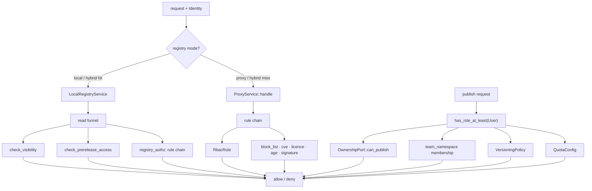
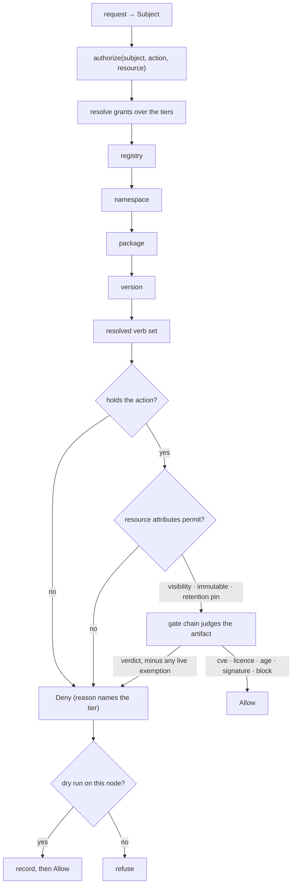

# RFC 0015 — Grants on the resource hierarchy

| Field       | Value                                                        |
| ----------- | ------------------------------------------------------------ |
| Status      | Draft                                                         |
| Short       | Grants on the hierarchy                                       |
| Settles     | How a request is authorized: one permission vocabulary with write verbs, grants that attach to a registry/namespace/package hierarchy, and namespaces that carry visibility, immutability and gate policy for everything beneath them |
| Author      | Max Batleforc <maxleriche.60@gmail.com>                       |
| Co-author   | —                                                             |
| Created     | 2026-08-27                                                    |
| Supersedes  | — (proposes absorbing [RFC 0011-bis](/rfc/0011-bis-namespace-scoped-visibility) on acceptance, see §9.1) |
| Touches     | `crates/core` (permission vocabulary, decision function, namespace resolution), `crates/config` (grant blocks, namespace blocks, migration), `crates/adapters` (grant storage, SQL predicates, migration), `crates/web` (every handler's declared verb, admin API), `cli/`, `ui/`, docs |

---

## 1. Summary

Today an operator writes `user = ["releases:read", "source:read"]` and believes they have configured this server's authorization. They have configured **half of one third of it**. Those two strings are the entire permission vocabulary; there is no write verb at all, so that block says nothing about who may publish, yank, or delete. And a grant can only be attached to a whole registry, so "the payments team owns `@acme/billing-*`" is not expressible.

This RFC replaces that with one model: a **resource hierarchy** (registry → namespace → package → version), **grants that attach at any level of it** and inherit downward, and a **verb vocabulary that includes writes**. A namespace stops being a matching rule used only by the visibility check and becomes the unit an operator configures — carrying its grants, its default visibility, its immutability policy and its gate overrides for everything published beneath it.

The point is not more knobs. It is that the nine mechanisms which today answer "who may do what" — ownership, visibility, versioning policy, quota, beta channels, console browse, `bypass_roles`, signed URLs, `firewall_only` — exist because two read verbs and two roles could not say what each ecosystem needed. Each was built locally, with its own config block and its own place to forget it. That is the same defect the 2026-08-26 security survey found ten times on the read path, one layer up.

### Before / after

```toml
# today — the whole authorization vocabulary
[registries.rbac]
anonymous = []
user      = ["releases:read", "source:read"]
admin     = ["*"]
# who may publish? not expressible here. It is `has_role_at_least(Role::User)`
# in publish.rs, registry-wide, modulated by ownership and namespaces if those
# happen to be configured elsewhere.
```

```toml
# proposed
[registries.grants]
"*"                = ["releases:read"]              # anonymous, this registry
"group:*:engineer" = ["releases:read", "source:read"]

[[registries.namespaces]]
match      = "@acme/billing"
visibility = "team"                                  # default for what lands here
immutable  = "released"                              # SNAPSHOT overwritable, release not
[registries.namespaces.grants]
"group:oidc1:payments" = ["releases:*", "owners:write"]
"group:oidc1:audit"    = ["releases:read"]
```

A reader of the second block can answer "who may publish to `@acme/billing/cards`?" without reading any Rust.

---

## 2. Motivation

The survey's central conclusion was that authorization is applied *by convention rather than by construction*. RFC-less work since then moved every local read through one funnel (`crates/core/src/services/registry_authz.rs`), which closed that instance. It did not close the cause, because the cause is upstream of the funnel: **there is no language in which most authorization decisions can be stated**, so each one grew its own mechanism.

Three facts, each verifiable in the tree today:

1. **The vocabulary is two strings.** `crates/core/src/rules/mod.rs` defines `RELEASES_READ` and `SOURCE_READ` and nothing else, for twenty-one registry types.
2. **There is no write verb.** A search for one across `crates/` returns nothing. Publish authorization is a single `has_role_at_least(&Role::User)` at `local_registry/publish.rs:151`.
3. **There is no resource between registry and package.** conda channels, OpenVSX publishers, Terraform namespaces, deb components and Maven groupIds are all real units an operator wants to grant on, and none of them can hold a grant.

What filled those gaps:

| Question | Mechanism today | Lives in |
| --- | --- | --- |
| Who may publish *this* package | `OwnershipPort::can_publish` | code, cargo owners API |
| Who may *see* this package | `check_visibility` + `team_namespace` | code, RFC 0011-bis (Draft) |
| Who may overwrite a version | `VersioningPolicy` | its own config block |
| How much may be published | `QuotaConfig` | its own config block |
| Who receives pre-releases | `BetaChannelConfig` | its own config block |
| Callers with no credential | signed URLs | RFC 0012 |
| Per-rule exemptions | `bypass_roles` on seven rules, and once more outside them | inside each rule, plus the integrity block |
| Whether anything is cached | `firewall_only` | its own flag |
| Who may search or browse the catalogue | `rbac.explore` | a fourth field of `[registries.rbac]` |

Nine answers to one question, in nine shapes. An operator who wants "this team publishes here, that team only reads" must currently understand four of them and will still not be able to express it.

`bypass_roles` is the row that shows how far this spreads once a mechanism is available: `cve_gate`, `deny_latest`, `license_gate`, `release_age`, `signed_release`, `trusted_publisher` and `version_gate` each carry their own copy, and an eighth sits on the integrity block's `require_metadata` gate (`crates/config/src/schema/registry.rs:268`), which is not a rule at all. Eight independently-configured escape hatches, none of which can be listed, granted or audited together.

The last row is the one that makes the point best, because it hides inside the block this RFC quotes as the whole vocabulary. `RbacConfig` has four fields, not three: `anonymous`, `user`, `admin` — and `explore`, a per-registry anonymous/user/admin gate on the console's browse and search surfaces (`crates/config/src/schema/rules.rs:24`), with five call sites under `handlers/front_office/explore/` and its own computation in `server/src/hot_config.rs:387-430`. It exists because "may read packages" and "may enumerate the catalogue" are different exposures and the two read verbs could not tell them apart. §4.2 gives it a verb and §10 rule 2 translates it.

---

## 3. Goals / non-goals

**Goals**

- One vocabulary covering reads *and* writes, closed rather than stringly-typed, so a route cannot request a permission nothing grants — and **extensible per ecosystem**, because twenty-one protocols do not have twenty-one identical action sets (§4.2).
- Grants attachable at any tier of that hierarchy, inheriting downward by union with no precedence between tiers or subject forms (§4.3).
- The namespace as a configurable policy node: grants, default visibility, immutability, gate overrides.
- One decision function every path calls, reads and writes alike.
- Absence of a grant never meaning "everything".
- A migration in which every existing config keeps its current meaning.

**Non-goals**

- **Authentication.** How a caller proves identity is RFC 0011's problem and the provider chain's. This RFC starts from a resolved `Identity`.
- **Signed URLs.** RFC 0012 owns minting and redemption. This RFC only requires that a redeemed signed URL produces a subject the decision function can judge, which it already does.
- **A policy language.** No Cedar, OPA or embedded expression evaluator. See §8.1.
- **Per-request attribute conditions** (time of day, source IP). The subject/action/resource triple is the scope; conditions are a later RFC if ever.
- **Retention and tombstones.** Reclaiming locally published versions, and the permanence of a published coordinate, are [RFC 0016](/rfc/0016-retention-and-the-permanence-of-a-published-name) (§4.6). This document defines the tier they attach to and the `releases:delete` verb they exercise; it does not define what deletes.
- **Re-litigating the rule chain's contents.** `cve_gate`, `license_gate` and friends keep their semantics; this RFC changes only where they are configured and how they are reached.

---

## 4. User-facing design

### 4.1 The resource hierarchy

```
registry            npm1
  └── namespace     @acme/billing          (ecosystem-defined separator)
        └── package @acme/billing/cards
              └── version 1.4.2
```

All four are **policy tiers**, not only addressing: see below.

A namespace is matched, not enumerated: `match = "@acme/billing"` covers `@acme/billing/cards` and `@acme/billing/ledger`. Matching is on segment boundaries using the ecosystem's own separator, so `@acme/billing` never matches `@acme/billing-internal` — the bug RFC 0011-bis §4.2 records for `digital` vs `digital.pipeline-tools`.

The separator table from RFC 0011-bis §4.2 is carried over unchanged and becomes the definition of "namespace" for every ecosystem: `/` for npm scopes and Go modules, `.` for OpenVSX publishers and NuGet ids, `:` for Maven groupIds, the channel for conda, the namespace segment for Terraform, the component for deb.

#### Every tier carries policy

The hierarchy is not only what grants attach to. **Registry, namespace, package and version are a general tier system**, and policy may be declared at any of them:

| Policy | What it says | registry | namespace | package | version |
| --- | --- | :-: | :-: | :-: | :-: |
| `grants` | who may do what (§4.3) | ✓ | ✓ | ✓ | ✓ |
| `visibility` / `prerelease_visibility` | how wide the audience is (§4.5) — the model's one narrowing dimension, where `grants` only widen | ✓ | ✓ | ✓ | ✓ |
| `versioning` — naming | `enforce_semver`, `pattern`, `allow_prerelease`, `monotonic` (§4.5) | ✓ | ✓ | ✓ | — |
| `versioning` — `immutable` | whether these bytes may be replaced (§4.5) | ✓ | ✓ | ✓ | ✓ |
| `retention` | what is kept ([RFC 0016](/rfc/0016-retention-and-the-permanence-of-a-published-name)) | ✓ | ✓ | ✓ | ✓ |
| `quota` | how much may be published (§4.5) | ✓ | ✓ | ✓ | — |
| `rules` | which gates judge the artifact (§4.5) | ✓ | ✓ | ✓ | ✓ |

**Not every policy is meaningful at every tier, and the table says so rather than implying uniformity.** The naming half of `versioning` governs what a version may be *called*, and at version tier the name already exists — `enforce_semver` on `1.4.0` has nothing left to decide. `immutable` is the opposite: pinning one golden build as frozen inside a namespace that otherwise allows replacement is exactly what a version tier is for. Config load rejects the naming fields at version tier rather than silently ignoring them (§4.9).

The version tier is what makes three otherwise-awkward things expressible, each of which is today either impossible or a registry-wide switch:

- **A single public build** in an otherwise private package.
- **A pin against reclamation** — "our LTS customers run this one; retention never touches it, whatever the pull statistics say." The manual override every automatic policy needs. The tier is this document's; what pins to it is [RFC 0016](/rfc/0016-retention-and-the-permanence-of-a-published-name)'s (§4.6).
- **A gate exemption on one version** — a CVE assessed as not applying to this estate, accepted deliberately, instead of turning `cve_gate` off for the whole registry. §4.5 constrains this one, because it is a deliberate weakening.

Registry level is the **default for everything beneath it** — the place an administrator says "unless a team says otherwise, this is how this registry behaves". Some of that exists today, unevenly: `[registries.rbac]`, `[registries.rules]` and `[registries.versioning]` are already registry-level, while visibility and retention have no registry-level expression at all. The tier system regularises what is there rather than inventing it.

#### How tiers compose

The composition rule is **not the same for every policy**, and pretending otherwise would be the trap. Each is chosen so that the *mistake* fails in the recoverable direction, and the direction differs by what the policy does:

| Policy | Composition | Why |
| --- | --- | --- |
| `grants` | **additive** — union of every matching grant on the path | Fewer permissions is the safe direction, so a union of what matched fails closed when nothing does. |
| `visibility` | **deepest wins** | It is a single value; there is nothing to merge. Already the per-package override in RFC 0011-bis §4.3. |
| `versioning` | **deepest wins, wholesale** | See below. |
| `retention` | **deepest wins, wholesale** | See below. |
| `rules` | **deepest wins, per rule** | Each gate is independently configured. A wholesale override would force redeclaring `cve_gate` and `license_gate` to change `release_age`, and a forgotten one is a gate silently switched off — fail-open. |

The same rules apply at the version tier; it is a fourth level, not a special case.

`versioning` and `retention` are wholesale rather than merged because their motivating case is a *narrower* policy on a deeper tier: the one package in an ordinary namespace that publishes a 2 GB artifact per CI run, or the one that follows a different release convention. A per-field merge cannot express that — an inherited `keep_if_pulled` can never be dropped, so a deeper tier could only ever keep *more*. Wholesale is also greppable: what you see on the node is what runs.

The cost is a real sharp edge, and validation is what compensates. Declaring a block at a deeper tier that omits a keep condition (or a versioning constraint) its parent declared is a **warning on every reload** — narrowing is precisely the edit that reclaims something someone was relying on, or accepts a version its namespace would have refused.

Package- and version-level policy cannot live in the config file: a registry with 200 000 packages will not enumerate them in TOML, let alone their two million versions. Both are set through the admin API and stored in one `policy` table keyed by tier, covering every policy kind rather than one table per feature.

### 4.2 The verb vocabulary

A closed enum, not strings. The **shared core** — actions every ecosystem has, in the same shape:

| Verb | Covers |
| --- | --- |
| `releases:read` | artifact bytes |
| `releases:list` | version documents, protocol indexes and search results — including the cargo sparse index, which is a version listing whatever its URL suggests |
| `source:read` | source archives (Go `.zip`, GitHub tarball) |
| `catalogue:browse` | the console's explore and search surfaces |
| `releases:publish` | creating a new version |
| `releases:overwrite` | replacing an existing version — see §4.4 |
| `releases:yank` | yank and unyank |
| `releases:delete` | hard delete |
| `owners:read` / `owners:write` | the ownership list |
| `packages:block` | administrative block/unblock |
| `gates:exempt` | accepting a `cve_gate` or `license_gate` finding on one version (§4.5) |
| `stats:read` | download counts, storage totals and the aggregates the console dashboard is built from (§4.4) |
| `audit:read` | the access log |

`releases:*` and `*` expand at config-load time, never at evaluation time, so an expansion is a fact about the loaded model rather than something implied at each decision. Making it *visible* takes a new task — `task config:explain`, which dumps the expanded grants for a config file and does not exist today; it lands with the vocabulary in phase 1 (§13), because an expansion nobody can print is only half of the property this paragraph claims. Note what that means for `gates:exempt`: it lives under a different prefix from `releases:`, so `releases:*` never reaches it. Silencing a finding is not something a publisher acquires by being able to publish.

`releases:list` is new and splits today's overloaded `releases:read`: a listing names no single version, which is why `authorize_listing` exists as a separate function running only the `rbac` rule. Making that a verb rather than a special case removes the function — and lets a listing be *filtered* by the per-version grant rather than refused wholesale, which §4.4 settles.

The split does not fall cleanly along today's two constants, which is why §10 rule 4 exists rather than a field-for-field carry. Handlers pass `RELEASES_READ` for most listing documents — the npm packument (`npm/read.rs:63`), the NuGet flat index (`nuget/flat.rs:62`), Composer metadata (`composer/metadata.rs:69`) — while the cargo sparse index goes out under `SOURCE_READ` (`cargo/index.rs:217`). Both of today's verbs therefore authorise some listing, and a translation that gave `releases:list` to only one of them would take working access away from whichever estates granted the other.

**`catalogue:browse` is not `releases:list`**, and the distinction is load-bearing rather than fastidious. `[registries.rbac.explore]` is already a separate gate for the reason §2 gives: browsing a catalogue in a console and resolving a version document from a package manager are different exposures. "Build agents resolve everything, people browse nothing" is a real configuration and a common one on a mirror, and one verb could not express it. Folding the two together would either hand every browse-denied role the protocol listings or take the protocol listings from every console-denied one — a widening in one direction or a breakage in the other.

#### When one ecosystem needs a verb the others do not

The core above is what twenty-one ecosystems have in common. They also each have actions nobody else has, and some of those are authorization decisions in their own right:

| Ecosystem | Action with no equivalent elsewhere |
| --- | --- |
| npm | moving a `dist-tag` — neither publishing nor reading, but repointing what `latest` means |
| OpenVSX | claiming a publisher namespace |
| Terraform | registering the GPG key a namespace's providers are signed with |
| JetBrains Marketplace | assigning a plugin build to the stable or EAP channel |
| Maven | promoting a staged repository, if staging is ever supported |
| deb / rpm | re-signing repository metadata, managing components |

"Move `latest` to this version" is not `releases:publish` — the bytes already exist and nobody is adding any — and it is not `releases:read`. Forcing it into an existing verb makes the grant mean something different on npm than it does anywhere else, which is how a vocabulary stops being one.

**So the enum is extensible, and stays closed.** An ecosystem-specific verb is added as a variant like any other, under its ecosystem's prefix:

```
npm:dist-tags:write
openvsx:namespace:claim
terraform:signing-keys:write
jetbrains:channel:assign
```

Three rules keep that from becoming an escape hatch:

1. **It is still the enum.** There is no free-text verb, ever. Adding one is a code change the compiler propagates to every match, which is the property §4.2 exists for — a typo'd `resource_type` string is currently a permission nothing ever grants and nobody ever notices.
2. **A verb is scoped to the registry types that define it.** A grant naming `npm:dist-tags:write` on a Maven registry is **rejected at config load**, not silently inert. The registry type is known at that point, so this is checkable, and "I granted it and nothing happened" is the failure mode this removes.
3. **Prefer the shared verb when the action really is the same.** A new ecosystem's "hide this version from resolution" is `releases:yank`, not `myeco:unlist:write`. The test is whether an operator reading a grant on a mixed estate would expect them to mean the same thing; if yes, it is one verb. Ecosystem prefixes are for what is genuinely peculiar, not for what is merely spelled differently.

#### A different door is not a different action

The rule above has a second edge, and it is the one more likely to be crossed: **the same action reached through a different client is still the same verb.** Downloading an artifact from the console is `releases:read`, not a `console:download` of its own. The console calls the same `/proxy/{registry}/…` routes every package manager calls — `ui/src/client/sdk.gen.ts` is generated against them — with the same credential, so a verb that gated the button and not the route would deny nothing. It would hide an affordance while the request behind it kept working, which is the "authorization by convention" shape §2 opens by describing, arriving as a feature.

The combinations an operator actually wants are already expressible, because `catalogue:browse` and `releases:read` are ANDed like any two verbs: browse-without-bytes is the first and not the second, and CI-pulls-while-nobody-browses is the second and not the first. The one thing this cannot say — *this principal may pull with `mvn` but not from the console* — is a condition on the request rather than on the resource, which §3 rules out as a non-goal and which nothing here could enforce anyway.

`catalogue:browse` and `stats:read` are not counter-examples. Neither gates a door onto an existing resource; each names a distinct resource with its own disclosure surface — the catalogue as an enumerable list, and the aggregates computed over it.

> **Deferred, and recorded so it is not lost: decomposing `require_admin`.**
>
> `require_admin` guards about twenty handler files — health, notification subscriptions, the package admin API, the governance endpoints, and the ops controls for eviction, quota, warming and IP blocks. By this document's own logic that blob should become verbs, and it is **not** in this RFC.
>
> The line drawn for now is what a wrong answer costs. **Disclosure surfaces get verbs here**, because leaking private package names is the survey's entire finding class: `catalogue:browse`, `stats:read` and `audit:read`. **Control surfaces stay `role:admin`**, because a wrong answer there is an outage rather than a leak, and a role is a defensible granularity while the model beds in.
>
> The rest is a follow-on to [RFC 0004](/rfc/0004-admin-composition-and-api-surface), which owns the admin API's shape, rather than more of this document — which already changes every handler. `role:admin` is a subject form (§8.3), so decomposing it later adds verbs beside a grant that already exists instead of replacing one.

Note that prefixing also does the right thing under expansion: `releases:*` reaches no ecosystem verb, and `npm:*` reaches only npm's. A grant cannot acquire the ability to repoint `latest` by being generous about releases.

#### Adding a verb never widens an existing config, and never breaks one silently

Absence of a grant is not permission (§4.3), so a newly added verb is granted to nobody the moment it ships. That is the correct default and it has an obvious hazard: the flow that verb now governs stops working for every estate that has not yet granted it, on upgrade, with no config change of their own.

That is what §4.7's shadow mode is for. **A new verb ships in dry-run for one release**: the action is permitted, every would-be refusal is recorded against the node that lacked the grant, and the authorization page (§4.8) shows an estate exactly which grants it is about to need. The following release enforces. An operator's first encounter with a new verb is a list, not an outage.

### 4.3 Grants

A grant is `subject → [verb]` attached to a node:

```toml
[registries.grants]                       # registry level
"*"                     = ["releases:read", "releases:list"]
"role:user"             = ["source:read"]
"group:oidc1:engineer"  = ["releases:publish"]
"user:release-bot"      = ["releases:publish", "releases:overwrite"]
```

Subject forms: `*` (anyone, including anonymous), `role:<role>`, `group:<provider>:<name>` with `group:*:<name>` for any provider, `user:<id>`, `token:<name>`. The `group:*:name` wildcard is today's behaviour, preserved.

**`token:` and a PAT are different principals, not competing mechanisms.** RFC 0011-bis settles that *"a PAT carries its creator's groups"* — so a personal access token **represents a user** and resolves to that user's subject plus a subset of their groups. It is a credential, not a principal. A **machine token has no user behind it** — a CI runner, a release bot — and is a subject in its own right, matched by `token:<name>`. The auth provider knows which kind it minted; nothing downstream has to guess.

The invariant that matters, and the reason this is worth stating rather than leaving implicit: **a PAT can never resolve to more than its user holds.** Its groups are a subset, never a superset, and its role is capped at the user's. A token that can exceed its owner is a privilege-escalation primitive, which is precisely what a leaked token is worth to an attacker.

#### Who may write a grant

`owners:write` is the verb that edits grants, and it **inherits downward like any other** — but it may only write grants *strictly below* the tier at which it is held. That single rule turns what would be escalation into delegation, and produces a hierarchy of authority that mirrors where each tier is stored:

| `owners:write` held at | May write grants at | Which live in |
| --- | --- | --- |
| *(nobody — the config file)* | registry, namespace | TOML, reviewed like any other change |
| registry | package, version — anywhere in the registry | the `policy` table |
| namespace | package, version — **within that namespace only** | the `policy` table |
| package | version — of that package only | the `policy` table |
| version | nothing | — |

The rule is not an extra thing to remember, because it is the storage split from §4.1 restated: **`owners:write` writes exactly what the API can write.** Registry and namespace grants are a config-file change and go through whatever review the estate already has; everything below is delegable.

Three properties fall out, and together they are why downward inheritance is safe here:

- **A delegate cannot extend their own reach.** Namespace-level `owners:write` cannot edit namespace or registry grants, so it cannot widen the subtree it applies to, and cannot make anyone an admin.
- **A delegate cannot revoke anything.** Grants are additive (§8.2), so a package-level grant can add permissions but never remove one an ancestor gave — and sealing, the one construct that does take access away, is not writable through the API at all (below). The namespace owner's access is not something a delegate can take away.
- **The blast radius is the subtree, and it is visible.** `explain` (§4.8) names the tier that granted each verb, so "who gave this package that" has an answer rather than an investigation.

What a namespace delegate *can* do is grant themselves `releases:publish` on any package in their namespace. That is intended: it is what being trusted with a namespace means, and it is the authority they already hold today through ownership — just now with a boundary written down and a tier recorded against it.

**Resolution is a union, and only a union.** The resolved permission set for a request is the union of every grant on the path from registry to version whose subject matches the caller. There is no precedence between tiers and none between subject forms: a deeper node does not replace a shallower one's set, and a more specific subject does not replace a broader one's. A grant only ever adds — there is no deny rule (§8.2), and no shape in which one grant subtracts from another.

**Replacement is excluded on purpose, because it is revocation wearing precedence's clothes.** Given registry `role:user = ["releases:read", "source:read"]` and package `role:user = ["releases:read"]`, a union keeps `source:read` and a "deepest wins" rule drops it. Every safety property in this document assumes the first: the delegation bounds above, §7's *a grant can never be revoked by a deeper node, only unmatched*, and §8.2's case against deny rules. A model that resolves by replacing has deny rules — it just does not call them that, and gets them without the trace §8.2 says a deny rule would require.

The cost is that a deeper node cannot narrow. Writing a smaller set further down does nothing at all, and the only way to withhold something an ancestor granted is to seal, which withholds everything. That is what buys order-independence, and it is what makes §11.2's shuffle test assertable: resolve the same hierarchy with the grants supplied in a random order and the result must be identical, which is a property a precedence rule would have to earn and a union has by construction.

**Absence is not "everything".** A node with no grants inherits its parent's. A node with an *empty* grant map (`grants = {}`) grants nothing and stops inheritance — the explicit way to seal a namespace. This is the modelling rule the survey's finding 2 broke, where an empty accessible-registry list read as *all* registries; it is stated once here and enforced by making the resolved set an `Option`-free type whose empty value means empty.

#### Sealing is a config-file construct, and only a config-file construct

`grants = {}` is the one thing in this model that takes access away, so it is the one thing a delegate may not write. **It is expressible at the registry and namespace tiers only** — the tiers that live in TOML (§4.1) — and the `policy` table has no column that can represent it, so a package- or version-tier seal is not a rejected request but an unwritable one.

Without that rule the delegation bounds above are decoration. A namespace delegate holds `owners:write` and may write package and version grants; if sealing were among them they could seal a package and lock out the registry owner who delegated to them — revocation reintroduced one tier below the model that excludes it, stored in a table only the API can edit. Confining seals to the config file means every seal is a reviewed diff and the recovery from a bad one is the same edit that made it.

**A seal also has a floor.** It stops inheritance including of a registry-level `role:admin = ["*"]`, which is what makes it useful and what makes it dangerous. So a sealed node still resolves `owners:read`, `owners:write` and `audit:read` for a subject holding them at the registry tier, and nothing else: an administrator can always see what a seal contains, change it, and read who reached it, and can never be locked out of a subtree of their own registry. `releases:read`, `releases:list` and `releases:publish` do not survive a seal — the floor is the ability to *administer* the sealed node, never to use it. A subtree nobody can reopen is a denial of service that looks like a configuration.

**A seal stops inheritance, it does not disable the nodes beneath it.** A grant written directly on a package inside a sealed namespace resolves normally; what a seal blocks is the namespace's own and its ancestors' grants flowing past it. That is what makes the floor useful rather than ceremonial — the administrator who can still write below a seal has a recovery that does not require reverting the seal itself, which is the difference between a mistake and an outage.

### 4.4 Listings filter, they do not refuse

A caller holding `releases:list` on a namespace but `releases:read` on only some of its packages asks for a version index. The index returns **what they may see**, not `403`.

This is not a new mechanism. It is the one [RFC 0006](/rfc/0006-blocked-versions-hidden-everywhere) already established for administrative blocks: a blocked version is removed from the listing so the resolver routes past it, which is why the Maven and NuGet handlers reach for `proxy_document` rather than `proxy_stream` on their index routes — streaming would deliver a document with the blocked version still in it, and the build would pick that version and fail at download. Grants filter the same document at the same point, for the same reason.

Three rules make it safe:

1. **Filter in the query, never after it.** Totals and pagination are computed on the filtered set. An accurate `total` over rows the caller may not see is a disclosure in itself, and page two of a filtered list is worse. Finding 12 of the 2026-08-26 survey is the direct precedent — private package names reaching the explore catalogue through `package_statuses`. Finding 2 is the sharper warning and a different defect: there the predicate ran, it was simply vacuous (an empty accessible set bound as `NULL`, which `= ANY` reads as *every* registry), and what turned a scoping bug into an enumeration of the whole private inventory was the paging metadata computed faithfully on top of it. A correct count over a wrong scope is not a smaller bug than no count at all; it is the thing that makes the wrong scope worth exploiting.
2. **Two levels, two answers.** No grant on the *package* → answer as though it does not exist, which is what `load_visible_versions_or_not_found` does today. A grant on the package but not on every version → return the filtered list. The caller named the package in the URL, so a filtered listing tells them nothing they did not already assert.
3. **A filtered listing is identity-dependent and must never be cached under an identity-blind key.** This is finding 11's lesson, paid for once already: the search cache held merged local hits under a key that named no identity, so one caller's private results were replayed to the next. The remediation was to cache the *upstream* answer only and merge per request. Any listing that grants filter takes the same treatment.

An empty filtered result is `200` with an empty document, not `404` — for a whole-registry index it discloses nothing, which is the property `crates/web/tests/authz_matrix.rs` already asserts through its `disclosed()` helper rather than through status codes.

#### An aggregate is a listing that has been counted

`stats:read` gates the dashboard's aggregates — top downloads, storage by registry, recent publishes, vulnerability counts. Holding it is not the interesting half. **Every one of those tiles is a query over packages, and it is filtered by the caller's grants exactly like a version index**, for the reason §4.4 rule 1 already gives: a number computed over rows the caller may not see is a disclosure whether or not the rows themselves are returned. "Your most-downloaded package is `@acme/billing-secrets`" discloses the name; "you have 47 packages" over a set the caller can see three of discloses the other 44 exist.

This is the surface where that rule is easiest to forget, because a tile reads as presentation rather than as a query. It is the same defect the survey found three times — finding 2's accurate `total` over an unscoped set, finding 11's search hits, finding 12's `package_statuses` counts — and a dashboard is where it will arrive a fourth time.

Two consequences follow directly rather than needing their own rules:

- **The filter is in the aggregation, not after it.** `SELECT count(*) … WHERE <grant predicate>`, never a count taken first and trimmed afterwards. A `SUM` cannot be trimmed at all, which is what makes this the version of rule 1 that fails silently.
- **A cached aggregate is keyed by grant set or it is not cached.** Dashboard tiles are expensive, so someone will cache them, and §4.4 rule 3 is finding 11's lesson about precisely that. The grant-set key §11.7 measures for listings is the same key here, and an aggregate is cheaper to key that way than a document is — there are far fewer distinct tiles.

`stats:read` without any package grants therefore resolves to a dashboard of zeroes rather than a `403`, which is the §4.4 rule 2 boundary applied one level up: the caller asked for their own view, and their own view is empty.

### 4.5 Namespace policy: visibility, versioning, and gates

The namespace block carries more than grants, because the things an operator wants to say about "everything my team publishes" are not only about who:

```toml
[[registries.namespaces]]
match      = "com.acme.internal"
visibility = "team"          # default visibility for versions published here

[registries.namespaces.grants]
"group:oidc1:platform" = ["releases:*", "owners:write"]
"group:*:qa"           = ["releases:read", "releases:list"]   # 0011-bis's readers, as grants

[registries.namespaces.versioning]    # what a version may be called, and whether it may change
enforce_semver   = true
allow_prerelease = false
pattern          = '^\d+\.\d+\.\d+$'
immutable        = "released"
monotonic        = true              # a new version must sort above the newest existing one

[registries.namespaces.retention]     # what is kept — the block itself is RFC 0016's
keep_if_pulled = "90d"

[registries.namespaces.rules]         # gate overrides, this namespace only
release_age = { min_age_secs = 0 }    # first-party code needs no quarantine
```

**`visibility`** is the default applied to a version published into the namespace, replacing "public unless someone sets it". A per-package override remains (RFC 0011-bis §4.3).

#### Why `visibility` survives alongside `grants`, and `readers` does not

Both answer "who may read this", and a document whose thesis is that two mechanisms for one question is the defect owes an account of why it ships two. The account is that they run in opposite directions, and each has the composition rule its direction needs:

| | Says | Composes | Direction |
| --- | --- | --- | --- |
| `grants` | *this subject may* | union over the path (§4.3) | only widens |
| `visibility` | *the audience is this wide* | deepest wins, one scalar | only narrows |

**A caller needs both**: a grant for the verb, and membership of the audience. That is the `ATTR` gate in §5.0's diagram, and it is an AND rather than a fallback — a `releases:read` grant does not make a `team` package public, and a `public` namespace does not serve a caller no grant matches.

If visibility only widened it would be sugar over subject forms — `public` is `"*"`, `internal` is `"role:user"` — and it should then collapse into grants, the way `readers` does below. It does not collapse, because grants can only add. A `team` package inside a `public` namespace, and its inverse in §4.1 — one public build inside a private package — are exactly the cases the tier system is sold on, and the union makes both inexpressible as grants. Visibility is the model's one narrowing dimension, kept deliberately separate from its one widening dimension so that neither has to carry both jobs and neither needs a deny rule.

Narrowing to *fewer subjects than the parent named* is the remaining case, and it takes one new value rather than a second subject list. **`visibility = "private"`**, at package or version tier, means inherited read grants do not apply — only grants written on that node or below. That is RFC 0011-bis §4.3's empty reader set, which is the shape it uses to keep one package private inside a shared namespace. It is a scalar, so it enumerates nobody and adds no second place to look; it composes deepest-wins like every other visibility value; and §4.3's administrative floor applies to it exactly as it does to a seal, so it cannot lock an operator out of their own registry.

**`readers` is therefore dropped.** It is a list of subjects who may read — which is a grant, spelled differently and composing by a different rule. Keeping it would give the widening direction two spellings and two semantics, in the one section of this document arguing that a single question deserves a single answer. RFC 0011-bis's reader groups become grant subjects (§9.1); nothing it expresses is lost, and the empty-set case is the `private` value above.

**`versioning`** is today's registry-level `VersioningPolicy` — `enforce_semver`, `allow_prerelease`, `version_pattern` — moved to the namespace and **extended with `immutable`**. Moving it is most of the value on its own: a policy that is right for `com.acme.internal` is rarely right for the vendored third-party namespace beside it, and one setting per registry forces the loosest of the two.

`immutable` is new. Nothing enforces immutability today at any level:

| Value | Meaning |
| --- | --- |
| `never` | any version may be replaced by a caller holding `releases:overwrite` |
| `released` | a release is immutable; a pre-release may be replaced |
| `always` | no version may ever be replaced; `releases:overwrite` grants nothing here |

`released` is the Maven shape — SNAPSHOT churns, releases do not — and is the default most estates want and cannot currently express.

`immutable` is also the one `versioning` field honoured at version tier (§4.1) — freezing a single golden build inside a namespace that otherwise permits replacement.

Note the interaction: **immutability is a property of the resource, the verb is a property of the subject, and a replace needs both.** That split is deliberate. It is what lets a namespace be append-only for *everyone, including admins*, which no role-based model can say — and it is why `immutable` lives here rather than becoming another verb.

**`monotonic`** refuses a publish whose version does not sort strictly above the newest existing one for that package, using `services::version_order::newest_first` — already the single ordering function in the tree, and currently carrying only one consumer. It catches what `immutable` cannot: republishing an *older* number after a bad release, which leaves a resolver picking a version that was never meant to come back.

Three consequences worth stating rather than discovering:

- **A yanked or deleted version still counts** as the newest — which the soft delete in [RFC 0016](/rfc/0016-retention-and-the-permanence-of-a-published-name) is what makes possible, and is why §4.6 records this as a cross-document dependency. Otherwise deleting `2.0.0` would let `1.9.9` be re-taken.
- **Pre-releases fall out correctly** without a special case: `1.3.0-rc1` sorts above `1.2.0` and is accepted, while `1.2.0-rc1` after `1.2.0` sorts below and is refused — which is what semver means and what a resolver expects.
- **Bulk import is incompatible with it**, by construction. Importing a package's history publishes oldest-first. The escape is to import with `monotonic = false` and turn it on afterwards; there is deliberately no bypass verb, for the same reason `immutable` has none — a rule an admin can step over is not an invariant, and the point of these two settings is that they hold for everyone.

**Pre-release visibility replaces `beta_channel`.** A namespace may declare a different default visibility for pre-releases:

```toml
visibility            = "public"
prerelease_visibility = "team"     # what [registries.beta_channel] used to say
```

This is one of §2's nine mechanisms folding into the model — the fifth row of that table, gone. `beta_channel` exists because "pre-releases are for members only" could not be said any other way; as a conditional visibility default it is one line at the tier that owns the packages, it composes with everything else by §4.1's rules, and a version-tier `visibility` overrides it for the one build you want to show someone. `check_prerelease_access` stops being a separate gate in the read funnel and becomes visibility resolution.

**One definition of "pre-release", used three times — and there are already two.** `immutable = "released"`, `allow_prerelease` and `prerelease_visibility` all turn on the same question, and today only the last of the three answers it. But it answers it twice, differently:

| Where | Rule | `1.0-SNAPSHOT` | `1.0.0rc1` | `1.0.0-beta.1` |
| --- | --- | :-: | :-: | :-: |
| `local_registry/read.rs:757`, behind `beta_channel` | strict semver parse, optional `v` prefix, Composer `dev-` aliases | **release** | release | pre-release |
| `upstream_detail/mod.rs:228`, the console's version table | `version.contains('-')` | **pre-release** | release | pre-release |

They disagree on Maven's spelling and both are wrong on PyPI's. `semver::Version::parse("1.0-SNAPSHOT")` fails on the two-component core, so the first rule falls through its `unwrap_or(false)` and calls a SNAPSHOT a release — the one case `immutable = "released"` exists to catch. The second calls it a pre-release for the right reason by accident, and would call `2.0.0+build-1` one too.

The crude rule is deliberate, and its doc comment says so: the detail page's two version lists sit in one table, and a row that sorted differently depending on which list it came from would be a visible inconsistency. That reasoning was sound while it had one consumer and no authorization attached to it. It stops being sound the moment a pre-release check decides whether a version may be *replaced* or *seen*.

So the single definition is neither of them as written. It is `local_registry`'s, **re-based on `services::version_order::parse`** — which already normalises `1.0-SNAPSHOT` to `1.0.0-SNAPSHOT` and says so in its own comment — with the console converged onto the result. That is a visible change to the detail page: versions the crude rule called releases will be labelled pre-releases, correctly, and the table's consistency argument is served better by one rule than by two. Five consumers silently disagreeing about what a pre-release is would be a worse outcome than not shipping three of them, and the two that exist already disagree.

#### Quota

`quota` is another of §2's mechanisms, and the one that is least about *who*: it answers how much, not whether. It attaches to tiers anyway, because "how much" is a question about a resource and the resource hierarchy is where resources now live.

```toml
[registries.namespaces.quota]
max_bytes_per_user    = "50GB"     # each publisher, within this namespace
max_packages_per_user = 500
enforcement           = "block"
```

Per-*subject* limits resolved per tier need no new accounting — the same counter `check_and_record_publish` already maintains, with the limit looked up at the deepest tier that declares one. Composition is wholesale, like `versioning` and `retention`, and for the same reason: a narrower quota deeper down is the point, and a field merge could only ever raise it.

Quota stops at the package tier. A per-version quota would be a limit on a thing that is published exactly once, which has nothing to constrain.

> **Deferred, and recorded so it is not lost: the aggregate cap.**
>
> `max_bytes` for a *namespace as a whole* — "the vendored namespace may hold 500 GB, whoever fills it" — is the version of this feature several estates will eventually want, and it is **not** in this RFC. It needs a counter keyed by namespace rather than by user, which is new accounting rather than a new lookup, and dragging it in would inflate a document that already changes every handler.
>
> It is deliberately left as a shape the config can grow into: `max_bytes` beside `max_bytes_per_user` reads naturally, and the tier attachment landing now is what makes adding it later a new field rather than a new model. When it is wanted, the work is the counter and the backfill — not this section.

**A gate exemption at version tier is a deliberate weakening, and is constrained like one.** "This CVE does not apply to how we use this library" is a real and common judgement, and today the only way to act on it is to turn the gate off for the whole registry — which is worse in every respect. So it is expressible:

An exemption is version-tier policy, so by §4.1 it cannot live in TOML — a registry does not enumerate two million versions in a config file. It is a request against the `policy` table:

```http
PUT /api/v1/admin/policy/version/{registry}/{package}/{version}/rules/cve_gate
```
```json
{
  "exempt": true,
  "exempt_until": "2026-12-01",
  "reason": "GHSA-… — the affected code path is not reachable from our usage"
}
```

Shown as the call rather than as a config block on purpose. Every other example in this section is TOML, and one more block in the same shape would read as a fourth thing an operator can write in their config file and then wonder why it does nothing — which is the failure mode §4.1 spends a paragraph preventing.

Setting one requires **`gates:exempt`** on the version's namespace or above — a verb of its own, not implied by `releases:*` and not held by an ordinary publisher. That is the approval model: not a workflow bolted beside the permission system, but a permission, granted by whoever owns the namespace to whoever they trust with it. A team that may publish to `@acme/billing` does not thereby get to decide which CVEs stop mattering there; the namespace owner decides who does, in the same block where they decide everything else about it.

It also means the answer scales with the estate rather than being fixed by this document. A small team grants `gates:exempt` alongside `releases:publish` and moves on; a regulated one grants it to a security group and nobody else. Neither needs a different mechanism.

`exempt_until` and `reason` are both **required**; config load and the API reject an exemption without them. This is the same discipline `grants.dry_run` carries in §4.7 and for the same reason: the realistic failure is not a wrong assessment, it is a right assessment nobody revisited. An exemption is audited on creation, surfaced in the console beside the finding it silences, and expires on its own.

#### Only two gates are exemptible, and the line is not arbitrary

`exempt` exists on `cve_gate` and `license_gate`. It does not exist on any other gate — **not as a rejected value, but as an absent field**, so an exemption on `release_age` is not a refusal at config load, it is a shape that cannot be written.

The line between the two groups is what a gate is *for*:

| Gate | Exemptible | Because |
| --- | :-: | --- |
| `cve_gate` | ✓ | It reports a finding a human can assess. "The affected path is unreachable from our usage" is a real judgement about a real fact, and the fact stays true — what is accepted is the risk. |
| `license_gate` | ✓ | Same shape: counsel approves a licence for one dependency. The declaration is unchanged; the decision is recorded. |
| `release_age` | — | It establishes an invariant, and an invariant with exceptions is not one. A quarantine a version can skip is not a quarantine — the value is entirely in its uniformity. |
| `require_signed_release` | — | An unsigned artifact is not a finding to assess, it is an **absence of evidence**. There is nothing to reason about and therefore nothing to accept. |
| `trusted_publisher` | — | Same family: provenance is established or it is not. |
| `block_list` | — | An administrative block is a decision by an admin. A namespace owner exempting it would be undoing someone else's authority from below. |
| `deny_latest`, `version_gate` | — | Both judge the *request* or the *name*, not the artifact. There is no finding for a per-version exemption to attach to. |

Stated once: **an exemptible gate reports an assessable finding; a non-exemptible gate establishes an invariant.** A future gate is exemptible only if it falls on the first side of that sentence, and adding the field is the decision — not a config value someone can set.

#### Self-approval warns, it does not block

Where `gates:exempt` is held by the same principal that published the version, the exemption is still accepted and is **flagged**. It carries a `self_approved` marker, which appears on the exemption wherever it is listed, in the audit event, and in the console beside the finding.

Blocking was the alternative and it is the wrong trade. Four-eyes enforced by the tool is friction a small team routes around — most often by granting `gates:exempt` more widely, which is strictly worse than the thing it was trying to prevent. A visible marker gives an auditor a filter (*show me every exemption nobody else looked at*) without giving anyone a reason to widen a grant. An estate that wants it as a rule has the ingredients to enforce it in review.

**`rules`** lets any tier override the one above it, per gate. This is the piece that answers the outstanding finding from the 2026-08-26 review: `release_age` quarantines first-party publishes because a rule written for upstream artifacts is applied registry-wide. With namespace rules, `min_age_secs = 0` on the namespace your CI publishes to states the intent directly, instead of choosing between quarantining your own builds and turning the gate off everywhere.

### 4.6 What happens to a version afterwards is RFC 0016

`retention` — reclaiming locally published versions nobody is using — and the **tombstone** that makes a published coordinate permanent are settled by [RFC 0016](/rfc/0016-retention-and-the-permanence-of-a-published-name), not here.

They belong beside each other and apart from this document. They share this RFC's tier system, its `policy` table and its `releases:delete` verb, and nothing else: they are the only features in either document that *destroy data*, and the reviewer who wants to argue about a reclamation policy is not the reviewer who wants to argue about a permission vocabulary. Keeping them here would also have made phases 0 to 2 wait on a schema change reaching every listing query in twenty-one ecosystems, which is the opposite of what §13's phasing is for.

Two couplings run the other way and are stated here rather than only there:

- **`monotonic` (§4.5) is not fully correct until RFC 0016 phase 1 lands.** Its point is catching a republish of an *older* number after a bad release, and that only holds if a deleted version still counts as the newest. Until delete becomes a soft delete, deleting `2.0.0` lets `1.9.9` be re-taken. Phase 4 either waits for it or ships `monotonic` with that hole named.
- **The version tier's retention pin** — "never reclaim this one, whatever the policy above says" — is one of the three things §4.1 gives the version tier, and it is RFC 0016 that gives it meaning. The tier attachment is this document's; what attaches to it is that one's.

`retention` therefore appears in §4.1's tier table and its composition table, because the tier system has to describe every policy that attaches to it, and nowhere else.

### 4.7 Dry run is a property of every policy

Every block in §4 either **refuses** a request or **destroys** data. Both are mistakes an operator wants to discover before they happen, on their own estate, rather than from a ticket. So `dry_run` is not a retention setting — it is available on `grants`, `versioning` and `retention` alike:

```toml
[registries.namespaces.versioning]
enforce_semver = true
monotonic      = true
dry_run        = true          # log what would be refused; refuse nothing
```

This generalises something the codebase has already invented twice, locally: `cve_gate` and `license_gate` both carry a `block` flag whose `false` default means "surface it, never deny". Two rules got warn-only because two authors needed it. Every policy needs it, and it should not be re-invented a third time under a third name.

In dry-run a policy evaluates fully, records what it *would* have done, and does not do it. The record is a structured log line, a `batlehub_policy_dryrun_total` counter labelled by policy and node, and an admin endpoint listing recent would-have-beens so the console can show them.

#### The two directions are not equally safe

This is the part that needs care, and it is why `dry_run` is a per-policy setting rather than one switch:

| Policy | Dry run means | Direction |
| --- | --- | --- |
| `retention` ([RFC 0016](/rfc/0016-retention-and-the-permanence-of-a-published-name)) | nothing is deleted | **safe** — the system does less |
| `versioning` | a badly-named or duplicate version is accepted | **mixed** — bad data lands, nothing leaks |
| `grants` | a request that would be refused is **served** | **fail-open** |

Dry-run on grants is the most useful setting in this document and the most dangerous. It is what makes §10's migration survivable in practice — enable the new model in shadow, watch a week of real traffic, then enforce — and it is also, if forgotten, an authorization bypass configured on purpose.

So it is constrained rather than merely documented:

- `versioning.dry_run` and `grants.dry_run` default to **`false`**. `retention.dry_run` defaults to **`true`**, which RFC 0016 argues from the fact that it is the only one of the three whose dry-run direction is unambiguously safe.
- `grants.dry_run` requires a companion `dry_run_until = "YYYY-MM-DD"`. Config load rejects the flag without it, and refuses to start on a date already past. **A shadow mode that cannot be forgotten is the entire point** — the failure this guards against is not a wrong decision, it is a right decision nobody revisited.
- Every reload logs a warning naming each node in grant dry-run and its expiry, and the config-warnings endpoint carries it, so it appears on the Config Reload page rather than only in a log nobody tails.

### 4.8 One page that shows what authorization did

Every mechanism this RFC removes had its own way of being invisible. Ownership lived in a table nobody rendered, `bypass_roles` was a field inside a rule, the beta channel was a config block, and the only way to answer "why was this refused?" was to read Rust. A single model deserves a single place to watch it, and without one an operator's first encounter with a denial is still a support ticket.

**`GET /api/v1/admin/authz/explain?subject=…&action=…&resource=…`** answers the question directly. It resolves without performing anything and returns the working:

```json
{
  "decision": "deny",
  "reason": "no grant for 'releases:publish'",
  "resolved": {
    "releases:read":  { "granted_by": "namespace:@acme/billing", "subject": "group:oidc1:audit" },
    "releases:list":  { "granted_by": "registry:npm1",           "subject": "*" }
  },
  "attributes": { "visibility": "team", "immutable": "released", "retention": "pinned" },
  "tiers_walked": ["registry:npm1", "namespace:@acme/billing", "package:@acme/billing/cards", "version:1.4.2"]
}
```

`granted_by` is the point. A resolved set without provenance tells an operator *what* they have; naming the tier and the subject form that produced each verb tells them **which line to edit** — which is the difference between a debugging tool and a diagnostic.

The console page gathers the five things this document otherwise scatters, because they are one operational question asked five ways:

| Panel | Answers |
| --- | --- |
| **Explain** | the endpoint above, with pickers instead of query parameters |
| **Recent denials** | what has actually been refused, by tier and reason — the view that turns "someone says it is broken" into a coordinate |
| **Shadow** | what `dry_run` *would* have refused (§4.7), per node, with each node's `dry_run_until` counting down |
| **Exemptions** | live gate exemptions (§4.5), their expiry, their reason, and a filter for `self_approved` |
| **Retention** | the last dry-run report ([RFC 0016](/rfc/0016-retention-and-the-permanence-of-a-published-name)) — what a live run would reclaim, before anyone lets it |

Three of those five are the fail-open or destructive directions of features decided elsewhere in this document. They are on one page on purpose: a shadowed grant, a self-approved exemption and a retention run about to go live are each individually easy to forget, and collectively they are the list of everything currently trusting an operator to remember.

#### The rest of the console reads the same endpoint, and renders instead of enforcing

`explain` has a second consumer beyond this page. **Every affordance in the console asks it what the caller holds, and does not offer what it knows will be refused** — no download button on a package the resolved set has no `releases:read` for, no publish form where there is no `releases:publish`, no exemption control without `gates:exempt`.

That is a rendering decision, not an authorization one, and the distinction is the point. The route still evaluates `authorize` on every request and still refuses; the console's copy of the answer only decides what to draw. A UI that hid a control and left the route open would be the second, weaker copy of the permission model that §4.2's *a different door is not a different action* rules out — and one that refused client-side while the route allowed would be a bug the server never sees. Hiding what would 403 is worth doing because a 403 the user could not have predicted is a support ticket, not because it protects anything.

It also gives the resolved set a second reader, which is a quiet argument for `explain` being an endpoint from phase 3 rather than a page from phase 5.

The same data is available to `batlehub authz explain` and, for the config-file half, to `task config:explain`, so this is not a reason to open a browser. Both are new: the task lands with phase 1 and the CLI command with phase 5 (§13). Neither exists today, and neither has a predecessor — "read the Rust" is the current answer to every question on this page, which is the whole argument for the section.

### 4.9 Validation

Config load rejects, rather than warns:

- a verb not in the enum (today a typo'd `resource_type` is silently never granted);
- an ecosystem-scoped verb granted on a registry of a different type — `npm:dist-tags:write` on a Maven registry is rejected, not inert (§4.2);
- a namespace `match` that cannot occur under the registry's ecosystem separator;
- two namespace blocks whose matches are identical;
- a `pattern` that is not a valid regex, and one that cannot match any string the ecosystem permits as a version;
- `enforce_semver = true` with a `pattern` that no semver string can satisfy — the pair is unsatisfiable and every publish would be refused;
- `monotonic = true` on a registry in `proxy` mode, where nothing is published and the setting can only mislead;
- `grants.dry_run` without `dry_run_until`, or with a date already in the past (§4.7);
- a `versioning` naming field (`enforce_semver`, `pattern`, `allow_prerelease`, `monotonic`) declared at version tier, where the name it governs already exists (§4.1);
- `visibility = "private"` at registry or namespace tier (§4.5), where "only grants written at this node or below" either says nothing or says what `grants = {}` already says properly — it is a package- and version-tier value, and accepting it higher up would give sealing a second, weaker spelling;
- a gate exemption without `exempt_until` or `reason`, or with a date already past (§4.5) — an `exempt` on any gate but `cve_gate` and `license_gate` is not rejected here because the field does not exist on them.

Config load warns for the states that are easy to reach and inert: `immutable = "always"` beside a `releases:overwrite` grant on the same node; a namespace with grants but no `visibility` on a registry whose default is `public`; `allow_prerelease = false` beside `immutable = "released"`, where the pre-release branch of the immutability rule can never be taken.

It warns — rather than rejects — for **`prerelease_visibility` on a registry in `proxy` mode**, which publishes nothing and where the setting can only mislead. Rejecting is the tidier rule and it is the wrong one: `[registries.beta_channel]` carries no mode restriction today (`crates/config/src/schema/registry.rs:159`), so a proxy-mode registry with a beta-channel block starts now, and §10 rule 5 translates that block into exactly this setting. A rejection would stop such an instance from booting on upgrade, which is the one thing §10 forbids. The codebase already settled this shape the same way: `require_signed_release_warnings` (`crates/config/src/schema/mod.rs:515`) skips proxy-mode registries rather than failing them.

`monotonic = true` on a proxy-mode registry stays a rejection, and the difference is not inconsistency. Nothing in today's config can produce it, so no existing instance can be broken by refusing it; a new operator writing it by hand is better told immediately than warned in a log.

It warns for a `prerelease_visibility` *wider* than the `visibility` beside it — pre-releases more visible than releases is legal and is almost always a typo.

It warns, on every reload, for every node in **grant dry-run**, naming the node and its expiry — a fail-open mode belongs on the Config Reload page, not only in a log.

RFC 0016 §4.6 carries the `retention` and `tombstone_detail_for` rules, which are the same discipline applied to the policy that deletes.

---

## 5. Architecture

### 5.0 How authorization works, before and after

Today a request is judged by whichever mechanisms its handler remembers to call, and which ones exist depends on the path it took:



Eight boxes answer one question, and the publish path shares none of its answers with the read path. The 2026-08-26 survey's finding class is what the top fork looks like when a handler takes the left branch and forgets one of the three boxes under it.

After:



One entry point, one resolution, and the same path whether the bytes came from local storage or an upstream. `dry_run` sits at the end deliberately: a shadowed policy still evaluates in full and still records, which is what makes §10's migration observable rather than theoretical.

### 5.1 One decision, four inputs

```rust
pub fn authorize(
    subject: &Subject,          // resolved Identity, or a redeemed signed URL
    action: Action,             // the closed verb enum
    resource: &Resource,        // registry / namespace / package / version
) -> Decision
```

`Decision` is `Allow` or `Deny { reason }`. `RequireRole` disappears: it exists today because `bypass_roles` needed to say "this is fine for a sufficiently privileged caller", which becomes an ordinary grant. Removing it also removes the class of bug where a caller-side `.resolve()` is forgotten — two such sites were found in `registry_authz.rs` during the 2026-08-26 remediation review, both silently reading `RequireRole` as allow.

The six existing mechanisms become inputs rather than parallel paths:

| Today | Becomes |
| --- | --- |
| `RbacRule` | grant resolution over the hierarchy |
| `check_visibility` | a resource attribute the resolver reads |
| `check_prerelease_access` | visibility resolution, via `prerelease_visibility` (§4.5) |
| `OwnershipPort::can_publish` | a package-level grant, written by `register_initial_owner` |
| `rbac.explore` | a `catalogue:browse` grant (§4.2), read by the same resolver as every other verb |
| `has_role_at_least(&Role::User)` on publish and the six `lifecycle.rs` operations | the write verbs, resolved by the same union as every read (§4.3) |

Ownership becoming a package-level grant is the largest simplification: a crate owner *is* a subject holding `releases:publish` and `owners:write` on one package. The cargo owners API becomes a view over grants rather than a second store, and the survey's finding 1 — an unowned crate being claimable by anyone — cannot recur, because "no grant" is not "everyone".

### 5.2 What stays where it is

The rule chain keeps its shape and its position: `authorize` resolves grants first and, if they allow, runs the gates. Gates judge the *artifact* (age, licence, CVEs, signature) where grants judge the *caller*. Keeping them separate is what makes namespace-level `rules` overrides coherent.

`registry_authz.rs`'s two funnels stay. This RFC changes what they call, not that they are the only way in.

---

## 6. Detailed design

### 6.1 `crates/core`

- `entities/permission.rs` (new): `Action`, `Subject`, `Resource`, `GrantSet`.
- `services/authz/` (new module, absorbing `registry_authz.rs`): resolution, precedence, the `authorize` entry point.
- `rules/rbac.rs`: deleted. Its group-wildcard matching moves into subject matching.
- `rules/mod.rs`: `resource_type` string constants deleted; `RuleContext.resource_type` becomes `Action`.
- `services/local_registry/publish.rs`: `has_role_at_least(&Role::User)` replaced by `authorize(subject, Action::ReleasesPublish, resource)`, and a replace additionally requires `Action::ReleasesOverwrite` **and** the resource's `immutable` setting to permit it.
- `services/local_registry/read.rs`: `is_prerelease` becomes the single definition §4.5 describes, reusing `version_order::parse`'s normalisation, and is consumed by the beta-channel gate, `allow_prerelease`, `prerelease_visibility` and `immutable = "released"` alike. It moves beside `version_order` rather than staying a `pub(super)` helper on the service, because it now has consumers outside `local_registry`.
- `services/upstream_detail/mod.rs`: `is_prerelease` — the `version.contains('-')` rule — is deleted, and the console's version table calls the shared definition. This is the drift §4.5 documents, and leaving it in place would mean shipping a fifth opinion in the same release that promises one.

### 6.2 `crates/config`

- `GrantMap` and `NamespaceConfig` in `schema/registry.rs`.
- `RbacConfig` retained and **translated** at load into grants (§10), not deleted.
- `VersioningPolicy` gains `immutable` and becomes valid at namespace level as well as registry level; a registry-level block keeps working and acts as the default for namespaces that declare none.

### 6.3 `crates/adapters`

- A `grants` table keyed `(registry, node_kind, node_match, subject)`; ownership rows migrate into it.
- One `policy` table keyed `(registry, tier, node_key)` carrying every policy kind for the package and version tiers (§4.1) — not a table per feature, and not one per tier. Written through the admin API, since the config file can enumerate neither packages nor versions.
- The SQL visibility predicate becomes a grant predicate; the `explore` CTEs already carry a visibility gate and inherit this. "Predicate" understates it: a visibility check compares a column on the row, where a grant check walks four tiers and unions what matches, so this is a hierarchical join and is the part of the design most likely to be too slow. §11.7 measures it separately from the documents it filters, with its own threshold, before phase 4 builds the `policy` table on top of it.

### 6.4 `crates/web`

Every handler's `resource_type` argument becomes an `Action`. The compiler enumerates the call sites, which is the mechanism that made the `get_artifact` `resource_type` parameter work when it was threaded through by hand during the survey remediation.

---

## 7. Security considerations

- **Migration is the risk.** A translation that widens any existing config is a silent privilege escalation across every deployment. §10 makes the translation assert-equal against the current evaluator rather than trusting review.
- **Additive-only grants** mean a grant can never be revoked by a deeper node, only unmatched. An operator expecting "deny beats allow" will be surprised; §8.2 argues why that is still right, and validation warns on the shapes where the surprise is likely.
- **Sealing is the one construct that takes access away, so it is confined to the config file** (§4.3). It is expressible at the registry and namespace tiers only and has no representation in the `policy` table, because a delegate who could seal a package could lock the registry owner out of it — revocation reintroduced one tier below the model built to exclude it. Three tests: a registry-level `*` grant does not leak into a sealed node; a package-tier seal is unrepresentable rather than merely refused; and the administrative floor — `owners:read`, `owners:write` and `audit:read` held at the registry tier — survives a seal while `releases:*` does not. The floor is a security control in its own right: a subtree an administrator cannot reopen is a denial of service that looks like a configuration.
- **Ownership migration** must not convert "no owner rows" into "everyone". The survey's finding 1 was exactly that reading; the migration writes no grant for an unowned package, and no grant denies.
- **A version-tier gate exemption is a deliberate acceptance of a known finding**, and is gated on `gates:exempt` — a verb no `releases:*` expansion reaches, so publishing to a namespace never confers the ability to silence its gates. Mandatory expiry and reason, audited on creation, shown beside the finding it silences. It replaces what operators do today, which is disable the gate registry-wide, so the control is net stronger even though the mechanism is new.
- **An ecosystem verb widens nothing it does not name.** Prefix-scoped expansion means a generous `releases:*` grant cannot acquire `npm:dist-tags:write`, so repointing what `latest` resolves to stays a decision someone made rather than one they inherited. That matters more than it sounds: moving a tag changes what every unpinned consumer installs, without publishing anything.
- **The gates that establish invariants are not exemptible at all**, and that is enforced by the field being absent rather than validated (§4.5). `release_age`, `require_signed_release`, `trusted_publisher` and `block_list` derive their value from holding uniformly; an escape hatch on any of them converts a control into a suggestion. A future gate joins the exemptible list only by someone adding the field, which is a code review rather than a configuration.
- **Self-approved exemptions are visible, not forbidden.** Blocking them pushes a small team toward granting `gates:exempt` more widely, which is worse than the state it prevents; the `self_approved` marker gives an auditor the filter without giving anyone that incentive.
- **Grant dry-run is a deliberate authorization bypass** for as long as it is on. The mandatory `dry_run_until` (§4.7) exists because the realistic failure is not a bad decision but a good one nobody came back to. It must also be impossible to set globally: per-node only, so the blast radius is what the operator named.
- **Deleting is a supply-chain decision, and it is [RFC 0016](/rfc/0016-retention-and-the-permanence-of-a-published-name)'s.** Tombstones, the permanence of a coordinate and the retention policy that reclaims bytes are argued there, including the three properties this section would otherwise carry: a tombstone is a control rather than bookkeeping, retention destroys the only copy, and the download signal it trusts was incomplete before 2026-08-27. What stays this document's problem is that `releases:delete` is the verb both paths need, and that no expansion of `releases:*` should reach it more readily than any other write.
- **Filtered listings are per-identity.** Any cache in front of one must key on the subject or hold only the unfiltered upstream answer. The search path already had this bug and its fix is the pattern to copy (§4.4, rule 3).
- **Counts and pagination are part of the disclosure surface**, not presentation. §4.4 rule 1 is a security requirement, not an implementation detail.
- **A dashboard tile is a query, not a decoration.** Aggregates over packages disclose the set they were computed over — a top-N names it outright, a total sizes it — so they filter by grants exactly as a listing does (§4.4). A `SUM` is the dangerous shape, because unlike a row set it cannot be trimmed after the fact, so an unfiltered one is invisible in review and correct-looking in tests written by someone who can see everything.
- **`stats:read` and `catalogue:browse` are reductions in privilege, like `audit:read`.** All three come out of `require_admin` and must not be applied silently to the console's own calls, which today authenticate as an admin and expect everything.
- **`audit:read` is new.** Splitting it out of `require_admin` is a reduction in privilege for existing admins and must not be applied silently to the console's own calls.

---

## 8. Alternatives considered

### 8.1 A policy language (Cedar, OPA/Rego, CEL)

Rejected. It is the natural destination for "richer authorization" and the wrong direction for this codebase: it moves the decision out of the type system into a string evaluated at runtime. The finding class this RFC addresses was *routes that did not ask the question at all* — a problem an exhaustive `Action` enum and a compiler-enumerated call-site list solve, and a policy engine does not. Revisit if per-request conditions ever become a requirement.

### 8.2 Deny rules

Rejected for the first iteration. Deny rules make the resolved set order-dependent and make "why was I refused" require a trace rather than a lookup. Every case raised so far ("this group may read everything except `@acme/secrets`") is expressible by sealing the exception with `grants = {}`. Reconsider if a case appears that sealing cannot express.

### 8.3 More roles

Rejected as the primary axis. A fourth and fifth role would still be registry-wide and still could not say "publishes to this namespace only". Roles remain as a subject *form* (`role:user`) for the common case and for backward compatibility, not as the model.

### 8.4 Leaving ownership as a separate port

Tempting, because the port works. Rejected because it is the clearest instance of the pattern this RFC exists to end: a per-package permission living outside the permission model, with its own store, its own API and — as the survey found — its own authorization bug.

---

## 9. Relationship to other RFCs

### 9.1 RFC 0011-bis is absorbed

0011-bis (Draft) settles namespace-scoped visibility: the per-ecosystem separator, reader groups with a per-package override, and groups on a PAT. All three are prerequisites of this document rather than neighbours of it — a namespace that cannot be matched cannot hold a grant, and a PAT with no groups cannot match a `group:` subject.

Carrying both as Drafts guarantees drift. This RFC takes 0011-bis's §4.2 (separators) **as written** — the table is reproduced unchanged in §4.1 and is the definition of "namespace" here.

**§4.3 it takes by requirement rather than by spelling**, which is the one place the absorption is not a copy. 0011-bis needs three things: a namespace grants read to a set of groups, a package may override that set, and the override may be empty so a package can stay private inside a shared namespace. All three survive — the set becomes grant subjects, the override becomes a package-tier grant, and the empty case becomes `visibility = "private"` (§4.5). What does not survive is `readers` as its own key, because a list of subjects who may read is a grant, and shipping it twice under two names with two composition rules is the defect this document opens by describing. An absorption that carried the spelling as well as the requirement would import the problem along with the solution.

**The absorption is proposed, not done.** 0011-bis stays `Draft` and keeps its two open questions until *this* document is Accepted; only then does it become `Superseded by 0015`. A draft that has not been agreed must not close another one — if 0015 is rejected, 0011-bis is still the live answer to a real problem, and it should not have to be resurrected.

### 9.2 RFC 0012 is untouched

Signed URLs mint and redeem a coordinate-scoped credential. Redemption already produces an `Identity`; under this RFC it produces a `Subject`. Nothing in 0012's construction changes.

---

## 10. Rollout and compatibility

Every existing config must keep its exact meaning. The mechanism is a **translation with a differential test**, not a rewrite:

1. **The three role fields and the `groups` map** translate to registry-level grants: `anonymous = [v]` → `"*" = [v]`, `user = [v]` → `"role:user" = [v]`, `admin = [v]` → `"role:admin" = [v]`, group entries → `group:*:<name>` subjects, which is the wildcard form §4.3 preserves.

2. **`RbacConfig.explore` translates to `catalogue:browse`.** It is the fourth field of the struct rule 1 reads (§2), and it has no other target. A role whose flag is `true` gains `catalogue:browse` at registry level; a role whose flag is `false` does not. Mapping it onto `releases:list` instead would hand every console-denied role the protocol listings, or take the protocol listings from every browse-denied one — a configured control silently widened in one direction or broken in the other. The failure mode of skipping this rule is worse than either: a gate that quietly stops existing.

3. **A legacy `"*"` does not become the new `"*"`.** `crates/core/src/rules/rbac.rs:47` accepts `"*"` for *any* role, not only `admin`, and today it means "both of the two verbs that exist". Under §4.2's load-time expansion the new wildcard reaches publish, overwrite, yank, delete, `packages:block`, `gates:exempt` and `audit:read`. So a `"*"` found in an `RbacConfig` expands to **today's reachable read set, written out** — `["releases:read", "releases:list", "source:read", "catalogue:browse"]` — and never to the new wildcard. `admin = ["*"]`, which `config.example.toml` ships eight times, is included in that rule: an administrator's write access today does not come from that string, it comes from `has_role_at_least`, and rule 4 restores it explicitly rather than smuggling it through a wildcard whose meaning has changed underneath it.

4. **The read verbs gain `releases:list` together.** Both of today's constants authorise some listing document (§4.2), so any subject holding `releases:read` *or* `source:read` gains `releases:list`. Splitting the new verb out of only one of them would take working access away from whichever estates granted the other, and which one that is varies by ecosystem rather than by intent.

5. **Today's write authority is registry-wide and role-based, and translates that way.** Publish is `has_role_at_least(&Role::User)` at `publish.rs:151`, and yank, unyank, unlist and delete are the same check at six sites in `lifecycle.rs` — none of it expressed in `[registries.rbac]`, so no reading of that block reproduces it. On every local- and hybrid-mode registry the translation writes `"role:user" = ["releases:publish", "releases:overwrite", "releases:yank", "releases:delete"]` at registry level, with `releases:overwrite` still subject to `immutable`, which rule 7 defaults to `never`. Proxy-mode registries get none of it, because they accept no publishes. `packages:block`, `owners:write` at registry scope, `stats:read` and `audit:read` go to `"role:admin"`, which is `require_admin` today — `stats.rs:72` among them, so the dashboard stays admin-only on upgrade and only becomes grantable when an operator writes the grant. `gates:exempt` goes to nobody: it is new, and §4.2's shadow release is how an estate discovers it needs one.

6. `BetaChannelConfig` translates to `prerelease_visibility` at registry level, with its member group becoming a registry-level grant of `releases:read` and `releases:list` rather than a reader list (§4.5) — on proxy-mode registries too, where it is inert and warned about rather than refused (§4.9).

7. `QuotaConfig` is carried over field-for-field at registry level, which is where it lives today; nothing about its enforcement changes.

8. `VersioningPolicy` is carried over field-for-field at registry level; `immutable` defaults to `never`, which is today's behaviour (nothing enforces immutability now, so any other default would change the meaning of an existing config).

9. Ownership rows migrate to package-level grants — `releases:publish`, `owners:read` and `owners:write` on the one package, which is the scope `OwnershipPort` already has. Registry-wide `owners:write` is rule 5's admin grant and nothing else; a publisher does not acquire it by publishing.

10. A differential harness runs both evaluators — the current chain and the new resolver — over the cartesian product of every fixture config, every subject shape and every verb, and fails on any disagreement. This is the gate for phase 3; the RFC is not implementable without it.

Rules 2 to 5 are the ones that are not carries, and they exist because three of this document's own changes — a fourth `RbacConfig` field, a wildcard whose meaning grew, and a read verb that split — each break a field-for-field translation in a way that is silent rather than loud. §11.3 names the fixtures that catch them.

`[registries.rbac]` remains accepted indefinitely and is documented as the shorthand it becomes. There is no flag day.

---

## 11. Test plan

The 2026-08-26 survey found one authorization defect ten times. A model change touching every handler will introduce its own if the tests are written after the code, so this section is a precondition of the phases in §13, not a description of them.

Two conventions this repo already runs on, restated because they are load-bearing here:

- **Every security test is confirmed red against the pre-change code before it is accepted as green.** Every remediation in the survey did this; it is what distinguishes a test that asserts the fix from a test that asserts the fixture.
- **Coverage is enforced by construction, not by intent.** `crates/web/tests/authz_matrix.rs` fails when a registered route has no entry, which is why it can be trusted; anything added here inherits that property or it is decoration.

### 11.1 Extending the authorization matrix

`authz_matrix.rs` today asserts two axes per route — the rule chain, and per-package visibility — over **43 of 97** package-read routes and **zero** write routes. It needs three things before phase 3:

1. **Write routes in the inventory.** The `ROUTE_INVENTORY` completeness gate filters on `item.get`; the same pattern over `put`/`post`/`delete` yields the write surface, which currently has no coverage of any kind. Publish, yank, delete and the owners API are where the new verbs land.
2. **Two new axes.**
   - *Axis C — inheritance.* A grant at registry level reaches a package; a grant at namespace level reaches packages in it and not their neighbours; a sealed namespace (`grants = {}`) is not reached by either. The row asserts the same request against the same package under four grant placements.
   - *Axis D — verb granularity.* A subject holding `releases:read` and not `releases:publish` is served the artifact and refused the publish, on the same coordinate. This is the axis that does not exist today because the verbs do not.
3. **Raising read coverage toward the whole 97.** Mechanical, parallelisable, and valuable whether or not this RFC lands — which is why it is phase 0.

Every row keeps its positive control. A row whose permitted caller is *also* refused proves nothing, and under a model where refusal is the default that failure mode gets much easier to hit.

### 11.2 Grant resolution

Unit-level, in `crates/core`, on the resolver rather than through HTTP:

- **Resolution is order-independent.** For any hierarchy and subject, shuffling the grant input produces an identical result. This is the property the union in §4.3 exists to give and the one a precedence rule would have had to earn.
- **A deeper node never narrows.** Registry `role:user = ["releases:read", "source:read"]` with package `role:user = ["releases:read"]` resolves to both verbs. The intuitive implementation is "deepest wins" and it is wrong; this is the assertion that says so, and it is the same shape as §11.5's wholesale-versus-merge test one policy over.
- **A seal is unrepresentable below the namespace tier.** Not refused by the admin API — absent from the `policy` model, so the test is that the type cannot be constructed (§4.3).
- **The administrative floor survives a seal.** A subject holding `owners:write` and `audit:read` at registry tier resolves them inside a sealed namespace; the same subject's `releases:read` does not.
- **Grants and visibility are an AND, in both directions** (§4.5). A subject with `releases:read` from the registry is refused a `team` package it is not in the audience for; a subject inside a `public` namespace's audience is refused a package no grant matches. Two tests, because a single implementation that got one of them backwards would pass the other.
- **`visibility = "private"` drops inherited read grants and keeps the floor.** A package marked `private` inside a namespace granting `group:*:eng` read is refused that caller and served one named by a grant on the package itself, while the registry-tier administrative floor still resolves. This is the only construct below the namespace tier that narrows, so it gets the same three assertions sealing does.
- **Empty is not all.** A property test over random hierarchies asserting that a subject matched by no grant resolves to the empty verb set, never a populated one. This is survey finding 2 as an invariant: it shipped because an empty list meant "all registries" in four repository implementations that all agreed with each other.
- **Sealing stops inheritance**, including from a registry-level `*` grant.
- **Expansion happens at load, not evaluation.** `releases:*` in a config produces an explicit verb set in the loaded model, asserted by comparing against the hand-written equivalent.

A fuzz target over grant hierarchies fits the existing `fuzz/` workspace and is cheap; `task fuzz:check` already gates compilation.

### 11.3 The migration differential harness

The single highest-risk item in this RFC (§10). Not a test so much as the gate for phase 3:

Run **both** evaluators — today's chain and the new resolver — over the cartesian product of every fixture config in the tree, every subject shape (anonymous, user, admin, each group form, a PAT, a redeemed signed URL) and every verb, and fail on any disagreement. Translation is only correct if it is *observably* identical; a review cannot establish that across four repository implementations and twenty-one registry types.

**Four fixture shapes go in the corpus by name**, because each is a §10 rule whose failure is silent, and none of them appears in a corpus of realistic configurations — which is exactly why they have to be added deliberately rather than harvested:

- **`"*"` on a non-admin subject.** `user = ["*"]` and `groups = { eng = ["*"] }` are legal today and mean two read verbs. §10 rule 3 is the only thing standing between them and the whole enum, and a harness that never sees one will pass while that rule is missing.
- **`[registries.rbac.explore]` with a role set to `false`.** §10 rule 2. The disagreement to catch is a caller the console refuses today and answers afterwards.
- **A registry granting `source:read` but not `releases:read`, and one granting the reverse.** §10 rule 4, asserted from both sides: each must reach the listing documents its own verb reaches today, and the cargo sparse index is the coordinate where the two disagree.
- **A proxy-mode registry with a `[registries.beta_channel]` block**, which must still load (§4.9) — a config-load assertion rather than an evaluator one, and the only entry here that fails as a startup error rather than as a wrong answer.

The harness is deleted when phase 3 lands, and its deletion is the signal that the old evaluator can go.

### 11.4 Filtering

- **Counts and pagination are computed on the filtered set.** A caller who may see 3 of 50 versions gets `total = 3`, and page 2 is empty rather than containing the other 47. Asserted against real Postgres, in `crates/adapters/tests/pg_*`, because it is a property of the query and an in-memory repository will agree with an incorrect one.
- **The cache cannot replay another identity's view.** The shape of finding 11's regression test: caller A with broad grants populates the cache, caller B with narrow grants makes the same request, and B's response contains nothing A could see and B could not.
- **A filtered-to-empty listing is `200`, a package with no grant is `404`.** Both spellings asserted, because the difference is the disclosure boundary in §4.4 rule 2.
- **Dashboard aggregates are computed over the caller's visible set.** A caller who can see 3 of 50 packages gets counts, sums and top-N lists over those 3 — asserted against real Postgres for the same reason the pagination test is, and asserted on a `SUM` as well as a `count(*)`, because a sum is the one that cannot be trimmed after the fact and so fails silently (§4.4).
- **`stats:read` with no package grants is a dashboard of zeroes, not a `403`.** The rule 2 boundary one level up.
- **A cached aggregate cannot replay another identity's view**, in the shape of finding 11's regression test: a broad caller populates the tile cache, a narrow caller reads it, and the narrow caller's numbers are their own.

### 11.5 Versioning, verbs and gates

- A table test over `{enforce_semver} × {allow_prerelease} × {pattern} × {immutable} × {monotonic}` at publish, since these compose and their interactions are where the surprises are.
- **The single pre-release definition is asserted from all five consumers** — beta channel, `allow_prerelease`, `immutable = "released"`, `prerelease_visibility`, and the console's version table — against one shared table including `1.0-SNAPSHOT`, `1.0rc1`, `1.0.0-beta.1`, `2.0.0+build-1` and `1.0.0`. The first two rows are the ones today's two implementations disagree on (§4.5); the console is included because it is the consumer that already drifted, and a shared table nobody asserts the fifth consumer against is how it drifts again.
- **Monotonicity counts yanked and deleted versions**, asserted directly. This is the cross-document dependency in §4.6 written as a test: it cannot pass until RFC 0016's soft delete exists, and it is the reason phase 4 is ordered against that RFC's phase 1.
- **A version-tier gate exemption expires**: the same request is served before `exempt_until` and refused after, with no config change between.
- **An exemption cannot be set without `gates:exempt`**, including by a subject holding `releases:*` on the same namespace — the expansion boundary asserted directly rather than assumed from the prefix.
- **The vocabulary has no dead ends in either direction**, asserted structurally and in the same spirit as §11.1's route inventory: every verb in the enum is requested by at least one route, and every verb a route requests is in the enum. A verb nothing asks for is a grant an operator can write that does nothing; a route asking for a verb nobody can hold is a route nobody can reach. Both have shipped in this tree before, which is why it is a test rather than a review item. **This one test cannot use the `/proxy/` filter §11.1 uses**: `catalogue:browse` is requested by the console's explore routes under `/api/v1/`, and a dead-end check scoped to the proxy surface would report the verb unreachable and be wrong. Scope it to every registered route, which is also the only way it stays honest as ecosystem verbs land on write routes.
- **An ecosystem verb is refused on the wrong registry type** at config load, per ecosystem prefix.
- **Expansion respects prefixes**: `releases:*` grants no ecosystem verb, `npm:*` grants no `openvsx:` verb, and neither reaches `gates:exempt`.
- **The exemptible list is closed**, asserted structurally: a test over every gate in the chain requiring that exactly `cve_gate` and `license_gate` expose `exempt`. A gate added later fails this until someone decides which side of §4.5's line it falls on — which is the point, and is the same construction the route inventory in §11.1 uses.
- **A self-approved exemption is accepted and marked**, and one approved by a different principal is accepted and not marked.
- **`prerelease_visibility` is applied by the single pre-release definition**, asserted from the same shared table as `allow_prerelease` and `immutable = "released"`, and overridden by a version-tier `visibility`.
- **Each policy kind composes by its own rule** (§4.1's table), asserted as a matrix: the same registry/namespace/package configuration exercised for `grants` (additive), `versioning` and `retention` (wholesale), and `rules` (per-rule). Five policies with three composition semantics between them is the shape a later contributor will assume is uniform.

RFC 0016 carries the retention and tombstone tests, including the per-ecosystem `deleted_at IS NULL` assertion. **One of them is this document's dependency rather than that one's**: monotonicity counting deleted versions is asserted here, because `monotonic` is a §4.5 feature whose correctness rests on a mechanism that lives there.

#### Dry run (§4.7)

One test per policy class this document owns, because the classes fail in different directions. `retention.dry_run` is the third class and is tested in RFC 0016, where the policy lives:

- `versioning.dry_run` — a version violating `pattern`/`monotonic`/`immutable` is **accepted**, and the counter increments.
- `grants.dry_run` — a request the resolved grants refuse is **served**, the counter increments, and the audit event records that it was permitted by dry run rather than by a grant. An operator reading the trail afterwards must be able to find every request that only succeeded because the mode was on.
- **`dry_run_until` in the past refuses to start**, and a missing `dry_run_until` beside `grants.dry_run` refuses to start. Both are config-load tests, and both are the kind that only exist if someone writes them deliberately.

### 11.6 `explain` agrees with the decision

`explain` (§4.8) resolves without performing, which makes it a second implementation of the thing it describes — and a diagnostic that can disagree with reality is worse than none, because it is trusted.

So it is tested as an oracle rather than on its own: for every row of the §11.1 matrix, the `explain` verdict for that subject/action/resource must equal the verdict the real request received. A disagreement fails the matrix, not a separate suite.

The provenance is asserted too — `granted_by` must name the tier a test placed the grant at, since "which line do I edit" is the entire value and it is the part most likely to drift as resolution changes.

### 11.7 Measuring what filtering costs (open question 5)

RubyGems' `/versions` and `/names`, the cargo sparse index and conda's `repodata.json` are single documents naming every package in the registry. Filtering them per identity is correct by §4.4 and makes them uncacheable in their current form. Whether that is affordable is a measurement, and the answer plausibly differs by an order of magnitude across estate sizes — so it is measured at three, before the design commits.

The harness exists: `perf/k6/scenarios/` with `task perf:seed` and `task perf:run:*`, driving a real server with Postgres and MinIO.

**Corpora.** Seeded by extending `perf/scripts/seed.sh`:

| Size | Packages | Versions | Represents |
| --- | --- | --- | --- |
| S | 1 000 | 5 000 | a team registry |
| M | 25 000 | 250 000 | an enterprise estate |
| L | 200 000 | 2 000 000 | a public mirror at rubygems.org scale |

**Arms**, each at each size:

1. *Today* — unfiltered, shared cache. The baseline, and the number any regression is judged against.
2. *Filtered, uncached* — the naive correct implementation. Establishes the worst case.
3. *Filtered, keyed by resolved grant set* — the proposed fix. Callers sharing a grant set share a cache entry, so the real question is how many distinct sets an estate has, not how many users.
4. *Filtered, keyed by grant set, with a precomputed per-set document* — only if arm 3 misses.

**Measured:** p50/p95/p99 latency, bytes served, cache hit ratio, RSS, and *number of distinct grant sets exercised* — arm 3's whole viability rests on that last number being small, and it is a property of real configurations rather than of the code.

#### The second number: what resolution itself costs

Everything above measures the *document* — its size, and how well it caches. It does not measure the resolver, and the two can fail independently. §6.3 describes "the SQL visibility predicate becomes a grant predicate", which understates the change: today's predicate is a comparison against a column on the row, where a grant predicate has to walk registry → namespace → package → version and union what matches at each. That is a hierarchical join, and on the L corpus it runs against two million version rows.

So each arm also reports **resolution cost in isolation**, separated from serialisation and transfer:

- p99 of `authorize` for a single artifact read — the hot path, one coordinate, and the number that decides whether every proxy request pays for this.
- p99 of resolving a whole listing — the same work amortised over a package's versions, which is where a per-row lookup would show up as a cliff rather than a slope.
- rows examined per resolution, at each corpus size, which is the number that says whether the cost is bounded by the hierarchy's depth (four) or by the estate's size (two million). Depth is fine; size is a redesign.

**Threshold:** a single-coordinate `authorize` adding more than 2 ms at p99 on the M corpus sends the storage design back before phase 4 builds the `policy` table on top of it. That is deliberately stricter than the 20 % document threshold, because a listing is served occasionally and cached, where `authorize` runs on every request that reaches this server and has nowhere to hide.

Both numbers run in the same harness and at the same three sizes. Arms 1 and 2 measure the document without grants and stay in phase 0b; the resolution numbers need grants and run with arms 3 and 4 in phase 3.

#### What the number decides

A measurement with no decision attached is a number in a wiki. §4.4 has already decided that listings filter, so the branch is not *whether* to filter but what happens to the four documents that cannot afford it:

- **Arm 3 passes.** Filtering applies everywhere, the grant-set cache key ships with phase 3, and open question 5 closes.
- **Arm 3 misses, arm 4 passes.** Whole-registry documents are precomputed per grant set and served from that, accepting staleness bounded by the recompute interval. Package-scoped listings stay live-filtered.
- **Both miss.** The honest fallback is to serve whole-registry documents **only to subjects whose grant set covers the whole registry**, and refuse them to everyone else — who still have the package-scoped routes, which are what a resolver uses anyway. That is a worse client experience for a narrow-grant caller and it is not a disclosure; the alternative, leaving these documents unfiltered, would be. §4.4 would need amending to say so, which is the point of naming the branch now rather than improvising it later.

**Thresholds, stated before measuring** so the result cannot be rationalised afterwards: arm 3 within 20 % of arm 1's p99 at size M is a pass; worse than 2× at size M sends the design back. Size L is informational for the first iteration — a public mirror serving one anonymous grant set to everyone is arm 1 by another name.

## 12. Decisions and open questions

### Resolved

- **Grants attach to the hierarchy** rather than staying a flat per-registry map with namespaces as a filter. Decided 2026-08-27: the flat form cannot express conda channels or Maven groups, which is the requirement.
- **Namespaces carry policy, not only grants** — visibility, versioning and gate overrides. Decided 2026-08-27.
- **`releases:list` filters, it does not refuse** (§4.4). Decided 2026-08-27. It is the behaviour RFC 0006 already established for administrative blocks, so this extends a mechanism rather than adding one — with the three safety rules in §4.4, each of which is a bug the 2026-08-26 survey already found and fixed somewhere else.
- **Versioning policy moves to the namespace and grows**, rather than being replaced by a scalar. Decided 2026-08-27: it keeps `enforce_semver`, `allow_prerelease` and `pattern`, and gains `immutable`. A version's *name* and a version's *mutability* are the same question — what a version is allowed to be — and belong in one block scoped to the namespace whose convention they encode.
- **`versioning` carries monotonicity** (§4.5). Decided 2026-08-27. It reuses the ordering function already in the tree, catches the republish-as-older mistake `immutable` cannot, and has no bypass verb for the same reason `immutable` has none.
- **Dry run is a property of every policy** — grants, versioning and retention alike (§4.7). Decided 2026-08-27. It generalises the `block` flag `cve_gate` and `license_gate` each invented separately, and grant dry-run carries a mandatory expiry because it is the one direction that fails open.
- **Registry, namespace and package are a general tier system** (§4.1). Decided 2026-08-27. Every policy kind attaches at any tier; registry level is the administrator's default for everything beneath; package level is one `package_policy` row rather than a table per feature. Composition differs per policy kind and is tabulated once, because three semantics presented as one is how a later contributor gets it wrong.
- **Version is a policy tier** (§4.1). Decided 2026-08-27. It carries grants, visibility, `immutable`, a retention pin and gate exemptions — but not the naming half of `versioning`, which has nothing left to decide once the version exists. Not every policy is meaningful at every tier and the table says so.
- **Gate exemptions are gated on a verb, not a workflow** (§4.5). Decided 2026-08-27. `gates:exempt` is grantable at any tier, is not reached by `releases:*`, and lets the namespace owner decide who may accept a finding there — so the approval model scales from a two-person team to a regulated estate without a second mechanism.
- **`beta_channel` folds into `prerelease_visibility`** (§4.5). Decided 2026-08-27. It becomes a conditional visibility default at whichever tier owns the packages, overridable per version, and `check_prerelease_access` stops being a separate gate.
- **The pre-release definition is re-based on `version_order::parse`, and the console converges onto it** (§4.5). Decided 2026-08-27. There are already two implementations and they disagree on `1.0-SNAPSHOT` — the exact case `immutable = "released"` exists to catch — because the local-registry one parses strict semver and falls through to `false` on a two-component core. Neither is kept as-is. The console's deliberately-crude rule loses its argument the moment a pre-release check decides whether a version may be replaced or seen, so the detail page changes visibly rather than keeping a fifth opinion.
- **Only `cve_gate` and `license_gate` are exemptible** (§4.5). Decided 2026-08-27. An exemptible gate reports an assessable finding; a non-exemptible one establishes an invariant, and an invariant with exceptions is not one. Enforced by the field being absent from the other gates rather than by validating a value.
- **Self-approval warns, it does not block** (§4.5). Decided 2026-08-27. Blocking pushes small teams toward granting `gates:exempt` more widely, which is worse than the state it prevents; a `self_approved` marker gives an auditor the filter without creating that incentive.
- **There is one authorization page, and `explain` names the tier that granted each verb** (§4.8). Decided 2026-08-27. Shadowed grants, live exemptions and pending retention runs share it, because they are the list of things currently trusting an operator to remember.
- **The verb enum is extensible per ecosystem and stays closed** (§4.2). Decided 2026-08-27. Ecosystem-peculiar actions — npm dist-tags, OpenVSX namespace claims, Terraform signing keys, JetBrains channels — get prefixed variants rather than being forced into a shared verb that would then mean something different per registry type. A verb is rejected on a registry type that does not define it, and prefix-scoped expansion keeps `releases:*` away from all of them.
- **A new verb ships shadowed for one release** (§4.2). Decided 2026-08-27. Absence is not permission, so a new verb is granted to nobody on upgrade; dry-run turns that from an outage into a list of grants the estate is about to need.
- **`quota` attaches to tiers; the aggregate cap is deferred** (§4.5). Decided 2026-08-27. Per-subject limits resolve per tier on the existing counter; a namespace-wide `max_bytes` needs accounting that does not exist and is recorded as a deliberate deferral rather than dropped.
- **`owners:write` inherits downward and may only write grants strictly below its own tier** (§4.3). Decided 2026-08-27. That is the §4.1 storage split restated — it writes exactly what the API can write — and it makes delegation bounded, non-revoking and attributable.
- **A PAT and a machine token are different principals** (§4.3). Decided 2026-08-27. A PAT resolves to its user and a subset of their groups, never a superset; `token:<name>` is for identities with no user behind them.
- **No grants editor before phase 4** (§13). Decided 2026-08-27. Config-file-first is right for the registry and namespace tiers because those grants are reviewable and diffable; the editor is only needed for the package and version tiers, which do not exist until phase 4. `explain` is the early need and lands with phase 3.
- **Grant resolution is a union and nothing else** (§4.3). Decided 2026-08-27. No precedence between tiers, none between subject forms, and no shape in which a deeper node narrows a shallower one — because replacement is revocation under another name, and the delegation bounds, §7 and §8.2 all rest on revocation being impossible. Order-independence is then a property rather than an obligation.
- **Sealing is confined to the config file, and has an administrative floor** (§4.3). Decided 2026-08-27. `grants = {}` is the only construct that removes access, so it exists at the registry and namespace tiers only and has no representation in the `policy` table — otherwise a namespace delegate could seal a package and lock out the registry owner who delegated to them. `owners:read`, `owners:write` and `audit:read` held at registry tier survive a seal; nothing else does.
- **`rbac.explore` becomes `catalogue:browse`** (§4.2, §10). Decided 2026-08-27. It is a fourth field of `RbacConfig` and a ninth mechanism in §2's table, gating the console's browse and search surfaces separately from protocol listings because those are different exposures. It gets its own verb rather than folding into `releases:list`, which would widen or break the configuration in whichever direction it was folded.
- **The migration has four rules that are not carries** (§10). Decided 2026-08-27. A legacy `"*"` expands to today's reachable read set rather than the new wildcard; both read verbs gain `releases:list` together; and today's role-based write authority — `has_role_at_least(&Role::User)` at seven sites, expressed nowhere in `[registries.rbac]` — is written out explicitly. Each is a silent widening or a silent breakage otherwise, and §11.3 names the fixture that catches each one.
- **`prerelease_visibility` on a proxy-mode registry warns rather than rejects** (§4.9). Decided 2026-08-27. `beta_channel` has no mode restriction today, so §10 rule 6 generates that shape from configs that boot now, and rejecting it would be a flag day. `monotonic` stays a rejection because nothing in today's config can produce it.
- **`visibility` survives beside `grants`; `readers` does not** (§4.5, §9.1). Decided 2026-08-27. They run in opposite directions and each takes the composition rule its direction needs — grants union and only widen, visibility is a scalar that only narrows — and a caller needs both. `readers` is a list of subjects who may read, which is a grant under a second name and a second rule, so 0011-bis §4.3 is absorbed by requirement rather than by spelling. Its empty-reader-set case becomes `visibility = "private"` at package or version tier: inherited read grants do not apply, only grants written at that node or below.
- **Package-tier policy dies with the package** ([RFC 0016](/rfc/0016-retention-and-the-permanence-of-a-published-name) §4.4). Decided 2026-08-27. Deleting a package's last version deletes its package-tier `policy` rows, grants and migrated ownership included; the version tombstones stay because they are the invariant. Grants keyed by a name that outlive the package would leave a previous owner holding `releases:publish` on a name someone else may take — finding 1's stale-claim shape arriving through the back door.
- **§11.7 measures two numbers, not one** (§11.7). Decided 2026-08-27. The document arms say whether a filtered index is affordable; a separate `authorize` measurement says what resolution costs on one coordinate, because a grant predicate walks four tiers where a visibility predicate compares a column. The second threshold is stricter and gates phase 4, since a slow resolver runs on every request and has no fallback branch.
- **A different door is not a different action** (§4.2). Decided 2026-08-27. A console download is `releases:read`, not a verb of its own: the console calls the same `/proxy/` routes with the same credential, so gating the button and not the route would deny nothing. `catalogue:browse` AND `releases:read` already expresses browse-without-bytes and its inverse; "pull with `mvn` but not from the console" is a condition on the request and stays a non-goal (§3).
- **The console renders from `explain`, it does not enforce from it** (§4.8). Decided 2026-08-27. Affordances the resolved set would refuse are not drawn, because an unpredictable 403 is a support ticket — but the route evaluates `authorize` regardless, so the UI never becomes a second copy of the model.
- **Disclosure surfaces get verbs; control surfaces keep `role:admin`** (§4.2). Decided 2026-08-27. `catalogue:browse`, `stats:read` and `audit:read` land here because leaking private package names is the survey's finding class; the twenty-odd `require_admin` control endpoints are deferred to a follow-on to RFC 0004, since a wrong answer there is an outage rather than a leak and `role:admin` is a subject form that later verbs sit beside rather than replace.
- **Dashboard aggregates filter like listings** (§4.4). Decided 2026-08-27. A tile is a query over packages, so a count or a sum over rows the caller cannot see is a disclosure on the same terms as a `total` — findings 2, 11 and 12 one abstraction level up. Filter inside the aggregation, key any cache by grant set, and answer an entitled caller with zeroes rather than a `403`.
- **Retention and tombstones are RFC 0016, not this document** (§4.6). Decided 2026-08-27. They share this RFC's tier system, `policy` table and `releases:delete` verb and nothing else, they are the only features that destroy data, and keeping them here made phases 0 to 2 wait on a schema change reaching every listing query in twenty-one ecosystems. The split is one direction only: 0016 depends on this document, except `monotonic`, whose correctness depends back on 0016's soft delete.
- **No policy language** (§8.1).
- **Additive grants, no deny rules**, for the first iteration (§8.2).

### Still open

One question remains, and it is a different state from the rest: it is not waiting on a decision, it is waiting on a **number**. The design has a defined answer for every way that number can come out, so nothing here blocks on taste — but it stays counted as open, because an RFC that reports zero while something is unanswered is exactly the drift the `Status` vocabulary exists to prevent. It closes when §11.7 has been run, not when someone agrees with it.

1. **Does filtering apply to whole-registry documents too?** RubyGems' `/versions` and `/names`, the cargo sparse index and conda's `repodata.json` are one document listing every package. Filtering them per identity is correct by §4.4 but makes them uncacheable in their current form, and they are the largest and hottest documents this server serves. **§11.7 is the protocol that answers this** — three corpus sizes, four arms, thresholds fixed in advance, and a stated branch for each outcome. Its baseline half runs in phase 0b, before anything is built; its grant-dependent half is phase 3's exit criterion. The question closes when those have run, and the design has a defined answer for every way the number can come out.

   It is one question with two numbers, and the second is the one more likely to bite. The document number asks whether a filtered index can be served affordably; the resolution number asks what `authorize` costs on a single coordinate, over a hierarchy walked at every tier rather than a column compared on a row. A filter that is too slow has the four branches §11.7 already names. A *resolver* that is too slow has no branch — it is on every request that reaches this server — which is why its threshold is stricter and why it gates phase 4 rather than only closing this question.

Every other question this document raised has been settled and moved to **Resolved** above.

---

## 13. Implementation phases

**Phase 0 — coverage before change.** §11.1: raise `crates/web/tests/authz_matrix.rs` from its current 43-of-97 read-route coverage, and extend the inventory pattern to write routes, which have none. A vocabulary change touches every handler; without the matrix underneath, each subsequent phase is a leap rather than a step. Independently valuable, and the gate for phase 1.

**Phase 0b — the baseline half of the §11.7 measurement.** Build the three corpora and run arms 1 and 2: today's unfiltered cached document, and the naive filtered-uncached one. Neither needs grants, so both can run before a line of this RFC is implemented, and together they bracket the problem — the baseline to regress against, and the worst case to design away from.

This is phase **0**, not phase 4, because its answer changes what phase 3 builds. If arm 2 at size M is close to arm 1, the grant-set cache key is an optimisation and phase 3 can ship without it. If it is an order of magnitude worse, the cache key is load-bearing and phase 3 has to be designed around it from the first commit rather than retrofitted. Discovering that after the storage layer exists is the expensive way to find out.

**Phase 1 — the vocabulary.** Introduce `Action` as a closed enum, replace `resource_type: &str` at every call site, add the write verbs without yet using them, and establish the ecosystem-prefix rule and its type scoping (§4.2) — cheap now, and retrofitting a prefix convention after grants exist means rewriting stored rows. No behaviour change; the compiler does the enumeration. Ships `task config:explain`, a new task that prints the expanded verb set for a config file: expansion happens at load from this phase onward (§4.2), and a phase that makes something implicit explicit should also make it printable.

**Phase 1b — dry run.** The `dry_run` plumbing (§4.7) — evaluate, record, do not act — with the counter, the log line and the config-load rules for `dry_run_until`. Early, because every phase after this one wants to ship in shadow first, and a shadow mode retro-fitted is a shadow mode with gaps.

**Phase 2 — the decision function.** `authorize(subject, action, resource)` over today's data, with `RbacRule`, `check_visibility` and `check_prerelease_access` behind it. Still no config change. `RequireRole` deleted.

**Phase 3 — grants and the hierarchy.** Grant storage, resolution, precedence. `RbacConfig` translation plus the §10 differential harness. Ownership migrates.

**Exit criterion: arms 3 and 4 of §11.7, and its resolution numbers.** All of them need grants to exist, so they run here rather than earlier, and phase 3 is not done until they have. Passing both thresholds — the document one and the stricter `authorize` one — is what closes open question 5; failing the document threshold takes the branch in §11.7 rather than shipping a filter nobody can afford, and failing the resolution threshold sends the storage design back before phase 4 builds the `policy` table on it.

**Phase 4 — tiered policy.** The tier system (§4.1) and its composition rules, the `policy` table for the package and version tiers with its admin API, and registry-level defaults for the policies that lack one today. Then the namespace content itself: `visibility`, the namespace-level `versioning` block including `immutable` and `monotonic`, per-namespace `rules`, and the single pre-release definition its consumers share — including the console's version table, which converges onto it here (§4.5) and is the one user-visible change in this phase.

**Tombstones and retention are [RFC 0016](/rfc/0016-retention-and-the-permanence-of-a-published-name)'s phases**, not this document's (§4.6). Two orderings tie the documents together and neither is optional:

- **0016 phase 1 (tombstones) is a prerequisite of this document's phase 4**, or phase 4 ships `monotonic` with the republish-an-older-number hole it exists to close. 0016 phase 1 depends on nothing here but the `releases:delete` verb, so it can land during phase 1 or 2 with a role check in the interim.
- **0016 phase 3 (retention) depends on phase 4's `policy` table** for its package and version tiers, and cannot start before it.

**Phase 5 — surfaces.** The authorization page (§4.8) and the grants editor, the CLI, and the documentation.

`explain` itself lands with **phase 3**, not here: the first thing anyone asks of a grant resolver is why it did that, and a migration (§10) reviewed without it is reviewed by reading code. The page that renders it can follow; the endpoint cannot.

Phases 0, 0b, 1 and 2 are shippable on their own and leave the tree better even if 3–5 never land — a broader authorization matrix, a measured baseline for the four largest documents this server serves, a closed verb enum and one decision function. That is deliberate: this is a model change, and a model change that cannot be abandoned halfway is one nobody should start.
