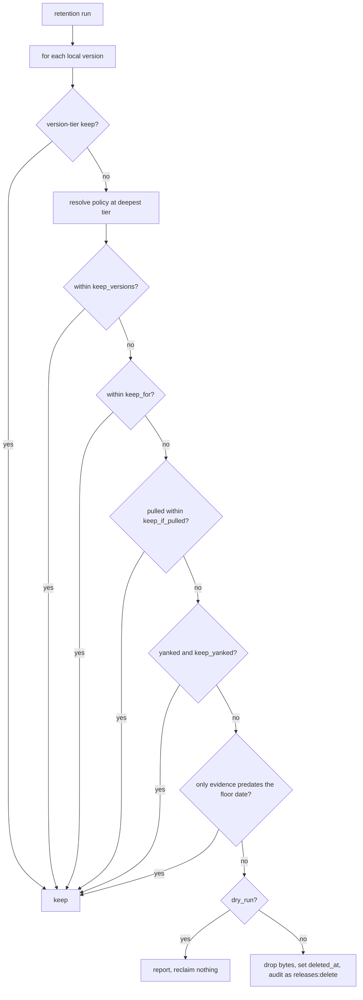
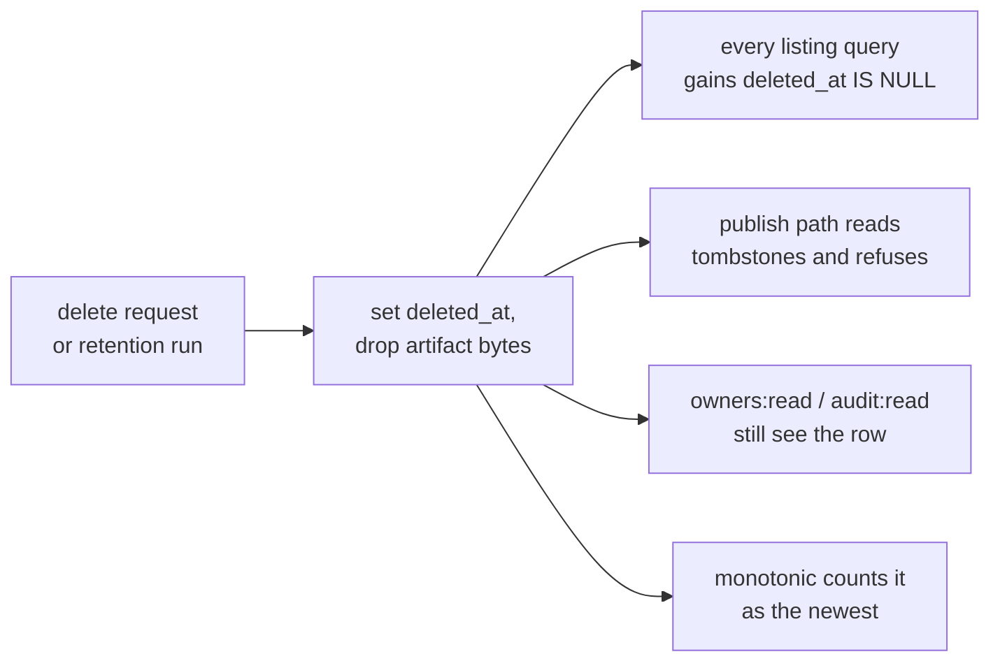

# RFC 0016 — Retention and the permanence of a published name

| Field       | Value                                                        |
| ----------- | ------------------------------------------------------------ |
| Status      | **Accepted** — **phases 1 and 2 have landed**: deleting a version now spends its coordinate permanently, and tombstone compaction ships with `dry_run` defaulting on. Phases 3–5, the reclamation half, are still a proposal and cannot start before [RFC 0015](/rfc/0015-grants-on-the-resource-hierarchy)'s `policy` table exists. Implementation reversed two of this document's own decisions — a `deleted_at IS NULL` sweep smaller than §6.3 predicted, and a §4.6 validation rule that turned out to have no second operand — both recorded in §13 |
| Short       | Retention and tombstones                                      |
| Settles     | What happens to a locally published version over time: reclaiming what nobody is using, and a coordinate that can never be occupied twice |
| Author      | Max Batleforc <maxleriche.60@gmail.com>                       |
| Co-author   | —                                                             |
| Created     | 2026-08-27                                                    |
| Supersedes  | —                                                             |
| Depends on  | [RFC 0015](/rfc/0015-grants-on-the-resource-hierarchy) — the tier system, the `policy` table, the `releases:delete` verb and the shared `dry_run` mechanism |
| Touches     | `crates/core` (retention service, soft delete, tombstone compaction), `crates/config` (retention blocks), `crates/adapters` (`deleted_at`, every listing query in every ecosystem, migration), `crates/web` (delete handlers, retention report endpoint), `ui/`, docs |

---

## 1. Summary

Nothing this server holds locally is ever reclaimed, and nothing it has published is ever safe from being republished as different bytes. Those are two problems and they share one mechanism, which is why they share a document: **delete becomes a soft delete**, and everything else follows.

`retention` reclaims the bytes of versions nobody is using, on a policy that attaches to the tier system [RFC 0015](/rfc/0015-grants-on-the-resource-hierarchy) defines. A **tombstone** keeps the coordinate forever, so `@acme/widgets@1.4.0` can never mean two different things to two different lockfiles.

The organising principle for the first is *keep what is being used*; for the second it is *a name is spent when it is used, not when it is occupied*.

### Before / after

```toml
# today — neither is expressible
# `[registries.eviction]` reclaims *cached* artifacts, which the upstream still
# holds. There is no policy for locally published versions, and no local
# registry has ever reclaimed one.
# Delete removes the row. The coordinate is free, and the next publish may take it.
```

```toml
# proposed
[registries.namespaces.retention]
keep_versions  = 10
keep_for       = "365d"
keep_if_pulled = "90d"     # a veto: whatever anyone is actually using stays
dry_run        = true      # the default — report, reclaim nothing
```

Deleting `1.4.0`, by hand or by a retention run, drops the bytes and keeps the coordinate. `1.4.0` is never published again.

---

## 2. Motivation

1. **A local registry only grows.** `EvictionConfig` (`crates/core/src/services/eviction/`) has `idle_days`, `keep_latest_n` and `max_size_bytes`, and governs the **proxy cache** exclusively. A locally published version has no expression at all, so an estate whose CI publishes a 2 GB artifact per run has one remedy: delete by hand, or add disk.

2. **A deleted coordinate is free for the taking.** Delete removes the `local_packages` row. The name and version are then unoccupied, and the next caller the permissions allow may publish entirely different bytes under them. A lockfile pinning `1.4.0` with a checksum resolves — at some later date, after a delete nobody remembers — to something that merely shares a name. This is the npm model, and npm has been exploited through it.

3. **The two are the same defect if retention ships alone.** A retention policy that frees names is a supply-chain mechanism by accident: it reclaims a coordinate on a schedule, silently, without anyone deciding to. Retention is therefore not implementable safely until deletion is, which is why the ordering in §12 is not negotiable.

4. **RFC 0015 needs one of these for its own correctness.** `monotonic` (0015 §4.5) refuses a publish that does not sort above the newest existing version, and its point is catching a republish of an *older* number after a bad release. That only holds if a deleted version still counts as the newest — which requires the soft delete below. Without it, deleting `2.0.0` lets `1.9.9` be re-taken and `monotonic` ships with a hole in the case it exists for.

---

## 3. Goals / non-goals

**Goals**

- A retention policy for locally published versions whose organising principle is *keep what is being used*, and whose every default fails toward keeping.
- A published version coordinate that can never be occupied twice, whether it was released by hand or reclaimed by policy.
- Both attaching to RFC 0015's tier system rather than inventing a second one.
- A retention run that is auditable, dry-runnable, and distinguishable in the trail from a human deletion.

**Non-goals**

- **Cache eviction.** `EvictionConfig` governs the proxy cache and is untouched. §5.1 argues at some length that retention must not be implemented by widening it.
- **Authorization.** Who may delete is `releases:delete`, and RFC 0015 owns it. This document assumes the verb and the tier system exist.
- **A retention expression language.** Keep conditions are a union of vetoes (§4.2). There is no ordering to get wrong and nothing to evaluate.
- **Reclaiming a coordinate, ever.** Not deferred — excluded. §4.4 explains why the schema has no representation for it.
- **Upstream artifacts.** A proxied artifact this server never held locally is the cache's problem, not this document's.

---

## 4. User-facing design

### 4.1 Retention attaches to the tier system

`retention` is a tiered policy like every other in RFC 0015 §4.1: a registry-level block is the default for everything beneath it, a namespace narrows it, a package narrows it again. **Deepest wins, wholesale** — a package block replaces its namespace's rather than merging with it, for the reason 0015 gives: the motivating case is a *narrower* policy on a deeper tier (the one package publishing 2 GB per CI run), and a field merge could only ever keep more.

That sharp edge is real, and validation compensates (§4.6): declaring a block at a deeper tier that omits a keep condition its parent declared is a warning on every reload, because narrowing is precisely the edit that reclaims something someone was relying on.

At **version tier** the block takes one field:

```toml
[version.retention]
keep = true          # never reclaim this version, whatever the policy above says
```

That is the pin every automatic policy needs an escape from — the release an LTS customer runs, which the pull statistics will eventually stop defending. It is a keep, never a reclaim: there is no version-tier spelling that makes retention *more* aggressive, because a policy that deletes should not be reachable one version at a time.

Package- and version-tier retention live in the `policy` table (0015 §4.1) and are set through the admin API, since a registry with 200 000 packages will not enumerate them in TOML.

### 4.2 Keep conditions are a union of vetoes

| Setting | Meaning | Default |
| --- | --- | --- |
| *(block absent)* | keep everything, forever | **the default** |
| `keep_versions` | the newest N are always kept | unset |
| `keep_for` | anything published within this window is kept | unset |
| `keep_if_pulled` | anything **downloaded** within this window is kept | unset |
| `keep_yanked` | a yanked version is still kept | `true` |
| `dry_run` | report what would be reclaimed, reclaim nothing | `true` |

**A version survives if *any* condition matches.** There is no expression to write and no ordering to get wrong: the only way to reclaim a version is for every configured condition to decline to keep it. Wrong configuration therefore fails toward keeping, which is the direction that is recoverable.

`dry_run = true` by default means enabling retention does nothing until the operator has read a report and turned it off. The report is the same structure `eviction/report.rs` already produces. RFC 0015 §4.7 owns the `dry_run` mechanism; retention is the one policy whose dry-run direction is unambiguously safe — the system does less — which is why it is the only one that defaults to on.

Reclaiming a version exercises `releases:delete` (0015 §4.2) and is audited as such, with the retention run as the subject. An operator reading the audit trail must be able to tell a policy reclamation from a human deletion.

**Retention reclaims bytes, not names.** A reclaimed version leaves a tombstone (§4.4) and its number can never be taken again. That is deliberate: freeing disk must not free the *namespace*, or retention becomes a supply-chain mechanism by accident.

### 4.3 Why "recently pulled" is the interesting one

`keep_versions = 10` alone throws away the version that half the estate is pinned to, because it happens to be eleventh by date. `keep_if_pulled = "90d"` is the rule that makes retention safe to switch on: *whatever anyone is actually using stays, regardless of age or count.*

That makes retention **a consumer of the download signal**, which has two consequences this RFC has to name because both are live in the tree today:

1. **Pre-2026-08-27 download history under-reports local reads.** The Maven and NuGet local artifact paths recorded no download event at all until the 2026-08-26 survey remediation, and the audit trail for those ecosystems is silent for that period. Retention must not read "no recorded pull" from that era as "never pulled". Concretely: retention takes an **effective floor date**, before which absence of a pull record proves nothing, and a version whose only evidence is older than the floor is kept.

2. **The signal must count what a consumer installs, not what a client fetched.** One `mvn` resolution touches `.jar`, `.pom` and a checksum beside each. The split is narrower than it first looks: `PackageId::is_verification_sidecar` (`crates/core/src/entities/package.rs:62`) matches checksum and signature suffixes only, so `lib-1.2.3.jar.sha1` records as `ViewMetadata` while `lib-1.2.3.pom` records as a `Download` — a `.pom` is a file a build actually consumes, and `package.rs:261` asserts exactly that pair. Retention reads *downloads*, so a version kept alive only by checksum fetches is not kept, while one whose `.pom` is still being resolved is. Both halves are worth an explicit test: the first is subtle enough to be "fixed" by someone later, and the second is subtle enough to be *broken* by someone widening the sidecar match to "anything that is not the primary artifact".

### 4.4 A published name is never reused

A version coordinate that has ever existed may never be occupied by different bytes. Deleting `1.4.0` — by hand, or by retention — does not free `1.4.0`; it burns it.

This is the crates.io and PyPI model rather than npm's, and it is the right one for a registry that is frequently the only copy of what it holds. The alternative is that a lockfile pinning `1.4.0` with a checksum resolves, at some later date, to something entirely different that happens to share a name. No amount of authorization compensates for that, which is why this belongs beside retention rather than inside RFC 0015.

**Mechanically: delete is a soft delete.** The version row survives with a `deleted_at`; the artifact bytes are dropped. That single choice buys four things that would otherwise each need their own mechanism:

- the tombstone that refuses a re-publish;
- the audit trail of what was deleted, and by whom;
- RFC 0015 `monotonic`'s requirement that a deleted version still counts as the newest;
- retention's own accounting, which needs to know what it has already reclaimed.

Tombstoned versions are absent from every listing and every resolver's view — they are not installable and must not appear to be. They are visible to `owners:read` and `audit:read`, and to the publish path, which is the one caller that needs to know a name is taken by something that is gone.

**A package name is a weaker claim than a version coordinate.** If every version of a package is deleted, the *name* may be published to again by a caller the grants permit — but the version numbers that existed stay burned. Re-creating `@acme/widgets` is allowed; re-creating `@acme/widgets@1.4.0` is not, ever.

**Its package-tier policy does not survive that.** When the last version of a package is deleted, every `policy` row at package tier for that name is deleted with it — grants included, and therefore the ownership grants RFC 0015 §5.1 migrates into. Who may re-create the name is then decided by the namespace above it, which is the tier that outlives any particular package.

The alternative is worse in a way that is easy to miss. Package-tier grants keyed by name, surviving the package, mean the previous owner still holds `releases:publish` and `owners:write` on a name someone else may now take — authority over a package they have never seen, granted by a decision nobody remembers making. That is a smaller version of the 2026-08-26 survey's finding 1 (a claim on a package nobody currently owns) arriving through the back door, and it is exactly the kind of stale authority a model whose first rule is *absence is not permission* should not accumulate. The version tombstones stay, because they are the invariant; the grants go, because they are a decision about a thing that no longer exists.

### 4.5 Tombstone retention compacts, it never collects

Tombstones do need a retention policy — but not the one the name suggests, because collecting a tombstone reopens exactly the hole it exists to close.

The trick is that a tombstone row holds **two things with two different lifetimes**:

| Part | Example | Lifetime |
| --- | --- | --- |
| **The claim** | `(npm1, @acme/widgets, 1.4.0)` | permanent — it *is* the invariant |
| **The detail** | `index_metadata`, checksum, publisher, signature, README | audit history |

Only the second grows. A cargo index line carries the version's full dependency graph and an npm manifest its scripts and `dist` block — kilobytes each — while the coordinate is a hundred bytes. So:

```toml
[registries.namespaces.retention]
tombstone_detail_for = "730d"    # strip to the coordinate after two years; unset by default
```

**Unset by default**, so nothing is stripped until an operator asks for it. An auditor investigating a deletion is the reader most likely to be surprised by a default here, and the cost of keeping the detail is disk — which is recoverable — where the cost of losing it is a question that can no longer be answered. After the window, the detail columns are nulled and the row keeps the claim. Space falls by one to two orders of magnitude on the part that actually accumulates, and no coordinate is ever released. At the largest of RFC 0015 §11.7's corpora — 200 000 packages and two million versions — that is the difference between roughly ten gigabytes of retained JSON and a couple of hundred megabytes of coordinates.

Three constraints:

- **Only rows with `deleted_at` set** are ever compacted. A live version is not a tombstone.
- **Compaction is audited and dry-runnable**, like every other policy. It is destructive to history even though it is not destructive to the invariant.
- **There is no setting that deletes the row.** Not "off by default" — absent from the schema, so it cannot be added by an operator in a hurry. If it is ever wanted it is an RFC, because it is a supply-chain decision wearing an operations decision's clothes.

The precedent for the *shape* is already in the tree: the audit trail has a purge-to-cutoff action (`AccessAction::AuditPurge`), audited as an action in its own right. This is the same idea applied to the part of a tombstone that is history rather than invariant.

### 4.6 Validation

Config load **rejects**:

- a `retention` block with no keep condition at all, which would reclaim everything on the first run;
- a version-tier `retention` block containing anything but `keep`;
- a `tombstone_detail_for` window shorter than the registry's audit-retention window, which would strip the detail an auditor is still entitled to read;
- a `retention` block on a registry in `proxy` mode, which publishes nothing locally and where the setting would silently govern an empty set — a `[registries.eviction]` block is what that operator meant.

Config load **warns**:

- loudly, on every reload, for `retention` with `dry_run = false` and no `keep_if_pulled` — the configuration that reclaims a version the estate is pinned to, which is the mistake this feature exists to make hard;
- for a deeper-tier block that omits a keep condition its parent declared (§4.1), because wholesale replacement means the omission is a narrowing rather than an inheritance.

---

## 5. Architecture

### 5.1 Retention is not eviction, and must not be built from it

The two look alike enough that the first implementation instinct will be to widen `EvictionConfig` to reach local rows. That instinct is the one thing this section exists to stop.

| | Cache eviction | Retention |
| --- | --- | --- |
| Governs | proxy-cached artifacts | locally published versions |
| Another copy exists | yes, upstream | **frequently not** |
| Cost of a wrong reclaim | a re-fetch | the artifact |
| Default | configured per registry | keep everything, forever |

That asymmetry sets every default in §4.2. A shared implementation would inherit eviction's defaults, its reporting and its silence, and would apply a policy calibrated for recoverable data to data that is not.



Every branch that is uncertain leads to `keep`. The floor-date check sits last on purpose: it is the one that turns *absence of evidence* into a keep, and putting it after the positive conditions makes it obvious that it can only ever add survivors.

### 5.2 Delete stops removing the row



The listing branch is the largest mechanical surface in this document and the one most likely to be missed somewhere, which is why §10 asserts it per ecosystem rather than per query.

---

## 6. Detailed design

### 6.1 `crates/core`

- `services/retention/` (new): the run, the report, the keep-condition resolution over tiers. Structurally parallel to `services/eviction/` and sharing no code with it (§5.1).
- `services/local_registry/lifecycle.rs`: delete sets `deleted_at` instead of removing the row, and the publish path consults tombstones before accepting a coordinate.
- `entities/access_log.rs`: a retention reclamation records `releases:delete` with the run as subject, distinguishable from a human deletion in the trail.

### 6.2 `crates/config`

- `RetentionConfig` in `schema/registry.rs`, valid at registry and namespace level; the package and version tiers go through the `policy` table (RFC 0015 §4.1), not TOML.
- `tombstone_detail_for` on the same block.

### 6.3 `crates/adapters`

- `local_packages` gains `deleted_at`. **Every existing listing query gains `deleted_at IS NULL`** — the npm packument, the cargo sparse index, the RubyGems compact index, the NuGet flat index, the Maven metadata, the PyPI Simple page, the Terraform version lists, and every other ecosystem's equivalent.
- The publish path gains a tombstone lookup on the coordinate.
- Compaction nulls the detail columns of rows with `deleted_at` older than the window, and touches nothing else.

**Deliberately untouched**, so reviewers do not go looking:

- `crates/core/src/services/eviction/` — the proxy cache keeps its own policy, its own config and its own defaults (§5.1).
- `AccessAction::AuditPurge` — the audit trail's own purge is the *precedent* for compaction's shape, not a thing this RFC extends.

---

## 7. Security considerations

- **A tombstone is a security control, not bookkeeping.** If a re-publish can take a deleted coordinate, a lockfile pin with a checksum can be made to resolve to different bytes later. §4.4's soft delete is what makes that unrepresentable. Tombstone retention therefore compacts the *detail* and never removes the *claim*, and there is deliberately no schema in which a row can be deleted — the absence is the control.
- **Retention destroys the only copy.** Cache eviction discards something recoverable from upstream; retention discards a locally published artifact that may exist nowhere else. Every default in §4.2 is set by that asymmetry, and retention must not be implemented by widening `EvictionConfig` to reach local rows.
- **Retention trusts the download signal**, which was incomplete for Maven and NuGet local reads before 2026-08-27. The effective-floor-date rule in §4.3 exists so a gap in the audit trail cannot be read as evidence of disuse.
- **Retention without tombstones is a supply-chain mechanism.** A policy that frees coordinates on a schedule reclaims names nobody decided to reclaim. This is why §12 gates retention on tombstones rather than shipping them in either order.
- **A tombstoned version must not be reachable by a resolver.** It is not installable, so a listing that still names it produces a build that fails at download — and a listing that serves its old metadata produces one that succeeds against bytes that are gone. The per-ecosystem assertion in §10 is a security test, not a completeness one.
- **Package-tier grants do not outlive their package** (§4.4), so a re-created name does not carry the previous owner's authority.

---

## 8. Alternatives considered

| Alternative | Why rejected |
| --- | --- |
| **Widen `EvictionConfig` to cover local rows** | It applies defaults calibrated for recoverable data to the only copy in existence (§5.1). The config surface would also lie: `idle_days` on a published artifact reads as "unused", where the artifact may simply be stable. |
| **Hard delete, with re-publish allowed** | npm's model. It makes a checksummed lockfile pin resolve to different bytes after a delete nobody remembers, and there is no compensating control elsewhere. |
| **Hard delete, with a separate `burned_coordinates` table** | The same invariant with a second store to keep consistent, and no audit trail of what was deleted. The soft delete gets both for free (§4.4). |
| **A retention expression language** (`keep if pulled_recently or version_rank < 10`) | Ordering and precedence become things an operator can get wrong, in a feature that deletes. A union of vetoes has one rule and fails toward keeping. |
| **Collect tombstones after a window** | Reopens the hole tombstones exist to close, on a timer. The detail is what grows; §4.5 compacts that and keeps the claim. |
| **Ship retention first, tombstones later** | Retention would free coordinates for as long as the gap lasted, silently. §12's ordering is the mitigation. |

---

## 9. Rollout and compatibility

- **Default behaviour is unchanged.** An absent `retention` block keeps everything forever, which is exactly what every existing instance does today. No estate acquires a reclamation policy by upgrading.
- **`dry_run` defaults to `true`**, so even a configured block reclaims nothing until an operator has read a report and turned it off.
- **The soft delete is not opt-in**, and is the one behaviour change on upgrade: a delete that used to remove a row now tombstones it, and the coordinate stops being republishable. That is the point of the document rather than a side effect, and it is the direction that only ever refuses more.
- **Migration**: `local_packages` gains a nullable `deleted_at`, backfilled to `NULL`. Rows deleted before the migration are gone and their coordinates are, unavoidably, still free — the invariant starts at the migration and cannot be applied retroactively. Worth saying plainly rather than discovering.
- **Rollback**: dropping the column restores today's behaviour; tombstoned rows become live versions with no bytes, so the rollback path must hard-delete rows with `deleted_at` set rather than leaving them.

---

## 10. Test plan

Retention deletes; its tests run against real Postgres and real storage, not in-memory doubles.

**Retention** (`crates/adapters/tests/pg_retention.rs`):

- **Never reclaims a recently-pulled version**, including when it is the oldest and outside every other keep window.
- **Ignores sidecar fetches**: a version whose only access records are `ViewMetadata` from checksum requests is *not* kept alive by them.
- **Counts a `.pom` as a pull**: a version whose only access records are `.pom` downloads *is* kept, which is the other half of the sidecar split (§4.3) and the one a future widening of `is_verification_sidecar` would break.
- **Respects the effective floor date**: a version with no access records at all, published before the floor, is kept.
- **`dry_run` reclaims nothing**, asserted by counting rows *and stored objects* before and after, then running live and comparing against the report.
- **A package-level block replaces the namespace's wholesale** — a package declaring only `keep_versions` does not inherit its namespace's `keep_if_pulled` (§4.1). The test exists because the intuitive implementation is a field-by-field merge and it is wrong.
- **A version-tier `keep` pin survives a run** that reclaims every other version of the same package, including when the pinned one is the oldest and least pulled.

**Tombstones** (`crates/web/tests/tombstones.rs` plus per-ecosystem suites):

- **A deleted version's coordinate cannot be re-published**, by hand or after a retention run, and the refusal is the same either way.
- **A tombstoned version is absent from every ecosystem's listing.** Asserted per registry type rather than per query: the `deleted_at IS NULL` predicate has to reach the npm packument, the cargo sparse index, the RubyGems compact index, the NuGet flat index, the Maven metadata, the PyPI Simple page and the Terraform version lists, and "we added it to the shared helper" is exactly the reasoning the 2026-08-26 survey found to be false eight times.
- **A tombstoned version is still visible to `owners:read` and `audit:read`**, and still counts for `monotonic`.
- **A fully deleted package name may be published to again; its old version numbers may not**, and its package-tier grants are gone (§4.4).
- **Compaction strips detail and keeps the claim**: after `tombstone_detail_for`, the coordinate still refuses a re-publish, still counts for `monotonic`, and the detail columns are null.
- **Compaction never touches a live row**, asserted by running it against a registry whose versions are all live and comparing every column.
- **Compaction is off unless configured**: a registry with no `tombstone_detail_for` retains every detail column indefinitely.

**Existing suites** that must pass unchanged: every `crates/web/tests/local_*_registry.rs` file. They exercise publish, yank and delete per ecosystem, and they are the regression signal for the `deleted_at IS NULL` sweep — a listing that starts returning a tombstoned version fails them without anyone writing a new test.

---

## 11. Decisions and open questions

### Resolved

| # | Question | Decision |
| --- | --- | --- |
| 1 | Does retention exist at all, and on what principle? | **Yes; *keep what is being used*.** Keep conditions are a union of vetoes, `dry_run` defaults on, and an absent block keeps everything — because unlike cache eviction, retention deletes the only copy. |
| 2 | Is a published name ever reusable? | **No.** Delete becomes a soft delete; the coordinate is burned permanently, whether released by hand or reclaimed by policy. A package *name* may be re-created, its old version numbers may not. |
| 3 | Is retention scopable below the namespace? | **Yes, to a package**, replacing the namespace's block wholesale rather than merging, and living behind the admin API rather than in TOML. |
| 4 | What happens to tombstones as they accumulate? | **Compaction, never collection.** The claim is permanent and has no deletion path in the schema; the detail — index metadata, checksums, publisher — is audit history and ages out on a window. |
| 5 | Is `tombstone_detail_for` on by default? | **No, unset.** Disk is recoverable; a question an auditor can no longer answer is not. |
| 6 | Should this be part of RFC 0015? | **No.** It shares 0015's tier system and verbs but nothing else: it is the only feature in either document that destroys data, and the reviewers who care about a reclamation policy are not the reviewers who care about a permission vocabulary. Splitting it also lets 0015's phases 0–2 ship without waiting on a schema change to every listing query. |
| 7 | What do package-tier grants do when the package is deleted? | **They go with it.** Grants keyed by a name that outlive the package leave a previous owner holding authority over a name someone else may take. |

### Still open

1. **Does a retention run need a rate limit, or a bytes-per-run cap?** A first live run on an estate that has never reclaimed anything may drop a large fraction of its storage in one pass. The dry-run default means an operator has seen the report first, so this is a question about blast radius after an informed decision rather than about surprise. The alternatives are a cap (predictable, but leaves the estate mid-reclamation in a state nothing else models) and a rate limit (slower, but every intermediate state is a valid one). **Recommendation: rate limit**, deferred until a real report exists to size it against — which is phase 3's dry-run-only release.

---

## 12. Implementation phases

The ordering is a safety property, not a convenience: retention before tombstones would free coordinates for as long as the gap lasted (§7).

| Phase | Content |
| --- | --- |
| 1 | **Tombstones.** `deleted_at` on the version row, delete stops removing it, and `deleted_at IS NULL` reaches every listing query in every ecosystem. Independently valuable — it closes the re-publish hole whether or not retention ever lands — and it is what RFC 0015's `monotonic` needs for its own correctness. |
| 2 | **Tombstone compaction** (§4.5), which is retention of a different object and ships with the tombstone machinery rather than after it. |
| 3 | **Retention, `dry_run`-only.** The run, the report, the endpoint, the tiered policy resolution. Reclamation is not enabled: the report lands, operators read it against real estates, and nothing is deleted. |
| 4 | **Reclamation enabled**, in a later release, once the reports have been boring for a while. Sizes the rate limit in §11's open question against reports that now exist. |
| 5 | **Surfaces.** The retention panel on the authorization page (RFC 0015 §4.8), the CLI, and the documentation. |

**Phase 1 is shippable on its own** and is worth shipping on its own even if 2–5 never land: a registry that cannot silently redefine a published coordinate is strictly better than one that can, and it costs no new configuration surface at all.

Phases 1 and 2 depend on RFC 0015 only for the `releases:delete` verb and can land before its phase 4 with a role check in the interim. Phase 3 depends on 0015's `policy` table for the package and version tiers, and cannot start before it.

---

## 13. Implementation notes (phases 1–2)

Phases 1 and 2 landed together, as §12 said they should. What follows is what
building them changed about the document.

### 13.1 The listing sweep was one predicate, not eight

§5.2 called the `deleted_at IS NULL` sweep "the largest mechanical surface in
this document and the one most likely to be missed somewhere", and §6.3
enumerated eight ecosystems' listings to reach. It was three queries.

Every ecosystem's listing is built on `LocalRegistryBackend`'s `get_versions`,
`exists` and `list_package_names`; the per-ecosystem code in
`services/local_registry/eco_*.rs` shapes rows it is handed rather than issuing
SQL of its own. So the predicate lands in two adapters and reaches everything.

That is a smaller change than predicted, and the prediction was still worth
acting on. The per-ecosystem assertion in §10 was written anyway and stays
written: what makes it a security test is not how many queries there are today
but that a future reader who adds a ninth cannot quietly bypass the funnel. The
test caught nothing at the time and is not therefore worthless — it is the thing
that makes "we added it to the shared helper" checkable rather than asserted.

Two guards went in rather than one. A tombstoned row also has `status =
'deleted'`, and every pre-existing reader already filters `status = 'published'`,
so a query this change failed to reach still excludes the tombstone rather than
serving a version whose bytes are gone.

### 13.2 One §4.6 rule has no second operand

§4.6 requires config load to reject "a `tombstone_detail_for` window shorter
than the registry's audit-retention window". There is no configured
audit-retention window in this tree. The audit trail is purged by an
operator-supplied cutoff through `AccessAction::AuditPurge` — an action, not a
schedule — so the rule has nothing to compare against.

Rather than invent one, or silently drop the rule, the implementation states the
gap in the validator and substitutes a **30-day floor** on the window, with `0`
rejected outright. That refuses the settings short enough to strip detail an
investigation is plainly still using, and it refuses the far more likely mistake
of days read as hours. If a scheduled audit retention is ever configured, the
rule as written becomes implementable and this floor becomes its lower bound.

### 13.3 `remove_version` had to be narrowed, not just left alone

§6.1 said delete "sets `deleted_at` instead of removing the row" and left the
existing hard delete unexamined. It is still needed: `remove_version` is how a
publish that failed between reserve and commit discards its own pending row, and
that row was never visible to anyone, so removing it spends no coordinate.

But it is also the only `DELETE` left against `local_packages`, which makes it
the one call that can free a spent name — by a caller reaching for the wrong
cleanup, in a change nobody would think to review as a supply-chain edit. It now
carries `AND deleted_at IS NULL` in both backends, and both suites assert that a
tombstone survives it.

### 13.4 `checksum` had to become nullable, under a CHECK

Compaction nulls the checksum, which the table declared `NOT NULL`. Dropping
that constraint outright would let a *live* row carry a null checksum, which the
read path decodes into a `String` — a panic at read time rather than an error at
write time.

Migration 039 drops the `NOT NULL` and replaces it with
`CHECK (deleted_at IS NOT NULL OR checksum IS NOT NULL)`, which states the actual
invariant: only a tombstone may lack a checksum. `index_metadata` needed no such
change — compaction sets it to `'{}'`, three bytes, keeping its `NOT NULL` —
and `published_at` is not stripped at all, because eight bytes do not accumulate
and "how long did this coordinate live" is the first question asked of a
tombstone whose metadata is already gone.

### 13.5 Compaction writes and reports in one statement

§4.5 asked for compaction to be dry-runnable and audited, and said nothing about
how the report is produced. Select-then-update would have been the obvious
shape, and it is wrong: `NOW()` moves between two statements, so a tombstone that
ages past the window in the gap is stripped without appearing in the report. The
live path is `UPDATE … RETURNING`, which cannot disagree with what it wrote; the
dry-run path is the matching `SELECT`. `pg_tombstones.rs` asserts the two agree.

### 13.6 What is not built

- **Phases 3–5.** No retention run, no `keep_versions`/`keep_for`/`keep_if_pulled`,
  no reclamation, no UI panel. The keys are **refused by the config loader**
  rather than accepted and ignored, so an operator who writes one is told rather
  than left believing versions are being reclaimed.
- **§11's still-open question** — whether a retention run needs a rate limit —
  belongs to phase 4 and is untouched. It was to be sized against phase 3's
  dry-run reports, which do not exist yet.
- **The effective floor date** (§4.3), which is a property of the retention run
  and has nothing to consume it until phase 3.
- **Authorization.** Delete is still admin-gated at the handler, as §12 allowed
  for the interim. `releases:delete` arrives with RFC 0015.
